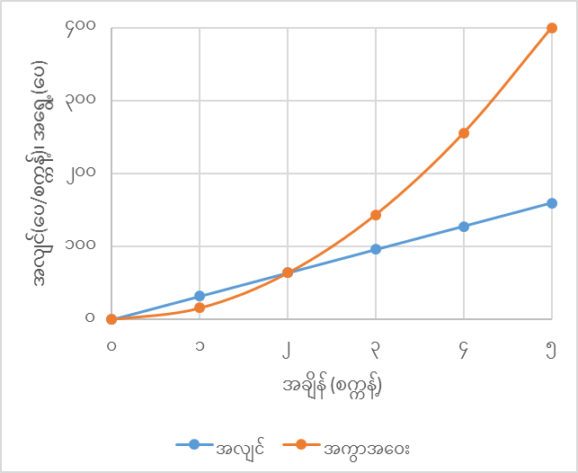

## အကွာအဝေး

အကွာအဝေးဆိုတာကတော့ လူတိုင်းရင်းနှီးမှာပါ။ အမှတ် A နဲ့ အမှတ် B ကြားက အကွာအဝေးဆိုရင် ဘယ်လိုတိုင်းတာရမလဲ။ ဥပမာ ရန်ကုန်နဲ့ မန္တလေး ဘယ်လောက်ဝေးလဲလို့ မေးရင် မြေပုံပေါ်က မျည်းဖြောင့် အကွာအဝေးကို ပြောတာလား၊ ဒါမှမဟုတ် ရန်ကုန်−မန္တလေးကားလမ်းရဲ့ အရှည်မိုင်ကို ပြောတာလားဆိုတာ သိဖို့လိုပါတယ်။ အမှတ် A နဲ့ B ကို ဆက်သွယ်ထားတဲ့ မျည်းရဲ့ အလျားက သူတို့နှစ်ခုကြားအကွာအဝေးပါပဲ။ ဒါပေမယ့် A နဲ့ B ကို ဆက်သွယ်နိုင်တဲ့ လမ်းကြောင်းတွေက မျည်းဖြောင့်၊ မျည်းကွေး စသည်ဖြင့် အနန္တရှိပါတယ်။ အနီးဆုံး အကွာအဝေးကတော့ မျည်းဖြောင့် တိုင်းတာခြင်းပဲ ဖြစ်ပါတယ်။ တိကျတဲ့ အကွာအဝေးကို ရဖို့က ဆက်သွယ်ထားတဲ့ လမ်းကြောင်းကို သိရပါမယ်။ ကားတစ်စီးရဲ့ အချိန်တစ်ခုအတွင်း သွားတဲ့ အစအမှတ်ကနေအကွာအဝေးကို အောက်ကလိုမျိုး ဇယားနဲ့ဖော်ပြလို့ရပါတယ်။

| အချိန် (မိနစ်) | စမှတ်မှအကွာအဝေး (မိုင်) |
| :------------: | :---------------------: |
|       ၀        |            ၀            |
|       ၅        |            ၂            |
|       ၁၀       |            ၅            |
|       ၁၅       |            ၅            |
|       ၂၀       |            ၈            |
|       ၂၅       |           ၁၂            |
|       ၃၀       |           ၁၆            |

ဒါမှမဟုတ် ဂရပ်နဲ့လည်း ပြလို့ရပါတယ်။

ဇယားနဲ့ ပုံအရ ကားက ၁၀ မိနစ်ကနေ ၁၅ မိနစ်ကြားမှာ ရပ်သွားပြီး နောက်ပိုင်းမှာ ပုံမှန်အလျင်နဲ့ မောင်းတာ တွေ့ရပါမယ်။

## အလျင်

အလျင်ဆိုတာက သွားနေတဲ့နှုန်: ၊ တစ်နည်း အချိန်အတိုင်းအတာတစ်ခုအတွင်းမှာ ခရီးရောက်တဲ့နှုန်းဖြစ်ပါတယ်။ ကားမောင်းနေရင် အလျင်ဘယ်လောက်နဲ့ သွားနေလဲဆိုတာ ကားက ဒိုင်ခွက်ပေါ်မှာ ကြည့်လို့ရပါတယ်။ ဒါပေမယ့် အလျင်မှာ အကွာအဝေးတိုင်းတာမှုနဲ့ မတူတဲ့ နက်နဲမှုလေးတွေရှိပါတယ်။ ဒီနက်နဲမှုတွေက ရှေးတုန်းက ဂရိတွေကို တိုင်ပတ်စေခဲ့ပါတယ်။ ဂရိတွေကို အလျင်နဲ့ ပတ်သက်ပြီး ဦးနှောက်ခြောက်စေခဲ့တဲ့ ပြဿနာတစ်ခုကို အောက်မှာတွေ့နိုင်ပါတယ်။ ဒီပြဿနာကို ဂရိလူမျိုး Zeno က တင်ပြခဲ့တာပါ။

## အာခီးလီးစ်နှင့် လိပ်

အာခီးလီးစ်နဲ့ လိပ်ကို အပြေးပြိုင်ခိုင်းမယ်။ အာခီးလီးစ်က လိပ်ထက် ၁၀ ဆ ပိုပြီး မြန်မြန်ပြေးနိုင်တယ်ဆိုပါတော့။ အစမှာ လိပ်ကို အာခီးလီးစ်ရဲ့ ရှေ့ မီတာ ၁၀၀ မှာ ချထားပါမယ်။ အာခီးလီးစ် ပြေးလို့ မီတာ ၁၀၀ ရောက်တဲ့အချိန်မှာ လိပ်က သူ့ရှေ့ ၁၀ မီတာရောက်နေပါတယ်။ အာခီးလီးစ် နောက်ထပ် ၁၀ မီတာရောက်တဲ့အချိန်မှာ လိပ်က သူ့ရှေ့မှာ ၁ မီတာရောက်နေသေးပါတယ်။ အာခီးလီးစ် နောက်ထပ် ၁ မီတာရောက်တဲ့အချိန်မှာ လိပ်က ၀.၁ မီတာ ရှေ့ရောက်နေပါသေးတယ်။ ဒီလိုဆက်သွားရင် အာခီးလီးစ်က လိပ်ကို ဘယ်တော့မှ ကျော်မတက်နိုင်ပါဘူး။

ဒီပြဿနာမှာ ဘာမှားနေတာလဲ။ သတိပြုရမှာတစ်ခုက အချိန်ကို အပိုင်းတွေ အနန္တပိုင်းခြားလို့ ရခြင်းပဲ ဖြစ်ပါတယ်။ ၁ စက္ကန့်နဲ့ ၂ စက္ကန့်ကြားက ကွာခြားချက် ၁ စက္ကန့်ကို ၁၀ ပိုင်း၊ အပိုင်း ၁၀၀၊ ၁၀၀၀ စသဖြင့် ပိုင်းချင်သလောက် ပိုင်းလို့ရပါတယ်။ ဒါပေမယ့် အပိုင်းအနန္တရှိတာက အချိန်အနန္တကုန်သွားတယ်လို့ ဆိုလိုတာမဟုတ်ပါဘူး။

အလျင်ကိုလိုချင်ရင် သွားတဲ့အကွာအဝေးကို ကုန်သွားတဲ့အချိန်နဲ့ စားရပါတယ်။

$$
v=\frac{s}{t}
$$

အလျင်ကိုလည်း အကွာအဝေးလိုပဲ ဇယား (သို့) ဂရပ်နဲ့ ဖော်ပြလို့ ရပါတယ်။ ပစ္စည်းတစ်ခုကို အမြင့်တစ်ခုကနေ လွှတ်ချလိုက်ရင် ဒြပ်ဆွဲအားကြောင့် ပြုတ်ကျသွားတာကို free fall လို့ခေါ်ပါတယ်။ Free fall ဖြစ်တဲ့ ပစ္စည်းတစ်ခုရဲ့ အလျင်နဲ့ အရွေ့ကို လွှတ်ချလိုက်တဲ့အချိန်ကနေစပြီး စက္ကန့်တိုင်းမှတ်တမ်းတင်ထားတာကို အောက်မှာ တွေ့နိုင်ပါတယ်။

| အချိန် (စက္ကန့်) | အလျင် (ပေ/စက္ကန့်) | အရွေ့(ပေ) |
| :--------------: | :----------------: | :-------: |
|        ၀         |         ၀          |     ၀     |
|        ၁         |         ၃၂         |    ၁၆     |
|        ၂         |         ၆၄         |    ၆၄     |
|        ၃         |         ၉၆         |    ၁၄၄    |
|        ၄         |        ၁၂၈         |    ၂၅၆    |
|        ၅         |        ၁၆၀         |    ၄၀၀    |

ဒီမှာဆိုရင် အလျင်က တစ်ဖြည်းဖြည်း တသမတ်တည်း တိုးလာတာတွေ့ရပါတယ်။ ဒီဇယားနဲ့ ဂရပ်ကနေ အချိန်တစ်ခုမှာရှိတဲ့ အလျင်ကိုသိချင်ရင် ညီမျှခြင်းထုတ်လိုက်တဲ့အခါ $ v(t)=32t $ ရပါတယ်။ $v(t)$ ကို $v$ of $t$ လို့ ဖတ်ပြီး $v$ ကို function of $t$ နဲ့ ပြတယ်လို့ ခေါ်ပါတယ်။

အလျင်ကို နားလည်နိုင်ဖို့ နောက်ထပ် ဥပမာတစ်ခု ပေးကြည့်ပါမယ်။ အဝေးပြေးလမ်းပေါ်မှာ Speed limit သတ်မှတ်ထားတယ် မဟုတ်လား။ အလျင်ကန့်သတ်ချက်က တစ်နာရီ မိုင် ၆၀ ဆိုပါတော့။ အဲ့ဒီ့ တစ်နာရီ မိုင် ၆၀ ဆိုတာက ဘာကို ဆိုလိုတာလဲ။ တစ်နာရီအတွင်းမှာ ကားသွားတဲ့ အကွာအဝေးက မိုင် ၆၀ ထက် မကျော်ရဘူးလို့ ပြောတာလား။ အဲ့ဒါဆို ကားကို တစ်နာရီပြည့်အောင် မောင်းခိုင်းရမှာလား။ ဒါလည်း မဟုတ်သေးဘူး။ နာရီဝက်ကို တစ်နာရီ မိုင် ၁၂၀ လောက်နဲ့ မောင်းပြီး ကျန်တဲ့နာရီဝက်ကို ဖြည်းဖြည်းလေးပဲမောင်းရင်လည်း တစ်နာရီ မိုင် ၆၀ ဖြစ်တာပဲ။ ဒါပေမယ့် speed limit ကျော်တဲ့ ခဏမှာပဲ ရဲဖမ်းတာ ခံရမှာပါ။ Speed limit က တစ်နာရီနှုန်းနဲ့ ကန့်သတ်ထားပေမယ့် တိုင်းတာတာက လက်ရှိအလျင်ကို တိုင်းတာဖြစ်လို့ပါ။ ပျမ်းမျှအလျင်ကို တိုင်းတာတာ မဟုတ်ပါဘူး။ အဲ့ဒါဆို လက်ရှိအလျင်ဆိုတာက ဘာကိုပြောတာလဲ။

$$
s=\frac{\Delta s}{\Delta t}
$$

အဲ့ဒီ့ ညီမျှခြင်းမှာ ပါတဲ့ အချိန်ပိုင်း ($ \Delta t $) က ဘယ်လောက်နဲ့ တွက်မလဲ။ အလျင်က အချိန်ကို လိုက်ပြီး ပြောင်းလဲနိုင်တာကြောင့် အချိန်ပိုင်း အများကြီး ယူလိုက်ရင် ရလာတဲ့ အလျင်က မတိကျတော့ပါဘူး။ အချိန်ပိုင်း တစ်နာရီယူလိုက်ရင် ကားက အဲ့တစ်နာရီအတွင်းမှာ ရပ်လိုက်၊ သွားလိုက် လုပ်နေရင် ရလာတဲ့အလျင်က ပျမ်းမျှအလျင်ပဲ ဖြစ်ပါမယ်။ တစ်မိနစ်ယူရင်လည်း အဲ့အချိန်အတွင်း ကားက အရှိန်မြှင့်တာ လျှော့တာ ဖြစ်နိုင်ပါသေးတယ်။ ၁ စက္ကန့်အတွင်းဆိုရင်တော့ ကားရဲ့ အလျင်က သိပ်မပြောင်းနိုင်တော့ဘူး။ ဒါပေမယ့် free fall နဲ့ ကျတဲ့ ပစ္စည်းက ၁ စက္ကန့်အတွင်း အလျင်ပြောင်းလဲမှု အများကြီး ဖြစ်နိုင်ပါသေးတယ်။ ဒါကြောင့် လက်ရှိအလျင်ကို အတိအကျလိုချင်ရင် အချိန်အပိုင်းကို သေးသေးလေးယူမှ အဆင်ပြေပါမယ်။ ၁ စက္ကန့်ရဲ့ အပုံတစ်သန်းပုံ တစ်ပုံလောက်အထိ သေးလိုက်ရင် အဲ့ဒီ့အချိန်အတွင်းမှာ အလျင်က ကိန်းသေနီးပါးဖြစ်သွားပါပြီ။ ဒီလိုမျိုး အပိုင်းသေးသေးလေးတွေပိုင်းတဲ့ ကိစ္စတွေကို ကိုင်တွယ်ဖြေရှင်းဖို့အတွက် သင်္ချာပညာရပ်တစ်ခုကို နယူတန် (Isaac Newton) နဲ့ လိုင့်ဘ်နစ်စ် (Wilhelm Leibniz) တို့က သီးခြားစီ တီထွင်ခဲ့ပါတယ်။ အဲ့ဒီ့ပညာရပ်ကိုတော့ ကဲကုလစ် (Calculus) လို့ ခေါ်ပါတယ်။

ကဲ ဒါဆိုရင် အလျင်ကို ပိုတိကျအောင် အဓိပ္ပာယ်ဖွင့်ကြည့်ရအောင်။ $ v=\frac{\Delta s}{\Delta t} $ မှာ $ \Delta t $ ဆိုတဲ့ အချိန်ပိုင်းကို သေးသေးလေးထားပြီး ရေးကြည့်ပါမယ်။ $ \Delta $ ဆိုတာ sin, cos တို့လို operator တစ်ခုသာဖြစ်ပြီး  ဆိုတာ အချိန်နှစ်ခုမှာရှိတဲ့ s နှစ်ခု ခြားနားခြင်းကို ဆိုလိုတာဖြစ်ပါတယ်။

$$
v=\lim_{\Delta t \to 0}\frac{\Delta s}{\Delta t}
$$

$ \lim\_{\Delta t \to 0} $ ဆိုတာက limit of $ \Delta t $ tends to zero, $ \Delta t $ ကို သေးနိုင်သမျှသေးအောင် (သုညနား ကပ်တဲ့အထိ) ယူရမယ်လို့ ပြောတာပါ။ ဒီညီမျှခြင်းပုံစံက differential calculus ရဲ့ အခြေခံပါပဲ။ ပညာရှင်အများစုရေးလေ့ရှိတာက limit ပုံစံကို ဖြုတ်ပြီး $ v=\frac{ds}{dt} $ ပုံစံနဲ့ ရေးပါတယ်။ ds နဲ့ dt တို့ကို differential (သုညနီးပါးအပိုင်းလေး) တွေလို့ ခေါ်ပြီး $ \frac{ds}{dt} $  ကိုတော့ derivative of s with respect to t (s ကို t အလိုက် differentiate လုပ်ခြင်း) လို့ ခေါ်ပါတယ်။  s ရဲ့ t အလိုက် ပြောင်းလဲမှုကို ရှာခြင်း (rate of change of s with respect to t) လို့လည်း ပြောပါတယ်။

Differentiate လုပ်တာ စမ်းသပ်တဲ့အနေနဲ့  $ s=At^3+Bt+C $  ဆိုတဲ့ ရွေ့လျားမှုဆိုင်ရာ ညီမျှခြင်းတစ်ခုကနေ အလျင်ကို တွက်ချင်တယ်ဆိုပါတော့။ ဒီတော့ $ t $ မှာရှိတဲ့ s နဲ့  $  t+\Delta t $ မှာရှိတဲ့ s နှစ်ခုခြားနားခြင်းကို $  \Delta t $ နဲ့ စားပါမယ်။

$$
v=\lim_{\Delta t \to 0}\frac{\Delta s}{\Delta t}=\lim_{\Delta t \to 0}\frac{s(t+\Delta t)-s(t)}{\Delta t}
$$

ဒီတော့ $ s(t+\Delta t) $ ကို အရင် ရှာကြည့်ပါမယ်။

$$
\begin{aligned}
s(t+\Delta t)&=A(t+\Delta t)^3+B(t+\Delta t)+C \\

&=At^3+3At^2\Delta t+3At\Delta t^2+Bt+B\Delta t+C \\

&=At^3+Bt+C+3At^2\Delta t+3At\Delta t^2+B\Delta t
\end{aligned}

$$

$ At^3+Bt+C $ နေရာမှာ s(t) ကို အစားသွင်းပါမယ်။

$$
s(t+\Delta t)=s(t)+3At^2\Delta t+3At\Delta t^2+B\Delta t
$$

ဒီတော့−

$$
s(t+\Delta t)-s(t)=3At^2\Delta t+3At\Delta t^2+B\Delta t
$$

$$
\frac{s(t+\Delta t)-s(t)}{\Delta t}=3At^2+3At\Delta t+B
$$

အပေါ်က ညီမျှခြင်းကို limit ယူလိုက်ရင် $  \Delta t $ နေရာတွေမှာ 0 တွေ လိုက်ထည့်ပါမယ်။

$$
v=\lim_{\Delta t \to 0}\frac{\Delta s}{\Delta t}=3At^2+B
$$

$$
\frac{ds}{dt}=3At^2+B
$$

တကယ်တော့ differentiate လုပ်တာ ဒီ့ထက် အများကြီး ပိုလွယ်ပါတယ်။ ဘာလို့လဲဆိုတော့ differentiate လုပ်တဲ့ function ပုံစံတွေ (ဥပမာ $ 3At^2 $) အတွက် ရလဒ်တွေကို ကြိုတင် တွက်ထုတ်ပြီးသား ဖြစ်လို့ပါပဲ။ ဒီရလဒ်တွေကို ရင်းနှီးသွားရင် ရှိတ်တာ ပိုပြီး မြန်ဆန်လာပါလိမ့်မယ်။ ထို function တွေနဲ့ သူတို့ရဲ့ derivative အချို့ကို အောက်က ဇယားမှာ ဖော်ပြထားပါတယ်။

|    Function     |                           Derivative                           |
| :-------------: | :------------------------------------------------------------: |
|    $ s=t^n $    |                         $ s=nt^{n-1} $                         |
|    $ s=cu $     |                $ \frac{ds}{dt}=c\frac{du}{dt} $                |
| $ s=u+v+w+... $ | $ \frac{ds}{dt}=\frac{du}{dt}+\frac{dv}{dt}+\frac{dw}{dt}+...$ |
|     $ s=c $     |                      $ \frac{ds}{dt}=0 $                       |
|    $ s=uv $     |        $ \frac{ds}{dt}=u\frac{dv}{dt}+v\frac{du}{dt} $         |

## Integration

Integration ဆိုတာက derivative ရဲ့ ပြောင်းပြန်ဖြစ်ပြီး ပေါင်းခြင်းအဓိပ္ပာယ်ကို ဆောင်ပါတယ်။ အလျင်ကို ရချင်ရင် အရွေ့ကို differentiate လုပ်ရသလို အရွေ့ကို ရချင်ရင် အလျင်ကို integrate လုပ်ရပါတယ်။ အလျင်က အချိန်ပိုင်းအလိုက် မတူတာကြောင့် အချိန်ပိုင်းနဲ့ အဲ့ဒီ့အချိန်ပိုင်းမှာရှိတဲ့အလျင်တို့ကို မြှောက်ပြီး အားလုံးပေါင်းရပါမယ်။

$$
\sum_{i}v(t_i)\times \Delta t_i
$$

$ \sum $ သင်္ကေတက ဂရိအက္ခရာ sigma ဖြစ်ပြီး ပေါင်းခြင်းကို ကိုယ်စားပြုပါတယ်။ i က 1, 2, 3, … စတဲ့ အပိုင်းလေးတွေရဲ့ index ကို ပြောတာဖြစ်ပါတယ်။ ဒီညီမျှခြင်းမှန်ဖို့ဆိုရင် $ \Delta t $ အတွင်းမှာ v က မပြောင်းလဲရပါဘူး။ ပိုပြီး တိကျချင်ရင်−

$$
\lim_{\Delta t\to 0} \sum_{i}v(t_i)\times \Delta t_i
$$

$ \Delta t $  ကို limit ယူရပါမယ်။ Limit သင်္ကေတကို ဖျောက်ပြီးရေးချင်ရင်−

$$

s=\int v(t)dt 
$$

လို့ ရေးပါတယ်။  $ \int $ သင်္ကေတက လက်တင်ဘာသာ summa က လာတာဖြစ်ပြီး integration sign လို့ ခေါ်ပါတယ်။ Function တစ်ခုကို Integrate လုပ်ခြင်းက derivate လုပ်ခြင်းရဲ့ ပြောင်းပြန်ပါပဲ။

Function တိုင်းကို အပေါ်က ဇယားမှာ ပြထားသလိုမျိုးနည်းတွေနဲ့ differentiate လုပ်လို့ ရပါတယ်။ Derivate တွေကို integrate လုပ်ရင် ရှေ့က function ပြန်ရပါတယ်။ ဒီလိုမျိုး သင်္ချာဥပဒေသတွေနဲ့ differentiate or integrate လုပ်တာကို ခွဲခြမ်းစိတ်ဖြာနည်း (analytical method) လို့ ခေါ်ပါတယ်။ ဒါပေမယ့် function တိုင်းကို analytical method နဲ့ integrate လုပ်လို့ မရပါဘူး။ Integrate လုပ်တဲ့ နည်းစနစ်တွေအများကြီး ရှိပေမယ့် အဲ့ဒီ့နည်းစနစ်တွေထဲကို ဘောင်မဝင်တဲ့ ရှုပ်ထွေးတဲ့ function တွေဆိုရင် integrate လုပ်ရတာ ခက်ခဲပါတယ်။ အဲ့ဒီ့အခါကျရင် အပိုင်းလေး တစ်ခုချင်းစီကို ပေါင်းပြီးတော့ တွက်ရပါတယ်။ ဒီနည်းကိုတော့ ကိန်းဂဏန်းနည်း (numerical method) လို့ ခေါ်ပါတယ်။ Numerical method ကိုသုံးရင် function တိုင်းကို integrate လုပ်လို့ရပါတယ်။

ဥပမာတစ်ခုအနေနဲ့ အပေါ်က free fall ကျတဲ့ ပစ္စည်းအတွက် အလျင်ကနေ အရွေ့ပြန်ရှာကြည့်ပါမယ်။ Analytical method နဲ့ဆိုရင်−

$$
v(t)=32t
$$

$$
s=\int v(t)dt=\int 32t \  dt=32\frac{t^2}{2}=16t^2
$$

ရလာတဲ့ function ဟာ အရွေ့တန်ဖိုးတွေနဲ့ ကိုက်ညီတာကို တွေ့ရပါမယ်။ $ [t=5 \to s=400] $

ဒီအလျင်ကို Numerical method နဲ့ ထပ်တွက်ကြည့်ပါမယ်။ အချိန်ပိုင်းကို ၁ စက္ကန့်နဲ့ ယူတွက်ပါမယ်။
$ s(t+\Delta t)=s(t)+\Delta s $ ဆိုတာကို ပြန်သတိရပါ။ $ \Delta s=v(t)\times 1 \text{ second}
$

| အချိန် (t) | အလျင် (v) | $ \Delta s $ | အရွေ့ (s) | အမှန်တကယ်အရွေ့ |
| :--------: | :-------: | :----------: | :-------: | :------------: |
|     ၀      |     ၀     |      ၀       |     ၀     |       ၀        |
|     ၁      |    ၃၂     |      ၃၂      |     ၀     |       ၁၆       |
|     ၂      |    ၆၄     |      ၆၄      |    ၃၂     |       ၆၄       |
|     ၃      |    ၉၆     |      ၉၆      |    ၉၆     |      ၁၄၄       |
|     ၄      |    ၁၂၈    |     ၁၂၈      |    ၁၉၂    |      ၂၅၆       |
|     ၅      |    ၁၆၀    |     ၁၆၀      |    ၃၂၀    |      ၄၀၀       |

ဒီဇယားက အရွေ့တန်ဖိုးတွေနဲ့ မူလဇယားက အရွေ့တန်ဖိုးတွေ နှိုင်းယှဉ်ကြည့်ရင် သိပ်မတူတာကို တွေ့ရမှာပါ။ အဲ့တာဘာလို့လဲဆိုတော့ အချိန်ပိုင်း ၁ စက္ကန့်အတွင်းမှာ အလျင်က ပြောင်းလဲနေပြီး  $ \Delta s $ ကို တွက်တဲ့အလျင်က အသေဖြစ်နေလို့ ဖြစ်ပါတယ်။ ဒီတော့ အချိန်ပိုင်းကို ၀.၂ စက္ကန့်နဲ့ ထပ်စိတ်ပြီး တွက်ကြည့်ရအောင်။

| အချိန် | အလျင် | $ \Delta s $ | အရွေ့ | အမှန်တကယ်အရွေ့ |
| :----: | :---: | :----------: | :---: | :------------: |
|  ၀.၀   |   ၀   |      ၀       |   ၀   |       ၀        |
|  ၀.၂   |   ၆   |      ၁       |   ၀   |
|  ၀.၄   |  ၁၃   |      ၃       |   ၁   |
|  ၀.၆   |  ၁၉   |      ၄       |   ၄   |
| $\vdots$ | $\vdots$ | $\vdots$ | $\vdots$ | $\vdots$ |
|  ၄.၀ | ၁၂၈ | ၂၆ | ၂၄၃ | ၂၅၆  | 
|  ၄.၂ | ၁၃၄ | ၂၇ | ၂၆၉  | 
|  ၄.၄ | ၁၄၁ | ၂၈ | ၂၉၆  | 
|  ၄.၆ | ၁၄၇ | ၂၉ | ၃၂၄  | 
|  ၄.၈ | ၁၅၄ | ၃၁ | ၃၅၃  | 
|  ၅.၀ | ၁၆၀ | ၃၂ | ၃၈၄ | ၄၀၀| 

ပထမတွက်တာနဲ့ ပိုနီးစပ်ပေမယ့် သိပ်မမှန်သေးပါဘူး။ ဒီတော့ ၀.၀၁ စက္ကန့်ပိုင်းပြီး ထပ်တွက်ကြည့်ပါမယ်။ အဖြေတွေကိုတော့ အောက်မှာပြထားပါတယ်။

| အချိန် (t) | အလျင် (v) | အရွေ့ (s) | အမှန်တကယ်အရွေ့ |
| :--------: | :-------: | :-------: | :------------: |
|     ၀      |     ၀     |     ၀     |       ၀        |
|     ၁      |    ၃၂     |   ၁၅.၈    |       ၁၆       |
|     ၂      |    ၆၄     |   ၆၄.၃    |       ၆၄       |
|     ၃      |    ၉၆     |   ၁၄၃.၅   |      ၁၄၄       |
|     ၄      |    ၁၂၈    |   ၂၅၅.၄   |      ၂၅၆       |
|     ၅      |    ၁၆၀    |   ၃၉၉.၂   |      ၄၀၀       |

ဒီအချိန်မှာတော့ တွက်ချက်မှုတွေက မူလတန်ဖိုးတွေနဲ့ အလွန်ကိုက်ညီတာ တွေ့ရပါတယ်။ ဒါကြောင့် ကိန်းဂဏန်းနည်းနဲ့ integrate လုပ်ရင် အပိုင်းကို သေးသေးလေးပိုင်းဖို့ လိုအပ်ပါတယ်။ အပိုင်းသေးတာနဲ့အမျှ တွက်ရတာလည်း ပိုရှည်ပါတယ်။ နောက်ပြီး function ရဲ့ စတင်အခြေအနေ (initial conditions) ပြောင်းသွားရင် အစကနေ ပြန်တွက်ရပါတယ်။ Analytical method ကတော့ တွက်ရတာ ရှင်းလင်းပြီး အဖြေအတိအကျရပါတယ်။

## အရှိန်

အရှိန်ဆိုတာက အလျင် ပြောင်းလဲနှုန်း၊ တစ်နည်း အလျင်ရဲ့ အချိန်အလိုက် derivative ပဲ ဖြစ်ပါတယ်။

$$
a=\frac{dv}{dt}
$$

Free fall ကျတဲ့ ပစ္စည်းတစ်ခုရဲ့ အရှိန်ကို ရှာကြည့်ရင် $ \frac{d(32t)}{dt}=32\frac{ft}{s^2}$ ရပါတယ်။ ဆိုလိုတာက ၁ စက္ကန့်တိုင်းမှာ အလျင်က ၃၂ ပေ/စက္ကန့် တိုးလာပါတယ်။ ဒါကြောင့် အလျင်က ၃၂, ၆၄, ၉၆, … စသဖြင့် တိုးတာလာကို တွေ့ရပါတယ်။ အလျင်တိုးတဲ့နှုန်း (အရှိန်)ကတော့ အချိန်ပေါ်မှာ မူတည်ခြင်းမရှိပဲ ကိန်းသေနှုန်းဖြစ်ပါတယ်။ ဒါပေမယ့် ကားတစ်စီးရဲ့ အရှိန်ကတော့ ကိန်းသေဖြစ်ချင်မှဖြစ်မှာပါ။ ကားစထွက်တဲ့အချိန်မှာ အရှိန်တစ်ခုရှိပြီ: ကားအရှိန်လျော့တဲ့အချိန်မှာ အနှုတ်အရှိန်တစ်ခုရှိပါမယ်။ ကိန်းသေအလျင်နဲ့မောင်းနေစဉ်မှာတော့ အရှိန်တိုးခြင်း၊ လျော့ခြင်းမရှိပါဘူး။

Reference: Feynman's Lectures on Physics, Vol 1, Chap 5
