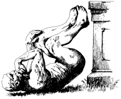

Ig Noble Prize ဆိုတာ Noble Prize ကို လှောင်ထားတာတော့ မဟုတ်ပါဘူး။ တမူထူးခြားတဲ့၊ ဒါမှမဟုတ် ကတ်သီးကတ်သတ်နိုင်ပြီး ရယ်ရွှင်ဖွယ်ကောင်းတဲ့ သိပ္ပံသုတေသနစာတမ်းတွေ၊ project တွေကို ပေးတဲ့ဆုပဲဖြစ်ပါတယ်။ သူတို့အဆိုအရ ဒီလိုစာတမ်းတွေက လူတွေကို ပထမဆုံး ရယ်မောစေတယ်၊ ပြီးတော့ တွေးတောစေပါတယ်။ ဒီဆုကို အမေရိကန်က Annals of Improbable Research လို့ခေါ်တဲ့ magazine ကနေ အဓိကစီစဉ်ပေးတာဖြစ်ပြီး သူတို့ရဲ့ရည်ရွယ်ချက်က ဆန်းပြားတဲ့သုတေသနတွေကို အသိအမှတ်ပြုပြီး လူတွေရဲ့ သိပ္ပံ၊ နည်းပညာနဲ့ ဆေးပညာတို့ကို စိတ်ဝင်စားမှု မြှင့်တင်နိုင်ဖို့ဖြစ်ပါတယ်။ ဆုပေးပွဲကို နှစ်စဉ် Harvard တက္ကသိုလ်မှာကျင်းပပြီး တကယ့် Nobel ဆုရှင်များက တက်ရောက်ချီးမြှင့်ကြပါတယ်။ ဆုအမျိုးအစားတွေကတော့ Nobel ဆုလိုပဲ ရူပဗေဒ၊ ဓာတုဗေဒ၊ စာပေ၊ ငြိမ်းချမ်းရေး၊ စီးပွားရေ:၊ ဇီဝဗေဒ စသဖြင့် ခွဲခြားထားပါတယ်။

Ig Noble Prize ဆုရ သုတေသနအချို့ကတော့ လူတွေအနားမှာရှိတာက ငှက်ကုလားအုပ်များရဲ့ လိင်စိတ်ကို ထကြွစေတာကို တွေ့ရှိချက်၊ black hole တွေက ငရဲ(hell)ရဲ့ တည်နေရာလိုအပ်ချက်တွေနဲ့ ကိုက်ညီနေခြင်း၊ အရက်မူးနေတဲ့လူက သူ့ကိုယ်သူ ဆွဲဆောင်မှုရှိတယ်ထင်ခြင်း၊ ကျစ်ဆံမြီးပုံစံများနှင့် ရွေ့လျားမှု၊ ဖားကို သံလိုက်ဓာတ်အသုံးပြုပြီး လေပေါ်ဝဲစေခြင်းတို့ပဲဖြစ်ပါတယ်။

၁၉၉၁ ခုနှစ်က စတင်ကျင်းပလာတဲ့ Ig Nobel ဆုရရှိသူ အမြောက်အများရှိပြီး အပေါ်က ဖားကိုလေထဲဝဲစေခဲ့တဲ့ သိပ္ပံပညာရှင်က နောက်ပိုင်းမှာ graphene သုတေသနနဲ့ Nobel ဆုကိုလည်း ရရှိခဲ့ပါတယ်။ ဆုပေးပွဲပုံစံကလည်း ဟာသမြောက်အောင် စီစဉ်ထားပါတယ် (လက်ခံစကားပြောဖို့ ၆၀ စက္ကန့်ပဲပေးထားပြီး နောက်ပိုင်းမှ lecture စီစဉ်ပေးတာ၊ ဂုဏ်ပြုတဲ့အနေနဲ့ စင်ပေါ်ကို စက္ကူလေယာဉ်တွေ ပစ်တာ) ။

Ig Nobel Prize ရဲ့ ဆုရွေးချယ်မှုပုံစံကြောင့် သာမန်သုတေသနတွေကို ဆုပေးတယ်လို့ ဝေဖန်ခံခဲ့ရပေမယ့် တည်ထောင်သူ Marc Abrahams ကတော့ ဘယ်သုတေသနက ကြီးမားတဲ့ရှာဖွေတွေ့ရှိချက်ဖြစ်မလဲဆိုတာ အလွယ်တကူ မသိနိုင်ဘူးလို့ဆိုပါတယ်။ Ig Nobel ဆုရ သုတေသနတွေက အစပိုင်းမှာ ကပျက်ကချော်ထင်ရပေမယ့် နောက်ပိုင်းမှာ အသုံးဝင်လာတာတွေလည်း ရှိပါတယ်။ ဥပမာ ငှက်ဖျားဖြစ်စေတဲ့ ခြင်အမျိုးအစားတစ်မျိုးကို လူခြေထောက်နဲ့ ဒိန်ခဲတစ်မျိုးက အတူတူဆွဲဆောင်နိုင်တယ်ဆိုတဲ့ တွေ့ရှိချက်ကို ငှက်ဖျားပေါတဲ့နေရာတွေမှာ ခြင်ဖမ်းဖို့ အသုံးပြုသလိုပါပဲ။ ဆုအရေအတွက်အနည်းငယ်ကို ရွဲ့ပြီးပေးတာတွေလည်းရှိခဲ့ပါတယ်။ ဥပမာ ဆင့်ကဲဖြစ်စဉ် နေရာမှာ intelligent design ကို ထည့်သွင်းသင်ကြားဖို့ အဆိုပြုတဲ့ education department ကို သိပ္ပံပညာရေးဆု ပေးလိုက်သလိုပါပဲ။ ဘာလို့လဲဆိုတော့ အဲ့ဒီ့အဆိုပြုချက်ကိုကြည့်ရင် သိပ္ပံပညာရေး ဘယ်လောက်လိုအပ်နေလဲဆိုတာ သိသာစေလို့ပါတဲ့။

အောက်မှာ ၂၀၁၇ ခုနှစ်အတွက် Ig Nobel Prize ဆုရှိတဲ့ သုတေသနတွေကို ဖော်ပြထားပါတယ်။

- ရူပဗေဒ − ကြောင်က အခဲအဖြစ်ရော၊ အရည်အဖြစ်ရော တည်ရှိနိုင်သလား (France, Singapore, USA)
- ငြိမ်းချမ်းရေး − Didgeridoo (နှဲအကြီးစားတစ်မျိုး) မှုတ်ခြင်းသည် - အိပ်နေစဉ်ဟောက်ခြင်းကို ကုသရန် ထိရောက်သောနည်းလမ်းဖြစ် (Switzerland, Canada, - Netherland, USA)
- စီးပွားရေး − မိကျောင်းကဲ့သို့ တွားသွားအကောင်များနှင့် ထိတွေ့ခြင်းသည် - လောင်းကစားချင်စိတ်ကို ပိုမိုဖြစ်ပေါ်နိုင် (Australia, USA)
- ခန္ဓာဗေဒ − အသက်ကြီးသော ယောက်ျားများ၏ နားသည် အဘယ်ကြောင့် ကြီးရသနည်း (UK)
- ဇီဝဗေဒ − ဂူအောင်းအင်းစက်တစ်မျိုးရှိ အမလိင်တံ၊ အဖိုယောနိနှင့် ဆင့်ကဲဖြစ်စဉ် (Japan, Brazil, Switzerland)
- Fluid dynamics − လမ်းလျှောက်ရင် ကော်ဖီဖိတ်လျှံကျမှုကို လေ့လာခြင်း (South Korea, USA)
- အာဟာရ − အမွှေးထူခြေထောက်ရှိ သွေးစုပ်လင်းနို့အစာတွင် လူသွေးပါဝင်မှု (Brazil, Canada, - Spain)
- ဆေးပညာ − ဒိန်ခဲမုန်းတီးမှုကို ဦးနှောက် scan ဖတ်နည်းဖြင့် လေ့လာခြင်း (France, UK)
- သိစိတ်ပညာ − ရုပ်တူသော အမွှာညီနောင်တို့သည် သူတို့နှင့် သူတို့ညီအစ်ကို၏ မျက်နှာတို့ကို - မခွဲခြားနိုင် (Italy, Spain, UK)
- သားဖွားပညာ − မိခင်၏ ယောနိအတွင်း သီချင်းထုတ်လွှင့်မှုကို သန္ဓေသား၏ တုန့်ပြန်မှု - (Spain)

[ဒီပစ္စည်း](https://www.babypod.net/) ကတော့ နောက်ဆုံးကတစ်ခုကို အခြေခံပြီး ထုတ်လုပ်ထားတဲ့ ပစ္စည်းဖြစ်ပါတယ်။

ပိုမိုသိရှိလိုပါက [မူရင်း website](https://www.improbable.com/) ကို သွားရောက်လေ့လာနိုင်ပါတယ်။
