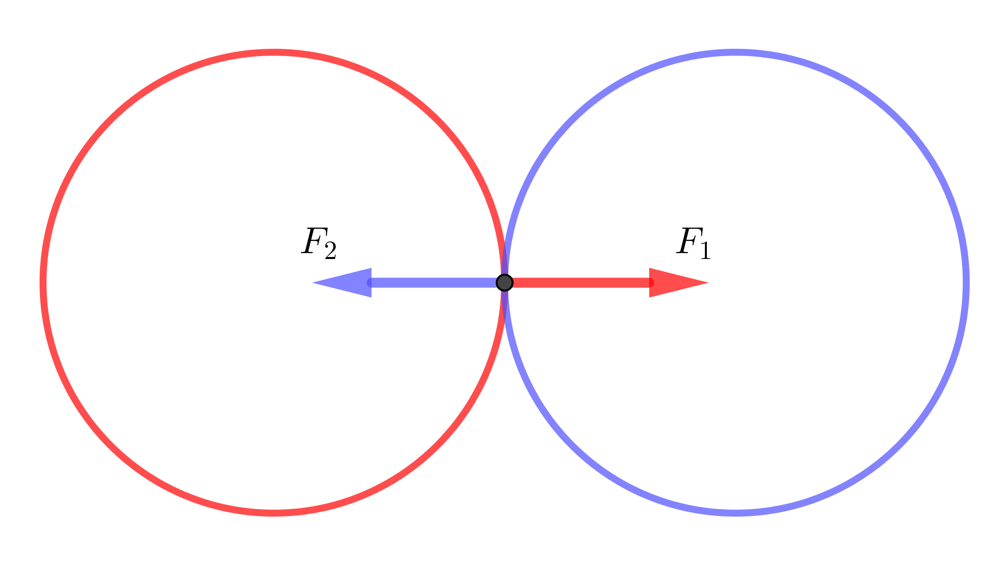
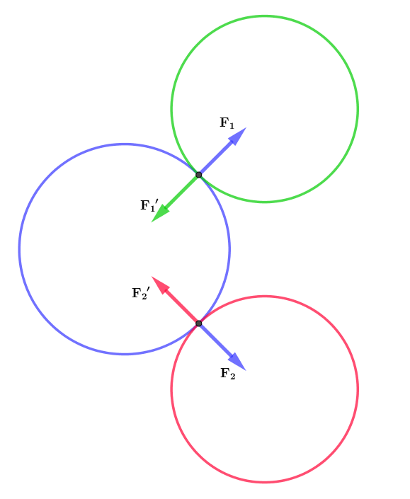
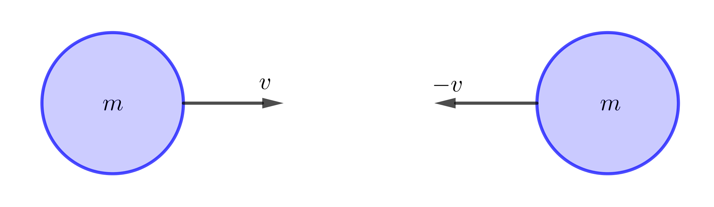
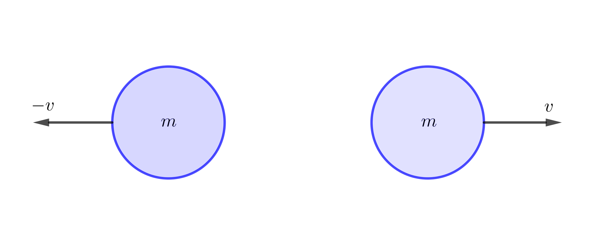
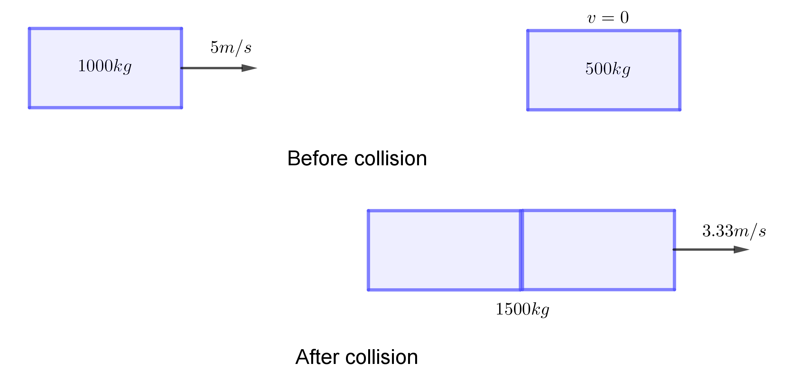
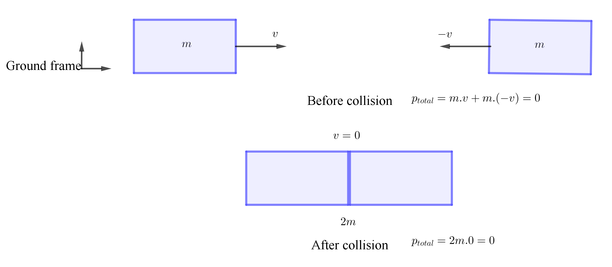
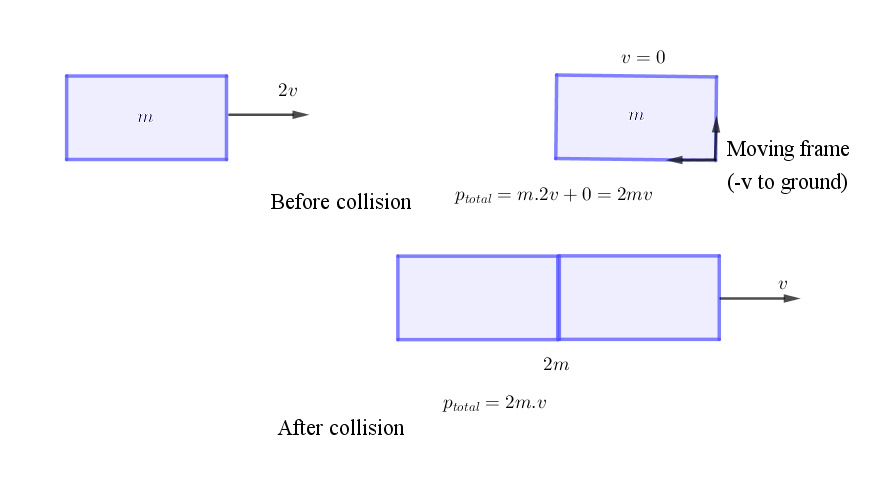

## Rockets

အာကာသထဲကိုလွှတ်တင်တဲ့ ဒုံးပျံတွေဟာ ဆီ၊ အောက်စီဂျင်၊ ဟိုက်ဒရိုဂျင်စတဲ့ လောင်စာတစ်ခုခုသုံးပြီး တွန်းကန်အားရရှိအောင် လုပ်ဆောင်ပါတယ်။ ဆီနဲ့ အောက်စီဂျင်ကို ရောစပ်ဖောက်ခွဲလိုက်တဲ့အခါ အလျင်အလွန်များတဲ့ လောင်ကျွမ်းအမှုန်တွေကို နော်ဇယ်ပေါက်ဝကနေ မှုတ်ထုတ်ပြီး ဒုံးပျံကို တွန်းအားရစေပါတယ်။ အမှုန်တွေက ထွက်လာတဲ့ သက်ရောက်အားကိုသုံးပြီးသွားတဲ့အတွက် ဒုံးပျံတွေက လေထုမရှိတဲ့ အာကာသထဲမှာပါ အလုပ်လုပ်နိုင်ပါတယ်။ နေရောင်ခြည်စွမ်းအင်သုံး ဂြိုလ်တုတွေကတော့ စွမ်းအင်ကို သူတို့ရဲ့လုပ်ဆောင်ချက်တွေအတွက်သာ အသုံးပြုပြီး လမ်းကြောင်းပြောင်းဖို့အတွက်က propellant တစ်ခုခုကို အသုံးပြုရပါတယ်။ တယယ်လို့ သင်ဟာ အာကာသထဲမှာမျောနေမယ်ဆိုရင် မှုတ်ထုတ်ရမယ့်အရာတစ်ခုခုမရှိပဲ လမ်းကြောင်းပြောင်းဖို့ မဖြစ်နိုင်ပါဘူး။ ဘာကြောင့်လဲဆိုတော့ နယူတန်တတိယနိယာမအရ သက်ရောက်မှုတိုင်းမှာ တန်ပြန်သက်ရောက်မှုရှိတဲ့အတွက် သက်ရောက်စရာမရှိရင် တန်ပြန်သက်ရောက်စရာလဲ မရှိပါဘူး :P။ နယူတန်ဒုတိယနိယာမအရ လမ်းကြောင်းပြောင်းဖို့ (နှေးဖို့၊ မြန်ဖို့၊ ကွေ့ဖို့) ဆိုရင် ပြင်ပ သက်ရောက်အား ရှိရပါမယ်။ ကိုယ့်အတွင်းမှာ ရှိနေတဲ့အရာတွေကို သက်ရောက်ရင် သူတို့က ပြန်ပြီးသက်ရောက်အားနဲ့ မျှခြေဖြစ်နေတဲ့အတွက် ပြင်ပအားကို မရနိုင်ပါဘူး။ ပြင်ပကို သက်ရောက်စရာမရှိရင် ကိုယ့်အစိတ်အပိုင်းတစ်ခုကို ခွဲထုတ်လိုက်မှသာ အသားတင်အားကို ရရှိပါမယ်။ ဒီသဘောတရားကို ရူပဗေဒရဲ့ အခြေခံအုတ်မြစ်တစ်ခုဖြစ်တဲ့ အဟုန်တည်မြဲခြင်းနိယာမမှာ တွေ့နိုင်ပါတယ်။

နယူတန်ဒုတိယနိယာမအရ ပြင်ပသက်ရောက်အားက အဟုန်ပြောင်းလဲခြင်းနဲ့ တူညီပါတယ်။

$$
\mathbf{F}=\frac{d\mathbf{p}}{dt}
$$

and

$$
\mathbf{p}=m.\mathbf{v}
$$

$F$=အား, $p$=အဟုန်, $m$=ဒြပ်ထု, $v$=အလျင်

ပစ္စည်းနှစ်ခု (ဥပမာ ဘောလုံးနှစ်လုံး) ရှိတယ်ဆိုပါတော့။ တစ်လုံးစီမှာ သက်ဆိုင်ရာ ဒြပ်ထုနဲ့ အဟုန်အသီးသီးရှိကြတယ်။ တစ်လုံးကရပ်နေပြီး တစ်လုံးက လိမ့်လာတယ်ဆိုပါတော့။ ဒါဆိုရင် ရပ်နေတဲ့အလုံးမှာ အဟုန် သုညရှိပြီး လိမ့်လာတဲ့အလုံးမှာ အဟုန် အပေါင်းကိန်းတစ်ခုရှိပါမယ်။ သူတို့နှစ်လုံးတိုက်မိတဲ့အချိန်ကျရင် သွားနေတဲ့အလုံးက အင်နားရှားအရ ဆက်သွားချင်ပြီး ရပ်နေတဲ့အလုံးကလဲ ဆက်ရပ်ချင်ပါမယ်။ ဒါကြောင့် ဘောလုံးနှစ်လုံးကြားမှာ အားသက်ရောက်မှုတစ်ခုဖြစ်လာပါတယ်။ နယူတန်တတိယနိယာမအရ တစ်လုံးရဲ့သက်ရောက်အားက နောက်တစ်လုံးရဲ့ သက်ရောက်အားနဲ့ တန်ဖိုးတူပြီး လက္ခဏာပြောင်းပြန်ဖြစ်ပါတယ်။

$$
\mathbf{F_1}=-\mathbf{F_2}
$$

နယူတန် ဒုတိယနိယာမအရ−

$$
\frac{d\mathbf{p_1}}{dt}=-\frac{d\mathbf{p_2}}{dt}
$$

ဒီတော့ ဘောလုံး ၁ ရဲ့ အဟုန်ပြောင်းလဲနှုန်းက ဘောလုံး ၂ ရဲ့ အဟုန်ပြောင်းလဲနှုန်း အနှုတ်နဲ့ ညီမျှပါတယ်။ ဒါပေမယ့် အချိန်ပိုင်းက ဘောလုံးနှစ်လုံးစလုံးအတွက် အတူတူပဲဆိုရင် အဟုန်ပြောင်းလဲမှု*ပမာဏ* ကလည်း အတူတူပဲဖြစ်မှာပါ။ ဥပမာ ပထမဘောလုံးရဲ့ အဟုန်ပြောင်းလဲနှုန်းက ၁ စက္ကန့်မှာ ၁ ယူနစ်နှုန်းနဲ့ လျော့ကျသွားတယ်ဆိုရင် ဒုတိယဘောလုံးက ၁ စက္ကန့်မှာ ၁ ယူနစ်နှုန်းနဲ့ အဟုန်တိုးလာပါမယ်။ ၂ စက္ကန့်ကြာတဲ့အခါ ပထမဘောလုံးမှာ အဟုန် ၂ ယူနစ်လျော့သွားပြီး ဒုတိယဘောလုံးမှာ အဟုန် ၂ ယူနစ်တိုးလာပါမယ်။ ဒါကြောင့် _စုစုပေါင်းအဟုန်_ က ဘောလုံးနှစ်လုံးအတွက် ဘယ်အချိန်မှာဖြစ်ဖြစ် ကိန်းသေဖြစ်နေပါတယ်။

အပေါ်က ညီမျှခြင်းကို ပြန်ညှိကြည့်ရင်−

$$
\frac{d\mathbf{p_1}}{dt}+\frac{d\mathbf{p_2}}{dt}=0
$$

Differentation နည်းစနစ်အရ−

$$
\frac{d(\mathbf{p_1}+\mathbf{d_2})}{dt}=0
$$

$\mathbf{p_1}$ နဲ့ $\mathbf{p_2}$ ပေါင်းခြင်းက အချိန်နဲ့ ပြောင်းလဲခြင်းမရှိဘူးလို့ ဆိုလိုတာပါ။

တကယ်လို့ ဘောလုံးသုံးလုံးဆိုရင်ရော။ သွားနေတဲ့တစ်လုံးက ရပ်နေတဲ့နှစ်လုံးကို တိုက်မိရင် ဘယ်လိုဖြစ်မလဲ။ နှစ်လုံးကို တစ်ပြိုင်တည်းတိုက်မိရင် အားသက်ရောက်မှုတွေက ဗက်တာအစိတ်အပိုင်းတွေလိုပဲ ခွဲပြီးသက်ရောက်မှာပါ။

ဒီနေရာမှာ ဘောလုံးသုံးလုံးစလုံးကို စနစ်တစ်ခုအနေနဲ့ကြည့်ရင် အားတွေအကုန်လုံးက စနစ်အတွင်းမှာရှိပြီး အသားတင်ပြင်ပအားမရှိတာကို တွေ့ရပါမယ်။ ဒီစနစ်အတွင်းမှာရှိတဲ့ အဟုန်တွေအားလုံးပေါင်းခြင်းကတော့ ကိန်းသေဖြစ်ပါတယ်။ ဒါကို အဟုန်တည်မြဲခြင်းနိယာမလို့ ခေါ်ပါတယ်။

$$
m_1v_1+m_2v_2+m_3v_3=\text{constant}
$$

3 dimension မှာဆိုရင် အဟုန်က သက်ဆိုင်ရာ axis တစ်ခုစီမှာ တည်မြဲတာကြောင့် x, y, z အတွက် အပေါ်က ညီမျှခြင်းလိုမျိုး သုံးကြောင်းရှိပါမယ်။

## Collisions

အဟုန်တည်မြဲခြင်းနိယာမကို ကားနှစ်စီးတိုက်တဲ့ဖြစ်ရပ်၊ ဘိလိယက်ဘောလုံးတွေတိုက်တဲ့ဖြစ်ရပ် စတဲ့ collision တွေမှာ အသုံးချလို့ရပါတယ်။ တိုက်မိတဲ့ဖြစ်ရပ်က နှစ်မျိုးရှိပါတယ်၊ ရုန်းပြန်တိုက်ခြင်း (elastic collision) နဲ့ ရုန်းမပြန်တိုက်ခြင်း (inelastic collision) တို့ဖြစ်ပါတယ်။ Collision ဖြစ်တဲ့ဝတ္ထုပစ္စည်းတွေမှာ ပြောင်းလဲနိုင်တာ အဟုန်သာမက အရွေ့စွမ်းအင် (kinetic energy) လည်း ပြောင်းလဲနိုင်ပါတယ်။ $K.E=\frac{1}{2}mv^2$ ဖြစ်တဲ့အတွက် အရွေ့စွမ်းအင်က ဒြပ်ထုနဲ့ တိုက်ရိုက်အချိုးကျပြီး အလျင်နှစ်ထပ်ကိန်းနဲ့ အချိုးကျပါတယ်။ အလျင် အနည်းငယ်အပြောင်းအလဲဖြစ်လိုက်တာနဲ့ အရွေ့စွမ်းအင်က အများကြီးပြောင်းလဲနိုင်ပါတယ်။ အဟုန်ကတော့ ဒြပ်ထုရော အလျင်ရောနဲ့ တိုက်ရိုက်အချိုးကျပါတယ်။ Elastic collision တွေမှာ အဟုန်ရော အရွေ့စွမ်းအင်ရောက တည်မြဲပါတယ် (စုစုပေါင်း အရေအတွက် မပြောင်းလဲပါဘူး)။ inelastic collision မှာတော့ အဟုန်ပဲတည်မြဲပြီး အရွေ့စွမ်းအင်က တစ်ခြားစွမ်းအင်ပုံစံ (အပူ၊ အသံ) တွေကို ပြောင်းသွားနိုင်ပါတယ်။ Elastic collision အများစုက တိုက်မိပြီးရင် ပြန်ကွာသွားတာဖြစ်ပြီး inelastic collision အများစုက တိုက်မိပြီးရင် ပေါင်းစည်းသွားတာများပါတယ်။ ဓာတ်ငွေ့အများစုထဲက အက်တမ်တွေတိုက်မိတာက perfectly elastic collision ဖြစ်ပါတယ်။ ရာဘာဘောလုံး၊ ဘိလိယက်ဘောလုံးတွေတိုက်မိတဲ့အခါ အရွေ့စွမ်းအင်ဆုံးရှုံးမှုက မပြောပလောက်တဲ့အတွက် elastic collision လို့ယူဆလို့ရပါတယ်။ ကားနှစ်စီးတိုက်မိတဲ့အခါမှာတော့ အများအားဖြင့် inelastic collision ဖြစ်တာများပါတယ်။

Collision တစ်ခုရဲ့ ရလဒ်ကိုသိဖို့အတွက် အချက်နှစ်ချက်ကို သိဖို့လိုအပ်ပါတယ်။

၁။ အဟုန်တည်မြဲခြင်း (isolated စနစ်တစ်ခုအတွက် အမြဲတမ်းမှန်ပါတယ်)

$$
m_1\mathbf{v_1}+m_2\mathbf{v_2}=m_1\mathbf{v_1'}+m_2\mathbf{v_2'}
$$

၂။ Elastic or inelastic collision (အရွေ့စွမ်းအင် မည်ကဲ့သို့ပြောင်းလဲမှု)

Perfectly elastic collision:

$$
\frac{1}{2} m_1v_1^2+\frac{1}{2} m_2v_2^2=\frac{1}{2} m_1v_1'^2+\frac{1}{2} m_2v_2'^2
$$

ဝတ္ထုနှစ်ခုအတွက် ဒြပ်ထုတွေနဲ့ မူလအလျင်တွေသိတယ်ဆိုရင် နောက်ဆုံးအလျင်နှစ်ခုကို သိဖို့အတွက် အပေါ်နှစ်ချက်ကရတဲ့ ညီမျှခြင်းနှစ်ကြောင်းကိုသုံးပြီ: ဖြေရှင်းလို့ရပါတယ်။

ဒြပ်ထု $m$ စီရှိပြီး $v$ အလျင်နဲ့ ရွေ့လျားနေတဲ့ ဘောလုံးနှစ်လုံး မျက်နှာချင်းဆိုင်လာပြီး perfectly elastic collision နဲ့ တိုက်မိတယ်ဆိုပါတော့။ မတိုက်မိခင်မှာ−

အလျင် v နှစ်ခုက ဦးတည်ချက်ဆန့်ကျင်ဘက်ဖြစ်တဲ့အတွက် တစ်ခုက v ဖြစ်ပြီ: နောက်တစ်ခုက -v ဖြစ်ပါတယ်။ အဟုန်စုစုပေါင်းက−

$$
p_{total} = mv + m(-v)=0
$$

ဖြစ်ပါတယ်။ ဒါကြောင့် တိုက်ပြီးတဲ့အချိန်မှာလည်း အဟုန်စုစုပေါင်း 0 ဖြစ်ရပါမယ်။ Perfectly elastic collision ဖြစ်တဲ့အတွက် kinetic energy လည်း လုံးဝပြောင်းလဲမှုမရှိရပါဘူး။ ဒါကြောင့် ဘောလုံးနှစ်လုံးက တိုက်ပြီးတာနဲ့ ဆန့်ကျင်ဘက်ကို မူလအလျင်နဲ့ ပြန်ကန်ထွက်သွားမှာဖြစ်ပါတယ်။

## Newton’s cradle

(https://commons.wikimedia.org/wiki/File%3ANewtons_cradle_animation_book.gif "By DemonDeLuxe (Dominique Toussaint) (Own work) [GFDL (http://www.gnu.org/copyleft/fdl.html) or CC-BY-SA-3.0 (http://creativecommons.org/licenses/by-sa/3.0/)], via Wikimedia Commons")

Newton's cradle မှာတော့ အရွယ်တူသံလုံးလေးတွေကို ကြိုးနှစ်ချောင်းစီနဲ့ တွဲလောင်းချထားပြီ: အစွန်ကတစ်လုံးကို ဆွဲယူပြီး တိုက်စေတာဖြစ်ပါတယ်။ အဟုန်တည်မြဲခြင်းနိယာမအရဆိုရင် ဆန့်ကျင်ဘက်အစွန်ဆုံးကတစ်လုံးတည်းက တူညီတဲ့အလျင်နဲ့ မြောက်တက်နိုင်သလို နှစ်လုံးက အလျင်တစ်ဝက်စီ $(m\times \frac{1}{2}v + m\times \frac{1}{2}v)$ နဲ့ မြောက်တက်တာလည်း ဖြစ်နိုင်ပါတယ်။ ဒါပေမယ့် perfectly elastic collision လို့ ယူဆနိုင်တဲ့အတွက် အရွေ့စွမ်းအင်ပါ တည်မြဲရမယ်ဆိုရင် တစ်လုံးတည်းမြောက်တက်တာကပဲ ဖြစ်နိုင်ပါတယ်။ နှစ်လုံးတွဲ၊ သုံးလုံးတွဲစီ တိုက်စေရင်လည်း တူညီတဲ့အလုံးရေအလိုက် တုန့်ပြန်မှာဖြစ်ပါတယ်။

Inelastic collision ဥပမာတစ်ခုအနေနဲ့ သွားနေတဲ့ကားက ရပ်ထားတဲ့ကားကို ဝင်တိုက်တဲ့ ဥပမာကို ကြည့်ရအောင်။ သွားနေတဲ့ကားရဲ့ ဒြပ်ထုက 1000 kg ရှိပြီး 5 m/s နဲ့ သွားနေတယ်ဆိုပါတော့။ ရပ်ထားတဲ့ကားရဲ့ ဒြပ်ထုက 500 kg ထားပါ။ ဒါဆို မူလအဟုန်စုစုပေါင်းက−

$1000 \times 5+500 \times 0=5000 \  \text{kg.m/s}$ ရှိမယ်။ ကားနှစ်စီးတိုက်လိုက်တဲ့အခါ ဒြပ်ထုစုစုပေါင်းက 1500 kg ရှိမယ်။ ကားနှစ်စီးစုစုပေါင်း နောက်ဆုံးအဟုန်က မူလအဟုန်စုစုပေါင်းနဲ့ တူညီရမယ်။ ဒီတော့−

$$
1500 \times v'=5000
$$

$$
v'=\frac{50}{15}=3.33 m/s
$$

ကားနှစ်စီး ပေါင်းပြီးသွားတဲ့အလျင်က 3.33 m/s ဖြစ်တာကို တွေ့ရမယ်။

အရွေ့စွမ်းအင်ကို တွက်ကြည့်ရင်−

မူလ => $\frac{1}{2}mv_1^2+0=12500$ Joules

နောက်ဆုံး => $\frac{1}{2}(m_1+m_2)v'^2=8317$ Joules

မူလ အရွေ့စွမ်းအင်စုစုပေါင်းနဲ့ နောက်ဆုံးအရွေ့စွမ်းအင်စုစုပေါင်းက မတူညီတာကို တွေ့ရပါမယ်။ ဒါက အရွေ့စွမ်းအင်အတွက်သာဖြစ်ပြီး စွမ်းအင်စုစုပေါင်းကတော့ တူညီရမှာဖြစ်ပါတယ်။ ဒါကြောင့် စွမ်းအင်တည်မြဲမှု မတူညီတဲ့ပြဿနာတွေနဲ့ကြုံရရင် စွမ်းအင်က ပုံစံပြောင်းတတ်တယ်ဆိုတာသတိရပါ။

ဒီနေရာမှာ တစ်ခုဖြတ်ပြောချင်တာက အလျင် ($\mathbf{v}$) ရော အဟုန် ($\mathbf{p}$) ရောက vector တွေဖြစ်တာကြောင့် သူတို့ရဲ့ ဦးတည်ရာကို ထည့်သွင်းစဉ်းစားဖို့ လိုအပ်ပါတယ်။ မဟုတ်ရင် ဦးတည်ချက်မတူတဲ့ကိန်းတွေကို ပေါင်းမိတာဖြစ်တတ်ပါတယ်။

ဒြပ်ထုနဲ့ အလျင်တူညီတဲ့ ဘောလုံးနှစ်လုံးက မျက်နှာချင်းဆိုင် inelastic collision နဲ့ တိုက်မိရင်တော့ နှစ်လုံးစလုံး ရပ်သွားမှာဖြစ်ပါတယ်။ အပေါ်က perfectly elastic collision မှာလည်း အဟုန်စုစုပေါင်းက သုညဖြစ်ပေမယ့် ဘောလုံးတွေက ရပ်မသွားတာကို နှိုင်းယှဉ်ကြည့်ပါ။

## Frame of reference

[Relativity principle](https://theinlinaung.wordpress.com/2017/09/06/symmetry/)
အရ အဟုန်တည်မြဲခြင်းနိယာမက အလျင်ကိန်းသေတစ်ခုနဲ့ ရွေ့လျားနေတဲ့ reference frame ကို ပြောင်းလိုက်ရင်လည်း မှန်ကန်နေရမှာဖြစ်ပါတယ်။ ဒါဆို ဒြပ်ထုနဲ့ အလျင်တူတဲ့ ကားနှစ်စီး inelastic collision နဲ့တိုက်မိတဲ့ ဥပမာကိုပဲ ကြည့်ရအောင်။ အရင်ဆုံး ground or earth reference frame လို့ခေါ်တဲ့ ကားလမ်းနေရာကနေ frame ယူကြည့်ရအောင်။

ကားနှစ်စီးက အလျင် v နဲ့ -v တို့နဲ့ အသီးသီးရွေ့နေပါတယ်။ သူတို့ တိုက်မိတဲ့အခါ နှစ်စီးလုံးရပ်သွားပါတယ်။

အခုတစ်ခါ ညာဘက်က ကားနေရာကနေ reference frame ယူကြည့်ပါမယ်။ ဒီတော့ reference frame က ညာဘက်က ကားနဲ့အတူ အလျင် -v နဲ့ ရွေ့နေပါမယ်။ ဒီ frame အရ ညာဘက်က ကားက ရပ်နေပြီး ဘယ်ဘက်က ကားက အလျင် 2v နဲ့ ရွေ့လာနေပါတယ်။ သူတို့နှစ်စီး တိုက်ပြီးတဲ့အခါ ကားနှစ်စီးလုံး အလျင် v နဲ့ ရွေ့မှာဖြစ်ပါတယ်။ ဒါပေမယ့် reference frame ကိုယ်တိုင်က -v နဲ့ရွေ့နေတဲ့အတွက်ကြောင့် ground ကနေကြည့်ရင် ကားနှစ်စီးကရပ်နေပြီး frame က ကားတွေနဲ့ဝေးရာကို ရွေ့သွားတယ်လို့ မြင်ရပါလိမ့်မယ်။ ဒါကြောင့် frame နှစ်ခုကရတဲ့ ရလဒ်နှစ်ခုက တကယ်တော့အတူတူပဲဆိုတာ တွေ့ရပါလိမ့်မယ်။

## Relativity သီအိုရီအတွက် အဟုန်

အဟုန်တည်မြဲခြင်းနိယာမက အလင်းအလျင်နီးပါးမြန်တဲ့ အလျင်တွေအထိပါ မှန်ပါတယ်။ ဒါပေမယ့် အဟုန်ကိုတွက်ရင် relativity သက်ရောက်မှုတွေကို ထည့်စဉ်းစားရပါတယ်။ Relativity theory အရ ဒြပ်ထုက ကိန်းသေမဟုတ်ပဲ အလျင်နဲ့လိုက်ပြီး တိုးလာပါတယ်။

$$
m=\frac{m_0}{\sqrt{1-\frac{v^2}{c^2}}}
$$

$m_0$ က rest mass ဖြစ်ပြီးတော့ c က အလင်းအလျင်ဖြစ်ပါတယ်။ ဒါကြောင့်−

$$
p_x=m_0\frac{v_x}{\sqrt{1-\frac{v^2}{c^2}}},\: p_y=m_0\frac{v_y}{\sqrt{1-\frac{v^2}{c^2}}},\:p_z=m_0\frac{v_z}{\sqrt{1-\frac{v^2}{c^2}}}, \\

v^2=v_x^2+v_y^2+v_z^2
$$

နဲ့ တွက်မှ နှိုင်းရသီအိုရီအရ မှန်ကန်တဲ့ အဟုန်ကို ရရှိမှာဖြစ်ပါတယ်။

## ကွမ်တမ်မက်ကင်းနစ်အတွက် အဟုန်

ကွမ်တမ်မက်ကင်းနစ်အရ အမှုန်တွေက အမှုန်သဘာဝရော လှိုင်းသဘာဝရောရှိပါတယ်။ အမှုန်အနေနဲ့ကြည့်တဲ့အခါ အဟုန်က $ m\mathbf{v} $ ဖြစ်ပေမယ့် လှိုင်းအနေနဲ့ကြည့်တဲ့အခါ $ m\mathbf{v} $ မဟုတ်တော့ပါဘူး။ ဥပမာ အလင်း က rest mass မရှိပေမယ့် အဟုန်တော့ ရှိတဲ့အတွက် အလင်းတန်းကျရောက်တဲ့ ဝတ္ထုမှာ အဟုန်ပြောင်းလဲမှုရှိပါတယ်။ လှိုင်းအနေနဲ့ဆိုရင် ၁ စင်တီမီတာကို လှိုင်းဘယ်နှစ်ခုဖြတ်သလဲဆိုတာနဲ့ အဟုန်ကို တိုင်းတာပါတယ်။ ဒါပေမယ့် ကွမ်တမ်မက်ကင်းနစ်မှာလည်း အဟုန်တည်မြဲခြင်းနိယာမက မှန်ကန်နေဆဲပါပဲ။
