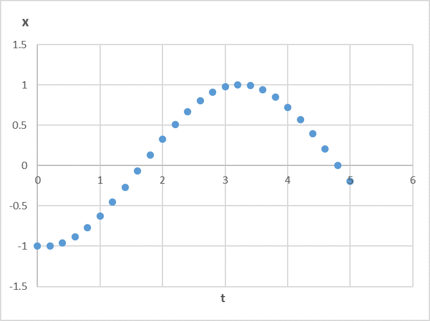

သိပ္ပံနဲ့ အင်ဂျင်နီယာပညာရပ်တွေမှာ mechanics လို့ခေါ်တဲ့ ရွေ့လျားမှုဆိုင်ရာ နိယာမတွေဟာ အရေးပါပါတယ်။ ဘာလို့လဲဆိုတော့ အဲ့ဒီ့နိယာမတွေက နောက်ထပ်အဆင့်မြင့်တဲ့ ဥပဒေသတွေကို လေ့လာဖို့ အခြေခံကျတဲ့နေရာက ပါဝင်နေလို့ပဲဖြစ်ပါတယ်။ နယူတန်ရဲ့ ရွေ့လျားမှုနိယာမသုံးခုကို အသုံးပြုပြီး နောက်ထပ်နိယာမအမြောက်အမြားကို တွက်ထုတ်နိုင်တဲ့အပြင် လက်တွေ့အသုံးချတဲ့နေရာမှာလဲ သူတို့ကို ထပ်ခါထပ်ခါအသုံးပြုရပါတယ်။ စွမ်းအင်၊ အား၊ စွမ်းအား၊ အလျင်၊ အဟုန် စတဲ့အရာတွေကလည်း ကားမောင်းတာကအစ ကွမ်တမ်မက်ကင်းနစ်အထိ ပါဝင်တဲ့အတွက် သိပ္ပံပညာရဲ့ ကကြီး ခခွေးလို့ခေါ်ရလောက်အောင် ပဓာနကျလှပါတယ်။ အခုတစ်ခါ နယူတန်ရဲ့ ရွေ့လျားမှုနိယာမသုံးခုကို လေ့လာသွားပါမယ်။

## နယူတန်၏ ရွေ့လျားမှုဆိုင်ရာ ပထမနိယာမ

ဒီနိယာမကို အင်နားရှားနိယာမလို့လည်း ခေါ်ပါတယ်။ နယူတန်က ပထမဆုံး ပြောခဲ့တာတော့ မဟုတ်ပါဘူး။ သိပ္ပံပညာရှင် ဂယ်လီလီယိုက စတင်အဆိုပြုခဲ့ပြီး နယူတန်က သူ့ကျမ်းထဲမှာ ပြန်ထည့်ထားတာပဲ ဖြစ်ပါတယ်။ အင်နားရှားရဲ့ သဘာဝက အရာဝတ္ထုတိုင်းမှာရှိတယ်၊ ရပ်နေတဲ့ အရာတစ်ခုက သူ့ပေါ်ကို ဘာသက်ရောက်မှုမှ မရှိရင် ရပ်မြဲရပ်နေပြီး သွားနေတဲ့အရာကလဲ သွားမြဲသွားနေမယ်လို့ ဆိုလိုပါတယ်။ သင်ဟာ အခုအချိန်မှာ အင်နားရှားသဘောတရားနဲ့ ရင်းနှီးနေနိုင်ပေမယ့် ဂယ်လီလီယိုရဲ့ တွေ့ရှိချက်က အသေးအမွှားမဟုတ်ပါဘူး။ ဘာကြောင့်လဲဆိုတော့ ကျွန်တော်တို့နေ့စဉ်ကြုံတွေ့နေတဲ့ အဖြစ်အပျက်တွေမှာ သွားနေတဲ့အရာတစ်ခုက သူ့ဘာသူအမြဲတမ်းဆက်သွားနေတယ်ဆိုတာ မရှိပါဘူး။ လမ်းပေါ်မှာ ဘောလုံးတစ်လုံးကို လှိမ့်လိုက်မယ်ဆိုရင် ဘောလုံးက အကွာအဝေးတစ်ခုရောက်ရင် ရပ်သွားပါတယ်။ စက်ဘီးစီးနေရင်း မနင်းပဲနေရင်လည်း စက်ဘီးက တစ်ြဖည်းဖြည်း ရပ်သွားပါတယ်။ အဲ့ဒါက ဘာလို့လဲဆိုတော့ ဘောလုံးနဲ့စက်ဘီးရဲ့ ရွေ့လျားမှုကို ဆန့်ကျင်ဘက်လုပ်ပြီး သက်ရောက်နေတဲ့ အားတွေရှိလို့ပါ။ ဘောလုံးကို စားပွဲပေါ်မှာလှိမ့်တယ်ပဲ ထားပါတော့။ စားပွဲတစ်လုံးရဲ့ မျက်နှာပြင်ကို ကြည့်လိုက်ရင် ချောနေသယောင် ထင်ရပါလိမ့်မယ်။ ဒါပေမယ့် စားပွဲမျက်နှာပြင်ကို လက်နဲ့ပွတ်ကြည့်ရင် သူ့ရဲ့ ကြမ်းတမ်းမှုကြောင့်ဖြစ်တဲ့ ပွတ်မှုအားကို ခံစားရပါလိမ့်မယ်။ မျက်နှာပြင်က အလွန်ချောမွတ်နေတယ်လို့ ထင်ရရင်တောင်မှ သူ့ကို မိုက်ခရိုစကုတ်အောက်မှာ အဆများစွာ ချဲ့ကြည့်ရင် အက်တမ်အဆင့်လောက် ရောက်တဲ့အခါ ချောမွတ်မှုပျောက်သွားပြီး ဖုတွေထစ်တွေ၊ ချိုင့်တွေကို တွေ့ရမှာ ဖြစ်ပါတယ်။ ဘောလုံးက အဲ့ဒီ့မျက်နှာပြင်ပေါ်ဖြတ်သွားတဲ့အခါ အဖုအထစ်တွေပေါ်ကို ဖြတ်ရတဲ့အတွက် ဘောလုံးနဲ့ စားပွဲမျက်နှာပြင်မှာရှိတဲ့ အက်တမ်တွေကို တုန်ခါစေပါတယ်။ အဲ့ဒီ့တုန်ခါမှုတွေက အသံနဲ့ အပူစွမ်းအင်အဖြစ်ပြောင်းသွားပြီး ဘောလုံးရဲ့ ရွေ့လျားမှုစွမ်းအင်တွေကို လျော့ကျစေပါတယ်။ ဒါပေမယ့် ပွတ်မှုအား မရှိသလောက်နည်းတဲ့ အာကာသထဲမှာတော့ ဘောလုံးကို ပစ်လိုက်ရင် တစ်ခုခုနဲ့ မတိုက်မချင်း ဆက်သွားနေမှာ ဖြစ်ပါတယ်။

## နယူတန် ဒုတိယနိယာမ

ဒုတိယနိယာမက အဟုန်ပြောင်းလဲနှုန်းနဲ့ သက်ဆိုင်ပါတယ်။ အဟုန်ဆိုတာက ရွေ့လျားနေတဲ့ အရာတစ်ခုမှာရှိတဲ့ ဂုဏ်သတ္တိတစ်ခုဖြစ်ပြီး p သ​​ေင်္ကတနဲ့ ကိုယ်စားပြုပါတယ်။ အဟုန်ကိုလိုချင်ရင် ဒြပ်ထုနဲ့ အလျင်နဲ့ မြှောက်ရပါတယ်။ ဒါကြောင့် ဒြပ်ထု၊ ဒါမှမဟုတ် အလျင်တစ်ခုခုကြီးတဲ့အရာမှာ အဟုန်အများကြီးရှိပါတယ်။

$$
\text{အဟုန်} = \text{ဒြပ်ထု} \times \text{အလျင်}
$$

$$
p=m×v
$$

ဒုတိယနိယာမကပြောတာက ပြင်ပအားသက်ရောက်မှုက အဟုန်ပြောင်းလဲနှုန်းနဲ့ တူပါတယ်တဲ့။ ပစ္စည်းတစ်ခုကို တွန်းလိုက်ရင် အလျင်မြန်သွားသလိုပါပဲ။ သက်ရောက်တဲ့အားက ပစ္စည်းရဲ့ အဟုန်ကို တိုးစေ၊ လျော့စေပါတယ်။

$$
F=\frac{dp}{dt}
$$

အချိန်အပိုင်းအခြား $dt$ အတွင်း သက်ရောက်သောအားသည် ထိုအချိန်အတွင်း အဟုန်ပြောင်းလဲမှု $dp/dt$ နှင့် တူညီသည်။

အဟုန်က $m \times v$ ဖြစ်တဲ့အတွက် ဒြပ်ထုကို ကိန်းသေယူလိုက်ရင် အားက အလျင်ပြောင်းလဲနှုန်းနဲ့ တိုက်ရိုက်အချိုးကျတာကို တွေ့ရပါလိမ့်မယ်။ အလျင်ပြောင်းလဲနှုန်းက အရှိန်ဖြစ်တာကြောင့် $F=m \times a$ လို့လည်း ရေးလို့ရပါတယ်။

$$
F=\frac{d(mv)}{dt}=m\frac{dv}{dt}=ma
$$

နောက်အချက်တစ်ခုက အပေါ်က ညီမျှခြင်းတွေမှာပါတဲ့ အား၊ အဟုန်နဲ့ အရှိန်တို့ဟာ ဦးတည်ရာအတူတူပါပဲ။ အားက နောက်ကနေ ရှေ့ကို သက်ရောက်ရင် အရှိန်ကလည်း နောက်ကနေ ရှေ့ကို ဦးတည်ပြီးတိုးသွားပါတယ်။ အားက ပစ္စည်းရဲ့ ရွေ့လျားနေတဲ့ဦးတည်ရာကနေ ဆန့်ကျင်ဘက်သက်ရောက်ရင် အဲ့ဒီ့အားကြောင့်ဖြစ်တဲ့ အရှိန်ကလည်း ဆန့်ကျင်ဘက်သက်ရောက်ပါတယ်။ ရွေ့လျားမှုကို ဆန့်ကျင်တဲ့အားကို အနှုတ်လက္ခဏာနဲ့ ပြနိုင်ပြီး အနှုတ်အရှိန်ကို ဆုတ်ရှိန်လို့ ခေါ်နိုင်ပါတယ်။ တကယ်လို့ အရှိန်က ရွေ့လျားမှုအလျင်ကို ထောင့်မှန်ကျ သက်ရောက်နေရင် ပစ္စည်းက စက်ဝိုင်းပုံလမ်းကြောင်းအတိုင်း သွားမှာဖြစ်ပါတယ်။ အဲ့ဒီ့အရှိန်ကို ဗဟိုချင်းရှိန်လို့ခေါ်ပြီး ထိုအရှိန်ကို ဖြစ်စေတဲ့အားကို ဗဟိုချင်းအားလို့ ခေါ်ပါတယ်။

ဟင်းလင်းပြင်မှာ ဦးတည်ရာ ဒိုင်မန်းရှင်းသုံးခု (x, y, z) ရှိတဲ့အတွက် အား၊ အဟုန်၊ အရှိန်တို့ရဲ့ ဆက်နွယ်ချက်ကလည်း သူ့ဦးတည်ရာအလိုက် အသီးသီး မှန်ကန်ပါတယ်။

$$
F_x=m\frac{dv_x}{dt}=ma_x
$$

$$
F_y=m\frac{dv_y}{dt}=ma_y
$$

$$
F_z=m\frac{dv_z}{dt}=ma_z
$$

$F_x, F_y, F_z $ တို့ဟာ x, y, z ဝင်ရိုးပေါ်မှာရှိတဲ့ $F$ ရဲ့ အစိတ်အပိုင်းတွေဖြစ်ပါတယ်။ အလားတူ a ရဲ့ အစိတ်အပိုင်းတွေကလည်း ​$ a_x, a_y, a_z $ တို့ ဖြစ်ကြပါတယ်။ $F$ ရဲ့ အစိတ်အပိုင်းတွေကို သိချင်ရင် $F$ ရဲ့ ပကတိတန်ဖိုးနဲ့ ရှာချင်တဲ့ ဝင်ရိုးနဲ့ $F$ တို့ ခံဆောင်ထားတဲ့ထောင့် cosine နဲ့ မြှောက်ပေးရပါတယ်။

## ဒုတိယနိယာမ၏ အဓိပ္ပာယ်

နိယာမကို သိတာတော့ ဟုတ်ပါပြီ။ သူ့ကို ဘယ်လိုအသုံးချမလဲဆိုတာ ကြည့်ရအောင်။ ရွေ့လျားမှုဆိုင်ရာ ဥပမာတစ်ခုအနေနဲ့ စပရိန်တစ်ခုမှာဆွဲထားတဲ့ အလေးတုံးလေးတစ်ခုရဲ့ လှုပ်ရှားမှုကို လေ့လာကြည့်ရအောင်။

စပရိန်ရဲ့ ဂုဏ်သတ္တိဖြစ်တဲ့ တောင့်တင်းအားကို $k$ နဲ့ ဖော်ပြပြီး စပရိန်က တွန်းကန်အားကို လိုချင်ရင် $F=-kx$ နဲ့ တွက်ရပါတယ်။ $x$ က စပရိန်ရဲ့ မူလအခြေအနေကနေ ပျက်ယွင်းသွားတဲ့ အကွာအဝေးဖြစ်ပါတယ်။ $x$ က အပေါင်းဆိုရင် စပရိန်က ပြန်ဆွဲတဲ့အတွက် $F$ က အနှုတ်ဖြစ်ပါတယ်။ လိမ္မော်ရောင် အတုံးက ဒြပ်ထု $m$ ရှိတဲ့ အလေးတုံးဖြစ်ပါတယ်။

အစမှာ စပရိန်နဲ့ အလေးတုံးက မြေဆွဲအားနဲ့ မျှခြေအခြေအနေမှာ ငြိမ်နေပါတယ်။ ဒီအတိုင်းထားရင်တော့ ဘာမှဆက်ဖြစ်လာမှာ မဟုတ်ပါဘူး။ အဲ့ဒီ့တော့ အလေးတုံးကို အောက်ကို နည်းနည်း ဆွဲချလိုက်ပါမယ်။ ၁ ယူနစ် ဆွဲချလိုက်တယ်ဆိုပါတော့။ ဒါဆိုရင် $x$ တန်ဖိုး တစ်ခုရှိလာပါပြီ။ ဒီအခြေအနေကို အချိန် 0 အဖြစ် သတ်မှတ်ပြီး $t=0$, အလျင် $v=0$ နဲ့ $x(t) = x(0) = -1$ အနေနဲ့ ရှိနေပါမယ်။ ဒီလိုမျိုး အချိန် အစမှာရှိနေတဲ့ အခြေအနေကို စတင်အခြေအနေ လို့ခေါ်ပါတယ်။ အခုတစ်ခါမှာ အလျင်က သုညြဖစ်နေပေမယ့် အလျင်တစ်ခုနဲ့ အစပြုလို့လည်း ရပါတယ်။ $x(t)$ ကို x of t လို့ ဖတ်ပြီး အချိန် $t$ မှာရှိနေတဲ့ $x$ ရဲ့တန်ဖိုးကိုပြောချင်တာ ဖြစ်ပါတယ်။ အလေးတုံးပေါ်က အားတွေက $x$ ဦးတည်ရာမှာပဲ ရှိတဲ့အတွက် $y$ နဲ့ $z$ ဝင်ရိုးတွေအတွက် စဉ်းစားစရာမလိုပါဘူး။

အခု ဆွဲထားတဲ့ အလေးတုံးကို လွှတ်လိုက်ပါမယ်။ အဲ့ဒါဆို အလေးတုံးရဲ့ ရွေ့လျားမှုက ဘယ်လိုဖြစ်မယ်ထင်လဲ။ သိထားတဲ့ နိယာမတွေနဲ့ စဉ်းစားကြည့်ပါမယ်။ ဘယ်လိုစဉ်းစားမှာလဲဆိုတော့ အလေးတုံးကို လွှတ်လိုက်ပြီး အချိန်စမှတ်တဲ့ အချိန်ကနေ ခဏလေးကြာတဲ့အခါ ဘယ်လိုဖြစ်သွားလဲ၊ နောက်ခဏလေးကြာတဲ့အခါကျ ဘယ်လိုပြောင်းသွားလဲ၊ နောက်ခဏ၊ နောက်ခဏ စသဖြင့် အချိန် အပိုင်းသေးလေးတွေလုပ်ပြီး သူ့ရဲ့ အရှိန်၊ အလျင်၊ အရွေ့တို့ကို လေ့လာမှာ ဖြစ်ပါတယ်။

$a$ ဆိုတာ အလျင်ပြောင်းလဲနှုန်း $ \Delta v/\Delta t $  ဖြစ်တယ်။ ဒါကြောင့် အရှိန် $a$a ကို သိရင် နောက်အချိန်ပိုင်း  ကြာတဲ့အခါ ရှိမယ့် အလျင် $v$ ကိုရဖို့ လက်ရှိ $v$ ကို $ a\times \Delta t $ ထည့်ပေါင်းပေးရမယ်။

$$
v(t+\Delta t)=v(t)+\Delta v=v(t)+a\times \Delta t
$$

အလားတူပဲ $ t+\Delta t $ မှာရှိမယ့် အရွေ့ $ x $ ကို လိုချင်ရင် လက်ရှိ $ x $ ကို $ v\times \Delta t $ ပေါင်းပေးရမယ်။

$$
x(t+\Delta t)=x(t)+v\times \Delta t
$$

အပေါ်က ညီမျှခြင်းနှစ်ကြောင်းကို ကိုင်နယ်မက်တစ် (kinematic) ညီမျှခြင်း လို့ ခေါ်ပါတယ်။ သူတို့က အရှိန်၊ အလျင်၊ အရွေ့တို့ရဲ့ ဆက်သွယ်ချက်ကိုသာ ဖော်ပြတာဖြစ်ပြီး နယူတန်နိယာမနဲ့ မဆိုင်ပါဘူး။

ဒီတော့ အလေးတုံးရဲ့ အချိန်တစ်ခုမှာရှိတဲ့ အရှိန်ကို သိချင်ရင် သူ့ပေါ်ကို သက်ရောက်နေတဲ့ အားတွေကို စဉ်းစားရပါမယ်။ အလေးတုံးပေါ်ကိုသက်ရောက်နေတာ ဒြပ်ဆွဲအားနဲ့ စပရင်အားတို့ပဲ ဖြစ်ပါတယ်။ ဒြပ်ဆွဲအားက $x=0$ မှာ စပရင်နဲ့ မျှခြေဖြစ်ပြီးသားဖြစ်တာကြောင့် အပိုသက်ရောက်တဲ့ အားတွေကိုပဲ ထည့်တွက်ပါမယ်။

$$
F_x=m\frac{dv_x}{dt}
$$

$$
-kx=m\frac{dv_x}{dt}
$$

$$
\frac{dv_x}{dt}=a_x=-\frac{k}{m}x
$$

ဒါဆို အရှိန် $a$ ကို ရပါပြီ။ အရှိန် $ax$ က အရွေ့ဖြစ်တဲ့ $x$ ကို မူတည်နေတာ တွေ့ရပါတယ်။ $k/m$ က ကိန်းသေမျှသာဖြစ်လို့ ဆက်တွက်ရလွယ်အောင် သူ့တန်ဖိုးတွေထည့်လိုက်ရင် 1 ရတယ်လို့ ယူဆလိုက်ပါမယ်။

$$
\frac{dv_x}{dt}=a_x=-x
$$

အခုရလာတဲ့ အရှိန် $a$ နဲ့ အပေါ်က kinematic ညီမျှခြင်းတွေကို သုံးပြီး အလေးတုံးရဲ့ ရွေ့လျားမှုကို တွက်ထုတ်လို့ရပါပြီ။ [ကိန်းဂဏန်းပေါင်းတဲ့နည်း](https://theinlinaung.wordpress.com/2017/08/11/distance-speed-acceleration/)နဲ့ ဇယားဆွဲပြီး တွက်ကြည့်ပါမယ်။ $ \Delta t $ ကို 0.2 second ထားကြည့်ပါမယ်။ ဇယားဆွဲရင် $v, x, a$ ကို အစဉ်လိုက်ရှာမှာ ဖြစ်တဲ့အတွက် $v$ နဲ့ $x$ ကို တွက်တဲ့အခါ အရှေ့ အချိန်ကတန်ဖိုးတွေကို ယူပြီးတွက်ပါတယ်။

| အချိန် ($t$)   | အရွေ့ ($x$)                    | အရှိန် ($a$)    | အလျင် ($v$)                    |
| -------------- | ------------------------------ | --------------- | ------------------------------ |
| $t$            | $x(t)$                         | $a(t)$          | $v(t)$                         |
| $t + \Delta t$ | $x(t) + v(t) \times \Delta t $ | $x(t+\Delta t)$ | $v(t) + a(t) \times \Delta t $ |

အောက်က ဇယားမှာ အချိန် ငါးစက္ကန့်အထိ တွက်ပြထားပါတယ်။

| $t$ | $x$   | $a$   | $v$   |
| --- | ----- | ----- | ----- |
| 0   | -1    | 0     | 0     |
| 0.2 | -1    | 1     | 0.2   |
| 0.4 | -0.96 | 0.96  | 0.39  |
| 0.6 | -0.88 | 0.88  | 0.57  |
| 0.8 | -0.77 | 0.77  | 0.72  |
| 1   | -0.62 | 0.62  | 0.85  |
| 1.2 | -0.45 | 0.45  | 0.94  |
| 1.4 | -0.27 | 0.27  | 0.99  |
| 1.6 | -0.07 | 0.07  | 1.00  |
| 1.8 | 0.13  | -0.13 | 0.98  |
| 2   | 0.33  | -0.33 | 0.91  |
| 2.2 | 0.51  | -0.51 | 0.81  |
| 2.4 | 0.67  | -0.67 | 0.68  |
| 2.6 | 0.81  | -0.81 | 0.51  |
| 2.8 | 0.91  | -0.91 | 0.33  |
| 3   | 0.98  | -0.98 | 0.14  |
| 3.2 | 1.00  | -1.00 | -0.06 |
| 3.4 | 0.99  | -0.99 | -0.26 |
| 3.6 | 0.94  | -0.94 | -0.45 |
| 3.8 | 0.85  | -0.85 | -0.62 |
| 4   | 0.73  | -0.73 | -0.76 |
| 4.2 | 0.57  | -0.57 | -0.88 |
| 4.4 | 0.40  | -0.40 | -0.96 |
| 4.6 | 0.20  | -0.20 | -1.00 |
| 4.8 | 0.00  | 0.00  | -1.00 |
| 5   | -0.20 | 0.20  | -0.96 |

ရလာတဲ့အဖြေတွေကို အချိန် − အရွေ့ အလိုက် ဂရပ်ဆွဲကြည့်ပါမယ်။

အောက်က ပုံမှာတော့ ၁၀ စက္ကန့်အထိ တွက်ပြီး ဆွဲပြထားပါတယ်။

စပရိန်မှာဆွဲထားတဲ့ အလေးတုံး ရွေ့လျားပုံက ခန့်မှန်းထားတဲ့အတိုင်း ထက်အောက်ရွေ့လျားပါတယ်။ ဒီလိုရွေ့လျားမှုကို oscillation လို့ခေါ်ပါတယ်။ အရှိန်ညီမျှခြင်းကို integrate လုပ်ပြီး analytical နည်းနဲ့တွက်ရင် အရွေ့ $x$ က ပုံထဲကလိုပဲ cosine function နဲ့ရမှာ ဖြစ်ပါတယ်။

နယူတန်ဒုတိယနိယာမက mechanics မှာသာမက ကျန်တဲ့အင်ဂျင်နီယာပညာရပ်တွေမှာ အသုံးချရပါတယ်။ ဒီနိယာမနဲ့ ဒြပ်ဆွဲအားနိယာမကိုသုံးပြီး ဂြိုလ်တွေရဲ့ပတ်လမ်းကြောင်းကိုတောင် တွက်ထုတ်နိုင်ပါတယ်။ ဒါပေမယ့် အလင်းအလျင်နီးပါးသွားနေတဲ့ အရာတွေမှာ ဒြပ်ထု $m$ က ကိန်းသေမဟုတ်တာကို သတိပြုရပါမယ်။

## နယူတန် တတိယနိယာမ

တတိယနိယာမကတော့ လူတိုင်းကြားဖူးမှာပါ။ သက်ရောက်မှုတိုင်းမှာ ဆန့်ကျင်ဘက် တန်ပြန်သက်ရောက်မှုရှိပါတယ်။ ပိုပြီးတိတိကျကျပြောရရင် ပစ္စည်းတစ်ခုကို အားတစ်ခု သက်ရောက်လိုက်ရင် အဲ့ဒီ့ပစ္စည်းက သက်ရောက်တဲ့အားနဲ့ တန်ဖိုးတူညီပြီး လားရာဆန့်ကျင်ဘက်ဖြစ်တဲ့ အားနဲ့ ပြန်ပြီး သက်ရောက်ပါတယ်။ ဒီနိယာမကလဲ အလွန်အသုံးဝင်ပါတယ်။
