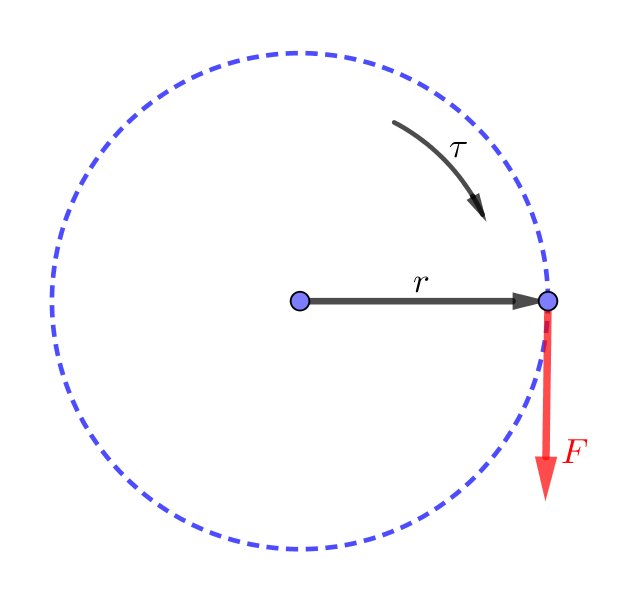
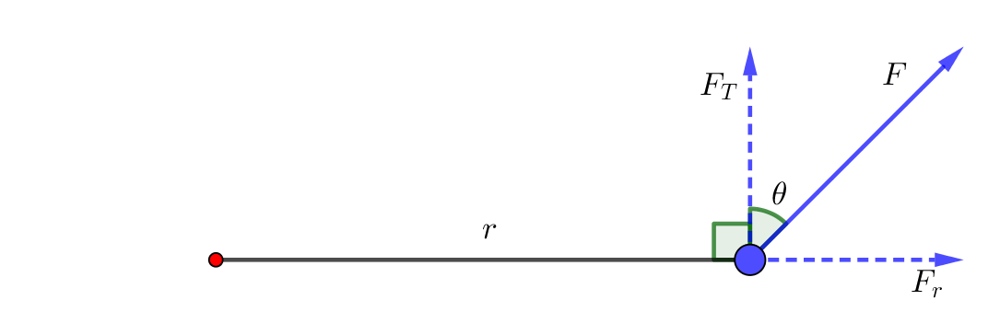
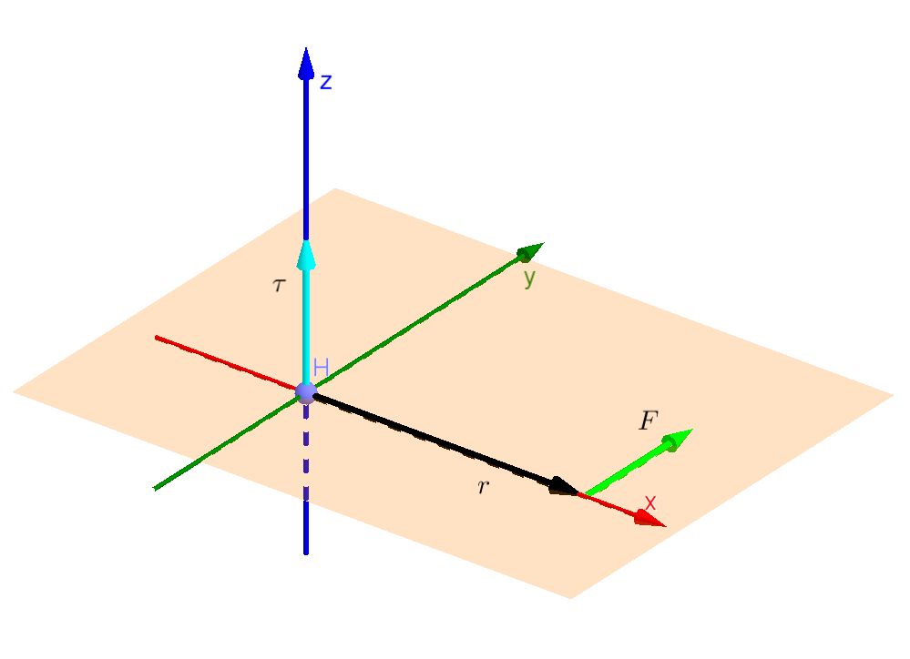
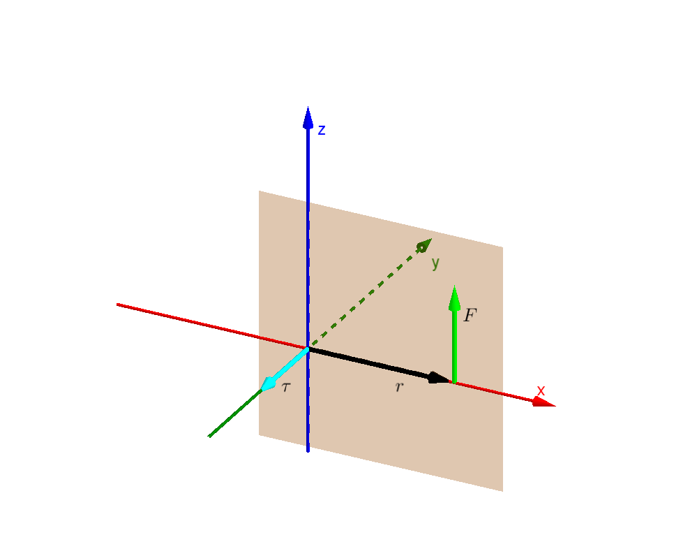
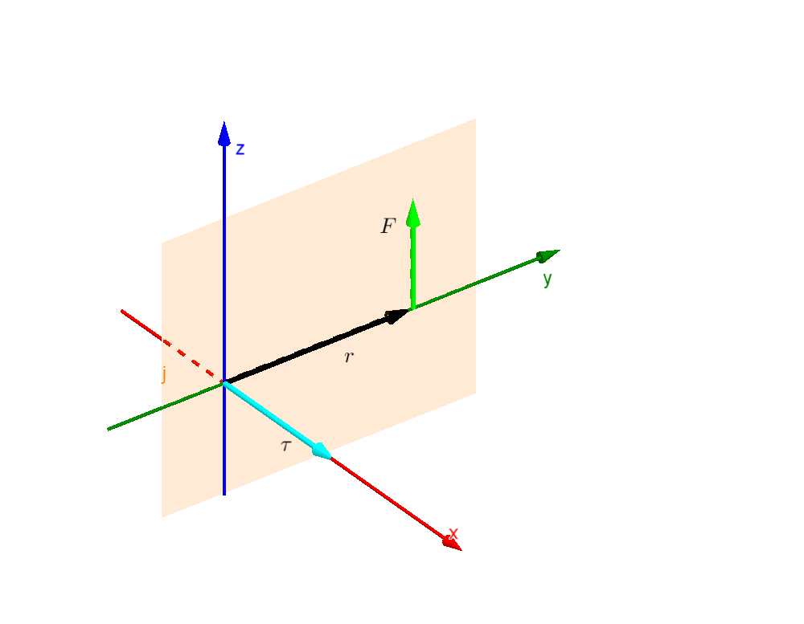
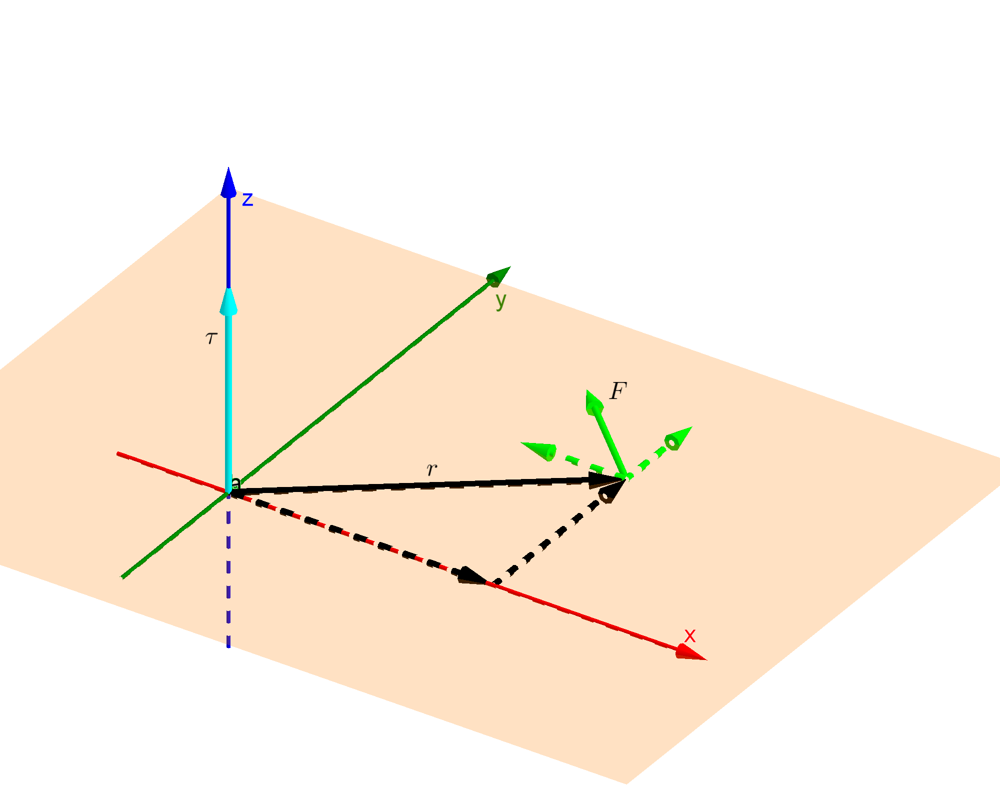
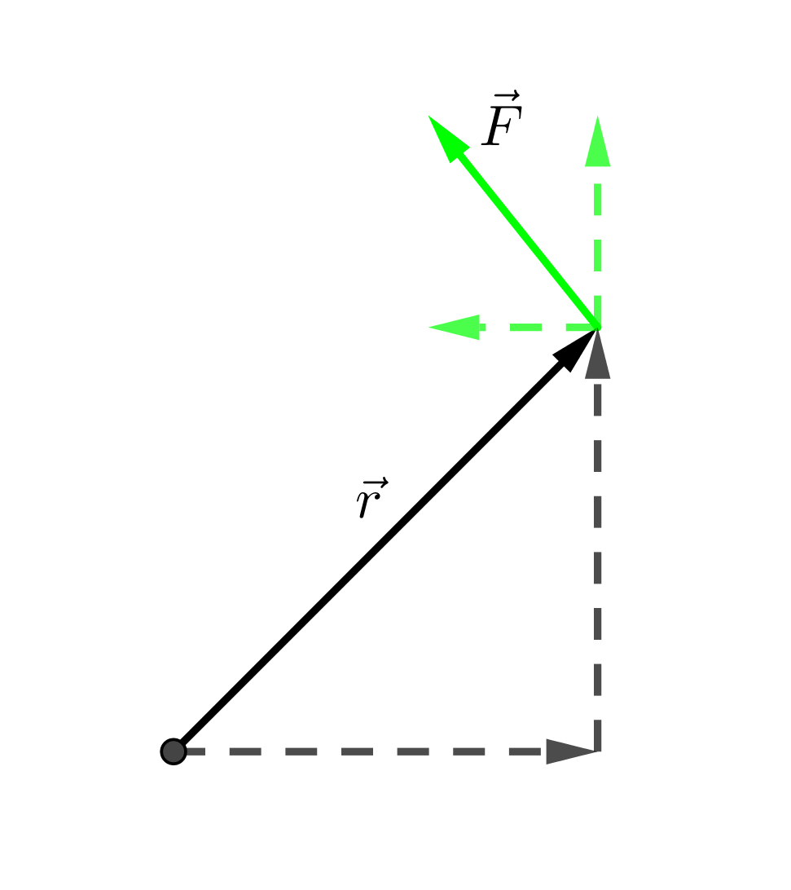

[လည်ခြင်းစနစ်များ (Rotations) Part 1](http://theinlinaung.com/rotations-part-1/)

## လိမ်အား (Torque)

လိမ်အားရဲ့ သဘောကိုသိချင်ရင် လက်လှည့်ကြံရည်ကြိတ်စက်ကို မြင်ယောင်ကြည့်ပါ။ ကြံရည်ကြိတ်စက် လက်လှည့်တံက လက်လှည့်အားကို အသုံးပြုပြီး ကြိတ်လုံးတွေအတွက် လိမ်အားကို ထုတ်ပေးပါတယ်။ Torque ဟာ လက်တင်ဘာသာစကား _torquere_ ကလာတာဖြစ်ပြီး လှည့်တယ်၊ လိမ်တယ်လို့ အဓိပ္ပာယ်ရပါတယ်။ ဒီတော့ လိမ်အားအနည်းအများကို သင်္ချာပုံစံနဲ့ (quantitively) ဘယ်လိုဖော်ပြမလဲ။ ကြံရည်ကြိတ်စက် ဥပမာကို ပြန်ကြည့်ရင် လိမ်အားက လက်ကိုင်ပေါ်ကို သက်ရောက်တဲ့အား $ \vec{F} $ နဲ့ လက်ကိုင်တပ်ထားတဲ့လည်ဘီးရဲ့ အချင်း တို့ပေါ်ကို မူတည်တာကို တွေ့ရပါမယ်။ လည်ဘီးကြီးရင် အားနည်းနည်းနဲ့လှည့်ရုံနဲ့ လိမ်အားများများရမယ်ဆိုတာ ခန့်မှန်းနိုင်ပါတယ်။ အားလုံးရင်းနှီးပြီးသားဥပမာတစ်ခုဖြစ်တဲ့ တံခါးကို အရင်းနားကလှည့်တာထက် အစွန်ကလှည့်တာ ပိုလွယ်တယ်ဆိုတဲ့ လီဗာသဘောတရားနဲ့လည်း ဆက်နွယ်နေပါတယ်။

ဒီတော့ လိမ်အားကို အား × ဝင်ရိုးမှအကွာအဝေး ပုံစံနဲ့ ဖော်ပြလို့ရမလားကြည့်ရအောင်။ လိမ်အားကို $ \tau $ (tau - တောင်) လို့ ခေါ်မယ်ဆိုရင် $ \tau = F \times r $ လို့ ရေးလို့ရနိုင်မလား။

အရင်က ပြောခဲ့သလိုပဲ အဓိပ္ပာယ်ဖွင့်ဆိုချက်တွေဆိုတာ ကိုယ်ဖွင့်ချင်သလို ဖွင့်နိုင်ပါတယ်။ လိမ်အား = အား × အချင်းဝက် ဆိုတာ သတ်မှတ်ချက်တစ်ခုပါပဲ။ ဒါပေမယ့် ဒီသတ်မှတ်ချက်က လက်တွေ့နဲ့ ကိုက်ညီဖို့လိုသလို အရင်က ရှိပြီးသားဖြစ်တဲ့ သတ်မှတ်ချက်တွေ၊ သီအိုရီတွေနဲ့လည်း အံဝင်ဖို့လိုပါတယ်။ ဒီတော့ ဒီလိမ်အားညီမျှခြင်းက အခုသိပြီးသားဖြစ်တဲ့ နယူတန်နိယာမနဲ့ စွမ်းအင်တည်မြဲခြင်းနိယာမကို လိုက်နာလားဆိုတာ ကြည့်ရအောင်။

နယူတန်နိယာမကပြဆိုတဲ့ အားနဲ့ လိမ်အားကို ဆက်စပ်ဖို့ အလုပ်နဲ့ စွမ်းအင်ကို လေ့လာရပါမယ်။ အားနဲ့ သက်ရောက်တဲ့အကွာအဝေးကိုမြှောက်ရင် အလုပ်ကို ရပါတယ်။ ဒီတော့ လိမ်အားနဲ့ လည်သွားတဲ့ထောင့်ကိုမြှောက်ရင်လည်း အလုပ် ရသင့်ပါတယ်။ ပိုပြီးသေချာအောင်လို့ ပုံ - ၁ ကို ပြန်ကြည့်ပါ။

စက်ဝိုင်းပုံရွေ့ဖို့ဆိုရင် ဝတ္ထုပေါ်ကို သက်ရောက်တဲ့အား F က ဝင်ရိုးက အကွာအဝေး r ကို ထောင့်မှန်ကျပြီး ds ဦးတည်ရာအလိုက် ရှိနေပါမယ်။ ဒါကြောင့် F ကြောင့်ဖြစ်တဲ့ အလုပ်ပြီးမြောက်မှုက−

$$
w = F.ds
$$

လိမ်အားက $\tau = F.r$ ဆိုရင် လိမ်အားကြောင့်ဖြစ်တဲ့ အလုပ်ပြီးမြောက်မှုက−

$$
w=\tau d\theta = F.rd\theta = F.ds
$$

ဒီတော့ $F$ ကြောင့်ဖြစ်တဲ့အလုပ်က $\tau$ အနေနဲ့ တွက်လည်း မှန်ကန်တာကို တွေ့ရပါတယ်။

$ \tau=F.r $ ညီမျှခြင်းနဲ့ အပေါ်က တွက်ချက်မှုတွေ မှန်ကန်ဖို့ဆိုရင် $ F $ နဲ့ $ r $ က ထောင့်မှန်ကျဖို့ လိုအပ်ပါမယ်။ တကယ်လို့ $ F $ နဲ့ $ r $ က အောက်ကပုံလိုမျိုးရှိနေမယ်ဆိုရင်ရော။

ဒါဆိုရင် $ F $ ကို $ F_T $ နဲ့ $ F_r $ ဆိုပြီး နှစ်ပိုင်းခွဲလိုက်ပါမယ်။

$$
 F_T=F\cos\theta
$$

$$
 F_r=F\sin\theta
$$

ဒီတော့ $ F_T $ က $ r $ ကို ထောင့်မှန်ကျတဲ့ အားတစ်ခု ဖြစ်သွားပြီး $ F_r $ က ဝင်ရိုးနဲ့ တစ်တန်းတည်းဖြစ်နေတဲ့အတွက် လှည့်အားမသက်ရောက်နိုင်ပါဘူး။ ဒီပုံအတွက်−

$$
 \tau=F \space \cos\theta .r = F.r \space \cos\theta
$$

နောက်တစ်မျိုးရေးပြထားတဲ့ $ F.r \space \cos\theta $ ရဲ့ အဓိပ္ပာယ်ကို အောက်ကပုံမှာတွေ့နိုင်ပါတယ်။ F ကို နောက်ကို တစ်ဖြောင့်တည်းဆက်ဆွဲလိုက်ရင် ဆုံချက်ကနေ ထောင့်မှန်ကျ အကွာအဝေးက $ r\space \cos\theta $ ဖြစ်တာကို တွေ့ရပါမယ်။ ဒီတော့ $ F $ ကို အပိုင်းခွဲတာနဲ့ $ r $ ကို အပိုင်းခွဲတွက်တာ ရလာဒ်က အတူတူပါပဲ။

## Rotations in three dimensions

အပေါ်က ပုံတွေနဲ့ ဆွေးနွေးချက်တွေက 2-Dimension, တစ်နည်းအားဖြင့် flat plane ပေါ်မှာ လည်ပတ်တဲ့ စနစ်တွေအတွက်ပဲ ဖြစ်ပါတယ်။ အခု ပိုပြီးယေဘူယျကျတဲ့ ဟင်းလင်းပြင် 3-Dimension စနစ်တွေကို ကြည့်ရအောင်။ ပထမဆုံးပြောရမှာက vector ကိစ္စပဲဖြစ်ပါတယ်။ Vector တွေရဲ့ သဘာဝနဲ့ အသုံးဝင်ပုံကို ရှေ့မှာပြောခဲ့ပြီးပါပြီ။ ဒီတော့ ထောင့်ပြောင်းအလျင်နဲ့ လိမ်အားတို့က vector ဖြစ်သလား။ နှစ်ခုစလုံးက လှည့်တာ၊ လည်တာကို ပြတဲ့ကိန်းတွေဖြစ်တဲ့အတွက် မြှားခေါင်းလိုမျိုး ဦးတည်ချက်ရှိတဲ့ vector လိုမျိုးပြဖို့က ထူးဆန်းပါတယ်။ အားကို vector အနေနဲ့ မြင်ယောင်ကြည့်လို့ရနိုင်ပေမယ့် လိမ်အားနဲ့ လည်နှုန်း ကို ဘယ်လိုဦးတည်ချက်သတ်မှတ်မလဲ။ ဒီနေရာမှာ ညာလက်ထုံး လို့ခေါ်တဲ့ right-hand convention ကို အသုံးပြုပါတယ်။ သူက ဘာကိုဆိုလိုတာလဲဆိုတော့ သင့်ညာဘက်လက်ကို ဆုပ်ပြီး လက်မထောင်လိုက်ပါ။ ဒါဆို လက်ချောင်းလေးချောင်းက လည်တဲ့ ဉီးတည်ချက် (ဘယ်ရစ်၊ ညာရစ်) ကိုပြပြီး လက်မက လည်တဲ့ vector ရဲ့ ဦးတည်ချက်ကို ပြပါတယ်။ ဒါကြောင့် လည်တာကို ပြတဲ့ကိန်းနဲ့ အဖြောင့် vector ကို ဆက်နွယ်ချက်တစ်ခု ရသွားပါတယ်။ ညာလက်ထုံးက အစဉ်အလာထုံးတစ်ခုသာဖြစ်ပြီး သဘာဝက သတ်မှတ်ပေးထားတာမဟုတ်တဲ့အတွက် ပြောင်းပြန်ဖြစ်တဲ့ ဘယ်လက်ထုံးကို ယူပြီး တွက်လို့လည်း ရပါတယ်။ ဒါပေမယ့် တစ်ကမ္ဘာလုံးက တွက်ချက်မှုတွေနဲ့ ဦးတည်ချက်လက္ခဏာတွေ တူညီသွားအောင် ညာလက်ထုံးကို စံတစ်ခုအနေနဲ့ အသုံးပြုပါတယ်။

လည်ကိန်းတွေကို vector အနေနဲ့ သတ်မှတ်တာက ထူးဆန်းနိုင်သလို ပြဿနာလည်းရှိနိုင်ပါတယ်။ ဘာလို့လည်းဆိုတော့ တွေ့ကရာကိန်းတိုင်းကို vector အနေနဲ့ သတ်မှတ်လို့မရပါဘူး။ Vector တစ်ခုဖြစ်ဖို့ လိုအပ်ချက်တွေ ရှိတဲ့အတွက် သူတို့နဲ့ မကိုက်ညီရင် vector မဟုတ်ပါဘူး။ ဒီတော့ လိမ်အားကို တကယ်ပဲ vector အနေနဲ့ သတ်မှတ်လို့ရသလားဆိုတာ ကြည့်ရအောင်။

အရင်ဆုံး 2-D plane ပေါ်မှာရှိတဲ့ လိမ်အားကို ညာလက်ထုံးအရ ဘယ်လိုဦးတည်ချက်သတ်မှတ်ပေးနိုင်မလဲ ကြည့်ရအောင်။ ပထမဆုံး principal planes လို့ခေါ်တဲ့ xy, yz နဲ့ xz plane တွေပေါ်မှာ ရှိနေတဲ့ အားတွေနဲ့ လိမ်အားတွေကို ကြည့်ပါ။ $ \vec{r}, \vec{F} $ နဲ့ $ \vec{\tau} $ တို့ရဲ့ ဦးတည်ရာတွေ ဆက်နွယ်ပုံကို သတိထားကြည့်ပါ။

$ \vec{\tau} $ က $ \vec{r} $ ရော $ \vec{F} $ ရောကို ထောင့်မှန်ကျရှိနေပြီး $ \vec{r} $ နဲ့ $ \vec{F} $ နဲ့က rotation plane ကို ဖြစ်စေတာ တွေ့ရပါမယ်။ ဥပမာ ပထမဆုံးပုံမှာဆိုရင် rotation က xy plane မှာ ဖြစ်ပြီး $ \tau $ က z axis အတိုင်း ရှိနေပါတယ်။

$$
 \tau _{xy}=\tau_z=r_x \times F_y
$$

$$
 \tau _{yz}=\tau_x=r_y \times F_z
$$

$$
 \tau _{xz}=-\tau_y=r_x \times F_z
$$

တကယ်လို့ $ \vec{r} $ နဲ့ $ \vec{F} $ က principal axis တွေနဲ့ အပြိုင်မဟုတ်ရင် အပိုင်းခွဲပြီး တွက်ရပါမယ်။ အောက်ကပုံမှာကြည့်ရင် rotation က xy plane မှာပဲ ရှိနေပြီ: torque က z axis ပဲ ရှိပေမယ့် $ \vec{r} $ နဲ့ $ \vec{F} $က အစောင်းဖြစ်နေတဲ့အတွက်အကြောင့် $ r_x, r_y, F_x, F_y $ တို့ရှိပါမယ်။

$$
 \tau _z = F_y \times r_x + F_x \times r_y
$$

ခဏနေဦး၊ $ F_x $ ရဲ့ ဦးတည်ရာကို ကြည့်ရင် $ -x $ ဘက်ကိုလှည့်နေတာ တွေ့ရမယ်။ ဒါပေမယ့် $ F_x $ ကြောင့်ဖြစ်တဲ့ $ \tau $ က အပေါင်းကိန်းနဲ့ လိုချင်တဲ့အတွက် -

$$
 \tau _z = F_y \times r_x - F_x \times r_y
$$

လို့ရေးရမယ်။

ယေဘူယျအခြေအနေမှာ $ \vec{r} $ နဲ့ $ \vec{F} $ က ဘယ် axis ကိုမှ အပြိုင်မကျရင် rotation plane ကလည်း principal plane တွေပေါ်ကို မကျပဲ ကြားထဲက plane တွေဖြစ်နိုင်ပါတယ်။ ဒီတော့ $ \tau $ ကလည်း axis တစ်ခုတည်းပေါ်မှာမကျပဲ ကြားထဲရောက်နေနိုင်ပါတယ်။ $ \tau $ ရဲ့ component တွေက−

$$
 \tau _x  = r_y \times F_z - r_z \times F_y
$$

$$
 \tau _y = r_z \times F_x - r_x \times F_z
$$

$$
 \tau _z = r_x \times F_y - r_y \times F_x
$$

ဒီညီမျှခြင်းတွေကို အပေါ်က ပုံသုံးပုံနဲ့ နှိုင်းယှဉ်ကြည့်နိုင်ပါတယ်။

ဒီတော့ $ \tau , r, F $ တို့ရဲ့ ဆက်သွယ်ချက်ကို သိပြီဆိုရင် အပေါ်ကညီမျှခြင်းသုံးကြောင်းကို $ \vec{\tau} $ ရဲ့ component သုံးခုအနေနဲ့ ထားပါ။

Reference frame ပြောင်းလဲမှုတွေက $ \tau $ ကို ဘယ်လိုသက်ရောက်သလဲဆိုတာ သိဖို့အတွက် reference frame transformation တွေကို လုပ်ကြည့်ပါမယ်။ x-axis မှာ Linear transformation ကို စလုပ်ကြည့်ပါမယ်။

$$
 x'=x+1
$$

$$
 y'=y
$$

$$
 z'=z
$$

$ \vec{r} $ က rotation axis နဲ့ Force နဲ့အကွာအဝေးကိုသာ ပြတာဖြစ်တဲ့အတွက် linear transformation လုပ်လိုက်ရုံနဲ့ နောက် reference frame အတွက် $ \vec{r} $ ရဲ့ component တွေက ပြောင်းမသွားပါဘူး။ ဒါကြောင့် $ \tau' $ က \$ \tau $ နဲ့ အတူတူပါပဲ။

z axis မှာ Rotational transformation အတွက်ဆိုရင်တော့ နောက် reference frame အတွက် $ \vec{r} $ နဲ့ $ \vec{F} $ ရဲ့ component တွေက ပြောင်းသွားပါပြီ။ Rotational transformation ဆိုတာ reference frame တစ်ခု $ (x',y',z') $ က နောက် reference frame တစ်ခု $ (x,y,z) $ နဲ့ ထောင့်တစ်ခုသွေဖည်ပြီးရှိနေတာကိုသာ ပြောတာဖြစ်ပြီ: လည်နေတာကို ပြောတာမဟုတ်ပါဘူး။ ဒီတော့ z axis မှာ $ \theta $ သွေဖည်နေတဲ့ reference frame အတွက်-

$$
\begin{aligned}
  r'_x &= r_x \cos \theta + r_y \sin \theta, \ & F'_x &= F_x \cos \theta + F_y \sin \theta  \\
  r'_y &= r_y \cos \theta - r_x \sin \theta, \ & F'_y &= F_y \cos \theta - F_x \sin \theta \\
  r'_z &= r_z , \ & F'_z &= F_z
\end{aligned}
$$

ဒီတော့−

$$
\begin{aligned}
 \tau'_x  &= r'_y \times F'_z - r'_z \times F'_y \\
          &= (r_y \cos \theta - r_x \sin \theta) \times F_z - r_z \times (F_y \cos \theta - F_x \sin \theta ) \\
          &= r_y F_z \cos\theta - r_x F_z \sin\theta - r_z F_y \cos\theta + r_z F_x \sin\theta  \\
          &= (r_y F_z - r_z F_y)\cos\theta + (r_z F_x - r_x F_z)\sin\theta  \\
          &= \tau _x \cos\theta - \tau _y \sin\theta
\end{aligned}
$$

$$
\begin{aligned}
 \tau'_y  &= r'_z \times F'_x - r'_x \times F'_z \\
          &= r_z (F_x \cos \theta + F_y \sin \theta) - (r_x \cos \theta + r_y \sin \theta)F_z \\
          &= r_z F_x \cos\theta + r_z F_y \sin\theta - r_x F_z \cos\theta - r_y F_z \sin\theta \\
          &= (r_z F_x - r_x F_z) \cos\theta + (r_z F_y - r_y F_z) \sin\theta \\
          &= \tau _y \cos\theta - \tau _x \sin\theta
\end{aligned}
$$

$$
\begin{aligned}
 \tau'_z  &= r'_x \times F'_y - r'_y \times F'_x \\
          &= (r_x \cos \theta + r_y \sin \theta)( F_y \cos \theta - F_x \sin \theta) - (r_y \cos \theta - r_x \sin \theta)(F_x \cos \theta + F_y \sin \theta) \\
          &= r_x F_y \cos^2\theta - r_x F_x \sin\theta \cos\theta + r_y F_y \sin\theta \cos\theta - r_y F_x \sin^2\theta - r_y F_x \cos^2\theta - r_y F_y \sin\theta \cos\theta + r_x F_x \sin\theta \cos\theta + r_x F_y \sin^2\theta \\
          &= (r_x F_y - r_y F_x) \cos^2\theta + (r_x F_y - r_y F_x) \sin^2\theta
\end{aligned}
$$

But $ \sin^2\theta + \cos^2\theta = 1 $

So, $ \tau_z'=\tau_z $

ဒီညီမျှခြင်းတွေအရ $ \vec{\tau '} $ နဲ့ $ \vec{\tau} $ ရဲ့ ဆက်သွယ်ချက်တွေက $ \vec{r'} $ နဲ့ $ \vec{r} $ ၊ $ \vec{F'} $ နဲ့ $ \vec{F} $ တို့ရဲ့ ဆက်သွယ်ချက်တွေနဲ့ တူညီတာကို တွေ့ရပါတယ်။ ဒါကြောင့် plane ပေါ်ကလိမ်အား $ \tau $ ကို ထောင့်မှန်ကျ axis နဲ့ ဆက်နွယ်ပြီ: vector အနေနဲ့ သတ်မှတ်လို့ရပါတယ်။ ဒီလိုမျိုး plane ပေါ်မှာရှိတဲ့ ကိန်းတစ်ခုကို သက်ဆိုင်ရာ axis တစ်ခုစီနဲ့ ဆက်နွယ်လို့ရတာက 3-Dimensional space မှာပဲဖြစ်နိုင်ပါတယ်။ 3-D space မှာ plane သုံးခုနဲ့ ထောင့်မှန်ကျ axis သုံးခုရှိတာက တိုက်ဆိုင်မှုတစ်ခုလို့လည်း​ ပြောလို့ရပါတယ်။ 4-D လိုမျိုး higher dimensional space တွေမှာဆို ဒီလိုဂုဏ်သတ္တိမျိုးမရှိတဲ့အတွက် plane-axis ဆက်နွယ်မှုတွေရဖို့ ပိုခက်ခဲပါတယ်။

$ \vec{\tau} $ က vector တစ်ခုဖြစ်တယ်ဆိုရင် $ \vec{\tau}, \vec{F}, \vec{r} $ တို့ရဲ့ ဆက်သွယ်ချက်ကို vector cross product လို့ခေါ်တဲ့ vector operation တစ်ခုနဲ့ ဖော်ပြနိုင်ပါတယ်။

$$
 \vec{\tau}=\vec{r} \times \vec{F}
$$

ဒီညီမျှခြင်းကို အကျယ်ဖြန့်လိုက်ရင် အောက်ကညီမျှခြင်းသုံးကြောင်းရပါတယ်။

$$
 \tau _x = r_y \times F_z - r_z \times F_y
$$

$$
 \tau _y = r_z \times F_x - r_x \times F_z
$$

$$
 \tau _z = r_x \times F_y - r_y \times F_x
$$

ဒါကြောင့် $ \tau $ ညီမျှခြင်းကို သုံးကြောင်းရေးစရာမလိုပဲ vector ညီမျှခြင်းတစ်ကြောင်းတည်းနဲ့ ဖော်ပြနိုင်ပါတယ်။ အရင်က ပြောခဲ့တဲ့ dot product က အမြဲတမ်း scalar တစ်ခုကို ထုတ်ပေးပြီး အခု cross product ကတော့ အမြဲတမ်း vector တစ်ခုကို ထုတ်ပေးပါတယ်။
