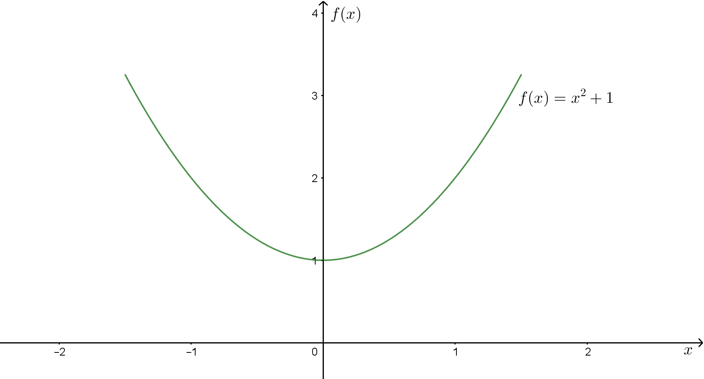
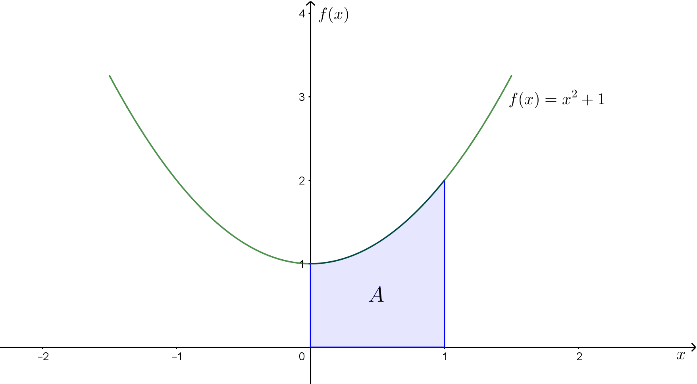
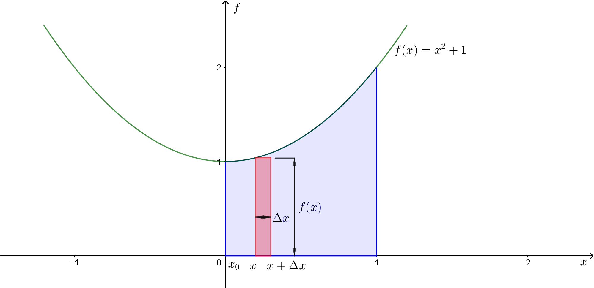
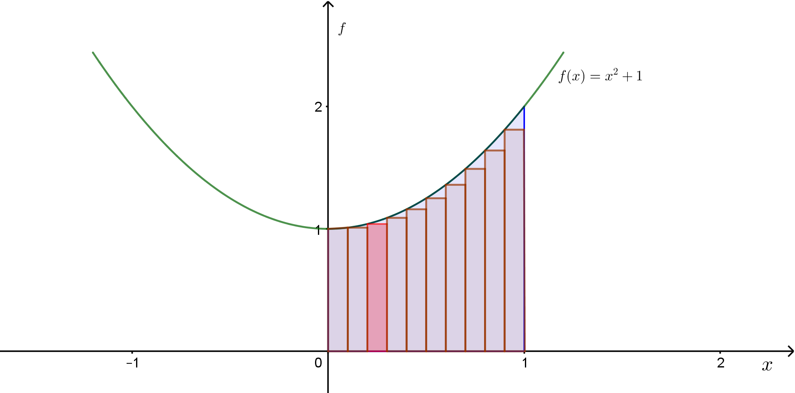
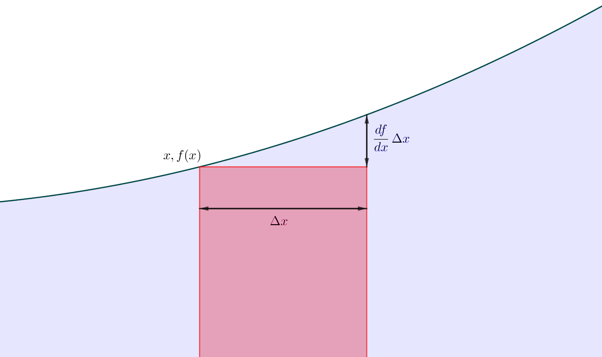

$f(x)=x^2+1 $ ဆိုတဲ့ function တစ်ခုရှိမယ်ဆိုပါတော့။ ဒီ function ကို graph ပေါ်မှာချကြည့်ရင် အောက်ကပုံအတိုင်းရမယ်။

ဒီ $ \text{curve} \ f $ နဲ့ $ x-\text{axis} $ နဲ့ကြားက ဧရိယာကိုရှာချင်တယ်ဆိုပါတော့။ ပထမဆုံး x တန်ဖိုး ဘယ်နဲ့ဘယ်ကြားကိုရှာချင်တာလဲဆိုတာသိရမယ်။ ဥပမာ x တန်ဖိုး 0 နဲ့ 1 ကြားက ဧရိယာကိုရှာချင်တယ်ဆိုပါတော့။ ဒါဆို curve ရယ်၊ x-axis ရယ်၊ x=0 ရယ်၊ x=1 ရယ် လေးဘက်ကာရံထားတဲ့ အောက်ကချယ်ပြထားတဲ့ ဧရိယာပုံလေးရမယ်။

ဒီဧရိယာကိုရှာဖို့ $ x-axis $ အလိုက် ထောင့်မှန်စတုဂံပုံအပိုင်းလေးတွေပိုင်းလိုက်ပါမယ်။ အပိုင်းတစ်ပိုင်းစီရဲ့ အကျယ်ကို $ \Delta x $ လို့ထားပါ။ ဘယ်ဘက်အောက်ထောင့်က $ x $ နေရာမှာရှိတဲ့ ထောင့်မှန်စတုဂံရဲ့အမြင့်က $ f(x) $ ဖြစ်ပါမယ်။ အောက်ကပုံကိုကြည့်ပါ။

ထောင့်မှန်စတုဂံလေးရဲ့ ဧရိယာက $ f(x) \times \Delta x $ ဖြစ်ပါမယ်။ ရှာချင်တဲ့စုစုပေါင်းဧရိယာက $ 0<=x<=1 $ အတွင်းက ထောင့်မှန်စတုဂံအပိုင်းတွေကို ပေါင်းထားတာလို့ မြင်လို့ရပါတယ်။ထောင့်မှန်စတုဂံအရေအတွက်ကို $ N $ လို့ထားမယ်ဆိုရင်-

$$
A= \sum_{i=0}^N \Delta x_i \times f(x_i)
$$

ဒီညီမျှခြင်းနဲ့တွက်ထားတဲ့ ဧရိယာက ထောင့်မှန်စတုဂံတွေအားလုံး ပေါင်းလဒ်ကိုပဲရမှာဖြစ်တဲ့အတွက် ရှာချင်တဲ့ခရမ်းရောင်ဧရိယာနဲ့ နီးစပ်တာကိုပဲရပါမယ်။ အပေါ်ကပုံမှာ သတိထားကြည့်ရင် $ f(x) $ မျည်းကွေးနဲ့ ထောင့်မှန်စတုဂံတွေကြားမှာ နေရာလွတ်လေးတွေရှိနေတာကို တွေ့ရမှာပါ။ ဒီ error တွေပျောက်အောင် ထောင့်မှန်စတုဂံရဲ့အကျယ် $ \Delta x $ ကို $ 0 $ နားကပ်အောင်ထားလိုက်ပါမယ်။ တစ်နည်း ထောင့်မှန်စတုဂံအရေအတွက်ကို အနန္တ ($ N \to \infty $) ထားလိုက်ပါမယ်။

$$
A=\lim*{\Delta x*{i \to 0}} \sum_{i=0}^N f(x_i) \times \Delta x_i = \int_0^1 f(x)dx
$$

နောက်ဆုံးမှာရေးထားတဲ့ integral ပုံစံက calculus အရ definition ပဲဖြစ်ပါတယ်။ $ \Delta x $ ကို $ 0 $ မှာ limit ယူလိုက်ရင် differential element $ dx $ ဖြစ်သွားပါတယ်။ $ x $ ကို $ 0 $ နဲ့ $ 1 $ ကြားမှာ ဘောင်ခတ်ထားတဲ့အတွက် $ \int_0^1 f(x)dx $ ကို definite integral လို့ခေါ်ပါတယ်။ ဒီ integral ကို သိထားတဲ့နည်းတွေနဲ့ ဖြေရှင်းလိုက်ရင်-

$$
A=\int_0^1 f(x)dx=\int_0^1 (x^2+1) dx=\left[  \dfrac{x^3}{3}+x \right]_0^1 =\dfrac{4}{3} 
$$

ရပါတယ်။ အောက်ကပုံမှာ slider နှစ်ခုကို ပြောင်းလဲပြီး ဧရိယာတွက်ထုတ်နိုင်ပါတယ်။

<Iframe title="Area under the curve" src="https://www.geogebra.org/material/iframe/id/DkeDsqTU/width/960/height/670/border/888888/smb/false/stb/false/stbh/false/ai/false/asb/false/sri/true/rc/false/ld/false/sdz/true/ctl/false"></Iframe>

ဒီနေရာမှာ calculus ရဲ့ သဘောသဘာဝကို နည်းနည်းပြောချင်ပါတယ်။ အပေါ်မှာ ထောင့်မှန်စတုဂံပုံပိုင်းလိုက်လို့ဖြစ်တဲ့ error ကိုနည်းအောင် $ \Delta x $ ကို သုညနားကပ်တဲ့အထိယူရမယ်လို့ ပြောခဲ့ပါတယ်။ ဒါပေမယ့် $ \Delta x $ က သုညမဟုတ်မချင်း error နည်းနည်းလေးရှိနေမှာဖြစ်တဲ့အတွက် ဧရိယာကိုအနီးစပ်ဆုံးပဲရပါမယ်။ $ \Delta x $ ကို လုံးဝသုညယူလိုက်ရင်လဲ ထောင့်မှန်စတုဂံအကုန်လုံးရဲ့ဧရိယာက သုညဖြစ်သွားပြီး စုစုပေါင်းဧရိယာကလည်း သုညဖြစ်နေပါမယ်။ ဒါဆို differential element ကို သုညနဲ့ limit ယူတဲ့ integral calculus က အတိအကျမှန်ကန်တာလား၊ အနီးစပ်ဆုံးမှန်ကန်တာလား။

အောက်ကပုံမှာ ထောင့်မှန်စတုဂံနဲ့ curve ကြားက လွတ်နေတဲ့နေရာကို ပုံကြီးချဲ့ပြထားပါတယ်။ $ \Delta x $ အတွင်းမှာ curve ကမျဉ်းဖြောင့်နီးပါးဖြစ်ပြီး ညာဘက်စွန်းကအမြင့်ကိုလိုချင်ရင် $ f $ ရဲ့ $ x $ အလိုက် rate of change ကို $ \Delta x$ နဲ့မြှောက်ရပါမယ်။

$$
 \Delta f = \dfrac{df}{dx}.\Delta x
$$

ဒါဆို ဟနေတဲ့ တြိဂံပုံစံဧရိယာလေးက-

$$
 \Delta A \approx 0.5 \Delta x \dfrac{df}{dx} \Delta x \approx 0.5 \dfrac{df}{dx} (\Delta x)^2
$$

ထောင့်မှန်စတုဂံအရေအတွက် $ (N) $ ကို နှစ်ဆတိုးကြည့်ရအောင်။ $ N $ နှစ်ဆတိုးတာနဲ့ ထောင့်မှန်စတုဂံတွေရဲ့အကျယ် $ \Delta x $ က တစ်ဝက်လျော့သွားပါမယ်။ ဒီတော့ ထောင့်မှန်စတုဂံတစ်ခုချင်းစီက မူလဧရိယာကနေ တစ်ဝက်စီလျော့သွားပါမယ်။ ထောင့်မှန်စတုဂံတွေ ဧရိယာတစ်ဝက်လျော့တာနဲ့ အရေအတွက်နှစ်ဆတိုးလာတာဟာ လုံးဝတိုက်ရိုက်အချိုးပါတယ်။ ဒါပေမယ့် $ \Delta x $ တစ်ဝက်လျော့ရင် ဧရိယာခြားနားချက် $ \frac{df}{dx} (\Delta x)^2 $ က လေးဆလျော့သွားပါတယ်။ ဒီအခြေအနေကို ထောင့်မှန်စတုဂံတွေရဲ့ဧရိယာက $ \Delta x $ အလိုက် first order နဲ့ပြောင်းလဲတယ်လို့ပြောပြီး တြိဂံပုံ error area က second order နဲ့ပြောင်းလဲတယ်လို့ပြောပါတယ်။

ဒီတော့ N တိုးလာပြီး $ \Delta x $ နည်းလာတာနဲ့အမျှ ထောင့်မှန်စတုဂံဧရိယာပေါင်းလဒ်က ဧရိယာအမှန်နဲ့ ပိုနီးစပ်လာပြီး error က အများကြီ: ပိုနည်းလာမှာဖြစ်ပါတယ်။ $ N \to \infty $ ကို limit ပြီး integrate လုပ်ရင် လိုချင်တဲ့ဧရိယာအတိအကျကို ရမှာဖြစ်ပါတယ်။

Curve အောက်က ဧရိယာကို ထောင့်မှန်စတုဂံပုံအပိုင်းတွေပိုင်းလိုက်တာကို discretization လို့ခေါ်ပြီး ဒီအပိုင်းတွေကိုပေါင်းပြီးတွက်တဲ့နည်းက numerical integration နဲ့ဆင်တူပါတယ်။ ကျွန်တော်တို့က curve အောက်က ဧရိယာကို ထောင့်မှန်စတုဂံပုံတွေပိုင်းနေသရွေ့တော့ curve အောက်ကဧရိယာအတိအကျရမှာမဟုတ်ပါဘူး။ ဒါပေမယ့် integral calculus နဲ့တွက်ရင်  ဧရိယာအတိအကျကိုရပါတယ်။ ဘာလို့လဲဆိုတော့ limit ရဲ့သဘောတရားကြောင့်ပါ။ $ lim*{x \to 0} f(x) $ လို့ရေးလိုက်တာနဲ့ x ကို သုညကိုချဉ်းကပ်တာလို့ပြောပါတယ်။ ပြောရရင်တော့ $ x $ သာတကယ်လို့သုညဖြစ်ခဲ့ရင် $ f(x) $ တန်ဖိုးက ဘယ်လောက်ဖြစ်မလဲဆိုတာခန့်မှန်းတာပါ။ $ x $ ကို လုံးဝသုညမဖြစ်စေပဲ သုညနားထိရောက်အောင် အနန္တကပ်သွားလို့ရပါတယ် (ဥပမာ 0.00…သုညအများကြီး…1 လို့ရေးသလိုပေါ့)။ သုညမဟုတ်တဲ့ သုညနားကပ်တဲ့ကိန်းတစ်ခုကို သင်ပြောမယ်ဆိုရင် ကျွန်ုပ်ကသင်ရွတ်လိုက်တဲ့ကိန်းနဲ့ သုညကြားကကိန်းတစ်ခုကို ရွတ်နိုင်ပါသေးတယ်။ ဒီသဘောတရားအတိုင်းပဲ မျည်းကွေးတစ်ခုကို မျည်းဖြောင့်အပိုင်းလေးတွေ အများကြီးဆက်ထားတာလို့ယူဆပြီး မျည်းပိုင်းလေးတွေရဲ့အရှည် ($ \Delta l) $ ကို $ lim*{\Delta l \to 0} $ ယူလိုက်မယ်ဆိုရင် မျည်းဖြောင့်တွေပျောက်သွားပြီး မျည်းကွေးအတိုင်းပြန်ရပါတယ်။ Dicretetation ပျောက်သွားတယ်လို့ဆိုလိုတာပါ။ ဒီသဘောတရားမှန်တယ်ဆိုတာ သက်သေပြတဲ့သင်္ချာကို real analysis လို့ခေါ်ပါတယ်။

ဒါကြောင့် calculus နည်းနဲ့တွက်တဲ့ analytical equation တွေဟာ လူနားလည်အောင်ပိုင်းထားတဲ့ အပိုင်းပိုင်းခြားမှုတွေပေါ်မှာ မှီခိုခြင်းမရှိပဲ အဖြေကိုအတိအကျပေးနိုင်ပါတယ်။ ဒါကြောင့် စက်ဝိုင်း၊ စက်လုံးဧရိယာညီမျှခြင်းတွေကိုရှာရင်လည်း အတိအကျထွက်လာတာကို တွေ့ရမှာဖြစ်ပါတယ်။
