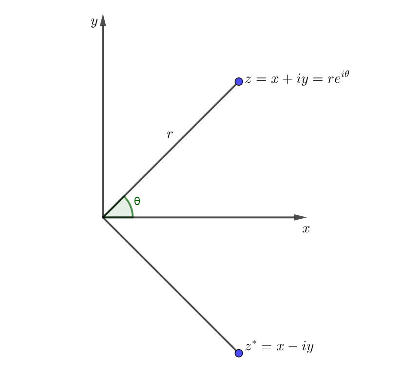

## Complex number များကို ပုံဖြင့်မြင်ယောင်ကြည့်ခြင်း

Real number တွေကို number line ဒါမှမဟုတ် $ x $ axis ပေါ်မှာ အစဉ်လိုက်နေရာချလို့ရပါတယ်။ Complex number တွေကိုတော့ complex plane လို့ခေါ်တဲ့ $ x-y $ plane ပေါ်မှာနေရာချရပါတယ်။ $ z=x+iy $ နဲ့ $ z^\star $ ကိုအောက်ကပုံမှာနေရာချပြထားပါတယ်။

$r, \theta $ တို့က polar coordinate စနစ်မှာလိုပဲ ဗဟိုကနေအကွာအဝေးနဲ့ ခံဆောင်ထောင့်ကိုရည်ညွှန်းပါတယ်။ ပုံနဲ့ သ​င်္ကေတတွေကို နည်းနည်းလေ့လာကြည့်ပါ။ $ e^{i\theta} $ ဆိုတာကို ခဏနေပြောပြပါမယ်။ ပုံမှာပြထားတဲ့အတိုင်း $ r $ က origin နဲ့ z အမှတ်ကိုဆက်သွယ်ထားတဲ့မျည်းရဲ့ အရှည်ပဲဖြစ်ပါတယ်။ ပုံအရ $ x=r\cos \theta , y=r\sin \theta $ ဖြစ်ပြီ: $ r=\sqrt {x^2+y^2} $ ဖြစ်ပါတယ်။ $ z $ ရဲ့ absolute value, or modulus ကိုရှေ့မှာဖွင့်ဆိုခဲ့တာကို မှတ်မိမယ်ဆိုရင် $ r $ က modulus ကိုကိုယ်စားပြုတယ်ဆိုတာ မြင်နိုင်ပါတယ်။ $ \theta $ ကိုတော့ phase angle လို့ခေါ်ပါတယ်။ z ရဲ့ complex conjugate ဖြစ်တဲ့ $ z^\star $ ရဲ့ phase angle က ထင်ထားတဲ့အတိုင်း $ -\theta $ ဖြစ်ပါတယ်။

[အပိုင်း ၂](http://theinlinaung.com/complex-numbers-2/) မှာပြောခဲ့တဲ့ complex number တွေရဲ့ ပေါင်း၊ နှုတ်၊ မြှောက်၊ စားကို polar form နဲ့တွက်ရင် တစ်ချို့ဟာတွေက ပိုလွယ်ပြီး တစ်ချို့ဟာတွေကတော့ပိုခက်ပါတယ်။

$$

z=re^{i\theta}

$$

$$

z^*=re^{-i\theta}

$$

$$

zz^*=r^2e^{i\theta-i\theta}=r^2 , |z| = r

$$

$$

z_1 z_2 = r_1r_2 e^{i(\theta _1 + \theta _2)}

$$

$$

\frac{z_1}{z_2}=\frac{r_1}{r_2} e^{i(\theta _1 - \theta _2)}

$$

Exponential function နှစ်ခုမြှောက်ရင် power (exponent) တွေကိုပေါင်းရတယ်ဆိုတာ complex number တွေအတွက်လည်း မှန်ပါတယ်။ (Complex exponential function ရဲ့ infinite series ကိုယူပြီး သက်သေပြနိုင်ပါတယ်။) ဒီညီမျှခြင်းတွေအရ complex number နှစ်ခုမြှောက်ရင် modulus တွေကိုမြှောက်ပြီး phase တွေကိုပေါင်းပေးရပါမယ်။ စားရင် modulus အချင်းချင်းစားပြီး phase ကိုနှုတ်ပေးရပါတယ်။ ဒါကြောင့် complex number တစ်ခုကို real number နဲ့မြှောက်(စား)ရင် modulus(length) ကို တိုးစေ(လျော့စေ)ပြီး complex number နဲ့မြှောက်(စား) ရင်တော့ phase angle ကိုပါ ပြောင်းလဲစေပါတယ်။

အခု $ e^{i\theta} $ အကြောင်းကိုပြောပါမယ်။ အရင်ဆုံး Euler’s formula လို့ခေါ်တဲ့ Leonhard Euler ရဲ့ ညီမျှခြင်းကိုကြည့်ပါ။

$$

e^{i\theta}=\cos\theta+i\sin\theta

$$

ဒီညီမျှခြင်းကိုသက်သေပြဖို့ complex number $ x $ အတွက် $ e^x $ ရဲ့ definition ကိုသိရပါမယ်။ Real number တွေအတွက် $ e^x $ ရဲ့ series expansion က−

$$

e^x=\sum_{n=0}^\infty \frac{x^n}{n!}

$$

ပဲဖြစ်ပါတယ်။ $ e $ ပေါ်မှာ complex power တင်ရင်လည်း ဒီ series အတိုင်းပဲ define လုပ်ထားပါတယ်။ ဒီတော့ $ e^{i\theta} $ ကို series အနေနဲ့ရေးလို့ရပါပြီ။ $ \theta $ ကိုတော့ real number အနေနဲ့ အသုံးပြုပါမယ်။

$$

e^{i\theta}=\sum_{n=0}^\infty \frac{(i\theta)^n}{n!}

$$

စုံ $ n $ နဲ့ မ $ n $ term တွေကိုခွဲရေးပြီး $ i^2=-1 $ ကိုထည့်လိုက်ရင်−

$e^{i\theta}=\sum_0^\infty \frac{(-1)^nx^{2n}}{(2n)!} +i\sum_0^\infty \frac{(-1)^nx^{(2n+1)}}{(2n+1)!}  $

ဒီညီမျှခြင်းထဲက infinite series နှစ်ခုက sine နဲ့ cosine တို့ရဲ့ series အသီးသီးနဲ့တူညီတာကို တွေ့ရပါလိမ့်မယ်။

$$
 e^{i\theta}=\cos \theta+i \sin \theta
$$

$\theta $ နေရာမှာ $ \pi $ ထည့်လိုက်ရင် သင်္ချာမှာအလှပဆုံးညီမျှခြင်းတစ်ခုလို့ဆိုကြတဲ့ Euler’s identity ကိုရပါမယ်။

$$
e^{i\pi}+1=0
$$

ဒီညီမျှခြင်းက သင်္ချာမှာအရေးပါတဲ့အရာတွေဖြစ်တဲ့ exponential $ e $, unit imaginary number $ i $, $ \pi $ နဲ့ $ 0, 1 $ တို့ကို အရှင်းလင်းဆုံးပေါင်းစပ်ထားပါတယ်။

$e^{i\theta} $ ရဲ့တန်ဖိုးက complex number z ဖြစ်တယ်ဆိုရင် $ (e^{i\theta})^4=e^{4i\theta} $ ကလည်း z ပဲဖြစ်ပါတယ်။ ဘာလို့လဲဆိုတော့ $ i^2 $ က -1 ဖြစ်ပြီး $ (i^2)^2 $ က 1 ဖြစ်တာကြောင့်ဖြစ်ပါတယ်။ ဒီတော့ $ \theta $ တန်ဖိုးတဖြည်းဖြည်းတိုးလာပေမယ့် $ e^{i\theta} $ ရဲ့တန်ဖိုးတွေက ဘောင်တစ်ခုအတွင်းမှာ ပြန်ထပ်နေတဲ့ periodic သဘောဆောင်ပါတယ်။ $ e^{2\pi i} $ ကလည်း 1 ဖြစ်တဲ့အတွက် $ e^{i\theta} $ ရဲ့ ပြန်ထပ်တဲ့အပိုင်းခြား (period) က $ 2\pi $ ဖြစ်ပါတယ်။ ဆိုလိုတာက $ e^{i\theta} $ တန်ဖိုးနဲ့ $ e^{i(\theta + 2\pi)} $ တန်ဖိုးက အတူတူပဲဖြစ်ပါတယ်။ (Trigo မှာ $ \cos \theta $ တန်ဖိုးနဲ့ $ \cos(\theta + 2\pi) $ တန်ဖိုးတူသလိုပေါ့။) နောက်တစ်ဖက်ကပြန်ကြည့်ရင် $ z=re^{i\theta} $  ဖြစ်ရင်-

$$
z=re^{i(\theta + 2\pi)}=re^{i(\theta + 4\pi)}=\ldots =re^{i(\theta+2n\pi)}, n=0,1,2,\ldots
$$

ဖြစ်ပါတယ်။ ဒီအခြင်းအရာတွေကြောင့် Euler’s formula က algebra နဲ့ trigonometry ကို သေသေသပ်သပ်ပေါင်းစပ်ပေးခဲ့တာပဲဖြစ်ပါတော့တယ်။

<Blockquote author="Michio Kaku">
I realized I needed to immerse myself in advanced mathematics and learn theoretical physics. So that is what did.
</Blockquote>
