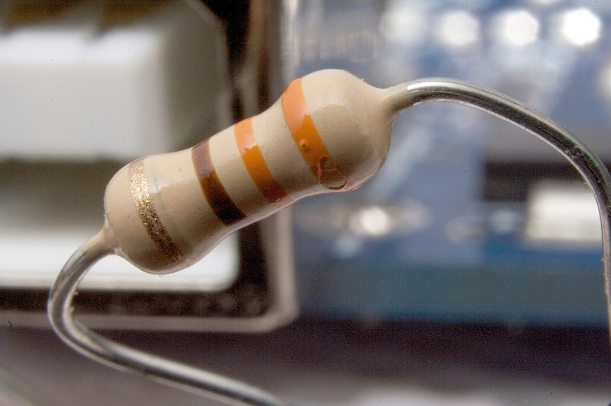

ရှေ့ပိုင်းမှာပြောခဲ့သလိုပဲ differential equation တွေကို နယ်ပယ်မျိုးစုံမှာသုံးလို့ရပါတယ်။ Harmonic oscillator တစ်ခုဖြစ်တဲ့ spring-mass စနစ်နဲ့ forced, damped oscillation ကိုဖော်ပြတဲ့ equation of motion ပုံစံက−

$$
 m\frac{d^2x}{dt^2}+c\frac{dx}{dt}+kx=F(t)
$$

ဒီညီမျှခြင်းပုံစံကို တစ်ခြားနေရာမှာတွေ့ရင်လည်း ဖြေရှင်းတဲ့နည်းနဲ့ အဖြေတွေက အတူတူပဲဖြစ်ပါမယ်။ သူ့ရဲ့အဖြေက−

$$
 x=\rho F_0 cos(\theta + \Delta + \omega t)
$$

where

$$
 \rho=\frac{1}{\sqrt{m^2\left[(\omega_0^2 - \omega^2)^2 + \gamma^2 \omega^2\right]}}
$$

အဲ့ဒီ့ညီမျှခြင်းပုံစံရှိတဲ့ နောက်ထပ် harmonic oscillator တစ်ခုကတော့ လျှပ်စစ်အစိတ်အပိုင်းတွေနဲ့ဖွဲ့စည်းထားတဲ့ လျှပ်စစ်ပတ်လမ်း (electrical circuit) တစ်ခုပဲဖြစ်ပါတယ်။ အောက်ကပုံမှာပြထားတဲ့ ဒီလျှပ်စစ်ပတ်လမ်းကို simple LCR circuit လို့ခေါ်ပါတယ်။

](images/1200px-RLC_series_circuit_v1.svg.png)

](images/RLC_series.png)

ဒီ circuit မှာပါဝင်တဲ့အစိတ်အပိုင်းတွေက L (Inductor ကွိုင်)၊ C (Capacitor လျှပ်သို)၊ R (resistor လျှပ်ခံ) နဲ့ ပြန်လှန်လျှပ်စီးထုတ်စက် (V, alternating current generator) တို့ပဲဖြစ်ပါတယ်။ ဒီအစိတ်အပိုင်းတွေရဲ့ ဂုဏ်သတ္တိက spring-mass-damper စနစ်မှာပါဝင်တဲ့ အစိတ်အပိုင်းတွေရဲ့ ဂုဏ်သတ္တိနဲ့ဆင်တူပါတယ်။ ဘယ်လိုဆင်တူတာလဲဆိုတော့ ကွိုင်ကဒြပ်ထုရှိပြီး လျှပ်သိုကတွန်းကန်လို့မဟုတ်ပါဘူး။ လျှပ်စစ်ပတ်လမ်းထဲမှာရှိတဲ့ လျှပ်စစ်ဓာတ်မှုန် (electrical charge) တွေရဲ့ရွေ့လျားမှုကို ကိုယ်စားပြုတဲ့ differential equation က အလေးတုန်းရွေ့လျားမှုကို ကိုယ်စားပြုတဲ့ equation နဲ့ပုံစံတူပြီး အထဲကသ​ေင်္ကတ (symbol) တွေပဲကွာသွားပါတယ်။

လျှပ်စစ်ပတ်လမ်းတစ်ခုအလုပ်လုပ်တာ အထဲမှာရှိတဲ့ electrical charge တွေက ဗို့အားမြင့်ရာက နိမ့်ရာကို စီးဆင်းသွားလို့ဖြစ်ပါတယ်။ Electrical charge ကို $ Q $ နဲ့ဖော်ပြပြီး သူတို့ရဲ့ time အလိုက် rate of change $ \frac{dQ}{dt} $ ကို လျှပ်စီးကြောင်း (electrical current) ($ I $) လို့ခေါ်ပါတယ်။

LCR circuit အတွင်းက Q ပြောင်းလဲမှုကိုမလေ့လာခင် L,C,R တို့အကြောင်းကိုနည်းနည်းပြောပြပါမယ်။ Inductor (L) ဆိုတာ သံချောင်း (iron core) ပေါ်မှာ ဝါယာ(ကွိုင်)ကိုပတ်ပြီး လျှပ်စစ်သံလိုက်စက်ကွင်းဖြစ်ပေါ်စေတဲ့ ပစ္စည်းတစ်ခုဖြစ်ပါတယ်။

](images/Electronic_component_inductors.jpg)

သံလိုက်စက်ကွင်းက လျှပ်စီးကြောင်း $ (I) $ နဲ့တိုက်ရိုက်အချိုးကျပြီး ကွိုင်အတွင်းမှာဖြစ်ပေါ်လာတဲ့ ညှို့ရဗို့အား (induced voltage) က rate of change of I နဲ့အချိုးကျပါတယ်။

$$
 V=L\frac{dI}{dt}=L\frac{d^2Q}{dt^2}
$$

L ကို self-inductance လို့ခေါ်ပါတယ်။ အကြမ်းဖြင်းပြောရရင် ပြန်လှန်လျှပ်စီးကြောင်းက inductor ထဲမှာ သံလိုက်စက်ကွင်းကိုဖြစ်ပေါ်စေပြီ: လျှပ်စစ်ကိုပိတ်လိုက်ရင် သံလိုက်စက်ကွင်းပြောင်းလဲမှုက လျှပ်စီးကိုပြန်လည်ဖြစ်ပေါ်စေပါတယ်။ ဒီတော့ L က အင်နားရှားရှိတဲ့ ဒြပ်ထု (mass) နဲ့ဆင်တူပါတယ်။

နောက်တစ်ခုကတော့ လျှပ်သို (capacitor) လို့ခေါ်ပါတယ်။ သူက ပုံမှန်အားဖြင့် လျှပ်စစ်ကူးတဲ့အပြားနှစ်ပြားကြားထဲမှာ လျှပ်ကာ (insulator) တစ်ခုခံပြီး တည်ဆောက်ထားပါတယ်။

](images/1200px-Capacitors_7189597135.jpg)

သူ့ရဲ့ငုတ်နှစ်ခုကို ဗို့အား (potential difference) တစ်ခုပေးလိုက်ရင် အပြားနှစ်ခုကြားမှာ charge တွေကိုသိုလှောင်ထားပေးပါတယ်။ ငုတ်နှစ်ခုကြားကဗို့အားက charge နဲ့အချိုးကျပါတယ်။

$$
 V=\frac{Q}{C}
$$

$\frac{1}{C} $ ကအချိုးကျကိန်းသေဖြစ်ပြီး C က capacitance လို့ခေါ်ပါတယ်။

တတိယအစိတ်အပိုင်းကတော့ လျှပ်ခံ (resistor) ဖြစ်ပါတယ်။ သူကတော့ ရေပိုက်ကိုကွေးထားလိုက်ရင် ရေစီးအားလျော့သွားသလို charge တွေစီးဆင်းမှုကို ခုခံထားတဲ့ပစ္စည်းဖြစ်ပါတယ်။

A resistor  
by [Nunikasi](https://commons.wikimedia.org/w/index.php?curid=12161146 "User:Nunikasi (page does not exist)") - Own work, [CC BY-SA 3.0](https://creativecommons.org/licenses/by-sa/3.0 "Creative Commons Attribution-Share Alike 3.0"), [Link](https://commons.wikimedia.org/w/index.php?curid=12161146)

သူ့ငုတ်နှစ်ခုကြားက ဗို့အားက လျှပ်စီးကြောင်းနဲ့တိုက်ရိုက်အချိုးကျပါတယ်။

$$

V=RI

$$

ဒီညီမျှခြင်းက Ohm’s Law ဖြစ်ပြီ: အချိုးကျကိန်းသေ R ကို resistance လို့ခေါ်ပါတယ်။

နောက်ဆုံးအစိတ်အပိုင်း V~ က charge တွေစီးဆင်းအောင် ဗို့အား (potential difference) ကိုဖန်တီးပေးတဲ့ လျှပ်ထုတ်ပစ္စည်း (generator) ဖြစ်ပါတယ်။ ဒီ generator က ပြန်လှန်လျှပ်စီ: (alternating current) ကိုထုတ်ပေးပါတယ်။ Spring-mass စနစ်မှာတုန်းက oscillating force နဲ့ဆင်တူပါတယ်။

အခု LCR circuit အတွင်းက $ Q $ ပြောင်းလဲမှုကို လေ့လာပါမယ်။ ဒါကိုကိုယ်စားပြုတဲ့ ညီမျှခြင်းက−

$$

L\frac{d^2Q}{dt^2}+R\frac{dQ}{dt}+\frac{Q}{C}=V(t)

$$

ပဲဖြစ်ပါတယ်။ ဒီညီမျှခြင်းကို အပေါ်ဆုံးမှာရေးထားတဲ့ spring-mass-damper ညီမျှခြင်းနဲ့ယှဉ်ကြည့်ပါ။ ဒါဆိုရင် L က m၊ R က c နဲ့ $ \frac{1}{C} $ က k တို့နဲ့အသီးသီးဆက်နွယ်နေတာကို တွေ့ရပါမယ်။ Generator ကထုတ်ပေးတဲ့ ဗို့အားက oscillating ဖြစ်နေတဲ့အတွက် $ V(t)=V_0 \cos(\omega t) $ လို့ရေးလိုက်ရင် အရင်က complex method နဲ့ရှင်းခဲ့တဲ့ညီမျှခြင်းပုံစံဖြစ်သွားပါပြီ။ ဒီတော့ spring-mass-damper တုန်းကအတိုင်းပဲ Q နဲ့ V ကို complex number ပုံစံနဲ့ $ \hat{Q}e^{i\omega t}  $ နဲ့ $ \hat{V}e^{i\omega t} $ တို့ကိုအစားသွင်းလိုက်ပါမယ် ($ \hat{Q} $ ဆိုတာ $ Q_0 $ ကို phase shift လုပ်ထားတာဖြစ်ပါတယ်)။ $ e^{i\omega t} $ ကနှစ်ဖက်လုံးမှာပါတဲ့အတွက် ကြေသွားပြီး differentiate လုပ်လိုက်တဲ့အခါ အောက်က algebric equation ကိုရပါတယ်။

$$
(i\omega )^2 L \hat{Q} + i\omega R \hat{Q} + \frac{\hat{Q}}{C} = \hat{V}
$$

$$
\hat{Q}=\frac{\hat{V}}{i\omega R- L\omega^2 + \frac{1}{C}}
$$

Spring-mass မှာတုန်းက
$\omega_0=\sqrt{\frac{k}{m}} $ ဆိုတော့ ဒီမှာက−

$$
\omega_0=\sqrt{\frac{1}{LC}}
$$

ဖြစ်မယ်။

$
\gamma=\frac{c}{m} $ ဆိုတော့ $ \gamma=\frac{R}{L} $ ဖြစ်မယ်။

ဒီတော့

$$
 \hat{Q}=\frac{\hat{V}}{L(i\gamma \omega + \omega_0^2 - \omega^2) }
$$

$$
 Q(t)=\hat{Q} e^{i\omega t}=\frac{\hat{V} e^{i\omega t}}{L(i\gamma \omega + \omega_0^2 - \omega^2) }
$$

ဒီအဖြေရဲ့ resonance ဂုဏ်သတ္တိတွေက spring-mass စနစ်လိုမျိုးပါပဲ။ ဒီညီမျှခြင်းကို Ohm’s Law ပုံစံဝင်အောင် $ \hat{V} $ နဲ့ $ \hat{Q} $ ဆက်သွယ်ချက်အစား $ \hat{I} $ ကိုသုံးမယ်ဆိုရင်−

$$
 I(t)=\frac{dQ(t)}{dt}=\frac{i\omega \hat{V} e^{i\omega t}}{ L(i\gamma \omega + \omega_0^2 - \omega^2)}
$$

$$
 I(t)=\hat{I} e^{i\omega t}=\frac{\hat{V} e^{i\omega t}}{ L(\frac{R}{L} + \frac{\omega_0^2}{i\omega} +i \omega)}
$$

နောက်ဆုံးညီမျှခြင်းမှာ $ \gamma = \frac{R}{L} $ ကိုပြန်ထည့်ပြီးတော့ $ i\omega $ နဲ့စားလိုက်တာဖြစ်ပါတယ်။ ဒါဆို $ \hat{V} $ နဲ့ $ \hat{I} $ ကြားကဆက်နွယ်မှုကိုရပါပြီ။

$ Z= L(\frac{R}{L} + \frac{\omega_0^2}{i\omega} +i \omega) $ လို့ထားရင်

$$

\hat{I} = \frac{\hat{V}}{Z}

$$

ဖြစ်ပါတယ်။ $ Z $ ကို လျှပ်စစ်အခေါ်အဝေါ်အရ impedence လို့ခေါ်ပြီး Ohm’s Law က resistance နဲ့ဆင်တူပေမယ့် complex number တစ်ခုဖြစ်ပါတယ်။ Electrical circuit တစ်ခုရဲ့ impedence Z ကိုရှာနိုင်ရင် ဒီလိုမျိုး circuit (device) နှစ်ခု၊ သုံးခုကို တန်းဆက် (series) (သို့) ပြိုင်ဆက် (parallel) ချိတ်ဆက်ထားတဲ့ ပိုရှုပ်ထွေးတဲ့ circuit တွေကို V နဲ့ I ရဲ့ linearity ဖြစ်မှုကိုအသုံးချပြီး superposition နည်းလမ်းနဲ့ရှာလို့ရပါတယ်။ ဆိုလိုတာက−

$$
Z_s=Z_1+Z_2 \ \text{ (Series)}
$$

$$
\frac{1}{Z_p}=\frac{1}{Z_1}+\frac{1}{Z_2} \ \text{ (parallel)}
$$

[![Impedances in series, by [Omegatron]](images/1200px-Impedances_in_series.svg.png)](https://commons.wikimedia.org/wiki/File:Impedances_in_series.svg#/media/File:Impedances_in_series.svg)

[![Impedances in parallel, by [Omegatron]](images/1200px-Impedances_in_parallel.svg.png)](https://commons.wikimedia.org/wiki/File:Impedances_in_parallel.svg#/media/File:Impedances_in_parallel.svg)

Electrical resonance တွက်ချက်မှုက လျှပ်စစ်ပတ်လမ်းတွေအတွက်ပဲ အသုံးဝင်တာမဟုတ်ပါဘူး။ သူ့ရဲ့ resonance ဂုဏ်သတ္တိတွေက spring-mass-damper စနစ်ရဲ့ဂုဏ်သတ္တိတွေနဲ့ ဆင်တူတဲ့အတွက် အချင်းချင်းပြောင်းလဲပြီ: model လုပ်လို့ရပါတယ်။ ဥပမာကားတစ်စီးမှာရှိတဲ့ shock absorber ကိုပြင်ပအားသက်ရောက်တဲ့အခါ တုန့်ပြန်မှုကိုလေ့လာချင်ရင် shock absorber ရဲ့ဖွဲ့စည်းပုံတန်ဖိုးတွေ (spring ကိန်းသေ၊ damping ကိန်းသေ စသည်) ကို electrical circuit တစ်ခုအနေနဲ့ပြောင်းလဲလိုက်ပါမယ်။ ပြီးတော့ဘုထစ်တွေထနေတဲ့ကားလမ်းနဲ့တူတဲ့ oscillating voltage source ကိုပေးလိုက်မယ်ဆိုပါတော့။ ဒါဆိုအဲ့ဒီ့ electrical circuit ကနေထွက်လာတဲ့တုန့်ပြန်မှု (Q) က ဘယ်လိုအခြေအနေရှိလဲဆိုတာသိရပါတယ်။ Q ရဲ့တန်ဖိုးကို သက်ဆိုင်ရာ mass ရဲ့ displacement တန်ဖိုးကိုပြောင်းလဲပြီး လက်ခံနိုင်တဲ့ပမာဏမရှိဘူးဆိုရင် circuit ထဲကတန်ဖိုး (ဥပမာ resistance) တွေကိုပြောင်းလဲပြီး ထပ်စမ်းသပ်နိုင်ပါတယ်။ Capacitance တန်ဖိုးကိုပြောင်းလဲတာက စပရိန်တွေ၊ damper တွေကိုဖြုတ်လဲတာထက် ပိုမြန်ပြီးအကုန်အကျလည်း ပိုသက်သာပါတယ်။ ဒီလို physical စနစ်ကို electrical circuit နဲ့ဖန်တီးထားတာကို analog computer လို့ခေါ်ပါတယ်။  ဒီလိုမျိုးခက်ခဲတဲ့စနစ်တစ်ခုရဲ့ သဘောတရားတူ (​analogical ဖြစ်) ပြီ: စမ်းသပ်ဖို့ပိုလွယ်တဲ့ model တွေကို ဖန်တီးတာ သိပ္ပံနဲ့အင်ဂျင်နီယာနယ်ပယ်တွေမှာ အရေးပါတဲ့နည်းလမ်းတစ်ခုဖြစ်ပါတယ်။

အပေါ်မှာရှာထားတဲ့အဖြေ Q(t) က differential equation ရဲ့ ယေဘူယျအကျဆုံးအဖြေမဟုတ်သေးပါဘူး။ အခုအဖြေ Q ကို steady-state response လို့ခေါ်ပြီး မူလအခြေအနေကနေ တစ်ခဏပဲခံတဲ့တုန့်ပြန်မှုလည်းရှိပါသေးတယ်။ သူ့ကိုတော့ transient လို့ခေါ်ပါတယ်။

<Blockquote author="Carl Sagan">
Somewhere, something incredible is waiting to be known.
</Blockquote>
