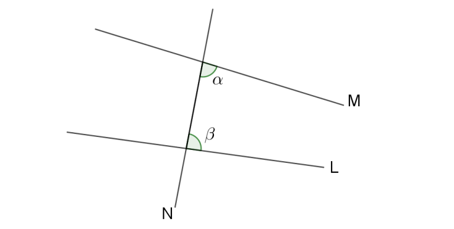
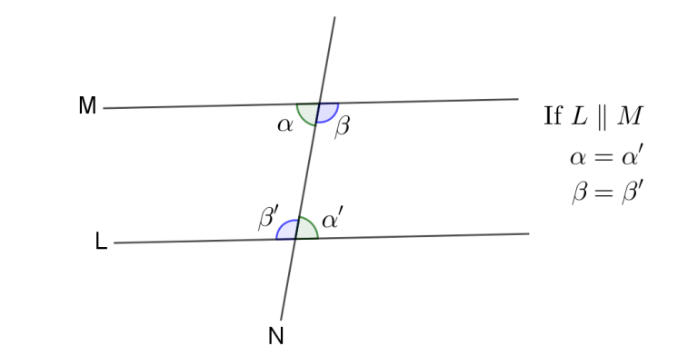
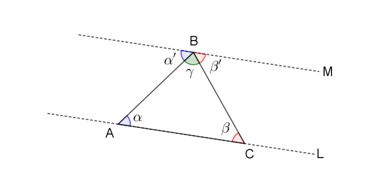
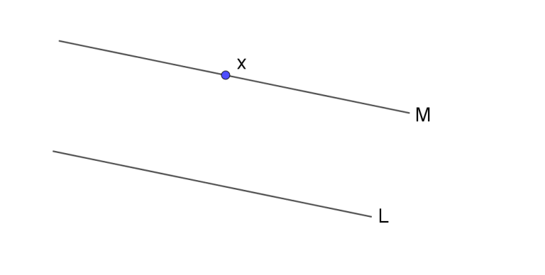

အချိန်ကာလကား ခရစ်တော်မပေါ်မီ နှစ် ၃၀၀ ဝန်းကျင်ဖြစ်သည်။ အီဂျစ်ပြည်၊ အလက်ဇန်းဒြီးယားမြို့တွင် [ယူကလစ်](https://en.wikipedia.org/wiki/Euclid)အမည်ရှိလူတစ်ယောက်သည် “_Stoicheia”_ ခေါ်စာအုပ်တစ်အုပ်ကိုရေးသားပြုစုခဲ့သည်။ ထိုစာအုပ်ကို နှောင်းလူများကအင်္ဂလိပ်ဘာသာသို့ပြန်ဆိုခဲ့ပြီး _“Elements”_ ဟုခေါ်တွင်စေခဲ့သည်။ လွန်ခဲ့သောနှစ်ပေါင်းနှစ်ထောင်ကျော်က ရေးသားခဲ့သော၎င်းစာအုပ်သည် ခေတ်ဟောင်း၊ခေတ်သစ်သင်္ချာပညာရပ်၏ အခြေခံဖြစ်လာခဲ့ပြီး နောင်လာမည့်ပညာရှင်များအပေါ် များစွာလွှမ်းမိုးနိုင်ခဲ့လေသည်။

ယူကလစ်ရဲ့ဂျီသြမေတြီကို အခုအချိန်ထိတစ်ကမ္ဘာလုံးကကျောင်းတွေမှာ သင်ကြားနေဆဲဖြစ်ပါတယ်။ ဂျီသြမေတြီလို့ကြားလိုက်တာနဲ့ မျဉ်းတွေ၊ တြိဂံတွေ၊ စက်ဝိုင်းတွေကို ပြေးမြင်မိနိုင်ပါတယ်။ ဒီဘာသာရပ်က ဘာလို့အရေးပါတာလဲဆိုတော့ ဒီတြိဂံတွေ၊ စက်ဝိုင်းတွေက လက်တွေ့ဘဝမှာအရေးပါတာတင်မကပဲ ယူကလစ်ရဲ့တွေးခေါ်ပုံတွေက သင်္ချာသင်ယူသူတွေအတွက် အခြေခံတွေဖြစ်တာကြောင့်လဲဖြစ်ပါတယ်။ သူ့ရဲ့ Elements လို့ခေါ်တဲ့စာအုပ်မှာ ယူကလစ်က axiomatic method လို့ခေါ်တဲ့နည်းလမ်းကိုအသုံးပြုပြီ: သူ့သီအိုရမ်တွေကို နည်းစနစ်တကျသက်သေပြခဲ့ပါတယ်။ ခေတ်သစ်သင်္ချာကလည်း ဒီနည်းလမ်းကိုပဲအသုံးပြုပြီး တည်ဆောက်ထားပါတယ်။ ဒီတော့ဒီနည်းလမ်းကို သင်္ချာလေ့လာသူတွေသိထားဖို့လိုအပ်ပါတယ်။

Axiomatic method ဆိုတာ axiom တွေကိုအခြေခံပြီး သီအိုရီတွေနဲ့ ကောက်ချက်တွေကို သက်သေပြတဲ့နည်းစနစ်တစ်ခုဖြစ်ပါတယ်။ ဒီတော့ axiom ဆိုတာဘာလဲ။ Axiom ကို ယူဆချက် လို့အလွယ်ဘာသာပြန်နိုင်ပြီ: ပိုတိကျအောင်အဓိပ္ပာယ်ဖွင့်ရင်တော့ မှန်တယ်လို့ယူဆထားတဲ့ဖွင့်ဆိုချက်လို့​ပြောနိုင်ပါတယ်။ ဒီဖွင့်ဆိုချက်တွေကဘာလို့လိုအပ်တာလဲဆိုရင် အဆိုတင်သွင်းချက်(hypothesis) တစ်ခုကိုသက်သေပြဖို့ ကျိုးကြောင်းကျလျှောက်လှဲချက် (logical argument) ကိုတစ်နေရာရာကစဖို့လိုပါတယ်။ အိမ်ဆောက်ဖို့တိုင်အရင်စိုက်ရသလိုပေါ့။ ဒီလျှောက်လှဲချက်အစပြုတဲ့နေရာက မှန်တယ်လို့လက်ခံထားတဲ့အချက် (axiom) တွေပဲဖြစ်ပါတယ်။ ဒီအကြောင်းကို နောက်ပိုင်းမှာဥပမာတွေနဲ့ရှင်းလင်းသွားပါမယ်။ ယူကလစ်ရဲ့ဂျီသြမေတြီအတွက် axiom တွေကစုစုပေါင်း ၅ ခုရှိပါတယ်။

၁။ အစက်နှစ်စက်ကို မျဉ်းပြတ်တစ်ကြောင်းတည်းဖြင့်သာ ဆက်သွယ်နိုင်သည်။

၂။ မည်သည့်မျဉ်းပြတ်ကိုမဆို မျဉ်းဖြောင့်တစ်ကြောင်းတည်းဖြစ်အောင် ဆက်ဆွဲနိုင်သည်။

၃။ ပေးထားသောအမှတ် P နှင့်အလျား r  တို့ကိုအသုံးပြုပြီ: ဗဟို P နှင့်အချင်းဝက် r ရှိစက်ဝိုင်းတစ်ခုကို တည်ဆောက်နိုင်သည်။

၄။ မည်သည့်ထောင့်မှန်နှစ်ခုမဆို ထပ်တူညီသည်။

၅။ မျဉ်းဖြောင့်တစ်ကြောင်း N သည် မျဉ်းဖြောင့်နှစ်ကြောင်း L နှင့် M ကို ဖြတ်သွားပြီး N ၏တစ်ဖက်ရှိ အတွင်းထောင့်နှစ်ခုပေါင်းခြင်းသည် ထောင့်မှန်နှစ်ခုထက်နည်းလျှင် L နှင့် M သည် ထိုတစ်ဖက်တွင်ဖြတ်သည်။

ပထမသုံးခုကတော့ သိသာမယ်ထင်ပါတယ်။ သူတို့မှာပါတဲ့ တစ်ကြောင်းတည်းဆိုတဲ့စကားလုံးက တစ်ကြောင်းအတိအကျကို ဆိုလိုပါတယ်။ မျဉ်းဖြောင့်ဆိုတာ အဆုံးအဆမရှိတဲ့မျဉ်းကိုဆိုလိုပြီ: မျဉ်းပြတ်ဆိုတာအဆုံးအစရှိတဲ့မျဉ်းဖြောင့်ကိုဆိုလိုပါတယ်။ နံပါတ် ၄ က ဘယ်ထောင့်မှန်မဆို အပေါ်အောက်ထပ်လိုက်ရင် အတူတူပဲလို့ဆိုလိုတာပါ။ ဒါလည်းရှင်းပါတယ်။ နံပါတ် ၅ ကဖတ်ရတာ နည်းနည်းရှုပ်တဲ့အတွက် အောက်ကပုံနဲ့တွဲကြည့်ပါ။

ဒီပုံမှာ N ရဲ့ညာဖက်မှာရှိတဲ့ $ \alpha + \beta $ တို့ရဲ့ပေါင်းလဒ်က ထောင့်မှန်နှစ်ခုပေါင်းလဒ်ထက်နည်းရင် axiom ၅ အရ L နဲ့ M က N ရဲ့ညာဖက်တစ်နေရာရာမှာဖြတ်သွားပါမယ်။ နံပါတ် ၅ axiom ကို မျဉ်းပြိုင်ယူဆချက်လို့လည်း ခေါ်ပါတယ်။ ဘာလို့လဲဆိုတော့ N ရဲ့ ဘယ်ရောညာရော နှစ်ဖက်လုံးမှာရှိတဲ့ အတွင်းထောင့်အသီ:သီ:ပေါင်းလဒ်က ထောင့်မှန်နှစ်ခုပေါင်းလဒ်ထက် မနည်းဘူးဆိုရင် L နဲ့ M က ဘယ်နေရာမှာမှမဖြတ်တဲ့ မျဉ်းပြိုင်နှစ်ကြောင်းဖြစ်ပါတယ်။

ဂျီသြမေတြီနယ်ပယ်က သီအိုရီတွေအကုန်လုံးကို ဒီ axiom ၅ ကြောင်းတည်းကိုအသုံးပြုပြီး သက်သေပြလို့ရပါတယ်။ ဆိုလိုတာက နောက်ထပ်ယူဆချက်တွေထပ်ဆွဲစရာမလိုတော့ပါဘူး။ သင်ဟာဂျီဩမေတြီသီအိုရီတွေကို အလွတ်ကျက်ခဲ့ဖူးရင် သီအိုရီတွေကသီးသန့်သတ်မှတ်ထားတာမဟုတ်ပဲ အပေါ်က axiom တွေကနေ ကျိုးကြောင်းဆီလျော်တဲ့ထောက်ဆချက်တွေကိုသုံးပြီ: ဖော်ထုတ်နိုင်တယ်ဆိုတာ အထူးသတိပြုစေလိုပါတယ်။ ဥပမာတစ်ခုအနေနဲ့ တြိဂံတစ်ခုအတွင်းက ထောင့်အားလုံးပေါင်းလဒ်က ၁၈၀ ဒီဂရီနဲ့ညီတယ်ဆိုတာ သက်သေပြကြည့်ရအောင်။ အရင်ဆုံးသမသတ်ထောင့် (alternate angle) တွေတူညီတယ်ဆိုတာ အရင်ဆုံးသက်သေပြရအောင်။ သမသတ်ထောင့်ဆိုတာ ဆန့်ကျင်ဘက်မျက်နှာချင်းဆိုင်ထောင့် (ပုံမှာ $ \alpha $ နဲ့ $ \alpha' $ ၊ $ \beta $ နဲ့ $ \beta' $) ကိုဆိုလိုပါတယ်။ အသုံးပြုထားတဲ့ axiom တွေကိုကွင်းစကွင်းပိတ် ( ) နဲ့ရေးပြထားပါတယ်။

L နဲ့ M က N ရဲ့ညာဘက်မှာမဖြတ်ဘူးဆိုရင် $ \beta + \alpha' >= 180 $ ဖြစ်ပါမယ် (axiom 5)။ N ရဲ့ဘယ်ဘက်မှာလည်းမဖြတ်ဘူးဆိုရင် $ \alpha + \beta' >= 180 $ ဖြစ်ပါမယ်။ $ \alpha $ နဲ့ $ \beta $ က မျဉ်းဖြောင့် L ကိုခံဆောင်ထားတဲ့ ထောင့်တွေဖြစ်တဲ့အတွက် $ \alpha + \beta = 180 $ ဖြစ်ပါမယ်။ (ဒါက axiom ထဲမှာမဖွင့်ဆိုထားဘူးလို့ ပြောနိုင်ပါတယ်။ ဒါပေမယ့် $ 180 $ ဆိုတာ အစဉ်အလာအရ ထောင့်မှန်ကို 90 သတ်မှတ်ထားလို့ရရှိတဲ့ကိန်းတစ်ခုသာဖြစ်ပြီး တစ်ခြားကိန်းတစ်ခုခုဖြစ်ရင်လည်း ကိစ္စမရှိဘူးဆိုတာ အလွယ်တကူတွေ့နိုင်ပါတယ်။)

$$
\beta + \alpha' >= 180
$$

$$
\alpha+ \beta' >= 180
$$

$$
\alpha + \beta = 180
$$

$$
\alpha'+ \beta' = 180
$$

ဒီညီမျှခြင်းလေးကြောင်းလုံးကို ပြေလည်စေမယ့်အခြေအနေက $ \alpha = \alpha' $ နဲ့ $ \beta = \beta' $ ဖြစ်မှရမှာပါ။ ဒီတော့ သမသတ်ထောင့်တွေကတူညီတယ်ဆိုတာ ကျွန်တော်တို့သိရပါပြီ။ ဒီတော့မူလအဆိုဖြစ်တဲ့ တြိဂံတစ်ခုအတွင်းထောင့်အားလုံးပေါင်းက ၁၈၀ ဒီဂရီဖြစ်တယ်ဆိုတာကို သက်သေပြဖို့ အောက်ကပုံကိုကြည့်ပါ။

တြိဂံ ABC ရှိတယ်ဆိုရင် အနား AC မျဉ်းပြတ်ကို မျဉ်းဖြောင့် L ဖြစ်အောင် ဆက်ဆွဲပါ (axiom 1)။ ပြီ:ရင်အမှတ် B ကိုဖြတ်ပြီ: L နဲ့အပြိုင်မျည်းဖြောင့် M ကိုဆွဲပါ။ ဒါဆိုရင်သမသတ်ထောင့်တွေဖြစ်တဲ့အတွက် $ \alpha = \alpha' $ , $ \beta= \beta' $ ဖြစ်မယ်။ $ \alpha' +\gamma + \beta' $ ကမျဉ်းဖြောင့်ဖြစ်စေတဲ့အတွက် သူတို့ပေါင်းလဒ်က $ 180 $ ဖြစ်တယ်။ ဒီတော့ $ \alpha +\gamma + \beta $ က $ 180 $ ဖြစ်တယ်။

ဒီတော့အပေါ်ကသက်သေပြချက်မှာ axiom တွေကလွဲပြီးတစ်ခြားယူဆချက်မပါတာကို တွေ့နိုင်ပါတယ်။ တြိဂံတစ်ခုကို ထောင့်တွေဖြတ်ပြီးတန်းစီလိုက်ရင် မျဉ်းဖြောင့်ရတာကိုလည်း လက်တွေ့လုပ်ကြည့်နိုင်ပါတယ်။ ဒီတော့ဒီသက်သေပြချက်ကလုံးဝမှန်ကန်သလား။ အတွင်းထောင့်သုံးခုပေါင်းရင် ၁၈၀ ဒီဂရီမရတဲ့တြိဂံရှိနိုင်သေးလား။ ဒီသက်သေပြချက်က တြိဂံပုံစံ၊ အချိုးအစားတွေပေါ်မှာမမှီခိုတာကြောင့် သင်ကြိုက်တဲ့တြိဂံကိုရွေးချယ်ပြီး ဒီအတိုင်းပဲအတိအကျသက်သေပြလို့ရပါတယ်။ ဒီသက်သေပြချက်မှာပါတဲ့ logic တွေကမှားနိုင်စရာ (သို့) အငြင်းပွားစရာမရှိပါဘူး။ ဒါပေမယ့် [Carl Friedrich Gauss](https://en.wikipedia.org/wiki/Carl_Friedrich_Gauss) ဆိုသူက အတွင်းထောင့်သုံးခုပေါင်းရင် ၁၈၀ ဒီဂရီမရတဲ့တြိဂံရှိနိုင်တယ်လို့ခန့်မှန်းခဲ့ပြီ: ဒီအဆိုကိုသက်သေပြဖို့ တောင်ထိပ်သုံးခုကို တြိဂံထောင့်စွန်းတွေအဖြစ်ယူပြီ: ထောင့်အားလုံးပေါင်းကိုတိုင်းဖို့ကြိုးစားခဲ့ပါတယ်။ ထောင့်တွေကိုအတိအကျတိုင်းတာဖို့ခက်ခဲတာကြောင့် သူ့ရဲ့စမ်းသပ်ချက်ရလဒ်ကတော့ ရှင်းရှင်းလင်းလင်းထွက်မလာခဲ့ပါဘူး။ ဒါပေမယ့်ပိုအရေးကြီးတာက Gauss ကဘာလို့ဒီတြိဂံသီအိုရီမှားနိုင်တယ်လို့ ထင်ခဲ့ရတာလဲ။ သက်သေပြချက်ရဲ့ logic ကမမှားနိုင်ဘူးဆိုရင်ဘယ်နေရာမှာ မှားနိုင်တာလဲ။ အဖြေကတော့သက်သေပြချက်ကို တည်ဆောက်ထားတဲ့ axiom တွေကိုလုံးဝမှန်ရဲ့လားလို့ မေးခွန်းထုတ်နိုင်တာပဲဖြစ်ပါတယ်။ axiom တွေသာမမှန်ခဲ့ဘူးဆိုရင် သူတို့ပေါ်ကိုမှီခိုနေတဲ့သက်သေပြချက်တွေလည်း မမှန်နိုင်ပါဘူး။ ဒီတော့ axiom တွေကိုယ်တိုင်က အမှန်တရားဖြစ်တယ်လို့ဘယ်လိုသိနိုင်မလဲ။

Axiom ဆိုတာမှန်တယ်လို့လက်ခံထားတဲ့အချက်တွေဖြစ်တယ်လို့ အပေါ်မှာပြောခဲ့ပါတယ်။ ဘာလို့လက်ခံထားလဲဆိုတော့ ပထမဖြစ်နိုင်တာက axiom ကအလွန်သိသာလို့ပါ။ ယူကလစ်ရဲ့ ဂျီသြမေတြီ ပထမ axiom ကိုကြည့်ပါ။ အမှတ်နှစ်ခုကိုတစ်ဖြောင့်တည်းဆက်တဲ့မျဉ်းက တစ်ကြောင်းတည်းပဲရှိနိုင်ပါတယ်။ ချိတ်နှစ်ခုကိုဆက်ထားတဲ့ကြိုးတင်းက တစ်ခုပဲရှိသလိုပေါ့။ ဒါကလူတိုင်းအတွက်သိသာတာကြောင့် သက်သေပြစရာတောင်မလိုပါဘူး။ ကျန်တဲ့ axiom တွေထဲမှာနည်းနည်းသံသယဖြစ်စရာကောင်းတာ နံပါတ် ၅ တစ်ခုပဲရှိပါတယ်။ နံပါတ် ၅ ကိုနောက်တစ်မျိုးပြောရရင် မျဉ်းတစ်ကြောင်း (L) အပြင်က အမှတ်တစ်ခု (x) ကိုဖြတ်သွားတဲ့ ပြိုင်မျဉ်း (M)က တစ်ကြောင်းပဲရှိတယ်လို့ဆိုလိုပါတယ်။

ဒါကရောမသိသာဘူးလား။ x ကိုဖြတ်ပြီ: L ကိုပြိုင်တဲ့မျဉ်းနောက်တစ်ကြောင်းကို ဘယ်လိုလုပ်ဆွဲလို့ရမလဲ။ စစ်စစ်ပေါက်ပေါက်ပြောမယ်ဆိုရင် axiom ၅ အရ L နဲ့ M က ရထားလမ်းလိုပဲဘယ်တော့မှမဖြတ်သွားနိုင်ပါဘူး။ လေဆာတန်းနှစ်ခုကို အပြိုင်ထားပြီးလွှတ်လိုက်ရင် ကြည့်နိုင်သလောက် ဘယ်နေရာမှာမှ မဆုံတာကိုတွေ့နိုင်ပါတယ်။ ဒါပေမယ့် အဆုံးမရှိတဲ့ပြိုင်မျဉ်းနှစ်ကြောင်းက ကျွန်တော်တို့မမြင်နိုင်လောက်အောင် ဝေးကွာတဲ့နေရာတစ်ခုမှာဖြတ်မသွားဘူးလို့ ပြောနိုင်သလား။ ဒီလိုမေးတာကိုက ကြောင်တောင်တောင်နိုင်ပါတယ်။ မျဉ်းပြိုင်တွေကဘယ်တာ့မှမဖြတ်ဘူးဆိုတာ ကလေးတောင်သိတယ်လေ။ ဒါပေမယ့် သိသာတယ်ဆိုတဲ့နောက်ကွယ်မှာ ထုတ်မပြောတဲ့ယူဆချက်တွေရှိနေပါတယ်။

_− ဆက်ရန် −_

Reference : Mathematics: A Very Short Introduction, by Timothy Gowers

<Blockquote author="BERTRAND RUSSELL, *Mysticism and Logic*">
Mathematics possesses not only truth, but supreme beauty - a beauty cold and austere, like that of sculpture.
</Blockquote>
