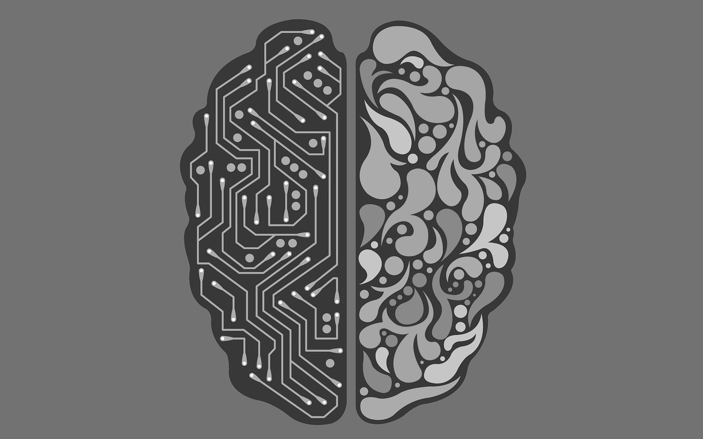

လူ့ဦးနှောက်သာ hard disk တစ်လုံးဖြစ်ခဲ့ရင် စစချင်းမှာ 1 MB ထက်နည်းတဲ့ ဝင်ဆန့်မှုပမာဏ (storage space) လောက်ပဲရှိပါလိမ့်မယ်။ အချိန်ကြာလာပြီး data အသစ်တွေဝင်လာတာနဲ့အမျှ သိမ်းဆည်းနိုင်စွမ်းလည်း တစ်ဖြည်းဖြည်းများလာပါတယ်။ data တွေများများသိမ်းလေ၊ hard disk ပမာဏတိုးလေပါပဲ။

Hard disk ကိုစသုံးပြီ: ၁၂−၁၃ နှစ်လောက်ကြာတဲ့အခါ ဝင်ဆန့်မှုပမာဏက အလျင်အမြန်ဆတိုးလာပါတယ်။ 10 GB ကနေ 100 GB, အဲ့ဒီ့ကနေ 1000 GB လောက်ဝင်ဆန့်နိုင်လာပါတယ်။

အခုအချိန်မှာ သင်ဟာဒီ hard disk ကိုသုံးနေတာ ၂၅ နှစ်လောက်ရှိပြီဆိုရင် သူ့ရဲ့ဝင်ဆန့်မှုပမာဏတိုးနှုန်းက တဖြည်းဖြည်းနှေးလာပါတယ်။ ဒါပေမယ့် data အနန္တနီးပါးကို သိမ်းဆည်းနိုင်တဲ့စွမ်းရည်ကတော့ ရှိနေတုန်းပါပဲ။

ဒီလိုမျိုး hard disk တစ်လုံး သင့်ကိုပေးမယ်ဆိုရင်ယူမှာလား။ ဒီပုံအတိုင်းဆိုရင်တော့ ဒီလို hard disk မျိုးရှိရင် ဝမ်းသာစရာပါပဲ။ ဒါပေမယ့် ဒီ hard disk မှာသာမန်နဲ့မတူတဲ့ အချက်လေးတွေနည်းနည်းတော့ရှိပါတယ်။

ဒီ hard disk မှာ storage space တွေအများကြီ:ရှိတာတော့ မှန်ပါတယ်။ ဒါပေမယ့် သူကခဏခဏ error တက်ပါတယ်။ တစ်ခြား drive တွေမှာ ဘယ်တော့မှဖြစ်မှာမဟုတ်တဲ့ တော်တော်ဆိုးတဲ့ error တွေတက်တာပါ။ အဲ့တာတွေကတော့−

- _data တွေကို ကျဘမ်းစနစ်နဲ့ အချိန်မှန်ဖျက်ပစ်ပါတယ်_
- _data တွေကို ကျဘမ်းစနစ်နဲ့ တွေ့ကရာ folder တွေထဲကို ရွှေ့ပစ်ပါတယ်_
- _data တွေကို ကျဘမ်းစနစ်နဲ့ မမြင်ရတဲ့ hidden folder တွေထဲကို ရွှေ့ပစ်ပါတယ်_

နောက်ပြီးတော့ ဒီ hard disk ထဲမှာသိမ်းတဲ့ data တွေအားလုံးကို မူရင်းအတိုင်းပြန်မရနိုင်လောက်အောင် compress လုပ် (ဖိသိပ်) ပြီ:သိမ်းပါတယ်။ Compress လုပ်ရင်းနဲ့ data တွေကိုလဲ အလွန်အကျွံဖြတ်ပစ်ပါသေးတယ်။

ဒါပေမယ့် အဲ့တာအဆိုးဆုံးမဟုတ်သေးပါဘူး။

အဲ့ထက်ပိုဆိုးတာက ဒီ hard disk ထဲမှာသိမ်းထားတဲ့ data တွေတစ်ဝက်လောက်က မကြာခဏပျက်စီးသွားပါတယ်။ ပျက်စီးသွားတဲ့ data တွေနေရာမှာအစားထိုးဖို့အတွက် ဒီ hard disk က တစ်ခါတစ်ရံ မဟုတ်မဟတ်လုပ်ဇာတ်တွေဖန်တီးပြီးထည့်ပါတယ်။

အားလုံးခြုံကြည့်လိုက်ရင်တော့ ဒီ hard disk က storage space မှာအလားအလာကောင်းပေမယ့် ပျက်စီးဖို့လဲ အလားအလာကောင်းနေပြန်ပါတယ်။

[Alexander Lee ၏ Quora answer](https://www.quora.com/If-a-human-brain-was-a-disk-how-much-space-would-it-have/answer/Alexander-Lee-%E6%A2%85%E6%B2%BB-%E6%96%B0%E5%A4%AA?share=69dd458b&srid=oti8) ကို ဆီလျော်အောင် ဘာသာပြန်ဆိုထားပါသည်။
