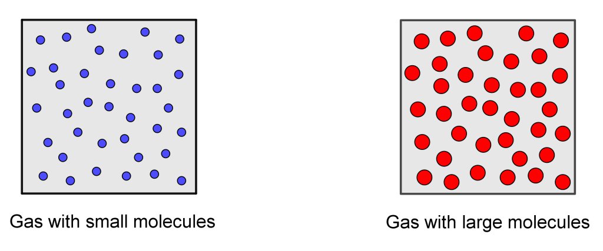
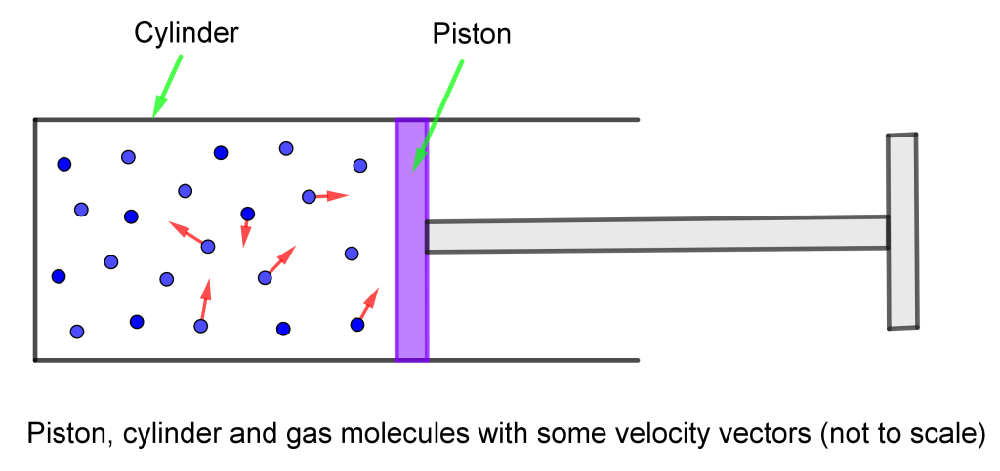
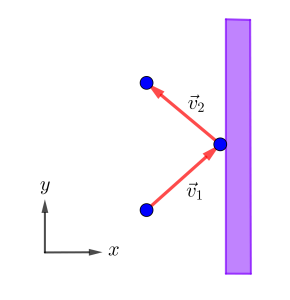

## တစ်ခုလောက်စဉ်းစားကြည့်ရအောင်။

ထုထည်တူပြီး အလုံပိတ်ထားတဲ့ပုံးနှစ်ပုံးရှိတယ်ဆိုပါတော့။ ပုံးတစ်ခုထဲကိုဟိုက်ဒရိုဂျင်မော်လီကျူးတွေထည့်ပြီး နောက်တစ်ခုထဲကို အောက်ဆီဂျင်မော်လီကျူးတွေထည့်မယ်။ ဒီဓာတ်ငွေ့မော်လီကျူးတွေထည့်ပြီးရင် ပုံးနှစ်ခုကိုအလုံပိတ်လိုက်မယ်။ ဒီပုံးနှစ်ခုကတူညီတဲ့အပူချိန် (temperature) နဲ့ အငွေ့ဖိအား (pressure) မှာရှိနေတယ်ဆိုရင် ပုံးထဲမှာရှိတဲ့ဟိုက်ဒရိုဂျင်မော်လီကျူးနဲ့ အောက်ဆီဂျင်မော်လီကျူးအရေအတွက်က ဘယ်ဟာကပိုများမလဲ။

ဟိုက်ဒရိုဂျင်နဲ့ အောက်ဆီဂျင်အက်တမ်တွေကို ဂေါ်လီလုံးလေးတွေ၊ ဒါမှမဟုတ်သဲစေ့တွေအနေနဲ့စဉ်းစားမယ်ဆိုပါတော့။ ဟိုက်ဒရိုဂျင်အက်တမ်ကို စက်လုံးပုံသဏ္ဍာန်လို့ယူဆရင် သူ့ရဲ့ atomic radius က ၁၂၀ ပစ်ကိုမီတာ (၁ မီလီမီတာရဲ့ သန်း ၁၀၀၀ ပုံတစ်ပုံ) ရှိပါတယ်။ အောက်ဆီဂျင်အက်တမ်က ၁၅၂ ပစ်ကိုမီတာရှိပါတယ်။ ဒီတော့ထုထည်ခြင်းယှဉ်လိုက်မယ်ဆိုရင် ပိုသေးတဲ့ဟိုက်ဒရိုဂျင်အက်တမ်က ပုံးထဲကိုပိုပြီ:များများဝင်ဆံ့နိုင်မှာပါ။ တကယ်လို့ဟိုက်ဒရိုဂျင်မော်လီကျူးနဲ့ ကာဗွန်ဒိုင်အောက်ဆိုက်မော်လီကျူး ဝင်ဆံ့နိုင်မယ့်အရေအတွက်ကို နှိုင်းယှဉ်ကြည့်မယ်ဆိုရင်ရော။ ဒီမော်လီကျူးနှစ်ခုရဲ့ထုထည်က အနည်းဆုံးနှစ်ဆကွာပါတယ်။ ဒီတော့ထုထည်တူတဲ့ပုံးထဲမှာ ဟိုက်ဒရိုဂျင်မော်လီကျူးအရေအတွက် ပိုထည့်လို့ရမယ်လို့စဉ်းစားစရာပါပဲ။

ဒါပေမယ့်လက်တွေ့မှာကျတော့ အပူချိန်နဲ့ဖိအားတူတဲ့ပုံးနှစ်ခုထဲမှာရှိတဲ့ ဓာတ်ငွေ့မော်လီကျူးအရေအတွက်က အတူတူဖြစ်နေပါတယ်။ ဒီတော့အပူချိန်နဲ့ဖိအားသာတူမယ်ဆိုရင် ၁ လီတာရှိတဲ့ဘူးထဲမှာထည့်ထားတဲ့ ဟိုက်ဒရိုဂျင်မော်လီကျူးအရေအတွက်ရော၊ အောက်ဆီဂျင်အရေအတွက်ရော၊ ကာဗွန်ဒိုင်အောက်ဆိုဒ်အရေအတွက်ရောက အတူတူပါပဲ။ နောက်တစ်မျိုးပြောရင် မော်လီကျူးအရေအတွက်က ဘယ်ဓာတ်ငွေ့လဲဆိုတာပေါ် မူတည်ခြင်းမရှိပါဘူး။ ဒါကို Avogadro’s law လို့ခေါ်ပါတယ်။ Avogadro’s law ရဲ့တရားဝင်ဖွင့်ဆိုချက်ကတော့−

<Box>
“အပူချိန်နှင့်ဖိအားတူညီပါက ထုထည်တူဓာတ်ငွေ့တို့တွင် တူညီသောမော်လီကျူးအရေအတွက်ပါဝင်ကြသည်”
</Box>

ဒီတော့ ဓာတ်ငွေ့အက်တမ်၊ မော်လီကျူးတွေကို သာမန်မြင်နေကျ ဂေါ်လီလုံးတွေ၊ သဲပွင့်တွေလိုယူဆလို့မရနိုင်ပါဘူး။ ဘာလို့မော်လီကျူးထုထည်ရော၊ ဒြပ်ထုရော မတူညီတဲ့ဓာတ်ငွေ့တွေက တူညီတဲ့ထုထည်ပမာဏရှိရသလဲဆိုတာ စိတ်ဝင်စားစရာပဲဖြစ်ပါတယ်။ ဒီမေးခွန်းရဲ့အဖြေကို ဒီဆောင်းပါးမှာဆွေးနွေးသွားမှာဖြစ်ပါတယ်။

ပထမဆုံးအနေနဲ့ဓာတ်ငွေ့တွေမှာ အပူချိန်နဲ့ဖိအားက အလွန်အရေးပါတဲ့အချက်တွေဖြစ်ကြောင်းရိပ်မိမယ်လို့ထင်ပါတယ်။ ဒုတိယအချက်က ဓာတ်ငွေ့အက်တမ် (သို့) မော်လီကျူးတွေဟာငြိမ်နေတာမဟုတ်ပဲ အပူချိန်အလိုက် တုန်ခါနေကြတာဖြစ်ပါတယ်။ တကယ်တော့အပူချိန်ကိုတောင် မော်လီကျူးတွေတုန်ခါနှုန်းနဲ့ အဓိပ္ပာယ်ဖွင့်ဆိုနိုင်ပါတယ်။ ဖိအား (pressure) ဆိုတာကတော့ အား (force) ကိုအားသက်ရောက်တဲ့စုစုပေါင်းဧရိယာ (area) နဲ့စားထားတာဖြစ်ပါတယ်။ တစ်နည်းအားဖြင့် တစ်ယူနစ်ဧရိယာပေါ်မှာသက်ရောက်တဲ့အားကို ဖိအားလို့ခေါ်ပါတယ်။ အခုလောလောဆယ်စိတ်ဝင်စားနေတဲ့ ဓာတ်ငွေ့ဖိအားကိုလည်း pressure လို့ပဲခေါ်ပါတယ်။ ဓာတ်ငွေ့ဖိအားကဘာလို့ဖြစ်လာတာလဲဆိုရင် ဓာတ်ငွေ့မော်လီကျူးတွေတုန်ခါမှုကြောင့်ပဲဖြစ်ပါတယ်။ ဒါဆိုရင် အပူချိန်ရော၊ ဖိအားရောက မော်လီကျူးတွေတုန်ခါမှုကြောင့်ဖြစ်တာဆိုတာ့ ရောချသလိုဖြစ်နေပါတယ်။ ဒီကိစ္စကိုနည်းနည်းပိုပြီ:တော့ အသေးစိတ်ဆွေးနွေးကြည့်ပါမယ်။

### အငွေ့ဖိအား

စက်ဘီးလေထိုးတဲ့ပြွန်ကိုမြင်ဖူးတယ်မလား။ အဲ့ဒီ့လေထိုးပိုက်ကိုဖွင့်ကြည့်လိုက်ရင် တည်ဆောက်ထားပုံကရှင်းရှင်းလေးပါပဲ။ ဆလင်ဒါပုံအခွံ(ပြွန်)ထဲမှာ လေလုံတဲ့ဝါရှာပြားလေးထည့်ထားပါတယ်။ ဝါရှာပြားလေးကိုလက်ကိုင်နဲ့ချိတ်ထားပြီ: သူ့ကိုဖိလိုက်ရင်ပြွန်ထဲကလေကို ဖိသိပ်ပေးပါတယ်။ တည်ဆောက်ပုံကို ပုံမှာအကြမ်းဆွဲပြထားပါတယ်။ တစ်ဖက်ပိတ်ပြွန်ကို ဆလင်ဒါ (cylinder) လို့ပဲခေါ်ပြီး ဖိသိပ်တဲ့ဝါရှာပြားကိုတော့ ပစ်စတန် (piston) လို့ခေါ်ပါတယ်။ ဆလင်ဒါအထဲမှာ ပစ်စတန်နဲ့ကာထားတဲ့အတွက် အလုံပိတ်ခံထားရတဲ့ဓာတ်ငွေ့မော်လီကျူးတွေရှိပါတယ်။ ဒီဓာတ်ငွေ့မော်လီကျူးတွေက ငြိမ်ငြိမ်မနေပဲ အလျင်တစ်ခုနဲ့ လျှောက်သွားနေပါတယ်။ အလုံပိတ်အခန်းထဲမှာ ရာဘာဘောလုံးတွေ ခုန်ပေါက်နေသလိုပေါ့။ ဒီတော့ဒီမော်လီကျူးတွေထဲကတစ်ချို့ဟာ ပစ်စတန်အပြားကိုဝင်တိုက်မိကြပါတယ်။ ပစ်စတန်ကိုမော်လီကျူးတစ်ခုဝင်တိုက်လိုက်တိုင်း ပစ်စတန်မှာအဟုန် (momentum) တိုးလာပါတယ်။ ဘာလို့လဲဆိုတော့ အဟုန်တည်မြဲခြင်းနိယာမကြောင့် မော်လီကျူးရဲ့အဟုန်က ပစ်စတန်ဆီကိုရောက်သွားပါတယ်။ အဟုန်ရဲ့ညီမျှခြင်းက $ \vec{p}=m\vec{v} $ ဖြစ်တဲ့အတွက်−

$$
 \vec m_m \vec v_m = \vec m_p \vec v_p
$$

ဒါပေမယ့်မော်လီကျူးကပစ်စတန်နဲ့တိုက်ပြီ:ပြီးချင်း ရာဘာဘောလုံးလိုမျိုး ပြန်ကန်ထွက်သွားပါတယ်။ ဒါကို elastic collision လို့ခေါ်ပါတယ်။ ပစ်စတန်နဲ့တိုက်မိတဲ့အချိန်မှာ အပူအဖြစ်စွမ်းအင်ဆုံးရှုံးမှုမရှိဘူးဆိုရင် မော်လီကျူးကလာတိုက်တဲ့မူလအရှိန်အတိုင်း ပြန်ကန်ထွက်သွားပါတယ်။ ဒါကို perfectly elastic collision လို့ခေါ်ပါတယ်  
_(momentum အကြောင်းဆောင်းပါးကို[ဒီမှာဖတ်ပါ](http://theinlinaung.com/momentum-convservation/))_။ ပြန်ကန်ထွက်သွားဖို့ကို ပစ်စတန်ကမော်လီကျူးဆီကို အဟုန်ပြန်ပေးရပါတယ်။ ပစ်စတန်ရဲ့မျက်နှာပြင်ကချောမွတ်နေမယ် (frictionless surface) ဆိုရင်အောက်ကပုံအတိုင်း y-direction မှာမော်လီကျူးအလျင်ကပြောင်းလဲမှုမရှိပဲ x-direction မှာလားရာပြောင်းသွားပါတယ်။

m က မော်လီကျူးရဲ့ဒြပ်ထု၊ M က ပစ်စတန်ရဲ့ဒြပ်ထုဆိုရင်−

$$
v_{mx1} = -v_{mx2}, v_{px1} = 0
\\
v*{my1} = v*{my2}, v*{px2} = 2\frac{M}{m_m}v*{mx}
$$

ဒီတော့ ပစ်စတန်ကိုမော်လီကျူးတစ်ခုလာတိုက်သွားတိုင်း ပစ်စတန်မှာမော်လီကျူးရဲ့အဟုန်ရဲ့ x-component နှစ်ဆစီတိုးလာပါတယ်။

$$

\Delta p_x = 2mv_x

$$

ပစ်စတန်ကို ဒီလိုမျိုးမော်လီကျူးတွေက အမြဲတမ်းလာတိုက်နေပါတယ်။ ပစ်စတန်က ၁ စက္ကန့်အတွင်းမှာရရှိတဲ့အဟုန်ကိုလိုချင်ရင် အပေါ်ကအဟုန်ပြောင်းလဲမှုကို အဲ့ဒီ့အချိန်အတွင်းမှာဖြစ်တဲ့ collision အရေအတွက်နဲ့မြှောက်ပေးရပါမယ်။ ဒီတော့ ၁ စက္ကန့်အတွင်းမှာ မော်လီကျူးဘယ်နှစ်လုံးလာတိုက်လဲဆိုတာ ဘယ်လိုရှာမလဲ။ ကျပန်းပြေးလွှားနေတဲ့မော်လီကျူးတွေထဲမှာ လာတိုက်တဲ့အရေအတွက်ကိုအတိအကျတွက်ဖို့တော့ မလွယ်ပါဘူး။ အားလုံးခြုံကြည့်မယ်ဆိုရင် မော်လီကျူးတွေရဲ့ ပျမ်းမျှအလျင်*ပမာဏ* က v လို့ထားပါတော့။ အလျင်ဦးတည်ရာကရော။ မော်လီကျူးအရေအတွက်များတယ်ဆိုရင် အလျင်ဦးတည်ရာတွေရဲ့ ဖြစ်တန်စွမ်းက အရပ်မျက်နှာတိုင်းမှာ တူညီတယ်လို့ယူဆနိုင်ပါတယ်။ နည်းနည်းရှုပ်သွားပြီလား။ မော်လီကျူးအရေအတွက်သန်းနဲ့ချီတဲ့ထဲက တစ်လုံးကိုကျပန်းထုတ်လိုက်ပြီ: သူ့ရဲ့အလျင်ဦးတည်ရာကို ခန့်မှန်းခိုင်းမယ်ဆိုရင် +x direction အတွက်ဖြစ်တန်စွမ်းက -x direction နဲ့အတူတူပါပဲ။ တစ်ခြားအချက်အလက်မရှိပဲ ဦးတည်ရာတစ်ဖက်ဖက်ကို အားသာစေတဲ့အကြောင်းပြချက်မရှိပါဘူး။ ဒီတော့မော်လီကျူးကိုဗဟိုထားပြီ:ဆွဲတဲ့ အလျင်ဖြစ်တန်စွမ်းတွေကိုဆွဲလိုက်ရင် စက်လုံးပုံကျနေမှာပါ။ x- direction ကိုပဲသီးသန့်စဉ်းစားမယ်ဆိုရင် မော်လီကျူးစုစုပေါင်းရဲ့တစ်ဝက်က +x ဘက် (ပစ်စတန်ဘက်)ကိုသွားနေပြီး တစ်ဝက်က -x ဘက် (ပစ်စတန်နဲ့ဝေးရာ) ကိုသွားနေတယ်လို့ ပြောလို့ရပါမယ်။ ဒါပေမယ့် ဆလင်ဒါထဲကမော်လီကျူးတစ်ဝက်လုံးက ၁ စက္ကန့်အတွင်းမှာ ပစ်စတန်ကိုလာမတိုက်မိပါဘူး။ ပစ်စတန်ကနေ $\frac{v_x}{1}$ (velocity / 1 second) အကွာအဝေးမှာရှိတဲ့ မော်လီကျူးတွေရဲ့တစ်ဝက်ကပဲ ပစ်စတန်နဲ့တိုက်မိဖို့အလားအလာရှိပါတယ်။ ဒီတော့ ဆလင်ဒါထဲကထုထည်တစ်ယူနစ်မှာရှိတဲ့ မော်လီကျူးအရေအတွက်ကို n လို့ထားပြီ: ဆလင်ဒါရဲ့အချင်းကို d လို့ထားရင်−

$$

\pi \frac{d^2}{4} . \frac {v_x}{1} . \frac 12 . n

$$

က ၁ စက္ကန့်အတွင်းပစ္စတန်ကိုလာတိုက်မယ့် မော်လီကျူးအရေအတွက်ဖြစ်ပါတယ်။ ဒီတော့ ၁ စက္ကန့်အတွင်း ပစ္စတန်ရဲ့အဟုန်တိုးကိန်းက−

$$

\frac {\Delta p_x}{1 s} = 2mv_x . \pi \frac {d^2}{4} . \frac {v_x}{1} . \frac 12 .n

$$

ဒီကိန်းက အဟုန်တိုးနှုန်းကိုဖော်ပြတာလည်းဖြစ်ပါတယ်။ နယူတန်ဒုတိယနိယာမအရ အဟုန်ပြောင်းလဲနှုန်းက အားနဲ့ညီမျှပါတယ်။

$$

F=\frac{dp}{dt}=\frac{\Delta p_x}{1 s}

$$

ဒီတော့အငွေ့ဖိအားက−

$$

P=\frac{F}{A}=\frac{F}{\pi \frac{d^2}{4}}=mv_x^2 n

$$

ဒီညီမျှခြင်းက အငွေ့ဖိအားနဲ့ မော်လီကျူးရွေ့လျားမှုတို့ကို ဆက်နွယ်ပေးပါတယ်။ တစ်ခုသတိထားမိမလားမသိဘူး။ အရွေ့စွမ်းအင်က $ \frac 12 mv^2 $ ဆိုတော့ အငွေ့ဖိအားနဲ့ဆက်သွယ်လို့ရနိုင်မလား။ $ v $ နဲ့ $ v_x $ ကမတူတဲ့အတွက် သူတို့နှစ်ခုကြားကဆက်သွယ်ချက်ကိုရှာကြည့်ပါမယ်။ ဒါကလွယ်ပါတယ်။

$$

v^2=v_x^2+v_y^2+v_z^2

$$

ပျမ်းမျှအခြေအနေမှာ $ v_x, v_y, v_z $ term သုံးခုက ဘယ်ဟာကမှပိုနည်းစရာ၊ များစရာမရှိတာမို့ $ v^2 $ ရဲ့သုံးပုံတစ်ပုံစီရှိပါမယ်။ ဒီတော့−

$$

v_x^2=\frac{v^2}{3},
$$

on average

$$
 P= n.mv_x^2=n.\frac{2}{3}.\frac{1}{2}mv^2= n.\frac{2}{3}.KE
$$

ဒီညီမျှခြင်းက အငွေ့ဖိအားနဲ့အရွေ့စွမ်းအင်ကို ဆက်သွယ်ပေးပါတယ်။ $ N $ ကစုစုပေါင်းမော်လီကျူးအရေအတွက်, $ V $ ကဓာတ်ငွေ့ထုထည်ဆိုရင်-

$$
 N=nV
$$

$$
 PV=N.\frac{2}{3}.KE
$$

ဒီညီမျှခြင်းအရ ဖိအားနဲ့ထုထည်ကိုကိန်းသေထားလိုက်ရင် အရွေ့စွမ်းအင်ကလည်းကိန်းသေဖြစ်မယ်လို့ဆိုပါတယ်။ ဓာတ်ငွေ့မော်လီကျူးတွေရဲ့အရွေ့စွမ်းအင်ကို internal energy (U) လို့လည်းခေါ်ပါတယ်။ ဒါက Avogadro’s Law နဲ့ဘယ်လိုဆက်သွယ်မှုရှိမလဲ။ $ PV=N.m\frac{v^2}{3} $ ဆိုတော့ ဒြပ်ထု (m) မတူတဲ့မော်လီကျူးတွေထည့်လိုက်ရင် PV တန်ဖိုးကပြောင်းသွားနိုင်မလား။ ဒါပေမယ့် $ v $ တန်ဖိုးကရော $ P,V,m $ တို့ကိုမမီခိုဘူးလား။ ဒီမေးခွန်းကိုဖြေရှင်းဖို့ နောက်ထပ်အရေးပါတဲ့လမ်းစတစ်ခုကို ဆွဲထုတ်ရပါမယ်။ ဒါကတော့ အပူချိန် (temperature) အကြောင်းပဲဖြစ်ပါတယ်။

−ဆက်ရန်

<Blockquote author="Avenged Sevenfold">
Seize the day or die regretting the time you lost.
</Blockquote>
