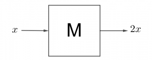
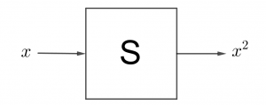

## ODE ဆိုတာဘာလဲ

ဒီညီမျှခြင်းကိုကြည့်ပါ။

$$
 a\frac{d^2x}{dt^2}+b\frac{dx}{dt}+cx+d=0
$$

ဒီညီမျှခြင်းဟာ variable x ရဲ့ time t အလိုက်ပြောင်းလဲတဲ့ rate of change တွေနဲ့ function of x တွေရဲ့ ဆက်နွယ်ပုံကို ဖော်ပြတဲ့ညီမျှခြင်းဖြစ်ပါတယ်။ Ordinary differential operator တွေနဲ့ဖွဲ့စည်းထားတဲ့ ဒီလိုညီမျှခြင်းကို _ordinary differential equation_ လို့ခေါ်ပါတယ်။ မြှောက်ဖော်ကိန်းတွေဖြစ်တဲ့ a, b နဲ့ c က ကိန်းသေ၊ ဒါမှမဟုတ် x or t တို့ရဲ့ function တွေလည်းဖြစ်နိုင်ပါတယ်။ ဥပမာ simple harmonic oscillation ကိုဖော်ပြတဲ့ညီမျှခြင်းဖြစ်တဲ့−

$$
 \frac{d^2x}{dt^2}+\omega^2 x = 0
$$

က ODE တစ်ခုဖြစ်ပါတယ်။ နောက်ဥပမာတစ်ခုအနေနဲ့−

$$
 \frac{d^2x}{dt^2}+t^2 x = 0
$$

ဒီတစ်ခုမှာ x ရဲ့မြှောက်ဖော်ကိန်းက ကိန်းသေမဟုတ်ပဲ variable t ဖြစ်နေပါတယ်။ ဒါပေမယ့် သူလည်းပဲ ODE တစ်ခုပါပဲ။ Ordinary differential operator မဟုတ်တာကဘာလဲဆိုရင် ဥပမာ partial differential operator ($ \partial $) နဲ့ဖွဲ့စည်းထားတဲ့ equation ကိုတော့ _partial differential equation_ လို့ခေါ်ပါတယ်။

ODE တွေအတွက် ကျွန်တော်တို့လုပ်ရမှာက differential equation ကဖော်ပြတဲ့ ဆက်နွယ်ချက်တွေကိုပြေလည်စေတဲ့ function of x ကို ရှာရမှာဖြစ်ပါတယ်။ သဘောကတော့ x(t) ကို မူရင်း equation ရဲ့ဘယ်ဘက်က x နေရာတွေမှာထည့်လိုက်ရင် ညာဘက်ကတန်ဖိုး (0) ကိုရရမှာဖြစ်တယ်။ ဒီတော့ x(t) ကိုဘယ်လိုပဲရှာရှာ မူရင်း equation ကိုပြေလည်စေတယ်ဆိုရင် အဲ့ဒီ့ function က ODE ရဲ့အဖြေတစ်ခုပဲဖြစ်ပါတယ်။

ODE ရဲ့ _order_ ကိုရှာချင်ရင် equation ထဲကအကြီးဆုံး derivative ကိုရှာပါ။ ဥပမာ simple harmonic oscillation equation ရဲ့ highest derivative က $ \frac{d^2x}{dt^2} $ ဖြစ်တဲ့အတွက် သူ့ကို second order ODE လို့ခေါ်ပါတယ်။ $ \frac{d^3x}{dt^3} $ အထိပါရင်တော့ third order ODE စသဖြင့်ခေါ်မှာပေါ့။

### Linearity of differential equations

Linear ဖြစ်တယ်ဆိုတာ ဘာကိုဆိုလိုတာလဲဆိုတာ ဒီမှာပြောပြပါမယ်။ ဥပမာအနေနဲ့  oscillator equation ကိုပဲပြန်ကြည့်ပါ။

$$
 \frac{d^2x}{dt^2}+\omega^2 x = 0
$$

ကျွန်တော်တို့ရှာလိုက်တဲ့ function $ x_1(t) $ က ဒီ equation ကိုပြေလည်စေတယ်ဆိုပါတော့။ ဒါဆိုရင် အဲ့ဒီ့အဖြေကို ကိန်းသေ $ c_1 $ နဲ့မြှောက်တဲ့ $ c_1 x_1(t) $ ကလည်း equation ကိုပြေလည်စေပါတယ်။ အကြောင်းရင်းကိုသိချင်ရင် equation နှစ်ဖက်လုံးကို $ c_1 $ နဲ့မြှောက်လိုက်ပါ။ ညာဘက်မှာက 0 ပဲရပါမယ်။ ကိန်းသေတစ်ခုက differential operator ရဲ့ ရှေ့မှာဖြစ်ဖြစ်၊ နောက်မှာဖြစ်ဖြစ် အကြောင်းမထူးတာမို့ $ c_1 x_1(t) $ က equation ကိုပြေလည်စေပါတယ်။ အောက်မှာ တစ်ဆင့်ချင်းရေးပြထားပါတယ်။

$$
 \frac{d^2x_1(t)}{dt^2}+\omega^2 x_1(t) = 0
\\
\frac{d^2(c_1 x_1(t))}{dt^2}+ \omega^2 (c_1 x_1(t))=0

$$

တစ်ခါ $ x_1(t) $ နဲ့မတူတဲ့ function နောက်တစ်ခု $ x_2(t) $ ကလည်း oscillation equation ကိုပြေလည်စေတယ်ဆိုတာ တွေ့ပြန်ရောဆိုပါတော့။ စောစောက logic အရ $ c_2 x_2(t) $ ကလည်း အဖြေတစ်ခုပဲဖြစ်မယ်။

$$

\frac{d^2(c_2 x_2(t))}{dt^2}+ \omega^2 (c_2 x_2(t))=0

$$

ဒါဆိုကျွန်တော်တို့ နောက်ထပ် function တစ်ခုကို စမ်းသပ်ကြည့်ပါမယ်။ ဘာလဲဆိုတော့ အရင်ကအဖြေနှစ်ခုကိုပေါင်းပြီး $ c_1 x_1(t) + c_2 x_2(t) $ ကရော ကျွန်တော်တို့ equation ကိုပြေလည်စေလားဆိုတာ စမ်းကြည့်ပါမယ်။ ဒီတော့ မူလ equation ရဲ့ x နေရာမှာ အဲ့ဒီ့ဟာကိုထည့်ကြည့်ပါမယ်။

$$
\frac{d^2}{dt^2}\left[ c_1 x_1(t) + c_2 x_2(t) \right]+\omega^2 \left[ c_1 x_1(t) + c_2 x_2(t) \right]
\\
 \frac{d^2}{dt^2}  c_1 x_1(t)  + \frac{d^2}{dt^2}  c_2 x_2(t)  + \omega^2  c_1 x_1(t)  + \omega^2  c_2 x_2(t)
$$

ဒုတိယအကြောင်းမှာ second derivative ကို ကွင်းထဲဝင်မြှောက်သလိုလုပ်လိုက်ပါတယ်။ ဒါပေမယ့် differential operator က သူ့ချည်းသက်သက်ကိန်းတစ်ခုမဟုတ်တာကြောင့် ဝင်မြှောက်တယ်လို့တော့ ပြောလို့မရပါဘူး။ ဒီလိုလုပ်လို့ရတာဟာ derivative ယူတာက linear operation ဖြစ်တာကြောင့်ဖြစ်ပါတယ်။ ပေါင်းလဒ်ကို derivative ယူတာက ပေါင်းကိန်းတွေကို derivative ယူပြီးမှ ပေါင်းတာနဲ့ အတူတူပါပဲ။ (ဒါကိုသက်သေပြချင်ရင် derivative ရဲ့ ဖွင့်ဆိုချက်ကိုသုံးကြည့်ပါ။) ဒီတော့ လိုချင်တဲ့အဖြေရအောင် ဒုတိယ equation ကို ပြန်စီလိုက်ရုံပါပဲ။

$$

\frac{d^2}{dt^2} c_1 x_1(t)  + \omega^2  c_1 x_1(t)  + \frac{d^2}{dt^2}  c_2 x_2(t)  + \omega^2  c_2 x_2(t) =0+0=0

$$

ဒီတော့ linear ဖြစ်တဲ့ differential equation တစ်ကြောင်းရဲ့အဖြေနှစ်ခုကို ပေါင်းထားတဲ့ ပေါင်းလဒ်ကလည်း နောက်အဖြေတစ်ခုဖြစ်ပါတယ်။ အဖြေနှစ်ခုထက်ပိုရင်လည်း ဒီကောက်ချက်ကမှန်တာကို အလွယ်တကူသက်သေပြနိုင်ပါတယ်။

Linearity သဘောတရားက သင်္ချာနဲ့သိပ္ပံဘာသာရပ်မှာ အရေးပါတဲ့သဘောတရားတစ်ခုဖြစ်လို့ ဒါကိုနည်းနည်းပိုပြီးနားလည်အောင်ကြိုးစားသင့်ပါတယ်။ နောက်ဥပမာတစ်ခုအနေနဲ့ differential operator မဟုတ်ပဲ ပိုရိုးရှင်းတဲ့ operator တစ်ခု(M လို့ဆိုကြပါစို့) ကိုကြည့်ရအောင်။ M ရဲ့ လုပ်ဆောင်ချက်က သူ့နောက်ကကိန်းကို နှစ်ဆတိုးတဲ့ တာဝန်ရှိတယ်ဆိုပါတော့။

ဒါဆို $M(a+b)=Ma+Mb$ ဖြစ်တာကို ဖြန့်ဝေရဂုဏ်သတ္တိအရသိနိုင်ပါတယ်။ ဒီတော့ definition အရ M က linear operator တစ်ခုဖြစ်ပါတယ်။ နောက် operator တစ်ခု S ရဲ့လုပ်ဆောင်ချက်က သူ့နောက်ကကိန်းကို နှစ်ထပ်တင်တယ်ဆိုပါတော့။

S ကရော linear operator ဖြစ်လားဆိုတာစစ်ကြည့်ရအောင်။

$$

S(a+b)=(a+b)^2=a^2+2ab+b^2=Sa+Sb+2ab

$$

ရှေ့ဆုံးနဲ့နောက်ဆုံး term ကိုယှဉ်ကြည့်ရင် S က linear operator မဟုတ်တာကိုတွေ့နိုင်ပါတယ်။ Differential equation ထဲမှာပါတဲ့ function တွေအကုန်လုံးက linear ဖြစ်ရင် အဲ့ဒီ့ differential equation ကလည်း linear ဖြစ်ပါတယ်။ အောက်က equation ကတော့ nonlinear differential equation တစ်ခုဖြစ်ပါတယ်။

$$

\frac{d^2x}{dt^2}+\sin x = 0

$$

ယေဘူယျအားဖြင့် $ \sin(x_1+x_2)\neq \sin x_1 + \sin x_2 $ ဖြစ်တာကြောင့် linearity definition ကိုမလိုက်နာတာဖြစ်ပါတယ်။

Free-damped oscillation ကိုဖော်ပြတဲ့ differential equation ကတော့ linear ဖြစ်တာကိုကြည့်ရုံနဲ့သိနိုင်ပါတယ်။

$$

\frac{d^2x}{dt^2}+\gamma \frac{dx}{dt}+\omega_0^2 x=0

$$

ODE ထဲက function တွေကို x ရဲ့ တစ်ထပ်ကိန်းတွေနဲ့ပဲ ဖွဲ့စည်းထားရင် homogeneous ဖြစ်တယ်လို့ခေါ်ပါတယ်။ ဒါပေမယ့် superposition principle က x သုညထပ်ကိန်းပါတဲ့ non-homogeneous equation တွေအတွက်လည်း အလုပ်ဖြစ်ပါတယ်။ ဥပမာ forced oscillation equation လိုမျိုးပေါ့။

$$

\frac{d^2x}{dt^2}+\gamma \frac{dx}{dt}+\omega_0^2 x=f(t)

$$

Oscillator ပေါ်ကို force နှစ်ခု $f_1(t)$ နဲ့ $ f_2(t) $ တို့ တစ်ပြိုင်တည်းသက်ရောက်နေမယ်ဆိုရင် ထွက်လာတဲ့ response က $ f_1 $ ကြောင့်ဖြစ်တဲ့အရွေ့ $ x_1 $ နဲ့ $ f_2 $ ကြောင့်ဖြစ်တဲ့ $ x_2 $ တို့ပေါင်းလဒ်နဲ့ညီတယ်ဆိုတာ superposition principle ကိုသုံးပြီး မင်းကိုယ်တိုင်သက်သေပြနိုင်ပါတယ်။

<Blockquote author="Jack Fraser">
Work and determination can overcome most academic problems.
</Blockquote>
