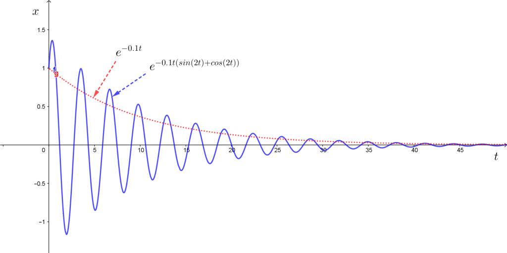
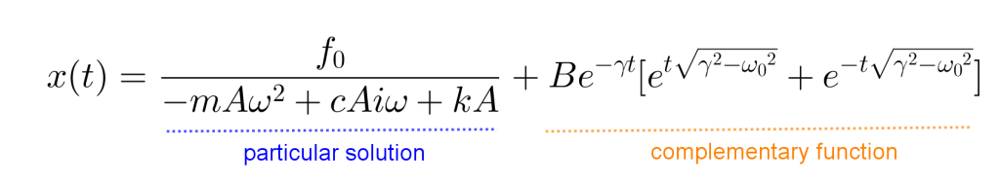

Free damped oscillation အတွက် အချိန်အလိုက်ပြောင်းလဲတဲ့ $ x $ ရဲ့အဖြေကို[ရှေ့အပိုင်း](http://theinlinaung.com/ode-2/)မှာတွက်ထုတ်ခဲ့ပါတယ်။

$$
 x=Ae^{(-\gamma \pm \sqrt{\gamma^2 - \omega_0 ^2})t}
$$

Constant A က x-t graph ရဲ့ စကေးကိုပဲပြောင်းလဲစေတာဖြစ်တဲ့အတွက် လောလောဆယ်ကျွန်တော်တို့ initial condition တွေက သူ့ကို 1 ဖြစ်စေတယ်ဆိုပါတော့။

$$
 x=e^{(-\gamma \pm \sqrt{\gamma^2 - \omega_0 ^2})t}
$$

$ \omega_0 $ နဲ့ $ \gamma $ နဲ့နှိုင်းယှဉ်လိုက်ရင် အခြေအနေသုံးခုဖြစ်နိုင်ပါတယ်။

$$
 \omega_0 > \gamma \ \text{(underdamped)}
$$ 

$$
\omega_0 = \gamma \ \text{(critically damped)}
$$

$$
\omega_0 < \gamma \ \text{(overdamped)}
$$

ပထမအခြေအနေဖြစ်တဲ့ $ \omega_0 > \gamma $ ဆိုရင် square root ထဲကကိန်းက အနှုတ်ကိန်းဖြစ်ပါမယ်။ ဒီတော့ exponential ပေါ်မှာ imaginary ကိန်းအနေနဲ့ရေးပါမယ်။

$$
x= e^{(-\gamma \pm i  \sqrt{\omega_0 ^2 - \gamma^2})t}
$$

$$
x=e^{-\gamma t}e^{\pm i t \sqrt{\omega_0 ^2 - \gamma^2}}
$$

$$
x=e^{-\gamma t}[Ae^{ i t \sqrt{\omega_0 ^2 - \gamma^2}}+Be^{- i t \sqrt{\omega_0 ^2 - \gamma^2}}]
$$

နောက်ဆုံးညီမျှခြင်းက သူ့အပေါ်က solution နှစ်ခုပေါင်းပြီးရေးထားတာပဲဖြစ်ပါတယ်။

အပေါ်ကအဖြေကိုလေ့လာကြည့်ရင် real negative exponential တစ်ခုနဲ့ imaginary exponential function တို့ကိုတွဲထားတာတွေ့နိုင်ပါတယ်။ Imaginary exponential function ရဲ့သဘာဝက oscillating ဖြစ်နေမှာဖြစ်ပြီး real negative exponential ကတော့ အချိန်အလိုက် exponentially ထိုးကျသွားမှာဖြစ်တယ်။ ဒီတော့ underdamped case မှာ $ \gamma t >> 1 $ ဖြစ်လာတာနဲ့ $ x $ ကအလွန်နည်းသွားမှာဖြစ်ပါတယ်။

ဒုတိယတစ်ခုဖြစ်တဲ့ critically damp case မှာတော့ $ x=e^{-\gamma t} $ (general solution ဆိုရင် $ x=(A+Bt)e^{-\gamma t} $) သာရတာကြောင့် oscillation လုံးဝမဖြစ်ပါဘူး။

တတိယတစ်ခု overdamped case မှာဆိုရင် falling exponential နှစ်ခုရှိပါမယ်။ ပေါင်းရေးလိုက်ရင်−

$$
x= e^{-\gamma t}[Ae^{t \sqrt{\gamma^2 - \omega_0 ^2}}+Be^{-t \sqrt{\gamma^2 - \omega_0 ^2}}]
$$

ရပါမယ်။

ဟုတ်ပြီ။ အခု forced oscillation ကိုကြည့်ရအောင်။ အရင်ကအတိုင်းပဲ force က amplitude $ f_0  $ နဲ့ frequency $ \omega $ နဲ့ oscillation ဖြစ်နေတယ်လို့ယူဆပါမယ်။ ဒါဆိုရင် force equation (equation of motion) က−

$$
m \frac{d^2x}{dt^2}+c \frac{dx}{dt}+kx=f(t)=f_0e^{i\omega t}
$$

ဒီ equation က linear ဖြစ်ပြီး applied force က imaginary component မရှိတဲ့အတွက် အဖြေမှာ real part ကိုပဲယူရပါမယ်။ ဒါပေမယ့် $ x^0 $ ဖြစ်တဲ့ force term ပါနေတဲ့အတွက် homogeneous တော့မဟုတ်ပါဘူး။ အခု အဲ့ဒီ့ equation အတွက်အဖြေတစ်ခုကိုခန့်မှန်းကြည့်ပါမယ်။

_Ansatz
$$
 x=Ae^{i\omega t}
$$
_(Ansatz = ခန့်မှန်းအဖြေ)

Displatement $ x $ က forced frequency $ \omega  $ အတိုင်း oscillate ဖြစ်နေမယ်လို့ ခန့်မှန်းပါမယ်။ မူလ equation of motion မှာအစားသွင်းပြီး x ကိုဖြေရှင်းလိုက်ရင်−

$$
x(t)=\frac{f_0e^{i\omega t}}{-m A  \omega ^2 e^{i\omega t}+c A i \omega e^{i\omega t} + k A e^{i\omega t} }
$$

$$
x(t)=\frac{f_0}{-m A  \omega ^2+c A i \omega + k A}
$$

ဒီ $ x(t) $ ($ x_{\text{forced}}(t) $ လို့ခေါ်လိုက်ပါမယ်) ကအဖြေတစ်ခုဖြစ်ပေမယ့် ပြည့်စုံတဲ့အဖြေတော့မဟုတ်သေးပါဘူး။ ဘာလို့လဲဆိုတော့ forced oscillation ညီမျှခြင်းမှာ force term ကို 0 ပေးပြီးတွက်လိုက်ရင် free oscillation ကအဖြေကိုရပါမယ်။ ဆိုလိုတာက အပေါ်ဆုံးမှာဆွေးနွေးသွားတဲ့ free oscillation အတွက်အဖြေ $ x_{\text{free}}(t) $ ကိုထည့်တွက်လိုက်ရင် 0 ရပါလိမ့်မယ်။ 0 ရတာ လိုချင်တဲ့ $ f(t)  $ ရတာမဟုတ်တဲ့အတွက် forced oscillation ရဲ့အဖြေမဟုတ်ဘူးလို့ ထင်ကောင်းထင်ပါလိမ့်မယ်။ ဒါပေမယ့် $ f(t)=f(t)+0  $ လို့ လုံးဝရေးလို့ရပါတယ်။ ဒီတော့ $ x_{\text{free}}(t)  $ ကသူ့ချည်းသက်သက်အဖြေမဖြစ်နိုင်ပေမယ့် linear ODE ရဲ့ superposition ဂုဏ်သတ္တိအရ $ x_{\text{forced}}(t)+x_{\text{free}}(t)  $ ကတော့ အဖြေတစ်ခုဖြစ်ပါတယ်။ ဒီတော့ forced oscillation အတွက်ယေဘူယျအကျဆုံး solution က−

$$
x=\frac{f_0}{-m A \omega ^2+c A i \omega + k A}+ Be^{-\gamma t}[e^{t\sqrt{\gamma^2 - \omega_0 ^2}}+e^{-t\sqrt{\gamma^2 - \omega_0 ^2}}]
$$

ပထမ term က သိတဲ့အတိုင်း force ကြောင့်ဖြစ်တဲ့ oscillation ဖြစ်ပြီး ဒုတိယ term က initial disturbance ပေးလိုက်ရင်ဖြစ်တဲ့ free oscillation ဖြစ်ပါတယ်။ ဒီတော့ forced oscillation ရဲ့ယေဘူယျအကျဆုံးအဖြေက force ကြောင့်ဖြစ်တဲ့ oscillation နဲ့ free oscillation ကိုပေါင်းစပ်ထားတာဖြစ်ပါတယ်။ ဒါပေမယ့် free oscillation term က အလျင်အမြန်ပဲပျောက်ကွယ်သွားပါတယ် (exponentially decay ဖြစ်တယ်လို့ခေါ်ပါတယ်)။ ဒါကြောင့် free oscillation term ကို _သက်တမ်းတိုတုန့်ပြန်မှု (transient response)_ လို့ခေါ်ပါတယ်။ အချိန်ကြာလာရင် forced oscillation term သာကျန်နေတာမို့သူ့ကို _ပုံမှန်တုန့်ပြန်မှု (steady state response)_ လို့ခေါ်ပါတယ်။

သင်္ချာသဘောတရားအရပြောရရင် inhomogeneous ODE ရဲ့ ယေဘူကျအကျဆုံး solution မှာ ညာဘက်က $ x^0 $ term ကို 0 ပေးလိုက်လို့ရတဲ့ homogeneous ODE ရဲ့ solution ပါတွဲပါနေတာကို တွေ့နိုင်ပါတယ်။ သင်္ချာအခေါ်အဝေါ်အရ ပထမ solution ကို _particular solution_ လို့ခေါ်ပြီး ဒုတိယ solution ကို *complementary function* လို့ခေါ်ပါတယ်။

> Better to light a candle than curse the darkness
>
> ~Peter Benenson
