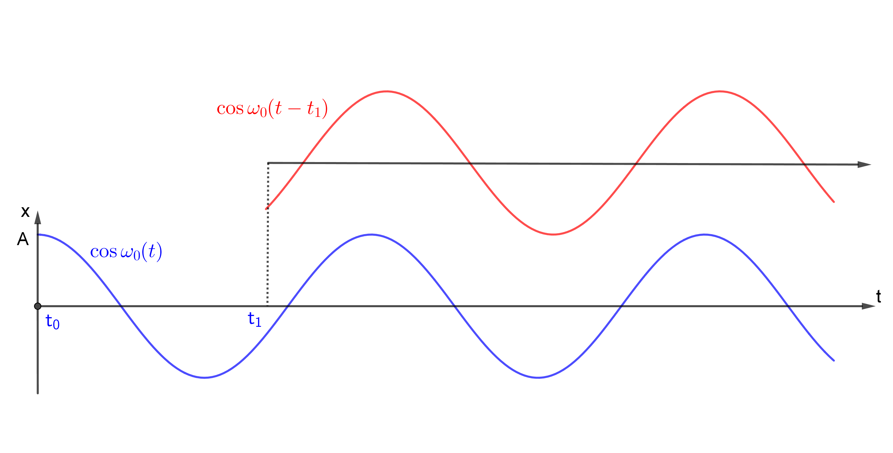

[ပထမအပိုင်း](http://theinlinaung.com/oscillations/)တုန်းက oscillator ရဲ့ ညီမျှခြင်းဖြစ်တဲ့ $ \frac{d^2x}{dt^2}=-x $ ကိုဖြေရှင်းလိုက်တော့ $ x=\cos t $ ရခဲ့ပါတယ်။ ဒါပေမယ့်မူလညီမျှခြင်းဖြစ်တဲ့−

$$
\frac{d^2 x}{dt^2}=-\frac{k}{m}  x
$$

ကိုဖြေရှင်းဖို့ကြိုးစားကြည့်ရအောင်။ ဒီညီမျှခြင်းကို ပထမညီမျှခြင်းနဲ့နှိုင်းယှဉ်လိုက်ရင် factor $ \frac km $ ပိုလာတယ်ဆိုတော့ အဖြေ $ x (= \cos t) $ ကိုတစ်ခုခုနဲ့မြှောက်ရင် အဖြေမှာအဲ့ဒီ factor ပါလာနိုင်မလား။ အရင်ဆုံး $ x $ ကို ကိန်းသေ $ A $ နဲ့မြှောက်ပြီး $ x=A \cos t $ ကိုအစားသွင်းလိုက်ရင် အဖြေက $ -Ax $ ရလားကြည့်ရအောင်။

$$
x=A\cos t
$$

$$
\frac{dx}{dt}=-A\sin t
$$

$$
\frac{d^2x}{dt^2}=-A\cos t=-x
$$

အဲ နောက်ဆုံးအဖြေမှာ ကျွန်တော်တို့လိုချင်တဲ့ $ x $ ရှေ့က factor A ပါမလာပါဘူး။ ဒီတော့ $ x=A\cos t $ က လိုချင်တဲ့အဖြေမဟုတ်သေးပါဘူး။ ဒါပေမယ့် သူက $ \frac{d^2x}{dt^2}=-x$ ရဲ့အဖြေဖြစ်နေတာကိုပဲ တွေ့ရပါတယ်။ ဒါကတိုက်ဆိုင်တာမဟုတ်ပဲ LDE တွေရဲ့ဂုဏ်သတ္တိတစ်ခုပဲဖြစ်ပါတယ်။ LDE ရဲ့အဖြေ (LDE ကိုပြေလည်စေသော function) တစ်ခုကို constant တစ်ခုနဲ့မြှောက်ခြင်းကလည်း အဖြေနောက်တစ်ခုပဲဖြစ်ပါတယ်။ တစ်နည်း $ x $ က LDE တစ်ခုရဲ့အဖြေဖြစ်မယ်ဆိုရင် $ Ax $ ကလည်း သူ့ရဲ့အဖြေပဲဖြစ်တယ်။ အလေးတုံးအခြေအနေနဲ့ပြောရရင် $ x $ ကို 2 နဲ့မြှောက်တာက အလေးတုံးသွားတဲ့အကွာအဝေး၊ အရှိန်တွေကိုပါ နှစ်ဆတိုးသွားစေပါတယ်။ ဒါပေမယ့် အကွာအဝေးနှစ်ဆကို အရှိန်နှစ်ဆနဲ့သွားတဲ့အတွက် အချိန်ကအတူတူပဲယူပါတယ်။ တစ်နည်းပြောရရင် $ x $ နဲ့ $ 2x $ က အပေါ်အောက်ရွေ့လျားချိန် time scale (period) မှာအတူတူပဲဖြစ်ပြီ: ရွေ့လျားတဲ့အကွာအဝေး (သို့) လွှဲကျယ် (​amplitude) ပဲကွာတာဖြစ်ပါတယ်။

ညီမျှခြင်း (၁) ကိုဖြေရှင်းဖို့ နောက်ကိန်းတစ်ခုကိုတင်သွင်းကြည့်ပါမယ်။ ဖြစ်နိုင်တဲ့ function အမျိုးမျိုးကို ဒီညီမျှခြင်းထဲထည့်ပြီ: ပြေလည်စေလားဆိုတာကြည့်တာပေါ့။ ဒီတော့  $ x $ ကို constant နဲ့မြှောက်တာမရဘူးဆိုရင် time variable ဖြစ်တဲ့ $ \cos t $ ထဲက $ t $ ကိုမြှောက်ကြည့်ရင်ရော။ ဥပမာ $ x=\cos \omega_0 t $ က ညီမျှခြင်း (၁) ပုံစံကိုပြေလည်စေလားဆိုတာ စမ်းကြည့်ရအောင်။ $ \omega_0 $ က စောစောက A လိုပဲ ကိန်းသေတစ်ခုပါပဲ။

$$
x=\cos \omega_0 t
$$

$$
\frac{dx}{dt}=-\omega_0 \sin \omega_0 t
$$

$$
\frac{d^2x}{dt^2}=-\omega_0^2 \cos \omega_0 t
$$

ဒီညီမျှခြင်းကို ညီမျှခြင်း (၁) နဲ့နှိုင်းယှဉ်ကြည့်ပြီး $ \omega_0^2 = \frac km $ ကိုထည့်လိုက်ရင် $ x=\cos \sqrt{\frac km} t $ က ဒီညီမျှခြင်းကို ပြေလည်စေတာတွေ့ရပါမယ်။ ဒီမှာသုံးတဲ့ $ \omega_0 $ ကိုယ်တိုင်ကလည်း အရေးပါတဲ့ကိန်းတစ်ခုဖြစ်တဲ့အတွက် နောက်ပိုင်းမှာသူ့ကိုပဲ အသုံးပြုသွားပါမယ်။

$ \omega_0 $ ကဘာကိုဆိုလိုတာလဲ၊ တစ်နည်း $ \omega_0 $ ကဘာကိုပြတဲ့ကိန်းလဲ။ $ \cos \omega_0 t $ ကိုကြည့်ပါ။ Cosine function ကသိတဲ့အတိုင်း periodic function လို့ခေါ်တဲ့ အဝိုင်းပတ်သလိုပြန်ပြန်ထပ်နေတဲ့ function တစ်ခုဖြစ်တယ်။ သူ့ရဲ့တစ်ပတ်ပြန်လည်တဲ့ထောင့်က $ 2\pi $ ။ ဒီတော့ $ \omega_0 t=2\pi $ မှာ $ x $ က မူလတန်ဖိုးပြန်ရောက်မယ် (အလေးတုံးကမူလနေရာပြန်ရောက်မယ်)။  တစ်ပတ်ပြည့်ဖို့ကြာမယ့်အချိန်(period) ကတော့ $ t_b=\frac{2\pi}{\omega_0} $ ဖြစ်မယ်။ ဒီတော့ အလေးတုံးထက်အောက်တစ်ပတ်လွှဲချိန် (period) က $ \omega_0 $ နဲ့ပြောင်းပြန်အချိုးကျပါတယ်။ $ \omega_0 $ ညီမျှခြင်းကို နောက်တစ်ခေါက်ပြန်ကြည့်စို့။

$$
\omega_0 = \sqrt{\frac km}
$$

$$
t_b=\frac{2\pi}{\omega_0}=2\pi \sqrt{\frac mk}
$$

ဒီညီမျှခြင်းအရ period က အလေးတုံးဒြပ်ထု (m) နဲ့တိုက်ရိုက်အချိုးကျပြီ: စပရိန်ကိန်းသေ (k) နဲ့ပြောင်းပြန်အချိုးကျပါတယ်။ ပိုလေးတဲ့အလေးတုံးကိုသုံးရင် အင်နားရှားများတဲ့အတွက် လှုပ်ရှားမှုနှေးပြီးအိပဲ့အိပဲ့ဖြစ်နေတာကြောင့် တစ်ပတ်ပြည့်ဖို့အချိန်ပိုယူပါတယ်။ စပိရိန်ကိန်းသေများတာကိုသုံးရင် စပရိန်ကပိုတောင့်တာကြောင့် အလေးတုံးကိုပိုဆွဲနိုင်ပြီး မြန်မြန်လှုပ်ရှားစေတာဖြစ်ပါတယ်။

$ \omega_0 $ ကို spring-mass စနစ်ရဲ့ သဘာဝကြိမ်နှုန်း (natural frequency) လို့ခေါ်ပါတယ်။ အခုလောလောဆယ် ဒီစနစ်ကပြင်ပသက်ရောက်အားမရှိပဲ သူ့သဘာဝအတိုင်းလှုပ်ရှားနေတာကြောင့် ဒီလိုခေါ်တာဖြစ်ပါတယ်။ ကြိမ်နှုန်း (frequency) ဆိုတာ တစ်စက္ကန့်အတွင်း အလေးတုံး အပေါ်အောက်ဘယ်နှစ်ပတ်ရွေ့လဲဆိုတာပြတဲ့ကိန်းပါ။  Period အတိုင်းပဲ natural frequency ကလဲ ဒီစနစ်ကိုဖွဲ့စည်းထားတဲ့ spring constant နဲ့ mass တို့ပေါ်မူတည်ပါတယ်။

$ k $ နဲ့ $ m $ ကိုသိရင် $ t_b $ နဲ့ $ \omega_0 $ ကိုတွက်လို့ရပါတယ်။ ဒါပေမယ့် ဘယ်လောက်ရွေ့မယ် ($ x_max $)၊ တစ်နည်း လွှဲကျယ်(amplitude) ကိုတော့ တွက်လို့မရသေးပါဘူး။ Amplitude ကအလေးတုံးကို စတင်လှုပ်ရှားစေတဲ့အခြေအနေ (initial $ x $ or velocity $ v=\frac{dx}{dt} $) ပေါ်မူတည်ပါတယ်။

## မူလအခြေအနေများ (Initial conditions)

မူလအခြေအနေဆိုတာ စနစ်ကိုစတင်တွက်ချက်တဲ့အချိန် ($ t=0 $) မှာရှိတဲ့ အရွေ့ ($ x $ နဲ့ အလျင် $ v $) တန်ဖိုးတွေပဲဖြစ်ပါတယ်။ အပေါ်မှာပြောခဲ့တဲ့အတိုင်း အလေးတုံးရဲ့လွှဲကျယ်(amplitude) က $ t=0 $ မှာရှိတဲ့ $ x $ နဲ့ $ v $ တို့ပေါ်မူတည်ပါတယ်။ Natural frequency ကိုချုပ်ကိုင်ထားတဲ့ spring constant နဲ့ mass ကိုမပြောင်းလဲသရွေ့ frequency နဲ့ အပေါ်အောက်တစ်ပတ်ပြည့်ဖို့ကြာချိန် (period) ကပြောင်းလဲမှာမဟုတ်ပါဘူး။ ဒီသဘောတရားကို LDE ညီမျှခြင်းကဘယ်လိုပြောပြနေလဲဆိုတာ လေ့လာဖို့ ညီမျှခြင်း(၁) ရဲ့ အဖြေတစ်ခုဖြစ်တဲ့ $ x=A \cos \omega_0 t $ ကိုကြည့်ပါ။ $ A $ က maximum amplitude ကိုပြတာဖြစ်ပြီး သူ့ရဲ့တန်ဖိုးက initial displacement $ x(0) $ ပေါ်မူတည်ပါတယ်။

အောက်မှာ harmonic oscillator ကိုသရုပ်ပြတဲ့ app တစ်ခုရှိပါတယ်။ mass, spring constant နဲ့ initial x တို့ကိုပြောင်းလဲပြီးစမ်းကြည့်ပါ။ လှုပ်ရှားစေဖို့ Run ကိုနှိပ်ပါ။ _Geogebra applet credit :_ [Harmonic oscillator](https://www.geogebra.org/m/pY4Hvugh)

<Iframe title="Simple Harmonic Motion Simulation" src="https://www.geogebra.org/material/iframe/id/dTcth7Fx/width/1215/height/553/border/888888/smb/false/stb/false/stbh/false/ai/false/asb/false/sri/false/rc/false/ld/false/sdz/false/ctl/false" height="100%"></Iframe>

အောက်မှာ အလေးတုံးရဲ့ position ကို time အလိုက်နမူနာဂရပ်(အပြာရောင်) ဆွဲထားပါတယ်။ အပေါ်မှာရခဲ့တဲ့အဖြေအတိုင်း amplitude က $ A $ နဲ့ period က $ t_b $ ဖြစ်ပြီ: ဂရပ်က cosine function ပုံဖြစ်ပါတယ်။

ဒီဂရပ်က မူလအခြေအနေမှာ position $ A $ မှာရှိနေတဲ့ အလေးတုံးရဲ့ရွေ့လျားမှုပုံစံဖြစ်ပါတယ်။ ဒါပေမယ့် ဒီ spring-mass စနစ်က အခန်းတစ်ခုထဲမှာရှိနေပြီး သင်ကအချိန် $ t_1 $ ကျမှအခန်းတံခါးကိုဖွင့်ကြည့်လိုက်တယ်ဆိုပါတော့။ သင့်ညီမျှခြင်းတွေအတွက် $ t_1 $ မှာရှိနေတဲ့ အလေးတုံးရဲ့ position နဲ့ velocity တွေက initial condition တွေဖြစ်နေပါမယ် (တစ်နည်း $ t_1 $ က သင့်အတွက် $ t_0 $ ဖြစ်နေပြီး time scale က $ t_1 $ ပမာဏရွေ့သွားပါတယ်)။ အနီရောင်ဂရပ်နဲ့ပြထားတဲ့ ဒီအခြေအနေအတွက် ညီမျှခြင်း(၁) ရဲ့ နောက်အဖြေတစ်ခုက $ x=A \cos \omega_0 (t-t_1) $ ဖြစ်ပါတယ်။ $ t_1 $ က ကိန်းသေဖြစ်တဲ့အတွက် $ \omega_0 t_1 $ ကို $ \Delta $ လို့ခေါ်မယ်ဆိုရင်−

$$
x(t)=A \cos (\omega_0 t+\Delta) 
$$

$$
x(t)=A (\cos \omega_0 t \cos \Delta - \sin \omega_0 t  \sin \Delta)
$$

$$
x(t)=A' \cos \omega_0 t+ B' \sin \omega_0 t
$$

where

$$
A'=A \cos \Delta \text{ and } B'=B \cos \Delta
$$

$ A' $ နဲ့ $ B' $ က initial condition တွေကနေရှာရမှာဖြစ်ပါတယ်။ ဒီအဖြေက ညီမျှခြင်း (၁)ရဲ့ ယေဘူကျအကျဆုံးအဖြေဖြစ်ပါတယ်။
