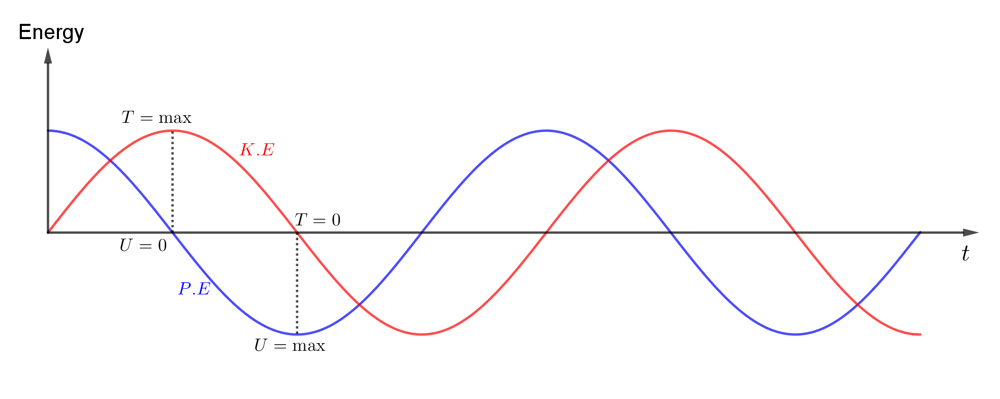

## Review

အပိုင်း (၁) နဲ့ (၂) မှာရိုးရှင်းတဲ့ spring-mass စနစ်တစ်ခုရဲ့ပြုမူပုံကိုဖော်ပြတဲ့ ညီမျှခြင်းကိုတွက်ချက်ခဲ့ပါတယ်။ အပိုင်း (၂) မှာ initial condition တွေအကြောင်းကိုပြောခဲ့ပါတယ်။ Simple spring-mass စနစ်ရဲ့ ယေဘူယျအကျဆုံးအဖြေကတော့−

$$
x(t)=A \cos \omega_0 t + B \sin \omega_0 t
$$

(သို့မဟုတ်)

$$
x(t)=a \cos (\omega_0 t + \Delta)
$$

အပေါ်ကညီမျှခြင်းနှစ်ခုလုံးက မှန်တဲ့ယေဘူကျအဖြေတွေဖြစ်ပါတယ်။ $ \omega_0 $ က natural frequency၊ $a $ က amplitude နဲ့ $\Delta $ က phase shift ဖြစ်ပါတယ်။ $A,B,a $ တို့ကို initial condition တွေကနေရှာရပါမယ်။ ဥပမာ $t=0 $ မှာရှိတဲ့ position $x_0 $ နဲ့ velocity $v_0 $ တို့ကိုသိရင် $x(t) $ ကိုရှာနိုင်ပါတယ်။ အခု $ x(t) $ ကို differentiate လုပ်ပြီး $v(t) $ ကိုရှာရအောင်။

$$
v(t)=-\omega_0 A \sin \omega_0 t + \omega_0 B \cos \omega_0 t
$$

$x(t) $ နဲ့ $v(t) $ ညီမျှခြင်းတွေကို $t=0 $ မှာဖြေရှင်းပြီး $\sin 0 = 0 $ နဲ့ $\cos 0 = 1 $ ကိုထည့်လိုက်ရင်−

$$
x(0)=x_0=A, v(0)=v_0=\omega_0 B
$$

ဒီတော့ $A=x_0 $ နဲ့ $B=\frac{v_0}{\omega \_0} $ ရမယ်။ $a $ နဲ့ $\Delta $ တန်ဖိုးတွေကိုလည်း အလားတူပဲရှာရပါမယ်။ ဒီကိန်းသေတန်ဖိုးတွေကိုသိရင် $x $ နဲ့ $v $ တို့ရဲ့ time အလိုက်ပြောင်းလဲမှုကို အပြည့်အစုံသိရပြီဖြစ်ပါတယ်။

## Energy in oscillation

အခု spring-mass စနစ်ရဲ့ oscillation ဖြစ်နေချိန်မှာရှိတဲ့ energy တွေကိုရှာကြည့်ရအောင်။ ပိုပြီ:ရှင်းလင်းအောင်−

$$
x(t)= a \cos (\omega_0 t + \Delta)
$$

$$
v(t)=-a \omega_0 \sin (\omega_0 t + \Delta)
$$

တို့ကိုသုံးပါမယ်။ ဒီစနစ်မှာ အလေးတုံးရွေ့လျားမှုက အရွေ့စွမ်းအင်နဲ့ စပရိန်က အတည်စွမ်းအင်တို့ရှိပါမယ်။ အရွေ့စွမ်းအင်က သိတဲ့အတိုင်း−

$$
T=\frac 12 mv^2
$$

$$
T=\frac 12 ma^2 \omega_0 ^2 \sin^2 (\omega_0 t + \Delta)
$$

$$
\omega_0 = \sqrt{\frac km}
$$

ကိုထည့်လိုက်ရင်−

$$
T=\frac 12 ka^2 \omega_0^2 \sin^2 (\omega_0 t+\Delta)
$$

အရွေ့စွမ်းအင်ကလည်း time အလိုက် oscillate ဖြစ်နေတာကို (အံ့သြဖွယ်မကောင်းစွာ) တွေ့ရပါတယ်။ စပရိန်ရဲ့ အတည်စွမ်းအင်က $\int kx \ dx = \frac 12 kx^2 $ ဖြစ်တာကြောင့်−

$$
U=\frac 12 k a^2 \cos^2 (\omega_0 t + \Delta)
$$

အလေးတုံး အမြင့်ဆုံးနေရာရောက်ရင် အရွေ့စွမ်းအင်သုညဖြစ်သွားပြီ: အတည်စွမ်းအင်ကအများဆုံးဖြစ်သွားပါမယ်။ စဉ်းစားကြည့်ရင် အရွေ့စွမ်းအင်နဲ့ အတည်စွမ်းအင်က တစ်လှည့်စီ နည်းလိုက်များလိုက်ဖြစ်နေပါတယ်။ ဒါပေမယ့် စွမ်းအင်စုစုပေါင်းက ကိန်းသေဖြစ်ရပါမယ်။

$$
T+U=\frac 12 ka^2 [\sin^2 (\omega_0 t+\Delta) + \cos^2 (\omega_0 t + \Delta)] = \frac 12 ka^2
$$

$k $ နဲ့ $a $ (maximum amplitude) က ကိန်းသေဖြစ်တဲ့အတွက် စွမ်းအင်စုစုပေါင်းက အမြဲတမ်းကိန်းသေဖြစ်ပါတယ်။

## Forced oscillations

Free oscillation ပြီးသွားတဲ့အခါ spring-mass စနစ်ပေါ်ကို ပြင်ပအားသက်ရောက်နေတဲ့ forced oscillation ကိုလေ့လာပါမယ်။

Equation of motion က−

$$
F=mx''
$$

$x'' $ က $x $ ကိုနှစ်ခါရှိတ်ထားတာကိုဆိုလိုပါတယ်။ ဒီနေရာမှာ time အလိုက်ရှိတ်ထားတာဖြစ်တဲ့အတွက် $\frac{d^2x}{dt^2} $ နဲ့အတူတူပါပဲ။ ဒါပေမယ့် $x'' $ ကစာရိုက်ရတာပိုသက်သာပါတယ်။

$$
x''=\frac 1m \left[ -kx+F(t) \right]
$$

Time အလိုက်ပြောင်းလဲနိုင်တဲ့ force function တွေကမျိုးစုံရှိနိုင်ပါတယ်။ ပထမဆုံးအနေနဲ့ ရိုးရှင်းတဲ့ function တစ်ခုဖြစ်တဲ့ oscillate ဖြစ်နေတဲ့ force ကိုပေးကြည့်ပါမယ်။

$$
F(t)=F_0 \cos \omega t
$$

$F_0 $ က force ရဲ့ maximum amplitude ဖြစ်ပြီး $\omega $ က force ရဲ့ frequency ဖြစ်ပါတယ်။ ($\omega_0 $ နဲ့ယေဘူယျအားဖြင့် မတူပါဘူး။) Force ရဲ့ frequency က စနစ်ရဲ့ဖွဲ့စည်းပုံပေါ်မတူတည်ပဲ ကိုယ်ပေးချင်တာပေးလို့ရပါတယ်။ $F(t) $ နဲ့ $\omega_0 $ တွေကိုအစားသွင်းလိုက်ရင် ဖြေရှင်းရမယ့်ညီမျှခြင်းက အောက်ကအတိုင်းဖြစ်ပါတယ်။

$$
x''=-\omega_0 ^2 x+ \frac{F_0}{m} \cos \omega t
$$

ဒီညီမျှခြင်းရဲ့အဖြေတစ်ခုက $x=C \cos \omega t $ လို့ခန့်မှန်းနိုင်ပါတယ်။ (Spring-mass က ပြင်ပသက်ရောက်အားအလိုက်လှုပ်ရှားမယ်လို့ ခန့်မှန်းတာပါ။) ဒီအဖြေကို စစ်ဆေးဖို့ $x $ ကိုနှစ်ခါရှိတ်ရပါမယ်။

$$
x'=-\omega C \sin \omega t
$$

$$
x''=-\omega^2 C \cos \omega t
$$

ကိန်းသေ C ကိုသာမှန်အောင်ရွေးချယ်နိုင်ရင် ဖြေရှင်းရမယ့် $x'' $ ညီမျှခြင်းနဲ့ ကိုက်ညီနိုင်ပါတယ်။ ဒီတော့ အခုရလဒ်ကို မူလညီမျှခြင်းနဲ့တူညီစေပြီ: C ကိုရှာပါမယ်။

$$
-\omega^2 C \cos \omega t=-\omega_0 ^2 C \cos \omega t+ \frac{F_0}{m} \cos \omega t 
$$

$$
\cos \omega t
$$

တွေကနှစ်ဖက်လုံးမှာပါတဲ့အတွက် သူတို့ကိုချေပြီ: C ကိုရှာလိုက်ရင်−

$$
C=\frac{F_0}{m(\omega_0^2 - \omega^2)}
$$

ကိုရပါမယ်။ ဒီကိန်းသေက $x(t) $ ရဲ့ maximum amplitude ပါပဲ။ အခုရတဲ့အဖြေက forced oscillation အတွက်ယေဘူယျအဖြေတော့မဟုတ်သေးပါဘူး။ Initial condition တွေမှန်ကန်မှသာဒီအဖြေကမှန်မှာဖြစ်ပြီ: တစ်ခြားအခြေအနေတွေမှာ ခဏအတွင်းသာဖြစ်တဲ့ မတည်ငြိမ်တဲ့တုန့်ပြန်မှုတစ်ခုရှိပါတယ်။ အခုအဖြေကို steady-state response လို့ခေါ်ပြီး ကျန်တဲ့အပိုင်းတစ်ခုကို transient response လို့ခေါ်ပါတယ်။ ယေဘူယျအဖြေကို နောက်ပိုင်းမှာဖော်ပြသွားပါမယ်။

အခုရတဲ့ forced oscillation အတွက် maximum amplitude (C) ညီမျှခြင်းကိုလေ့လာကြည့်ရင် $\omega_0 $ နဲ့ $\omega $ (နှစ်ထပ်ကိန်း) တို့ရဲ့ခြားနားချက်ပေါ်မူတည်တာကို တွေ့ရပါလိမ့်မယ် (F_0 ကိုအသေထားရင်)။ Forced frequency $\omega $ က အလွန်သေးငယ်ရင် $x $ နဲ့ $F $ က direction အတူတူပါပဲ။ ဒီလိုမဟုတ်ပဲ $\omega $ က $\omega_0 $ ထက်များနေမယ်ဆိုရင် $C $ က အနှုတ်ဖြစ်ပြီး $x $ နဲ့ $F $ က direction ဆန့်ကျင်ဘက်ဖြစ်ပါမယ်။ Frequency အရမ်းများရင်တော့ စားကိန်းက အရမ်းကြီးပြီ: amplitude နည်းနည်းလေးပဲရပါလိမ့်မယ်။

စိတ်ဝင်စားဖို့ကောင်းတဲ့နောက်တစ်ချက်က $\omega $ နဲ့ $\omega_0 $ နဲ့ထပ်တူနီးပါးတူညီတဲ့အခါ စားကိန်းက အရမ်းနည်းသွားပြီ: amplitude က အရမ်းများလာပါမယ်။ ဒီသဘောတရားက ကလေးစီးဒန်းကို လွှဲပေးဖူးတဲ့သူဆိုသိပါတယ်။ ဒန်းလွှဲတဲ့ပုံစံနဲ့ လူကအချိန်ကိုက် အားသက်ရောက်ပေးရင် သိပ်အားစိုက်စရာမလိုပဲ အများကြီ:လွှဲနိုင်ပါတယ်။ ဒီလိုမဟုတ်ပဲ မျက်စိမှိတ်ပြီး ကျပန်းလွှဲပေးရင်တော့ ဒန်းလွှဲပုံနဲ့မကိုက်ပဲ တွန်းရမယ့်နေရာဆွဲပြီး amplitude နည်းသွားပါတယ်။

$\omega $ နဲ့ $\omega_0 $ နဲ့လုံးဝတူညီရင်တော့ညီမျှခြင်းအရ amplitude က အနန္တဖြစ်သွားပါတယ်။ ဒါကတော့ လက်တွေ့မှာမဖြစ်နိုင်ပါဘူး။ Amplitude များလာရင် friction နဲ့ တစ်ခြား force တွေသက်ရောက်လာနိုင်ပါတယ်။ ဒါမှမဟုတ် စပရိန်ပြတ်ထွက်သွားနိုင်ပါတယ်။

> True knowledge is earned, not given.
>
> A.G. Riddle
