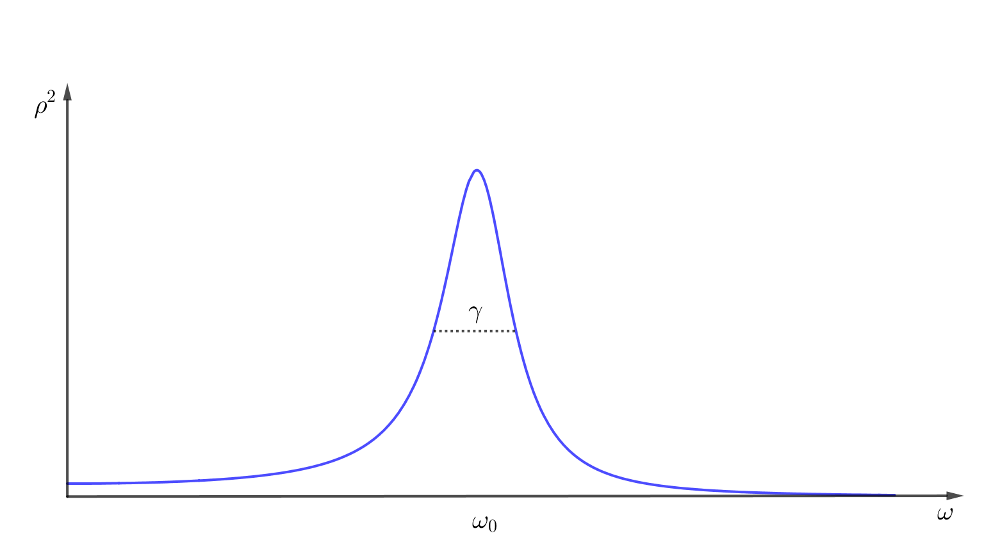

## Harmonic motion ကို complex number များဖြင့် ဖော်ပြခြင်း

Complex number တွေအကြောင်း article မှာ $ e^{i \omega} $ က $ 2\pi $ period ရှိတဲ့ periodic function ဖြစ်တဲ့အကြောင်းပြောခဲ့ပါတယ်။ ပြီ:တော့ Euler’s identity ဖြစ်တဲ့−

$$
 e^{ix} = \cos x + i \sin x
$$

ကိုလဲပြခဲ့ပါတယ်။ Complex number $ z=x+iy $ ရဲ့ polar form $ z=re^{i\theta} $ နဲ့ modulus $ |z|=r=\sqrt{x^2+y^2} $ တို့အကြောင်းကိုလည်းသိပြီးပါပြီ။ Harmonic motion/ oscillation တို့ဟာလည်း periodic function တွေကိုအသုံးချထားတာဖြစ်တဲ့အတွက် သူတို့တွေကိုတွက်ချက်ရာမှာ complex number တွေကိုသုံးပြီး ပိုပြီ:လွယ်ကူအောင်ဖန်တီးသွားမှာဖြစ်ပါတယ်။

Forced oscillation အပိုင်းမှာတုန်းက periodic force ကို $ F=F_0 \cos \omega t $ ဆိုပြီ: cosine function ကို $ F_0 $ နဲ့စကေးချဲ့ပြီးဖော်ပြခဲ့ပါတယ်။ အခုဒီ force ကိုနည်းနည်းဉာဏ်နီဉာဏ်နက်သုံးပြီ: complex number အနေနဲ့ရေးကြည့်ရအောင်။

$$
 F=F_0 e^{i\omega t}= F_0(\cos \omega t+i\sin \omega t)
$$

ဒီလိုရေးလိုက်ရင် F မှာ real part ဖြစ်တဲ့ $ \cos \omega t $ နဲ့ imaginary part ဖြစ်တဲ့ $ \sin \omega t $ တို့ပါဝင်လာပါပြီ။ ဒါပေမယ့်ကျွန်တော်တို့လိုချင်တာက $ \cos \omega t $ ပဲဖြစ်တဲ့အတွက် imaginary part ကိုလျစ်လျူရှုထားပါမယ်။ လက်တွေ့မှာလည်း $ F $ က real number တစ်ခုသာဖြစ်ပြီ: သင်္ချာသဘောတရားအရသာ complex number အနေနဲ့ရေးထားတာဖြစ်ပါတယ်။ ဒါဆိုရင်ဘာလို့ complex number နဲ့တမင်ရေးထားတာလဲဆိုတဲ့အဖြေကိုတော့ ခဏနေရင်သိရမှာဖြစ်ပါတယ်။

နောက် Force တစ်ခုအနေနဲ့ စောစောက Force ကိုပဲ အချိန်တစ်ခုရွှေ့ပြီ: phase shift လုပ်လိုက်ရင် $ F=F_0 \cos (\omega t-\Delta) $ ဆိုပြီ:ရပါတယ်။ ဆိုလိုတာကတော့ အခု Force က ပထမ Force ထက် phase $ \Delta=\omega t_0 $ နောက်ကျပါတယ်။ သူ့ကို complex form နဲ့ရေးရင် $ F=F_0e^{i(\omega t-\Delta)}=F_0 e^{i\omega t}. e^{-i\Delta} $ ရပါတယ်။ $ \hat{F}=F_0 e^{-i\Delta} $ လို့ထားရင်−

$$
 F=\hat{F} e^{i\omega t}
$$

ဖြစ်ပါမယ်။ $ \hat{F} $ ကလည်း $ F_0 $ လိုပဲမြှောက်ဖော်ကိန်းတစ်ခုဖြစ်ပြီး $ \hat{} $ နဲ့ရေးထားတာက complex number မှန်းသိအောင်ပါ။ နည်းနည်းတော့ရှုပ်သွားမလားမသိဘူး။ $ F_0 $ က force ရဲ့တကယ့် amplitude၊ $ \hat{F} $ က force ရဲ့ phase shift ကို ကိုယ်စားပြုတဲ့ complex number၊ $ F $ က force ကို ကိုယ်စားပြုတဲ့ complex number ဖြစ်ပါတယ်။

Forced oscillation ရဲ့ပြုမူပုံကိုဖော်ပြတဲ့ equation of motion က−

$$
 m\frac{d^2x}{dt^2}=-kx+F
$$ 
−−−(၁)

ဒီညီမျှခြင်းရဲ့အဖြေ $ x $ ကရှေ့တုန်းကပြောခဲ့သလို force ရဲ့ frequency နဲ့တူညီပြီး amplitude တစ်ခုရှိတယ်လို့ခန့်မှန်းကြည့်ပါမယ်။ ဒီတော့ $ x $ ကိုလည်းဒီနေရာမှာ complex number လို့ယူဆပါမယ်။ အပေါ်ကညီမျှခြင်းကို complex form တွေအစားသွင်းလိုက်ရင်−

$$
\frac{d^2(x_r+ix_i)}{dt^2}=-\frac 1m k (x_r+ix_i) + \frac 1m (F_r+iF_i)
$$

Real part နဲ့ imaginary part တွေခွဲထုတ်လိုက်ရင်−

$$
\frac{d^2x_r}{dt^2}+i\frac{d^2x_i}{dt^2}=-\frac{k x_r}{m}+\frac{F_r}{m}+i\left( -\frac{kx_i}{m} + \frac{F_i}{m} \right)
$$

Complex number နှစ်ခုတူညီတယ်ဆိုရင် real part အချင်းချင်း၊ imaginary part အချင်းချင်းတူညီပါတယ်။ ဒီတော့ အပေါ်ကညီမျှခြင်းရဲ့ ဘယ်ညာမှာရှိတဲ့ real part တွေက အရင်ကရှင်းခဲ့တဲ့ forced oscillation အတွက်ညီမျှခြင်းပုံစံပါပဲ။ ဒါပေမယ့် ဒီလိုမျိုး complex number တွေဘယ်ညာညှိလို့ရတာက complex number အချင်းချင်း linear combination လုပ်ထားတာအတွက်သာရတာဖြစ်ပါတယ်။ ဥပမာ $ (x_r-ix_i)^2 $ ဆိုရင် real part က $ x_r^2-x_i^2 $ ဖြစ်ပြီး imaginary part က $ -2x_rx_i $ ဖြစ်ပါတယ်။ ဒီတစ်ခါတော့ real part ရလဒ်ထဲမှာမူလ imaginary part ဖြစ်တဲ့ $ x_i $ ပါရောပါနေတာဖြစ်တယ်။ လောလောဆယ်ရှင်းနေတဲ့ ညီမျှခြင်းမှာပါတဲ့ imaginary part က ကိုယ့်ဘာသာဖန်တီးထားတာဖြစ်တဲ့အတွက် ဒီလိုမျိုးရောနေလို့မရပါဘူး။

Real part တွေပြန်ခွဲထုတ်လို့ရတာသိပြီဆိုရင် ရှင်းရမယ့်ညီမျှခြင်း(၁)ကို ပြန်ကြည့်ပါမယ်။ $ F $ နေရာမှာ $ \hat{F}e^{i\omega t} $ ကိုထည့်ပါမယ်။ (နောက်ဆုံးကျမှ real part ကိုခွဲထုတ်ယူမယ်ဆိုတာ သတိရပါ)

$$
\frac{d^2x}{dt^2}=-\frac{kx}{m}+\frac{\hat{F}e^{i\omega t}}{m}
$$

ဒီညီမျှခြင်းရဲ့အဖြေ $ x $ ကို $ F $ တုန်းကလိုပဲ $ \hat{x}e^{i\omega t} $ နဲ့ရေးကြည့်ပါမယ်။ $ \hat{x} $ ကထုံးစံအတိုင်းပဲ $ x $ ရဲ့ amplitude နဲ့ phase shift ကို ကိုယ်စားပြုပါတယ်။

$$
x=\hat{x}e^{i\omega t}
$$

ဒါဆို $ \frac{dx}{dt} $ ကရော။ Exponential function ရဲ့အသုံးဝင်မှုကဒီနေရာမှာ လာပါပြီ။ Exponential function ကိုရှိတ်ရင် သူ့ကိုပဲပြန်ရပါတယ်။ $ \hat{x}e^{i\omega t} $ ကို $ t $ နဲ့ရှိတ်ရင် $ i\omega \hat{x} e^{i\omega t} $ ရပါတယ် ($ \hat{x} $ က time ပေါ်ကိုမမှီခိုတဲ့ ကိန်းသေဖြစ်)။ ဒီတော့ $ \hat{x}e^{i\omega t} $ ကိုရှိတ်တိုင်း $ i\omega $ နဲ့မြှောက်သွားရုံပါပဲ။

$$
\hat{x} (i\omega )^2 e^{i\omega t}=-\frac{k}{m} \hat{x} e^{i\omega t}+\frac{\hat{F}}{m} e^{i\omega t}
$$

$$
e -m \hat{x} \omega ^2 =-k \hat{x} +\hat{F} 
$$

နောက်ဆုံးညီမျှခြင်းမှာ နှစ်ဖက်လုံးကို $ m $ နဲ့မြှောက်ပြီး $ e^{i\omega t} $ နဲ့စားလိုက်တာဖြစ်ပါတယ်။ အခုကျန်တာက algebric equation ထဲက $ \hat{x} $ ကိုရှင်းလိုက်ရုံပါပဲ။

$$
\hat{x}=\frac{\hat{F}}{k-m\omega^2}
$$

$$
\omega_0^2=\frac{k}{m}
$$
ကိုအစားသွင်းလိုက်ရင်−

$$
\hat{x}=\frac{\hat{F}}{m(\omega_0^2-\omega^2)}
$$

ရပါတယ်။ ဒီတော့ $ \hat{x} $ နဲ့ $ \hat{F} $ ကိုချိတ်ဆက်ထားတဲ့ မြှောက်ဖော်ကိန်းကိုရပါပြီ။ ဒီအဖြေကရှေ့အပိုင်းမှာတုန်းက differential equation ကိုဖြေရှင်းလို့ရတဲ့အဖြေနဲ့ အတူတူပဲဆိုတာတွေ့နိုင်ပါတယ်။ $ \hat{x} $ နဲ့ $ \hat{F} $ ရဲ့ phase angle ကအတူတူ (in phase) ပါပဲ။ ဒါမှမဟုတ် $ \omega $ က $ \omega_0 $ ထက်ကြီးရင်တော့ 180˚out of phase ဖြစ်ပါမယ်။ အရှေ့မှာပြောခဲ့သလိုပဲ $ \omega $ က $ \omega_0 $ နဲ့တူရင် $ \hat{x} $ က အနန္တတန်ဖိုးကိုချဉ်းကပ်သွားပါတယ်။ ဒီလိုဖြစ်တာကို လှိုင်းပြန်ထပ်ခြင်း (resonance) လို့ခေါ်ပါတယ်။

ဒီပုစ္ဆာက နည်းနည်းလွယ်သေးတဲ့အတွက် complex exponential နည်းရဲ့ ထိရောက်မှုကသိပ်မသိသာသေးပါဘူး။ ဒီ့ထက်ပိုရှုပ်တဲ့အခြေအနေတွေမှာမှ ထိုနည်းလမ်းရဲ့အသုံးဝင်ပုံကို သိသာနိုင်ပါတယ်။

## ဖီဆန်အားရှိသောလွှဲခြင်းများ (Damped oscillations)

Forced oscillation ရဲ့အဖြေအရ force ရဲ့ frequency $ \omega $ က natural frequency $ \omega_0 $ နဲ့တူညီရင် လွှဲကျယ်ကအနန္တဖြစ်သွားပါတယ်။ ဒါပေမယ့်လက်တွေ့မှာ ဒါကမဖြစ်နိုင်ပါဘူး။ တွက်လာတဲ့ထဲမှာ ရွေ့လျားမှုကိုဆန့်ကျင်တဲ့ ပွတ်မှုအား (friction) လိုမျိုး အားတွေကိုလျစ်လျူရှုထားခဲ့ပါတယ်။ လက်တွေ့မှာ friction ရှိတာကြောင့် ဒီ force ကိုထည့်တွက်မှပိုသဘာဝကျပါမယ်။ ဒါပေမယ့် frictional force က ဝတ္ထုရဲ့ဂုဏ်သတ္တိ၊ မျက်နှာပြင်အနေအထား စတဲ့အခြင်းအရာတွေပေါ် မူတည်နေတာကြောင့် သူ့ရဲ့တန်ဖိုးကိုတွက်ထုတ်ဖို့က ခက်ခဲပါတယ်။ သို့ပေမယ့် ပွတ်မှုအားက ဝတ္ထုရဲ့အလျင်နဲ့ တိုက်ရိုက်အချိုးကျတဲ့ နေရာတွေလဲရှိပါတယ်။ ဥပမာ ရေထဲမှာအလျင်နှေးနှေးနဲ့ရွေ့နေတဲ့ဝတ္ထုတစ်ခုလိုမျိုးပေါ့။ လုံးဝရပ်နေရင် ပွတ်မှုအားမရှိပဲ အလျင်မြန်လာတာနဲ့ ဆန့်ကျင်အားကလဲ များလာပါတယ်။ ဒါကြောင့် forced oscillation ညီမျှခြင်းမှာ friction ကို velocity နဲ့တိုက်ရိုက်အချိုးချပြီး $ F_f=-c\frac{dx}{dt} $ ကိုထည့်တွက်ပါမယ်။

$$
m\frac{d^2x}{dt^2}=-kx-c\frac{dx}{dt}+F
$$

ဒီနေရာမှာ ကိန်းသေ c ကိုမသုံးပဲ $ \gamma=\frac{c}{m} $ နဲ့တွက်ရင် ပိုရှင်းပါလိမ့်မယ်။

$$
c=\gamma m
$$ 
နဲ့ $ k=m\omega_0 ^2 $ ကိုထည့်လိုက်ရင်−

$$
 \frac{d^2x}{dt^2}=-x\omega_0^2-\gamma \frac{dx}{dt}+\frac{F}{m}
$$

ဒီညီမျှခြင်းက forced damped oscillation ရဲ့အပြုအမူကိုဖော်ပြတဲ့ညီမျှခြင်းပဲဖြစ်ပါတယ်။ ပြင်ပသက်ရောက်အား $ F=F_0 \cos (\omega t + \Delta) $ ကိုထည့်ပြီး ဒီညီမျှခြင်းကိုဖြေရှင်းပါမယ်။ Complex method နဲ့ရှင်းဖို့ $ F $ နေရာမှာ $ \hat{F}e^{i\omega t} $ ကိုထည့်ပြီ: $ x $ နေရာမှာ $ \hat{x}e^{i\omega t} $ ကိုထည့်ပါမယ်။ အရှေ့ကအတွေ့အကြုံအရ အစားသွင်းစရာတောင်မလိုပဲ ကြည့်လိုက်တာနဲ့တင် ညီမျှခြင်းကိုဖြေရှင်းလို့ရပါတယ်။

$$
 \hat{x}(i\omega)^2 e^{i\omega t}=-\hat{x}\omega_0^2 e^{i\omega t}-\gamma i\omega \hat{x}e^{i\omega t}+\frac{\hat{F}}{m}e^{i\omega t}
$$

နှစ်ဖက်လုံးကို $ e^{i\omega t} $ နဲ့စားလိုက်ရင်−

$$
 -\omega^2 \hat{x}=-\hat{x}\omega_0 ^2-\gamma i\omega \hat{x}+\frac{\hat{F}}{m}
$$

$$
 \hat{x}=\frac{\hat{F}}{m(\omega_0^2-\omega^2+i\gamma \omega)}
$$

ဒါဆိုရင် $ \hat{x} $ နဲ့ $ \hat{F} $ ဆက်သွယ်ချက်ရပါပြီ။ မြှောက်ဖော်ကိန်းကို $ R $ လို့ခေါ်လိုက်ရင်−

$$
 R=\frac{1}{m(\omega_0^2-\omega^2+i\gamma \omega)} 
$$

$$
 \hat{x}=\hat{F}R 
$$

Forced, undamped oscillation နဲ့ယှဉ်ရင် ပိုလာတဲ့စားကိန်းက $ i\gamma \omega $ ပဲဖြစ်ပါတယ်။ $ \gamma $ များလာရင်(တစ်နည်း $ c $ များလာရင်) လွှဲကျယ်နည်းပါမယ်။ ဒါပေမယ့် R က complex number ဖြစ်နေတဲ့အတွက် $ \hat{x} $ ရဲ့ phase က $ \hat{F} $ ရဲ့ phase နဲ့မတူတော့ပါဘူး။ အစမှာတုန်းက $ x $ နဲ့ F ရဲ့ဆက်သွယ်ချက်ကို real part ပဲယူမယ်လို့ သဘောတူထားခဲ့ပါတယ်။ R ကို $ x+iy $ ဒါမှမဟုတ် $ \rho e^{i\theta} $ ပုံစံနဲ့ရေးလို့ရပါတယ်။ $ \rho e^{i\theta} $ ပုံစံနဲ့ရေးရင်ဘယ်လိုဖြစ်မလဲကြည့်ရအောင်။

$$
 \hat{x}=F_0 e^{i\Delta} \rho e^{i\theta}=F_0 \rho e^{i(\theta +\Delta)}
$$

ရှာချင်တဲ့ displacement $ x $ က $ x=\hat{x} e^{i\omega t} $ ဖြစ်တဲ့အတွက်−

$$
 x=\rho F_0 e^{i(\theta + \Delta + \omega t)}
$$

ဖြစ်ပါမယ်။ Real part ကိုပဲယူမယ်ဆိုရင်−

$$
 x=\rho F_0 cos(\theta + \Delta + \omega t)
$$

ရပါတယ်။ ဒါဆိုရင် $ x $ ရဲ့ လွှဲကျယ်က $ \rho F_0 $ ဖြစ်ပြီ: force နဲ့ယှဉ်ရင် $ \theta $ phase shift ဖြစ်သွားပါတယ်။

အခု $ \rho $ ရဲ့တန်ဖိုးကိုရှာကြည့်ဖို့အတွက် $ R $ ကိုပြန်ကြည့်ပါ။

$$
 R=\rho e^{i\theta}=\frac{1}{m(\omega_0^2-\omega^2+i\gamma \omega)} 
$$

$ R $ က complex number ဖြစ်ပြီ: သူ့ရဲ့ ပကတိတန်ဖိုးနှစ်ထပ်ကိန်းက complex conjugate နဲ့မြှောက်တာနဲ့တူညီပါတယ်။

$$
 |R|^2 = \rho^2 =\frac{1}{m(\omega_0^2-\omega^2+i\gamma \omega)}  \times \frac{1}{m(\omega_0^2-\omega^2-i\gamma \omega)}
$$

$$
 \rho^2=\frac{1}{m^2 [\omega_0^2 - \omega^2)^2 - (i\gamma \omega)^2 ]}
$$

$$
 \rho^2=\frac{1}{m^2[(\omega_0^2 - \omega^2)^2 + \gamma^2 \omega^2]}
$$

Phase angle $ \theta $ ကိုရှာဖို့ $ R $ ကိုတိုက်ရိုက်မသုံးပဲ $ \frac 1R $ ကိုသုံးပြီးရှာရင်ပိုလွယ်ပါတယ်။

$$
 \frac 1R=S=\frac 1\rho e^{-i\theta}=\omega_0^2-\omega^2+i\gamma \omega
$$

$$
 \tan(-\theta)=-\tan \theta = \frac{\text{Im}(S)}{\text{Re}(S)}=\frac{\gamma \omega}{\omega_0^2 - \omega^2}
$$

$$
 \tan \theta = -\frac{\gamma \omega}{\omega_0^2 - \omega^2}  
$$

ကိုရပါမယ်။

အောက်ကပုံမှာ $ \rho^2 $ က $ \omega $ ကိုလိုက်ပြီး ပြောင်းလဲပုံကိုဂရပ်ဆွဲပြထားပါတယ်။ ဒီလိုပုံမျိုးကို resonance curve လို့ခေါ်ပါတယ်။ $ \rho^2 $ က လွှဲကျယ်နှစ်ထပ်ကိန်းနဲ့အချိုးကျပြီး oscillator ရဲ့ energy နဲ့လည်းအချိုးကျတဲ့အတွက် $ \rho $ ထက်စာရင်ပိုစိတ်ဝင်စားဖို့ကောင်းပါတယ်။

Damping ရှိနေတဲ့အတွက် $ \omega=\omega_0 $ အခြေအနေမှာ လွှဲကျယ်ကအနန္တဖြစ်မသွားပဲ $ \gamma $ တန်ဖိုးအနည်းအများပေါ်မူတည်ပြီ: မြင့်တက်သွားပါတယ်။ တကယ်လို့ $ \gamma $ တန်ဖိုးက $ \omega_0 $ တန်ဖိုးထက်အများကြီးငယ်ရင် resonance curve ရဲ့အမြင့်ဆုံးတန်ဖိုးရဲ့တစ်ဝက်မှာရှိတဲ့ curve ရဲ့အကျယ် $ \Delta \omega $ က $ \gamma $ ရဲ့တန်ဖိုးနဲ့တူညီပါတယ် (ပုံတွင်ကြည့်)။ Friction နည်းလို့ $ \gamma $ တန်ဖိုးနည်းလာတာနဲ့ curve က ပိုပိုချွန်လာပြီး resonance ကများလာပါတယ်။ အောက်မှာ $ \gamma $ တန်ဖိုးကို အပြောင်းအလဲလုပ်ပြီး resonance အနည်းအများပြောင်းလဲပုံကို လေ့လာနိုင်ပါတယ်။ 

<Iframe title="Damped oscillation" src="https://www.geogebra.org/material/iframe/id/FYJBvqtz/width/1422/height/672/border/888888/smb/false/stb/false/stbh/false/ai/false/asb/false/sri/false/rc/false/ld/false/sdz/false/ctl/false"></Iframe>

> Will I always, will you always see the truth when it stares you in the face?
>
> ~Sharon den Adel, Robert Westerholt, Martijn Spiereburg
