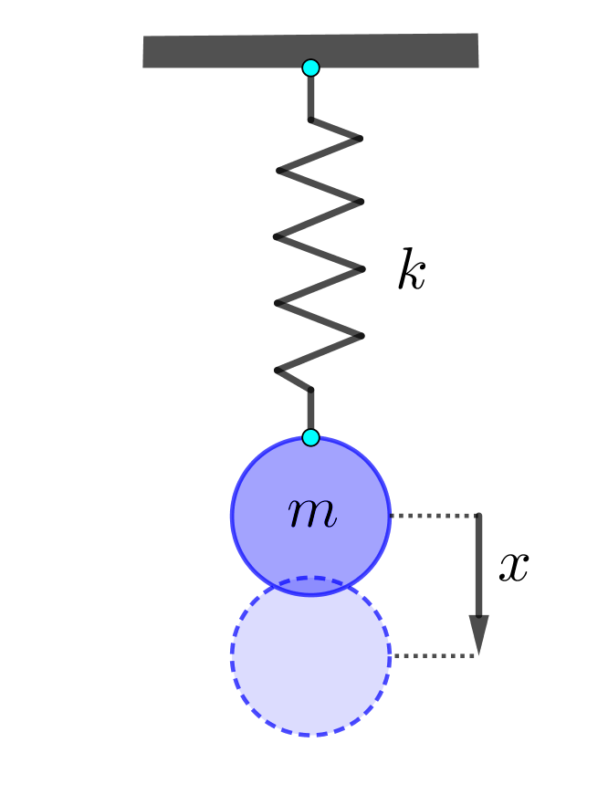

## Introduction - Linear differential equations များ

Physic ကို လေ့လာတဲ့အခါ မတူညီတဲ့နယ်ပယ်တွေ အများကြီးရှိပါတယ်။ နယ်ပယ်တစ်ချို့ကို ဥပမာပေးရရင် မက်ကင်းနစ်၊ အပူ၊ အသံ၊ အလင်း၊ လျှပ်စစ်၊ သံလိုက် စသဖြင့် အများကြီးရှိပါတယ်။ ဒါပေမယ့် ဒီနယ်ပယ်တွေထဲမှာရှိတဲ့ သဘောတရားတွေ၊ ပြုမူချက်တွေက တစ်ခုနဲ့ တစ်ခု ဆင်တူနေတာကို တွေ့ရပါတယ်။ ဥပမာ အလင်းလှိုင်းတွေပျံ့နှံ့တဲ့ ဥပဒေသက အသံလှိုင်းတွေ ပျံ့နှံ့တဲ့ ဥပဒေသနဲ့ ဆင်တူပါတယ်။ ဒါကလည်း သဘာဝရဲ့ ဆန်းကြယ်တဲ့ အရာတစ်ခုပါ။ အဲ့ဒါကြောင့် နယ်ပယ်တစ်ခုကို အသေးစိတ်လေ့လာလိုက်ရင် အဲ့ဒီ့ကရတဲ့ အသိပညာက နောက်နယ်ပယ်တွေမှာပါ အသုံးဝင်ပါတယ်။

စည်းချက်ကျ လှိုင်းထုတ်ကိရိယာတစ်ခုရဲ့ ပြုမူပုံကို သင်္ချာ equation နဲ့ ရေးတဲ့အခါ linear differential equation ပုံစံ ရပါတယ်။ ဒီပုံစံတစ်ခုကို ဥပမာရေးပြရမယ်ဆိုရင် $ a_2 \frac{d^2x}{dt^2}+a_1\frac{dx}{dt}+a_0x=f(t) $    ဖြစ်ပါတယ်။ ဒီညီမျှခြင်းမှာ $ a_2, a_1, a_0 $ တွေက ကိန်းသေတွေဖြစ်ပါတယ်။ $ \frac{d^2x}{dt^2} $  ဆိုတာကတော့ x ကို t နဲ့ နှစ်ခါရှိတ် (differentiate) လုပ်ထားတာပဲဖြစ်ပါတယ်။ ဒီညီမျှခြင်းမှာ နှစ်ခါရှိတ်ထားတာက အများဆုံးဖြစ်တဲ့အတွက် သူ့ကို second order linear differential equation လို့ ခေါ်ပါတယ်။ သုံးခါ၊ လေးခါရှိတ်ထားတဲ့ higher order equation တွေလည်း ဒီပုံစံအတိုင်းပဲရှိပါတယ်။ ဒီညီမျှခြင်းပုံစံဟာ အခုစည်းချက်ကျကိရိယာမှာသာမက လျှပ်စစ်ပတ်လမ်းတစ်ခုမှာ လျှပ်စစ် charge တစ်ခုရဲ့တုန်ခါမှု၊ အသံညှိခက်ရင်းခွတစ်ချောင်းရဲ့ တုန်ခါမှု၊ အက်တမ်တစ်ခုအတွင်းမှာရှိတဲ့ အီလက်ထရွန်လေးတွေရဲ့ တုန်ခါမှု၊ ဓာတုဗေဒ ဓာတ်ပြုမှုတစ်ခုအတွင်းက ဖြစ်ပျက်မှုတွေ၊ အစားအစာထဲမှာ ဘက်တီးရီးယားတွေ ပေါက်ဖွားမှု၊ မြက်ကိုစားတဲ့ ယုန်ကို မြေခွေးက စားတာ၊ အစရှိတဲ့အရာတွေမှာပါ တွေ့ရပါတယ်။ ဒီလို အသုံးဝင်တဲ့ linear differential equation ကို အခု စည်းချက်ကျ ကိရိယာမှာ လေ့လာမှာဖြစ်ပါတယ်။ (LDE တစ်ခုဖြစ်ဖို့ ဘယ်လိုဂုဏ်သတ္တိတွေ ပါဝင်ရမလဲဆိုတာ နောက်မှာဖော်ပြပါမယ်။)

စည်းချက်ကျ ကိရိယာတစ်ခုတည်ဆောက်ပုံက ရိုးရှင်းပါတယ်။ စပရိန်တစ်ခုရယ် အလေးတုံး (mass) တစ်ခုရယ်ပဲ လိုပါတယ်။ အလေးတုံးကို အောက်ကို ဆွဲလိုက်ရင် ဘာဖြစ်မလဲဆိုတာ စဉ်းစားရုံနဲ့ သိနိုင်ပါတယ်။ အလေးတုံးအောက်ရောက်သွားရင် စပရိန်က ပြန်ဆွဲမယ်၊ အလယ်ပြန်ရောက်ရင် အလေးတုံးမှာ အရှိန်ပါတဲ့အတွက် အပေါ်ကို ကျော်တက်သွားပြီး စပရိန်ကို ဖိမိမယ်။ စပရိန်က ပြန်တွန်းတဲ့အခါ အလေးတုံးက အောက်ကို ပြန်ကျမယ်။ ဒီလိုနဲ့ စည်းချက်ကျ တက်လိုက်ကျလိုက် ဖြစ်နေမှာဖြစ်ပါတယ်။

တက်လိုက်ကျလိုက် ဖြစ်တာတော့ ဟုတ်ပြီ။ ဘယ်လောက်အထိ အများဆုံး တက်၊ကျမှာလဲ၊ ဘယ်အချိန်မှာ အလျင်ဘယ်လောက်နဲ့ တက်၊ဆင်းမှာလဲဆိုတာ သင်္ချာညီမျှခြင်းနဲ့ လေ့လာကြည့်ပါမယ်။ အရင်ဆုံး ဒီကိရိယာမှာပါတဲ့ ပစ္စည်းတွေကို ကြည့်ရအောင်။ စပရိန်တစ်ခုရဲ့ ဂုဏ်သတ္တိက သူ့ရဲ့ စပရိန်ကိန်းသေ (k) ပေါ်မှာ မူတည်ပါတယ်။ စပရိန်ကို ဆွဲဆန့်လိုက်တဲ့အခါ k များတဲ့ စပရိန်က အားများများနဲ့ပြန်ဆွဲမယ်၊ k နည်းတဲ့ စပရိန်က အားနည်းနည်းနဲ့ပဲ ပြန်ဆွဲပါမယ်။ အလေးတုံးရဲ့ အရေးပါတဲ့ ဂုဏ်သတ္တိကတော့ သူ့ရဲ့ဒြပ်ထု (mass = m) ပဲ ဖြစ်တယ်။

အလေးတုံးရဲ့ရွေ့လျားမှုကိုလေ့လာဖို့အတွက် နယူတန်ရဲ့ မက်ကင်းနစ်ဥပဒေသတွေကို အသုံးပြုရအောင်။ နယူတန်ဒုတိယနိယာမအရ Force က rate of change of momentum (သို့) acceleration နဲ့တူညီပါတယ်။

$$ 
\vec F=m \frac{d\vec v}{d t} 
$$

အလေးတုံးပေါ်ကို သက်ရောက်နေတဲ့အားတွေက မြေဆွဲအားနဲ့ စပရိန်ဆွဲအားဖြစ်ပါတယ်။ မြေဆွဲအားက အချိန်တိုင်းကိန်းသေသက်ရောက်နေပြီး စပရိန်ကဆန့်ကျင်ဘက်ကိုဆွဲထားတဲ့အတွက် မူလအခြေအနေမှာ မျှခြေဖြစ်နေပါမယ်။

ပုံမှာပြထားတဲ့အတိုင်း အလေးတုန်းရဲ့မူလနေရာက $ x=0 $ ဖြစ်ပြီး မြှားခေါင်းဦးတည်ရာက $ x $ အပေါင်းဖြစ်ပါတယ်။ စပရိန်က အလေးတုန်းရွေ့လျားမှုရဲ့ဆန့်ကျင်ဘက်ကို ဆွဲတာဖြစ်တဲ့အတွက် $ +x $ မှာစပရိန်ဆွဲအား $ F $ ကအနှုတ်ဖြစ်ပါမယ်။ စပရိန်ဆွဲအားကို Hooke's law အရ $ F=-kx $ နဲ့ဖော်ပြပြီး $ k $ က spring constant ဖြစ်ပါတယ်။ ဒီတော့−

$$
-k \vec x=m\frac{d\vec v}{dt}=m\frac{d^2 \vec x}{dt^2}
$$

$$ 
\frac{d^2 \vec x}{dt^2}=-\frac{k}{m} \vec x \ \ \text{(1)}
$$

ပိုပြီးရှင်းလင်းအောင် လောလောဆယ် constant factor တစ်ခုဖြစ်တဲ့ $ \frac{k}{m} $ ကို 1 လို့ ယူဆရအောင်။ ပြီ:မှဒီ factor ကိုပြန်ထည့်ပါမယ်။

$$ 
\frac{d^2 \vec x}{dt^2}=- \vec x   \ \ \text{(2)}
$$

အပေါ်ကညီမျှခြင်းကို လေ့လာကြည့်ပါ။ ညီမျှခြင်းရဲ့ဘယ်ဘက်မှာ $ x $ ကို $ t $ နဲ့နှစ်ခါရှိတ်ထားပြီ: ညာဘက်မှာ $ -x $ ကိုရပါတယ်။ ဒီညီမျှခြင်းကိုဖြေရှင်းဖို့ $ x $ ရဲ့ $ t $ အလိုက်ပြောင်းလဲမှုကို ရှာရပါမယ်။ သိသာတဲ့အဖြေတစ်ခုကတော့ $ x=0 $ ပါပဲ။ ဒါပေမယ့် $ x=0 $ ဆိုရင် အလေးတုန်းကဘယ်မှမရွေ့ပဲ မျှခြေမှာပဲရပ်နေမှာဖြစ်တဲ့အတွက် ပျင်းစရာကောင်းပါတယ်။ တစ်ခြားအဖြေတစ်ခုကိုတော့ [အရင်တုန်းက](http://theinlinaung.com/newtons_laws_of_motion-2/) [numerical နည်းလမ်း](http://theinlinaung.com/newtons_laws_of_motion-2/)နဲ့ ရှာခဲ့ပါတယ်။ Analytical နည်းလမ်းနဲ့ရှာမယ်ဆိုရင်တော့ သူ့ကိုနှစ်ခါရှိတ်ရင် negative သူပဲပြန်ရတဲ့ function တစ်ခုကိုရှာရပါမယ်။ ဒီ function ကတော့ cosine function ဖြစ်တာကို တွေ့ရပါလိမ့်မယ်။

$$ 
x=\cos t 
$$

$$ 
\frac{dx}{dt}=-\sin t 
$$

$$ 
\frac{d^2x}{dt^2}=-\cos t=-x 
$$

ဒီတော့ cosine function ရဲ့ပုံစံအတိုင်း $ x $ ကအပေါင်းအနှုတ် တစ်လှည့်စီ oscillate ဖြစ်နေမှာဖြစ်ပါတယ်။ အခု စောစောကဖျောက်ထားတဲ့ $ \frac km $ factor ကိုပြန်ထည့်ပြီး ညီမျှခြင်း (၁) ကိုဖြေရှင်းဖို့ကြိုးစားကြည့်ရအောင်။

Reference: Feynman Lectures on Physics, Volume I

> If you want to find the secrets of the universe, think in terms of energy, frequency and vibration.
> 
> ~Nikola Tesla
