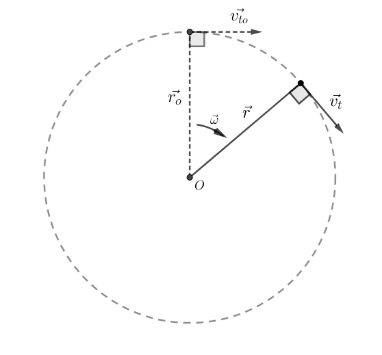
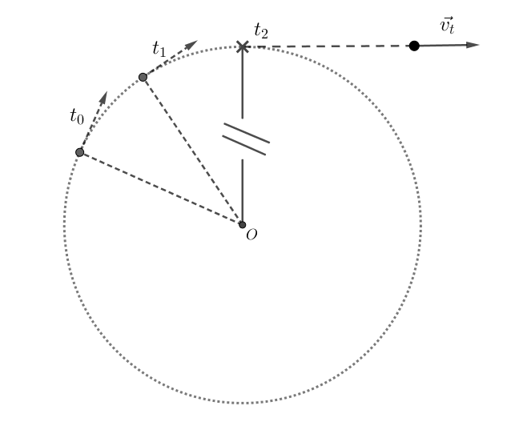
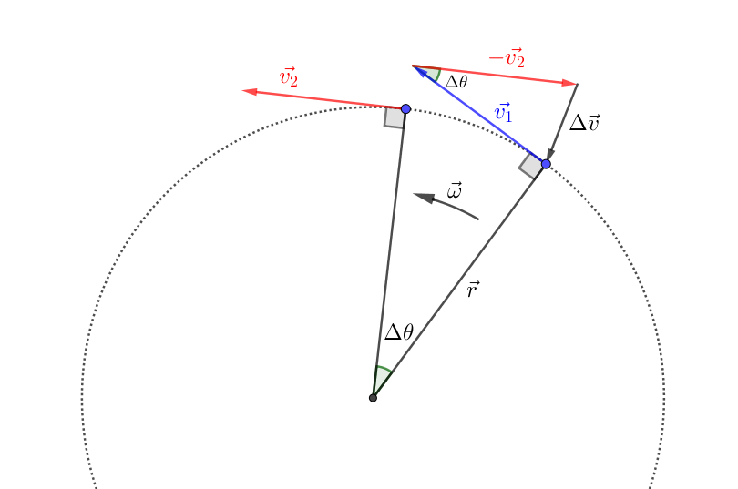
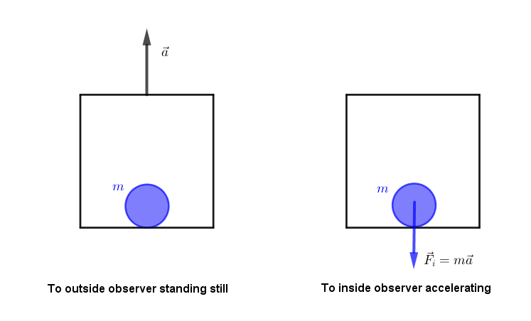
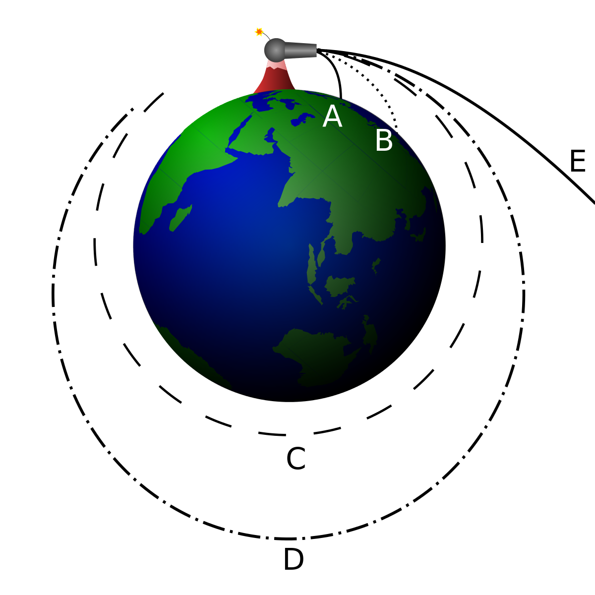

## ဗဟိုချဉ်းရှိန် (centripetal force)

အင်နားရှားသဘောတရားအရ အရာဝတ္ထုတစ်ခုဟာ သူရွေ့လျားနေတဲ့အလျင်နဲ့ ဦးတည်ရာအတိုင်း ဆက်ရွေ့လျားလိုပါတယ်။ အမှတ်တစ်ခုကို ဗဟိုထားပြီး ကိန်းသေလည်ပတ်နှုန်းနဲ့ စက်ဝိုင်းပုံရွေ့လျားနေတဲ့ ဝတ္ထုတစ်ခုမှာလည်း အချိန်တစ်ခုမှာ tangential velocity လို့ခေါ်တဲ့ အချင်းဝက်ဗက်တာကို ထောင့်မှန်ကျတဲ့အလျင်တစ်ခုရှိပါတယ်။

$$
\vec{v_t}=\vec{r} \times \vec{\omega}
$$

ကျောက်တုံးတစ်တုံးကို ကြိုးချည်ပြီးစက်ဝိုင်းပုံလှည့်မယ်ဆိုပါတော့။ တကယ်လို့ ကြိုးပြတ်သွားရင် ကျောက်တုံးက ပတ်လမ်းစက်ဝိုင်းအတိုင်း ဆက်ပတ်နေမှာမဟုတ်ပဲ ပြတ်တဲ့အချိန်မှာရှိတဲ့ tangential velocity ဦးတည်ရာမျည်းဖြောင့်လမ်းကြောင်းအတိုင်း ပြေးထွက်သွားမှာဖြစ်ပါတယ်။

Tangential velocity ရဲ့ ဦးတည်ရာမျည်းဖြောင့်အတိုင်း ရွေ့လျားလိုတဲ့ ဝတ္ထုရဲ့အင်နားရှားကို လွန်ဆန်ပြီး ဗဟိုကိုပတ်နေဖို့အတွက် ဝတ္ထုမှာ ဗဟိုကိုအမြဲတမ်းဆွဲသွင်းနေတဲ့ အား (force) တစ်ခုလိုအပ်ပါတယ်။ ကျောက်တုံးဥပမာမှာ ဒီအားကို ကြိုးရဲ့တင်းအား (tension) ကပေးပါတယ်။ ကြိုးက ကျောက်တုံးကို အပြင်ဘက်လွင့်ထွက်မသွားအောင် တင်းအားနဲ့ ပြန်ဆွဲထားပေးပါတယ်။ ကားတစ်စီး ကွေ့တဲ့အချိန်မှာလည်း ကားတာရာတွေနဲ့ ကားလမ်းကြားက ပွတ်မှုအားက ကားကို မျည်းကွေးပုံသွားအောင် တွန်းပို့ပေးပါတယ်။ ဒီလို ဗဟိုဘက်ကို တွန်းပို့တဲ့အားကို ဗဟိုချင်းအား (centripetal force) လို့ခေါ်ပါတယ်။ အပေါ်က ပုံတွေအရလည်း ဝတ္ထုရဲ့ tangential velocity $ \vec{v_t} $ က ပမာဏမပြောင်းလဲပေမယ့် ဦးတည်ရာက အချိန်တိုင်းပြောင်းလဲနေတဲ့အတွက် velocity vector ပြောင်းလဲတာကြောင့် အရှိန် (acceleration) တစ်ခု ဖြစ်ပေါ်လာပါတယ်။ ဝတ္ထုကို ဗဟိုဘက်ဆွဲသွင်းစေတဲ့အတွက် ဒီအရှိန်ကို ဗဟိုချင်းရှိန် (centripetal acceleration) လို့ခေါ်ပါတယ်။ နယူတန်ဒုတိယနိယာမအရ အရှိန်ရှိရင် အားလည်းရှိပြီး ဗဟိုချင်းရှိန်ကိုဖြစ်စေတဲ့ အားကတော့ ဗဟိုချင်းအားပဲဖြစ်ပါတယ်။ ဗဟိုချင်းအားနဲ့ ဗဟိုချင်းရှိန် ဗက်တာတွေရဲ့ ဦးတည်ရာက စက်ဝိုင်းပတ်လမ်းရဲ့ အချင်းဝက်လမ်းကြောင်း (radial direction) အတိုင်း ဗဟိုဘက်ကိုဦးတည်ပြီး ရှိပါတယ်။

အခု ဗဟိုချင်းရှိန်နဲ့ ဗဟိုချင်းအားတို့ကို သင်္ချာနည်းနဲ့ရှာကြည့်ရအောင်။ ဗဟိုချင်းရှိန်ကိုရှာဖို့ အလျင်ပြောင်းလဲနှုန်းကို ရှာရပါမယ်။ ဗဟိုကို ကိန်းသေလည်နှုန်းနဲ့ ပတ်ပြီးလည်နေတဲ့ဝတ္ထုတစ်ခုအတွက် tangential velocity ဗက်တာပြောင်းလဲနှုန်းကို ရှာပါမယ်။ အချိန်ပိုင်း $ \Delta t $ မှာ ဝတ္ထုကထောင့် $ \Delta \theta $ ရွေ့သွားပါမယ်။ အချိန် $ t_1 $ မှာ tangential velocity $ \vec{v_1} $ ရှိပြီး အချိန် $ t_2 $ မှာ $ \vec{v_2} $ ရှိပါမယ်။ $ \vec{v_1} $ နဲ့ $ \vec{v_2} $ က ပမာဏအတူတူဖြစ်ပြီး ဦးတည်ရာပဲကွဲပါတယ်။ $ v_1 = v_2 = v_t $ အောက်ကပုံကို ကြည့်ပါ။

Velocity နှစ်ခုခြားနားချက် $ \Delta \vec{v} $ ကိုလိုချင်ရင် $ \vec{v_1} $ ထဲက $ \vec{v_2} $ ကို နှုတ်ပါမယ်။ ဒါကြောင့် ဗက်တာနည်းအရ $ \vec{v_2} $ ကို ဦးတည်ရာပြောင်းပြန်လှည့်လိုက်ပြီး $ \vec{v_1} $ နဲ့ $ -\vec{v_2} $ ကို ပေါင်းပါမယ်။ ဒါဆို acceleration က−

$$
a_c=\lim_{\Delta t \to 0} \dfrac{\Delta v}{\Delta t}
$$

$ \Delta \theta \text{ က သေးသေးလေးဆိုရင် } \Delta v \text{ ရဲ့ပမာဏကို } v_1 \times \Delta \theta \text{ နဲ့ယူလို့ရပါတယ်။} $

$$
\Delta v = v_t \Delta \theta
$$

$$
a_c=\dfrac{\Delta v}{\Delta t}= v_t \dfrac{\Delta \theta}{dt}=v_t.\omega
$$

$$
\text{Since } v_t=r.\omega
$$

$$
a_c=r.\omega ^2
$$

$$
F_c=m.a_c=mr\omega ^2
$$

အပေါ်ကနည်းက ဗဟိုချင်းရှိန်ကို ဗက်တာနဲ့ ဂျီအိုမေတြီနည်းလမ်းအရ ရှာတာဖြစ်ပါတယ်။ အခုတစ်ခါ ကဲကုလပ်စ်နည်းလမ်းနဲ့ ရှာကြည့်ရအောင်။ ပထမနည်းအတိုင်းပဲ−

$$
\vec{a_c}=\lim_{\Delta t \to 0} \dfrac{\Delta \vec{v}_t}{\Delta t}=\dfrac{d\vec v_t}{dt}
$$

$ \vec{v_t} $ ကို component ခွဲရေးရင်−

$$
v_{tx}=v_t cos \theta , \  v_{ty}=v_t sin \theta 
$$

$$
 a_{cx}= \dfrac{dv_{tx}}{dt}=\dfrac{d}{dt} r.\omega .cos\theta=-r.\omega .sin\theta . \dfrac{d\theta }{dt}=-r\omega ^2 .sin\theta
$$

$$
a_{cy}= \dfrac{dv_{ty}}{dt}=\dfrac{d}{dt} r.\omega .sin\theta=r.\omega .cos\theta . \dfrac{d\theta }{dt}=r\omega ^2 cos\theta
$$

$$
a_c =\sqrt{a_x ^2+a_y ^2} =\sqrt{r^2 \omega ^4 sin^2 \theta + r^2 \omega ^4 cos^2 \theta }=r\omega ^2
$$

ကဲကုလပ်စ်နည်းနဲ့ရှာရင်လည်း $ a_c $ က $ r\omega ^2 $ ပဲရတာတွေ့ရပါတယ်။ ဒါကြောင့် ညီမျှခြင်းအသစ်တစ်ခုကိုတွက်ထုတ်ရင် နည်းလမ်းအမျိုးမျိုးနဲ့ ချဉ်းကပ်ပြီးအဖြေရှာသင့်ပါတယ်။ ဒါမှ ညီမျှခြင်းတွေရဲ့ ဆက်နွယ်ပုံကို ပိုနားလည်လာမှာဖြစ်ပြီး လိုအပ်ရင် ကိုယ်ပိုင်သက်သေပြချက်တွေပါ တီထွင်လို့ရနိုင်ပါတယ်။

## ဗဟိုခွာအား (Centrifugal force)

အပေါ်မှာပြောခဲ့သလို ဝတ္ထုတစ်ခုက ရှိနေတဲ့အလျင်မျည်းဖြောင့်အတိုင်း ဆက်ရွေ့လျားလိုတဲ့အတွက် ဗဟိုချင်းအားနဲ့ ဆွဲထားရပါတယ်။ ဒါကြောင့် ဝတ္ထုမှာရှိတဲ့အင်နားရှားသက်ရောက်မှုအရ ဗဟိုချင်းအားနဲ့ဆန့်ကျင်ဘက်၊ ဗဟိုကနေ အပြင်ဘက်ကိုတွန်းကန်နေတဲ့ ဗဟိုခွာအားတစ်ခု ဖြစ်ပေါ်လာပါတယ်။ မြေပြင်ညီအတိုင်းရှိနေတဲ့ ချားရဟတ်လည်တဲ့အခါ အပြင်ဘက်ကိုတွန်းတဲ့ အားတစ်ခုကိုခံစားရပါတယ်။ ကားကွေ့တဲ့အချိန်မှာ လူတွေကကွေ့တဲ့မျဉ်းကွေးရဲ့ ဆန့်ကျင်ဘက်ကိုယိုင်သွားပါတယ်။ ကော်ဖီကို ဇွန်းနဲ့မွှေလိုက်ရင် ကော်ဖီတွေက ကတော့ပုံစံဖြစ်သွားတာလည်း ဗဟိုခွာအားကြောင့်ပါပဲ။ ဒါပေမယ့် ဗဟိုခွာအားက ဝတ္ထုပေါ်ကို တကယ်သက်ရောက်နေတဲ့အားမဟုတ်ပဲ အင်နားရှားသဘောတရားနဲ့ လည်နေတဲ့ရည်ညွှန်း frame ကြောင့်သာဖြစ်ပေါ်လာတဲ့ အားအယောင်တစ်ခုဖြစ်ပါတယ်။

အားအယောင်ရဲ့ သဘောတရားကို ပိုနားလည်နိုင်ဖို့ အပေါ်ကို အရှိန်နဲ့တက်သွားတဲ့ ဓာတ်လှေကားတစ်ခုကို မြင်ယောင်ကြည့်ပါ။ ဓာတ်လှေကားအပေါ်ကိုတက်ဖို့ အရှိန်မြှင့် (accelerate) တဲ့အချိန်မှာ လူတွေကပိုလေးသလိုခံစားရပါတယ်။ ဒါကဘာကြောင့်လဲဆိုတာ သင်ခန့်မှန်းမိမှာပါ။ ဟုတ်ပါတယ်။ အင်နားရှားသဘောတရားကြောင့်ပါပဲ။ ဓာတ်လှေကားက တက်သွားပေမယ့် လူတွေရဲ့ဒြပ်ထုက ရပ်နေလိုသေးတဲ့အတွက် ရွေ့လျားမှုကိုဆန့်ကျင်တဲ့ အားတစ်ခုဖြစ်ပေါ်လာပြီး အဲ့ဒီ့အားက အောက်ဘက်ကိုဦးတည်သက်ရောက်တာကြောင့် ပိုလေးလာတာဖြစ်ပါတယ်။ ဒါပေမယ့် ဓာတ်လှေကားကိုရွေ့စေတဲ့အားက အပေါ်ကိုပဲဦးတည်သက်ရောက်တာဖြစ်လို့ အောက်ကိုသက်ရောက်တဲ့အား မရှိပါဘူး။ ဒါကြောင့် လူတွေခံစားရတဲ့အားက အားအယောင်တစ်ခုဖြစ်ပါတယ်။

ဓာတ်လှေကားတက်သွားတာကို မြေပြင်ပေါ်ကရပ်ကြည့်တဲ့သူအတွက် ဓာတ်လှေကားကို တွန်းတဲ့အားကိုပဲတွေ့ရမှာဖြစ်တယ်။ ဒါပေမယ့်သင်က ဓာတ်လှေကားထဲမှာရောက်နေတယ်၊ အပြင်ကိုလည်းမမြင်ရဘူးဆိုရင် သင့်ရဲ့အလျင်နဲ့ အရှိန်တွေကို ဓာတ်လှေကားကို ရည်ညွှန်းထားပြီးတိုင်းရပါမယ်။ ဓာတ်လှေကားနဲ့အတူတူ အရှိန်မြှင့်သွားတဲ့ရည်ညွှန်း frame အတွက် အရှိန်က အမြဲတမ်းသုညဖြစ်နေပေမယ့် ရုတ်တရက် အောက်ကိုတွန်းနေတဲ့ (အောက်ကနေဆွဲနေတဲ့) အားတစ်ခု ဖြစ်ပေါ်လာတာကို ထောက်လှမ်းသိရှိရပါလိမ့်မယ်။ ဒီလိုအင်နားရှားနဲ့ အရှိန်တို့ကြောင့် ဖြစ်ပေါ်လာတဲ့ အားတွေကို အားအယောင်တွေလို့ ခေါ်တာဖြစ်ပါတယ်။

လည်တဲ့စနစ်မှာလည်း ထိုနည်းလည်းကောင်းပါပဲ။ မြေပြင်ပေါ်မှာရပ်နေသူက ချားရဟတ်စီးနေသူကို ကြည့်တဲ့အခါ စီးသူက စက်ဝိုင်းပုံလည်နေပြီး သူ့ပေါ်မှာ ဗဟိုချင်းအားတစ်ခု သက်ရောက်နေတယ်လို့ပဲမြင်ပါတယ်။ စီးသူနေရာက၊ တစ်နည်း ချားရဟတ်နဲ့အတူလည်နေတဲ့ ရည်ညွှန်း frame က ကြည့်တဲ့အခါ အပြင်ဖက်ကိုတွန်းထုတ်နေတဲ့ အားတစ်ခုကိုတွေ့ရမှာဖြစ်ပါတယ်။ အောက်ကပုံတွေကို ကြည့်ပါ။

<Iframe src="https://www.geogebra.org/material/iframe/id/E9eZ3J83" title="Rotating carousel (ground ref)"></Iframe>

<Iframe src="https://www.geogebra.org/material/iframe/id/gQcsQ46x" title="Rotating carousel (carousel ref)"></Iframe>

အချုပ်ပြောရရင် စက်ဝိုင်း(သို့) မျည်းကွေးပုံသွားဖို့ ဗဟိုကိုဦးတည်တဲ့ ဗဟိုချင်းအားတစ်ခုလိုအပ်ပြီး အင်နားရှားသဘောတရားကြောင့် ဗဟိုခွာအားတစ်ခုဖြစ်ပေါ်လာပါတယ်။ ဗဟိုခွာအားက ဗဟိုချင်းအားနဲ့ ပမာဏတူပြီး ဦးတည်ရာဆန့်ကျင်ဘက်ဖြစ်တဲ့အတွက် ဗဟိုခွာအားကို တစ်ချို့က ဗဟိုခွာသက်ရောက်မှု၊ ဗဟိုချင်းအားတန်ပြန်သက်ရောက်မှုလို့လည်း ခေါ်ကြပါတယ်။

ဗဟိုခွာအားသဘောတရားကိုသုံးပြီး ဂြိုလ်တုတွေကမ္ဘာကိုပတ်ဖို့လိုတဲ့ အလျင်ကိုတွက်လို့ရပါတယ်။ နယူတန်ရဲ့ အမြှောက်ပစ်တဲ့ဥပမာကိုလည်း ကြားဖူးကြမှာပါ။ ကမ္ဘာကအလုံးဖြစ်ပြီး ဒြပ်ဆွဲအားကဗဟိုချင်းအားဖြစ်စေတဲ့အတွက် အမြှောက်ဆံကိုပစ်လိုက်ရင် မျဉ်းကွေးပုံလမ်းကြောင်းအတိုင်း သွားပါတယ်။ တကယ်လို့ အမြှောက်ဆံမှာလုံလောက်တဲ့ အလျင်ရှိမယ်ဆိုရင် မြေပေါ်ကိုပြန်ကျမလာတော့ပဲ ကမ္ဘာကိုပတ်နေမှာဖြစ်ပါတယ်။ ဒီအလျင်ကိုတော့ orbital velocity လို့ခေါ်ပါတယ်။ အောက်ကပုံမှာ C နဲ့ D က orbital velocity တွေဖြစ်ပြီး E က သူတို့ထက်များတဲ့အလျင်နဲ့ ကမ္ဘာ့ဆွဲအားက လွတ်ထွက်သွားစေတဲ့ escape velocity ဖြစ်ပါတယ်။

 By [user:Brian Brondel](//commons.wikimedia.org/w/index.php?title=User:Brian_Brondel&action=edit&redlink=1 "User:Brian Brondel (page does not exist)") - Own work, [CC BY-SA 3.0](http://creativecommons.org/licenses/by-sa/3.0/ "Creative Commons Attribution-Share Alike 3.0"), [Link](https://commons.wikimedia.org/w/index.php?curid=1657849)

အမြှောက်ဆံရဲ့ကမ္ဘာ့ဗဟိုကအကွာအဝေး $ \vec{r} $ ကိုသိရင် orbital velocity $ \vec{v}_t $ ကိုရှာဖို့ ဒြပ်ဆွဲအားနဲ့ဗဟိုခွာအားကို ညီမျှခြင်းချလိုက်ပါမယ်။

$$ 
\vec{F}_c=m\vec{r} \omega ^2=m\dfrac{v_t^2}{\vec r} 
$$

$$
\vec{F}_g=\dfrac{GMm}{r ^2}= m\dfrac{v_t ^2}{\vec r}
$$

$$
\dfrac{GM}{\vec{r}}=v_t ^2
$$

$$
\vec{v}_t = \sqrt{\dfrac{GM}{\vec r}}
$$

လည်ခြင်းစနစ်တွေမှာ ဗဟိုခွာအားအပြင် နောက်ထပ်အားအယောင်တစ်ခုလည်း ရှိပါသေးတယ်။ ဒီအားအယောင်ကို ဖော်ထုတ်ဖို့ [ထောင့်ပြောင်းအဟုန်တည်မြဲခြင်းနိယာမ](http://theinlinaung.com/rotations-part-3/)ကို ပြန်တူးဆွရပါမယ်။ အဲ့ဒီ့နိယာမအရ အလေးတုန်းနှစ်တုံးကို ကိုင်ပြီး လက်ဆန့်ထားတဲ့လူတစ်ယောက်ကို ကိန်းသေလည်နှုန်းတစ်ခုပေးလိုက်ပါ။ ဒီလူက ဆန့်ထားတဲ့လက်တွေကို ရုတ်လိုက်တဲ့အခါ လည်နှုန်းမြန်သွားပြီး ပြန်ဆန့်လိုက်တဲ့အခါ လည်နှုန်းနှေးသွားပါတယ်။

$$
\vec{L}=I \vec{\omega}= m\vec r \ ^2 \vec{\omega}
$$

$$
\vec{\tau}=\dfrac{d\vec L}{dt}
$$

အဟုန်တည်မြဲမှုအရ ဒီလူရဲ့လည်နှုန်းပြောင်းဖို့ဆိုရင် ပြင်ပလိမ်အားသက်ရောက်မှုရှိရပါမယ်။ ဒီလိမ်အားကို အလေးတုန်းနှစ်ခု၊ ဒါမှမဟုတ် လက်မောင်းနှစ်ခုကပေးသလား။ အလေးတုံးနှစ်ခုကို ဆွဲသွင်းတဲ့အားက ဗဟိုဖြာဦးတည်ရာ (radial direction) အတိုင်းရှိတဲ့အတွက် လိမ်အားကို မဖြစ်ပေါ်စေနိုင်ပါဘူး။ ဒီတော့ ဒီလူကိုလည်နှုန်းမြန်လာစေတဲ့ လိမ်အားက ဘယ်ကလာသလဲ။ ဒီလိမ်အားကိုဖြစ်ပေါ်စေတဲ့အားကိုတော့ Coriolis force လို့ခေါ်ပါတယ်။ Coriolis force ဟာ အဟုန်တည်မြဲမှုနိယာမနဲ့ လည်နေတဲ့ရည်ညွှန်း frame တို့ကြောင့် ဖြစ်ပေါ်လာတဲ့ အားအယောင် (pseudo force) တစ်ခုဖြစ်ပါတယ်။

Coriolis force ကိုရှာဖို့ အဟုန်ပြောင်းလဲမှုဖြစ်စေတဲ့ လိမ်အားကို ရှာရပါမယ်။ ဒီနေရာမှာ ဝတ္ထုရဲ့ moment of inertia က ပြောင်းလဲနေတဲ့အတွက် radius $ r $ ကလည်း ပြောင်းလဲပါမယ်။ လည်နှုန်း $ \omega $ ကတော့ ကိန်းသေဖြစ်ပါမယ်။

$$
\vec{\tau}=\vec{F_c}\times \vec r=\dfrac{d\vec L}{dt}=2\vec r \ \dfrac{d\vec{r}}{dt} \ m\omega
$$

$ \frac{d\vec{r}}{dt} $ ကို radial အတိုင်းရွေ့တဲ့နှုန်း $ \vec{v_r} $ လို့ခေါ်မယ်ဆိုရင်−

$$
\vec{F_c}=\dfrac{\vec{\tau}}{\vec{r}}=2 m \omega \vec{v_r}
$$

ဒီနေရာမှာ $ F_c $ ရဲ့ဦးတည်ရာက လိမ်အားကိုဖြစ်ပေါ်စေဖို့အတွက် tangential direction အဖြစ်တည်ရှိပါတယ်။ လည်နေတဲ့ချားရဟတ်ပေါ်မှာ ဗဟိုဆီကိုတည့်တည့်လမ်းလျှောက်ကြည့်ရင် ဘေးဘက်ကိုတွန်းတဲ့ အားတစ်ခုကိုခံစားရမှာဖြစ်ပါတယ်။

Coriolis force က ပုံစံနောက်တစ်မျိုးအနေနဲ့လဲ ရှိနိုင်ပါသေးတယ်။ အခုတွက်ချက်ထားတဲ့ $ F_c $ ကဝတ္ထုကို ဗဟိုဖြာဦးတည်ရာအတိုင်း အလျင် $ v_r $ နဲ့ ရွေ့စေလို့ ဖြစ်ပေါ်လာတဲ့အားပဲ ဖြစ်ပါတယ်။ နောက်တစ်ခါ ဝတ္ထုကို စက်ဝန်း (circumference) အလိုက်ရွှေ့ကြည့်ရအောင်။ ဥပမာ လည်နေတဲ့ချားရဟတ်ပေါ်မှာ လူကအဝိုင်းပတ်အတိုင်း ပတ်နှုန်း $ \epsilon $ နဲ့လမ်းလျှောက်သွားမယ်ဆိုပါတော့။ ဒါဆို မြေပေါ်ကကြည့်တဲ့သူအတွက် ရဟတ်ပေါ်ကလူက ရဟတ်ရဲ့လည်နှုန်း $ \omega $ အပြင် လမ်းလျှောက်တာကြောင့်ဖြစ်ပေါ်လာတဲ့နှုန်း $ \epsilon $ ပေါင်းပြီး $ \omega + \epsilon $ နှုန်းနဲ့ ဗဟိုကိုပတ်နေတာကို တွေ့ရမယ်။ မြေပေါ်က ရည်ညွန်း frame အတွက် ချားရဟတ်ပေါ်ကလူပေါ်မှာ ဗဟိုချင်းအားတစ်ခုပဲသက်ရောက်တာကို တွေ့ရပါမယ်။

<Iframe src="https://www.geogebra.org/material/iframe/id/v47vWFrz" title="Walking on a carousel (ground ref)"></Iframe>

$$
F_{(ground)} = mr(\omega + \epsilon)^2
$$

$$
F_{(ground)} = mr(\omega ^2 + 2\omega \epsilon+ \epsilon^2)
$$

$$
F_{(ground)} = mr\omega ^2 + 2mr\omega \epsilon+ mr\epsilon^2
$$

လမ်းလျှောက်တဲ့ tangential velocity ကို $ v_w $ လို့ထားရင်−

$$ 
F_{(ground)} = mr\omega ^2 + 2m\omega v_w + mr\epsilon^2 
$$

ရဟတ်ပေါ်ကလူနေရာကကြည့်ရင် သူကချားရဟတ်လည်နေတယ်ဆိုတာ မသိရင်တောင်မှ တစ်ဖက်ကိုသက်ရောက်နေတဲ့အားတစ်ခုရှိတယ်ဆိုတာ သိနိုင်ပါတယ်။ ဒီအားက ရဟတ်လည်တာကြောင့်ဖြစ်တဲ့ ဗဟိုခွာအားဖြစ်ပြီး $ F_{(ground)} $ ရဲ့ ပထမအပိုင်းဖြစ်တဲ့ $ mr\omega ^2 $ ဖြစ်ပါတယ်။ နောက်ပြီး ရဟတ်ပေါ်ကလူတွေ့ရတာက သူလမ်းလျှောက်တာကြောင့်ဖြစ်တဲ့ ဗဟိုခွာအား $ mr\epsilon^2 $ ဖြစ်ပါတယ်။ ဒါဆို $ F_{(ground)} $ မှာ အလယ်ကအပိုင်းတစ်ပိုင်း $ 2m\omega v_w $ ကျန်ပါသေးတယ်။ ဒီအားအပိုင်းက ရဟတ်ပေါ်ကလူအတွက် အဝန်းအလိုက်ရွေ့လျားမှုကြောင့်ဖြစ်တဲ့ coriolis force ပဲဖြစ်ပါတယ်။ ဒီနေရာမှာတော့ coriolis force က radial direction အတိုင်းရှိတာကို တွေ့ရပါတယ်။ ဒါကြောင့် ဝတ္ထုကို radial direction အတိုင်းရွေ့ရင် coriolis force က tangential direction အတိုင်းသက်ရောက်ပြီး ဝတ္ထုကို tangential direction အတိုင်းရွေ့ရင်တော့ coriolis force က radial direction အတိုင်း သက်ရောက်ပါတယ်။

<Iframe src="https://www.geogebra.org/material/iframe/id/mPb6x53x/width/858/height/466/border/888888/smb/false/stb/false/stbh/false/ai/false/asb/false/sri/true/rc/false/ld/false/sdz/true/ctl/false" title="Walking on a carousel (carousel ref)"></Iframe>
