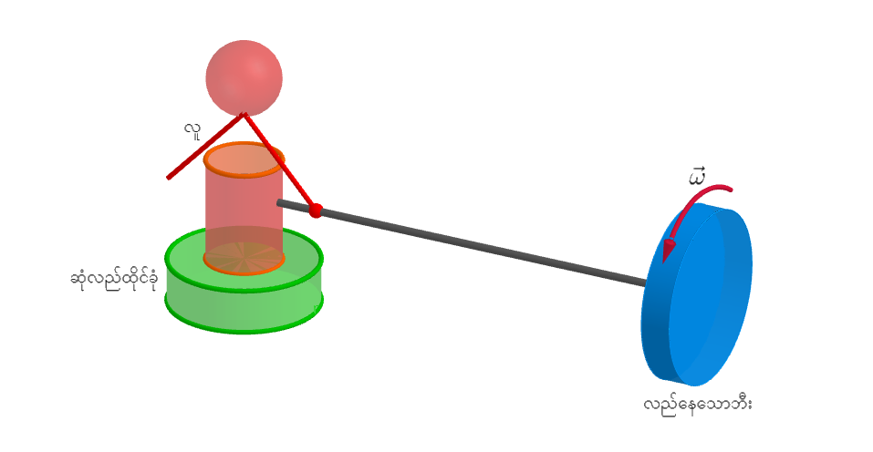
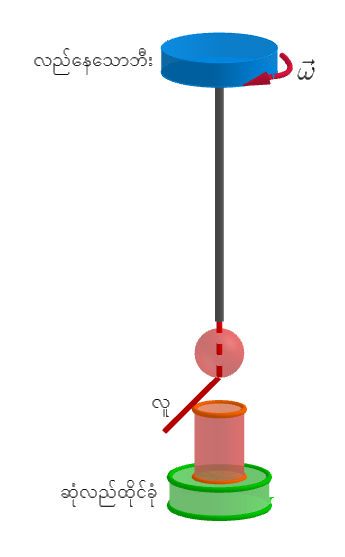
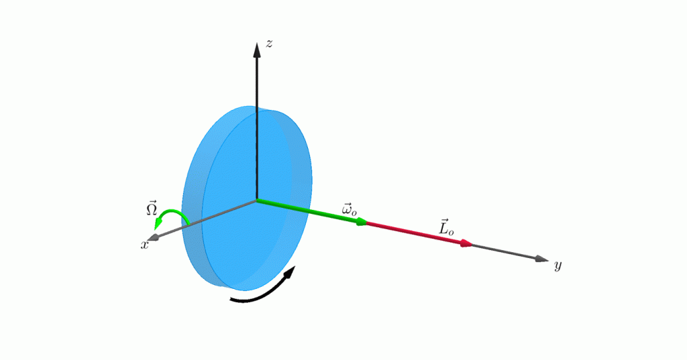
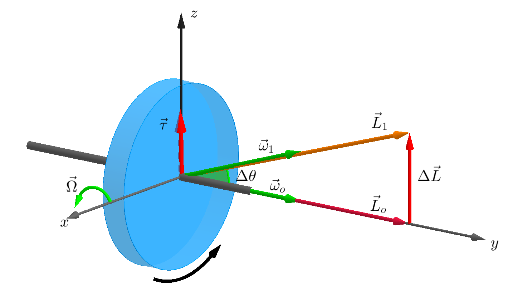
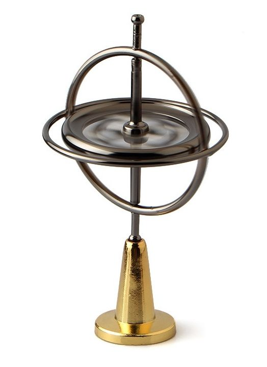
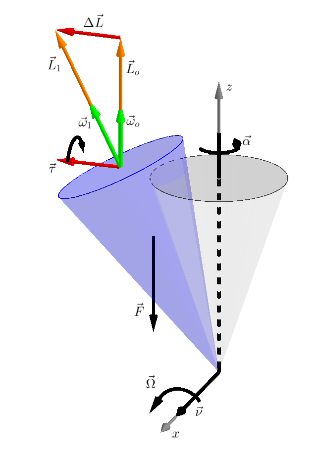
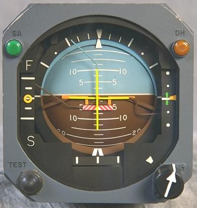
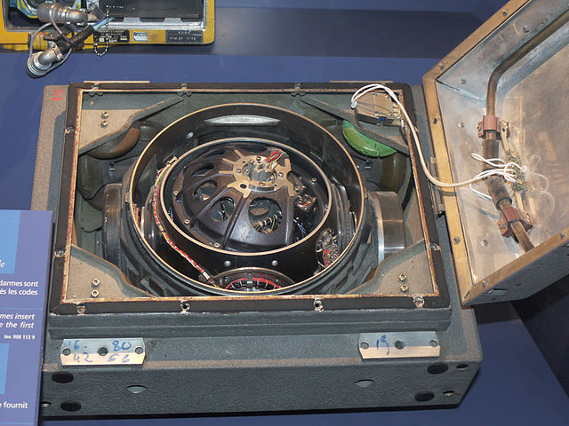
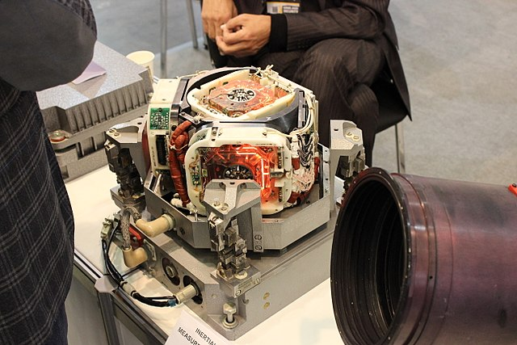
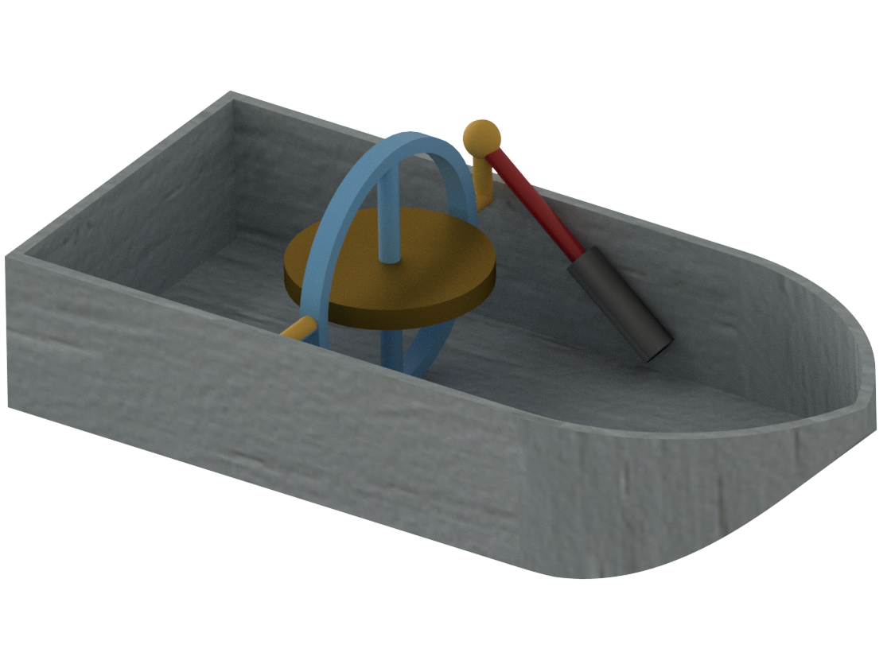

## ဂျိုင်ရိုသဘောတရား

မြောက်ဝင်ရိုးစွန်းကိုပထမဆုံးဖြတ်သန်းနိုင်ခဲ့တဲ့ ရေငုပ်သ​င်္ဘောဟာ အမေရိကန်ပိုင် USS Nautilus ဖြစ်ပါတယ်။ Operation Sunshine ရဲ့ mission တစ်ခုဖြစ်တဲ့ မြောက်ဝင်ရိုးစွန်းကိုဖြတ်ဖို့ ရေငုပ်သင်္ဘောဟာ ရေခဲပြင်အောက်ကသွားရတဲ့အတွက် ကြယ်တွေကိုကြည့်ပြီး တည်နေရာကိုခန့်မှန်းလို့မရပါဘူး။ ဝင်ရိုးစွန်းနားရောက်လာရင် သံလိုက်အိမ်မြှောင်တွေကလည်း ကောင်းကောင်းအလုပ်မလုပ်တော့ပါဘူး။ Nautilus ရဲ့ ကပ္ပတိန်နဲ့သ​င်္ဘောသားတွေဟာ ရေငုပ်သ​င်္ဘောပေါ်မှာပါလာတဲ့ ဂျိုင်ရိုအိမ်မြှောင်ကိုသာအသုံးပြုပြီး သင်္ဘောလမ်းကြောင်းကိုခန့်မှန်းကြရပါတယ်။ ဒါပေမယ့်ရေငုပ်သ​င်္ဘောက ၁၉၅၈ သြဂုတ်လ ၃ ရက်နေ့မှာ မြောက်ဝင်ရိုးစွန်းကို အောင်မြင်စွာရောက်ရှိခဲ့ပါတယ်။ Operation Sunshine အောင်မြင်ဖို့အတွက်အရေးပါတဲ့ ဂျိုင်ရိုအိမ်မြှောင်ကို ယနေ့အထိ သ​င်္ဘောတွေ၊ လေယာဉ်ပျံတွေနဲ့ မိုဘိုင်းဖုန်းတွေမှာပါ အသုံးပြုလျက်ရှိပါတယ်။ ဂျိုင်ရိုအိမ်မြှောင်က ကလေးတွေဆော့တဲ့ ဂျင်လိုမျိုးပဲ ဂျိုင်ရိုစကုတ်သဘောတရားကိုသုံးထားပါတယ်။ ဂျိုင်ရိုသဘောတရားကို ဒီအပိုင်းမှာ အဓိကလေ့လာမှာဖြစ်ပါတယ်။

အရှေ့က Part-4 မှာ လည်ခြင်းစနစ်တွေကြောင့်ဖြစ်တဲ့ အားအယောင်တွေအကြောင်းကို ပြောခဲ့ပါတယ်။ အခုလည်ခြင်းစနစ်ရဲ့ အခြေခံညီမျှခြင်းတွေကို အတိုချုပ်ပြန်ကြည့်ရအောင်။

| Type                  | Equation                            |
|-----------------------|:-----------------------------------:|
| Tangential velocity   | $ \vec{v_t} = r \vec{\omega} $      |
| Torque                | $ \vec{\tau}=\vec{r} \times \vec{F} $ |
| Angular momentum      | $ \vec L=m r^2 \vec \omega , \vec{\tau} = \frac{d\vec{L}}{dt} $ |
| Centripetal force     | $ \vec F_c = m \vec v_t \omega = m \vec r \omega ^2 $ |
| Coriolis force        | $ \vec{F}_c=2m\vec v_t \times \vec \omega $ |

အခု လည်နေတဲ့အလေးပြားတစ်ခုရဲ့ဝင်ရိုးတစ်ဖက်ကကိုင်ပြီး ဆုံလည်ထိုင်ခုံမှာထိုင်နေတဲ့ လူတစ်ယောက်ကိုကြည့်ရအောင်။ (Sorry for the graphics ;)

လူက လက်ကိုင်ကို အပေါ်ထောင်လိုက်ရင် ဝင်ရိုးက မြေပြင်ညီအတိုင်းရှိနေရာကနေ ဒေါင်လိုက်ဖြစ်သွားပါမယ်။ အဝိုင်းပြားက လည်နေတဲ့အတွက် ဒေါင်လိုက်ဝင်ရိုးမှာ ထောင့်ပြောင်းအဟုန်တစ်ခုဖြစ်ပေါ်လာပါမယ်။ ဒီထောင့်ပြောင်းအဟုန်က အရင်ကမရှိတဲ့အတွက် ထောင့်ပြောင်းအဟုန်တည်မြဲဖို့အတွက် လူနဲ့ထိုင်ခုံက အပြားလည်တဲ့ဦးတည်ရာရဲ့ ဆန့်ကျင်ဘက်ကို လည်သွားပါမယ်။

လူနဲ့ထိုင်ခုံကိုလည်စေဖို့အတွက် လိမ်အားတစ်ခုလိုပါမယ်။ ဒီလိုတွေးခေါ်မှုကို coriolis force တုန်းကလည်းတွေ့ခဲ့ဖူးပါတယ်။ လက်ရှိလူနဲ့ထိုင်ခုံကိုလည်စေတဲ့ လိမ်အားကိုရှာဖို့ လည်နေတဲ့အဝိုင်းပြားကို ကြည့်ရအောင်။

အဝိုင်းပြားနေရာမှာ x, y, z axis သုံးခုကို ပုံပါအတိုင်းထားလိုက်ပါမယ်။ အဝိုင်းပြားက y-axis မှာလည်နေတဲ့အတွက် ညာလက်ထုံးအရ ထောင့်ပြောင်းအလျင် $ \vec \omega \_o $ က +y-axis မှာရှိပါမယ်။ ထောင့်ပြောင်းအဟုန် $ \vec L \_o $ ကလည်း +y-axis မှာပဲရှိပါမယ်။ ဒီလည်နေတဲ့အပြားကို x-axis ကိုပတ်ပြီး နှုန်း $ \vec \Omega $ နဲ့ ထောင့်အသေးလေး $ \Delta \theta $ တစ်ခုလှည့်ကြည့်ရအောင်။ လှည့်ပြီးရင် ထောင့်ပြောင်းအလျင်နဲ့ ထောင့်ပြောင်းအဟုန်က ပမာဏမပြောင်းပဲ ဦးတည်ရာပြောင်းသွားပါမယ် ($ \vec \omega \_1 , \ \vec L_1 $)။ $ \vec \Omega $ ကြောင့်ဖြစ်တဲ့ထောင့်ပြောင်းအဟုန်က သေးငယ်တဲ့အတွက် လျစ်လျူရှုလိုက်ပါမယ်။ ဒီတော့ ထောင့်ပြောင်းအဟုန်ခြားနားချက်ကို ပုံပါအတိုင်း $ \Delta \vec{L} $ လို့ထားပါ။ သေးငယ်တဲ့ $ \Delta \theta $ အတွက်−

$$
\Delta \vec{L}  = \vec L_0 \Delta \theta
$$

ဒီ $ \Delta \vec L $ ကြောင့်ဖြစ်တဲ့ $ \vec \tau $ က−

$$ 
\vec \tau = \dfrac{\Delta \vec L}{\Delta t}
$$

ဒီ $ \vec \tau $ ရဲ့ဦးတည်ရာအရ z-axis ကိုပတ်လည်တဲ့ လိမ်အားတစ်ခုဖြစ်တယ်ဆိုတာ တွေ့ရပါတယ်။ ဒီလိမ်အားကိုဖြစ်ပေါ်စေမယ့် အားက x-axis နဲ့ အပြိုင်ဖြစ်ပါလိမ့်မယ်။ ဒီလိမ်အားနဲ့ အားတွေကို ဘယ်ကထုတ်ပေးလဲဆိုတော့ အဝိုင်းပြားကိုမတင်လိုက်တဲ့လူက စိုက်ထုတ်ပေးရတာဖြစ်ပါတယ်။ နယူတန်တတိယနိယာမကြောင့် လူကစိုက်ရတဲ့အားတွေက လူပေါ်ကိုပြန်သက်ရောက်တဲ့အတွက် လူနဲ့ထိုင်ခုံက ဆန့်ကျင်ဘက်ကိုလည်သွားရတာဖြစ်ပါတယ်။

$$
\vec \tau = \dfrac{\Delta \vec L}{\Delta t}=\dfrac{\vec L_o \Delta \theta}{\Delta t}
$$

$ \frac{\Delta \theta}{\Delta t} $ က $ \vec \Omega $ ဖြစ်ပြီး ဦးတည်ရာတွေကို သေချာကြည့်ရင် $ \vec \tau $ က $ \vec \Omega $ ရော $ \vec L \_o $ ရောကို ထောင့်မှန်ကျတဲ့အတွက်−

$$
\vec \tau = \vec \Omega \times \vec L_o
$$
ကိုရပါမယ်။

ဒီတော့ $ \vec \Omega $ နဲ့ $ \vec L_o $ က အလျားလိုက်ရှိရင် $ \vec \tau $ က ဒေါင်လိုက်ရှိပါမယ်။ ဒါကြောင့်လူက အဝိုင်းပြားကိုလှည့်တာက $ \vec \Omega $ အတိုင်းပေမယ့် ဆုံလည်က z-axis အတိုင်းလည်သွားတာဖြစ်ပါတယ်။

## Gyroscopic precession

အခုတစ်ခါ ဂျိုင်ရိုစကုတ်တစ်ခုဖြစ်တဲ့ ဂျင်တစ်ခုလည်တဲ့ကိစ္စကို ထပ်ကြည့်ရအောင်။

ဂျင်က တစ်ဖက်ကိုနည်းနည်းလေးစောင်းသွားတဲ့အချိန်မှာ မြေဆွဲအား $ \vec F $ က ဂျင်ကို $ \vec \Omega $ အတိုင်းလည်သွားစေပါတယ် (ပုံနဲ့တွဲကြည့်ပါ) ဒါပေမယ့်ဒီလိုလည်သွားတာက ထောင့်ပြောင်းအဟုန်ဗက်တာ $ \vec L_o $ ကို ဦးတည်ရာပြောင်းစေတဲ့အတွက် $ \Delta \vec L $ တစ်ခုဖြစ်ပေါ်လာပါတယ်။ ဒီ $ \Delta \vec L $ က လိမ်အား $ \vec \tau $ ကိုဖြစ်ပေါ်လာစေပါတယ်။ ဒီ $ \vec \tau $ ကြောင့် ဂျင်က အောက်ကိုမလဲပဲ ဘေးဘက်ကိုလည်သွားပါတယ်။ လည်သွားတဲ့အခါ $ \vec L $ က ထပ်ပြောင်းသွားတဲ့အတွက် ဂျင်ကိုပြန်တည့်မတ်စေတဲ့ $ \vec \tau $ တစ်ခုထွက်ပေါ်လာပါတယ်။

ဒီလိုမျိုး ထောင့်ပြောင်းအဟုန် $ \vec L $ နဲ့လိမ်အား $ \vec \tau $ တို့အပြန်အလှန်သက်ရောက်မှုဟာ ဂျင်ကို ဒေါင်လိုက်ဝင်ရိုးပေါ်မှာ ထောင့်ပြောင်းအလျင် $ \vec \alpha $ နဲ့ ကတော့ချွန်ပုံသဏ္ဍာန် ပတ်နေစေပါတယ်။ ဒီလိုဖြစ်တာကို gyroscopic precession လို့ခေါ်ပါတယ်။

ဂျင်ပေါ်ကိုအရင်ဆုံးသက်ရောက်တဲ့ မြေဆွဲအား $ \vec F $ က +x-axis အတိုင်းရှိတဲ့ လိမ်အား $ \vec \nu $ တစ်ခုကိုဖြစ်ပေါ်စေပါတယ်။ ဒါပေမယ့်ဂျင် precess ဖြစ်တဲ့ဝင်ရိုးကတော့ +z-axis မှာဖြစ်ပါတယ်။ ဒီတော့ precess ဖြစ်တဲ့ဦးတည်ရာ (tangential velocity) က အား $ \vec F $ နဲ့ထောင့်မှန်ကျပြီး $ \vec \nu $ ရဲ့ဦးတည်ရာအတိုင်းရှိပါတယ်။

[By LucasVB - Own work, Public Domain](https://commons.wikimedia.org/w/index.php?curid=1528090)

ဒါဆိုရင် gyroscope တစ်ခု ဘာလို့ precess ဖြစ်လဲဆိုတာ သင်္ချာနည်းအရသိပါပြီ။ ဒါဆိုရင် gyroscope ကိုလမ်းကြောင်းပြဖို့အတွက် ဘယ်လိုသုံးသလဲ။ Gyroscope တစ်ခုကိုဦးတည်ရာမျိုးစုံလည်လို့ရအောင် gimbal လို့ခေါ်တဲ့ x,y,z axis  သုံးခုလုံးပေါ်မှာလည်လို့ရတဲ့ဒေါက်ပုံစံပေါ်မှာတင်ထားလေ့ရှိပါတယ်။ ဒါမှမဟုတ် ဂျိုင်ရိုစကုတ်ပါတဲ့ casing ကို ဆီထဲမှာထည့်ပြီးပေါလောမျောထားလေ့ရှိပါတယ်။ အောက်ကပုံကတော့ gimbal bearing ပေါ်မှာတင်ထားတဲ့ ဂျိုင်ရိုစကုတ်တစ်ခုပဲဖြစ်ပါတယ်။ Gimbal နဲ့ဂျိုင်ရိုစကုတ်ထိစပ်နေတဲ့နေရာတွေက ပွတ်မှုအားကြောင့် ဂျိုင်ရိုရပ်မသွားအောင် မော်တာတပ်ထားလေ့ရှိပါတယ်။

](images/Gyroscope_gimbal.gif) 

Gimbal ပေါ်မှာ ဂျိုင်ရိုကိုလှည့်ထားရင် ဂျိုင်ရိုရဲ့ဝင်ရိုးပေါ်ကို (ဂျိုင်ရိုလည်နေတဲ့ဝင်ရိုးကလွဲရင်) လိမ်အားသက်ရောက်တဲ့အခါ ဂျိုင်ရိုကလိမ်အားသက်ရောက်တဲ့ ဝင်ရိုးအတိုင်းမလည်ပဲ လိမ်အားဝင်ရိုးနဲ့ဂျိုင်ရိုဝင်ရိုးနှစ်ခုလုံးထောင့်မှန်ကျတဲ့ ဝင်ရိုးကိုပတ်ပြီးလည်ပါတယ်။ ဂျိုင်ရိုစကုတ်ဝင်ရိုးကိုဦးတည်ရာတစ်ဖက်ကိုချိန်ထားရင် ပြင်ပလိမ်အားမသက်ရောက်မချင်း အဲ့ဒီ့တစ်ဖက်ကိုပဲ အမြဲတမ်းပြနေမှာဖြစ်ပါတယ်။

ပထမဆုံး ဂျိုင်ရိုစကုတ်ကို လေယာဉ်ပျံတွေမှာဘယ်လိုသုံးလဲကြည့်ရအောင်။ လေယာဉ်ပျံတွေမှာ ဂျိုင်ရိုစကုတ်ကိုအဓိကသုံးတာ နှစ်မျိုးရှိပါတယ်။ ပထမတစ်မျိုးက artificial horizon လို့ခေါ်ပါတယ်။ Attitude Indicator လို့လည်းခေါ်ပါတယ်။ သူကလေယာဉ်မှုးတွေ ညဘက်မှာ၊ ဒါမှမဟုတ် ရာသီဥတုကြောင့်ကမ္ဘာမြေပြင်ကို မမြင်ရတဲ့အချိန်မျိုးမှာ လေယာဉ်ဘယ်ညာစောင်းတာ၊ အပေါ်အောက်ငိုက်တာကို ပြတဲ့ကိရိယာဖြစ်ပါတယ်။ ဒီကိရိယာရဲ့အစိတ်အပိုင်းပုံအကြမ်းကို အောက်ကပုံမှာကြည့်ပါ။

](images/Attitude-Indicator-Schematics.gif)

ဒီကိရိယာမှာ ဂျိုင်ရိုရဲ့ဝင်ရိုးကို လေယာဉ်ပျံနဲ့အလျားလိုက် တပ်ဆင်ထားပါတယ်။ ဂျိုင်ရိုကိုပွတ်မှုအားလျှော့ချဖို့အတွက် ကိရိယာအတွင်းပိုင်းကို လေဟာနယ်လုပ်ထားလေ့ရှိပါတယ်။ ဂျိုင်ရိုစကုတ်သဘောတရားအရ လေယာဉ်ဘယ်ညာစောင်းသွားတဲ့အခါ ဂျိုင်ရိုကလိုက်မစောင်းပဲ မူလဦးတည်ရာအတိုင်းကျန်နေခဲ့ပါမယ်။ ဒီတော့ဂျိုင်ရိုဝင်ရိုးကို ဒိုင်ခွက်နဲ့ချိတ်ထားလိုက်ရင် လေယာဉ်အတိမ်းအစောင်းကိုသိနိုင်မှာဖြစ်ပါတယ်။

 [By Photographer: Reddy & Garcia - Source, Public Domain](https://commons.wikimedia.org/w/index.php?curid=103473\[/caption\])

နောက်တစ်မျိုးသုံးတာက ဂျိုင်ရိုအိမ်မြှောင်ဖြစ်ပါတယ်။ ဂျိုင်ရိုအိမ်မြှောင်က သံလိုက်အိမ်မြှောင်လိုပဲ မြောက်ဘက်ကို အမြဲတမ်းညွန်ပြအောင်လုပ်ထားပါတယ်။ ဂျိုင်ရိုဝင်ရိုးကို မြောက်ဘက်ကိုချိန်ထားလိုက်ရင် လေယာဉ်ဘယ်လိုပဲကွေ့ကွေ့၊ စောင်းစောင်း မြောက်ဘက်ကိုပဲ ညွှန်ပြနေမှာဖြစ်ပါတယ်။ သံလိုက်အိမ်မြှောင်လို လေယာဉ်ပေါ်ကသံလိုက်စက်ကွင်းတွေရဲ့ လွှမ်းမိုးမှုကိုလည်းမခံရပါဘူး။

## Gyro drift

ဂျိုင်ရိုစကုတ်တွေမှာ ဦးတည်ရာတစ်ဘက်တည်းကို အမြဲတမ်းညွှန်ပြနိုင်ဖို့ ဂျိုင်ရိုကို ပြင်ပလိမ်အားသက်ရောက်လို့မရပါဘူး။ ဒါပေမယ့် လက်တွေ့မှာတော့ ဂျိုင်ရိုနဲ့ gimbal နဲ့ထိစပ်တဲ့နေရာတွေကနေ ဂျိုင်ရိုပေါ်ကိုသက်ရောက်နေတဲ့ ပွတ်မှုအားတွေကို လုံးဝပျောက်အောင်လုပ်လို့မရပါဘူး။ ဒီတော့ ပွတ်မှုအားကြောင့်ဖြစ်တဲ့ လိမ်အားအနည်းငယ်က ဂျိုင်ရိုပေါ်ကို သက်ရောက်နေတဲ့အတွက် ဂျိုင်ရိုကို precess ဖြစ်စေပါတယ်။ ဒီတော့ အချိန်ကြာလာတာနဲ့အမျှ ဂျိုင်ရိုက မူလညွှန်ပြနေတဲ့ဦးတည်ရာကနေ တစ်ဖြည်းဖြည်းရွေ့သွားမှာဖြစ်ပါတယ်။ ဒီလိုဖြစ်တာကို ဂျိုင်ရို drift ဖြစ်တယ်လို့ခေါ်ပါတယ်။ Gyro drift ကြောင့်ဖြစ်တဲ့ အမှား (error) ကိုကာကွယ်နိုင်ဖို့ ဂျိုင်ရိုစကုတ်ကို အချိန်ပိုင်းတစ်ခုမှာ သံလိုက်အိမ်မြှောင်၊ ဒါမှမဟုတ် မြေဆွဲအားလိုမျိုး တစ်ခုခုနဲ့ ပြန်ပြီးချိန်ညှိပေးရပါတယ်။ မြန်နေတဲ့နာရီတစ်လုံးကို အချိန်မှန်အောင် ပြန်ပြန်တိုက်ရသလိုပေါ့။ ဂျိုင်ရိုစကုတ်က ဘယ်လောက်ကြာကြာယုံကြည်ရလဲဆိုတာတော့ ပွတ်မှုအားကိုလျှော့ချတဲ့ ဂျိုင်ရိုရဲ့တည်ဆောက်ပုံနဲ့ သေသပ်မှုတို့အပေါ်မူတည်ပါတယ်။ အကြမ်းဖြင်း ၁၀−၁၅ မိနစ် တစ်ခါလောက်ပြန်တိုက်ရပါတယ်။

ဒီကိရိယာနှစ်ခုက လေယာဉ်မှူးတွေအတွက်ရော၊ လေယာဉ်အလိုအလျောက်မောင်းနှင်စနစ် (auto pilot) အတွက်ပါ အလွန်အရေးပါတဲ့ ကိရိယာနှစ်ခုဖြစ်ပါတယ်။ ဂျိုင်ရိုစကုတ်နဲ့ အရှိန်နှုန်းကိုတိုင်းတဲ့ accelerometer တို့ပေါင်းစပ်ပြီး ယာဉ်တစ်စင်းဟာ ဟင်းလင်းပြင်ထဲမှာ ဘယ်လောက်အရှိန်နှုန်းနဲ့ ဘယ်ဦးတည်ရာကိုရွေ့နေတယ်ဆိုတာ ပတ်ဝန်းကျင်ကိုမကြည့်ပဲ သိနိုင်ပါတယ်။  အင်နားရှားကိုအသုံးပြုပြီးတိုင်းတာတဲ့အတွက် ဒီလိုမျိုးတိုင်းတာတဲ့ကိရိယာကို inertial measurement unit (IMU) လို့ခေါ်ပါတယ်။ ဒီကိရိယာကို လေယာဉ်ပျံ၊ သ​င်္ဘော၊ ကား၊ ဂြိုလ်တု၊ ဒုံးပျံ၊ mobile phone တွေနဲ့ ယာဉ်အမျိုးမျိုးမှာ တပ်ဆင်အသုံးပြုနေပါတယ်။ IMU တွေကိုအသုံးပြုပြီ: ယာဉ်လမ်းကြောင်းထိန်းတဲ့စနစ်ကိုတော့ inertial guidance system လို့ခေါ်ပါတယ်။

 [By Pline - Own work, CC BY-SA 3.0](https://commons.wikimedia.org/w/index.php?curid=5854735)

 [By VictorAnyakin - Own work, CC BY-SA 4.0](https://commons.wikimedia.org/w/index.php?curid=63541620)

ဂျိုင်ရိုစကုတ်ကို ဂြိုလ်တုနဲ့ အာကာသစခန်းတွေမှာ လမ်းကြောင်းပြဖို့အတွက်သာမက ဂြိုလ်တုရဲ့ဦးတည်ရာကို ပြောင်းဖို့အတွက်လည်းအသုံးပြုပါတယ်။ နောက်ပြီး ဇိမ်ခံသ​င်္ဘောတွေမှာ သင်္ဘောလှိုင်းလူးတာကိုလျှော့ချဖို့ ဂျိုင်ရိုစကုတ်ကိုအသုံးပြုလေ့ရှိပါတယ်။ ဒါပေမယ့် ဂျိုင်ရိုစကုတ်တပ်လိုက်ရုံနဲ့တော့ သ​င်္ဘောကငြိမ်သွားမှာမဟုတ်ပါဘူး။ ဒီစနစ်မှာ သ​င်္ဘောဘယ်ညာယိမ်းတာကိုအာရုံခံတဲ့ ဂျိုင်ရိုစကုတ်အသေးလေး (master gyro) တစ်ခုနဲ့ လိမ်အားကိုထုတ်ပေးတဲ့ ဂျိုင်ရိုစကုတ်အကြီး (slave gyro) တစ်ခုရှိပါတယ်။ ဂျိုင်ရိုစကုတ်အကြီးရဲ့ဝင်ရိုးကို ဒေါင်လိုက်တပ်ထားပါတယ်။ နောက်ပြီး ဂျိုင်ရိုစကုတ်အကြီးကို ရှေ့နောက်လှည့်လို့ရအောင် သ​င်္ဘောနဲ့ကန့်လန့်ဖြတ်ဝင်ရိုးတစ်ခုပေါ်မှာတင်ပြီး မော်တာ (သို့) ဟိုက်ဒရောလစ်စနစ်နဲ့ ထိန်းချုပ်ထားပါတယ်။ (ပုံကိုကြည့်ပါ) ဥပမာ သ​င်္ဘောဘယ်ဘက် စောင်းသွားတာကို ဂျိုင်ရိုစကုတ်အသေးက အာရုံခံမိတာနဲ့ ဂျိုင်ရိုစကုတ်အကြီးကို ဟိုက်ဒရောလစ်နဲ့ နောက်ဖက်ကိုလှည့်လိုက်ပါတယ်။ ဒါပေမယ့်ဂျိုင်ရိုစကုတ်အကြီးရဲ့ precess ဖြစ်မှုကြောင့် သ​င်္ဘောကိုညာဘက်ဆွဲလှည့်တဲ့ လိမ်အားတစ်ခုဖြစ်ပေါ်လာပါတယ်။ ဒီလိုနည်းနဲ့ ဘယ်ညာမလူးအောင် လုပ်ဆောင်တာဖြစ်ပါတယ်။ သ​င်္ဘောက ယေဘူယျအားဖြင့်အလျားရှည်တဲ့အတွက် ရှေ့နောက်လူးတာကတော့ သိပ်မပြင်းပါဘူး။

ဟယ်လီကော်ပတာတစ်စီးပေါ်က ပန်ကာရွက် (ရိုတာ) တွေကလည်း လည်နေရင် ဂျိုင်ရိုစကုတ်လိုပဲဖြစ်တာကြောင့် ဟယ်လီကော်ပတာကို ရှေ့ဖက်ကိုစောင်းချင်ရင် ရိုတာကို ဘေးဘက်ကိုစောင်းပေးရပါတယ်။ ရိုတာကို ရှေ့ဘက်စောင်းရင်တော့ ဟယ်လီကော်ပတာက ဘေးဘက်ကိုစောင်းသွားမှာဖြစ်ပါတယ်။

ဂျိုင်ရိုစကုတ်က ကလေးတွေအတွက် ပျော်စရာကောင်းတဲ့ ဆော့စရာတစ်ခုဖြစ်သလို ကျွန်တော်တို့အတွက်လည်း အံ့ဩစရာကောင်းတဲ့ ကိရိယာတစ်ခုဖြစ်ပါတယ်။ ဒါပေမယ့် ဂျိုင်ရိုစကုတ်တစ်ခု precess ဖြစ်တာကတော့ မှော်စွမ်းအားကြောင့်မဟုတ်ပဲ သိပ္ပံနည်းကျဖြေရှင်းချက်ရှိတယ်ဆိုတာ လက်တွေ့သိခဲ့ရပြီဖြစ်ပါတယ်။ ဒီနားလည်မှုကိုအသုံးချပြီး အံ့မခန်းစွမ်းဆောင်ရည်ရှိတဲ့ လမ်းကြောင်းပြကိရိယာတွေ၊ auto−pilot တွေနဲ့ ဆယ်စုနှစ်သုံးခုကြာ အလုပ်လုပ်နေဆဲဖြစ်တဲ့အာကာသယာဉ်တွေကို တီထွင်နိုင်တာကတော့ သိပ္ပံပညာရှင်တွေ၊ အင်ဂျင်နီယာတွေနဲ့ စက်မှုပညာရှင်တွေရဲ့ သမိုင်းမှတ်တိုင်တစ်ခုပဲဖြစ်ပါတော့တယ်။

> "Finding the occasional straw of truth awash in a great ocean of confusion and bamboozle requires vigilance, dedication and courage."
>
> Carl Sagan
