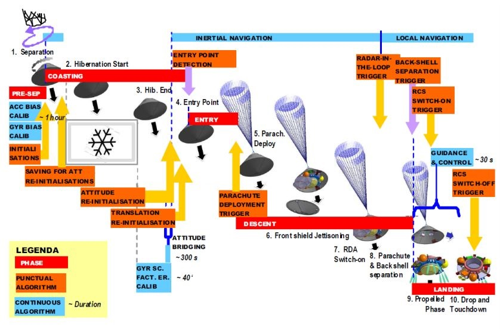
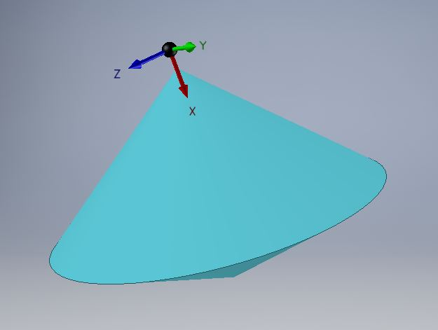
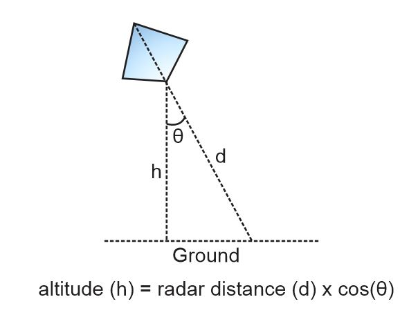

အောက်တိုဘာ ၂၀၁၆၊ ၁၉ ရက်နေ့မှာ European Space Agency (ESA) နဲ့ Russian Space Agency တို့ ပူးပေါင်းပါဝင်တဲ့ ExoMars 2016 mission ရဲ့ အစိတ်အပိုင်းတစ်ခုဖြစ်တဲ့ Schiaparelli လို့ခေါ်တဲ့ ယာဉ်ငယ်ဟာ အင်္ဂါဂြိုလ်ပေါ်ကို ဆင်းသက်ဖို့ ကြိုးစားခဲ့ပါတယ်။ ဒီယာဉ်ကို Entry Demonstrator Module (EDM) လို့ခေါ်ပြီ: 2020 မှာ လွှတ်တင်မဲ့ Mars Rover အတွက် ရှေ့ပြေးစမ်းသပ်ချက်အနေနဲ့ scientific instruments နည်းနည်းပဲထည့်ပြီ: အင်္ဂါဂြိုလ်လေထုထဲကို အဝင်နဲ့ မြေပြင်ပေါ်ဆင်းသက်ပုံကို လေ့လာခဲ့တာဖြစ်ပါတယ်။ ဒါပေမယ့် ဂြိုလ်မျက်နှာပြင်ပေါ်ကို မရောက်ခင် ၄၃ စက္ကန့်လောက် အလိုမှာပဲ signal lost ဖြစ်သွားပြီး နောက်ထပ် ဆက်သွယ်မှုကိုလဲ မရရှိတော့ပါဘူး။ အောက်တိုဘာ ၂၀ ရက်နေ့မှာ NASA ရဲ့ အင်္ဂါဂြိုလ်ပေါ်မှာရှိတဲ့ ဂြိုလ်တုကနေ landing site ကို ဓာတ်ပုံရိုက်ကြည့်တဲ့အခါ အရင်ကမရှိတဲ့ အမည်းရောင်အစက်ကလေးကို တွေ့ရပြီး ဂြိုလ်ဆင်းယာဉ် crash ဖြစ်သွားတယ်ဆိုတာ အတည်ပြုခဲ့ပါတယ်။

 - Own work, [CC BY-SA 4.0](https://creativecommons.org/licenses/by-sa/4.0 "Creative Commons Attribution-Share Alike 4.0"), [Link](https://commons.wikimedia.org/w/index.php?curid=52430247)
](images/1200px-Schiaparelli_Lander_Model_at_ESOC.jpg)

Lander ဆင်းသက်မှု မအောင်မြင်ရခြင်းရဲ့ အကြောင်းရင်းကို ESA နဲ့ NASA က ပညာရှင်တွေပါဝင်တဲ့ ဘုတ်အဖွဲ့က လေ့လာပြီး မေလ ၁၈ ရက်နေ့မှာ public ကို ထုတ်ပြန်ခဲ့ပါတယ်။

ဂြိုလ်ဆင်းယာဉ်ရဲ့ entry, descent and landing sequence အကြမ်းဖြင်းကတော့ မိခင်ဂြိုလ်တုကနေ ခွဲထွက်ပြီး သုံးရက်လောက်အကြာမှာ အင်္ဂါဂြိုလ်လေထုထဲကိုဝင်တဲ့အချိန် လေထီးဖွင့်၊ ရှေ့အပူခံကာဗာဖြုတ်ထုတ်၊ ရေဒါဖွင့်၊ သတ်မှတ်အမြင့်တစ်နေရာရောက်ရင် လေထီးနဲ့ နောက်အပူခံကာဗာဖြုတ်ထုတ်၊ ပြီးရင် အရှိန်လျှော့ဖို့ တန်ပြန် rocket thruster တွေကိုဖွင့်ပြီး မျက်နှာပြင်ကိုရောက်ဖို့ ၂ မီတာ (၆ ပေခွဲ) လောက်အလိုမှာ rocket တွေကို ပိတ်ပြီး soft landing လုပ်ဖို့ဖြစ်ပါတယ်။

Landing မှာ ဘာလွဲချော်သွားလဲဆိုတာ မပြောခင် Inertial Measurement Unit (IMU) အကြောင်းကို အရင်ပြောချင်ပါတယ်။ IMU ဆိုတဲ့ device က ယာဉ်ရဲ့ အရှိန်(acceleration) နဲ့ တိမ်းစောင်းမှု(orientation) ကို တိုင်းတာတဲ့ အာရုံခံပစ္စည်းဖြစ်ပါတယ်။ သူ့ကို အင်နားရှားနိယာမ၊ နယူတန် ဒုတိယနိယာမနဲ့ ဂျိုင်ရိုစကုတ် သက်ရောက်မှုတို့ကို အခြေခံပြီး တည်ဆောက်ထားပါတယ်။ သူ့ကို များသောအားဖြင့် navigation အတွက် ကမ္ဘာပေါ်မှာဆို သင်္ဘောတွေ၊ လေယာဉ်ပျံတွေမှာ GPS နဲ့ တွဲပြီး အသုံးပြုပါတယ်။ အာကာသထဲမှာတော့ GPS မရှိတဲ့အတွက် IMU ကိုပဲ အလေးထားပြီး navigational calculation တွေ လုပ်ကြပါတယ်။ ဒါပေမယ့် IMU က ယာဉ်ရဲ့ လက်ရှိ အလျင်(velocity) နဲ့ လက်ရှိ အတိမ်း(orientation) ကို ထုတ်မပေးနိုင်ပါဘူး၊ မူလအစ တန်ဖိုးတွေကို reference ယူပြီ: အရှိန်နဲ့ ထောင့်ပြောင်းလဲခြင်းတွေကို အချိန်အလိုက် ပေါင်းထည့်ပေးရတာဖြစ်ပါတယ်။ အဲ့ဒီ့မှာ အာရုံခံစနစ်က ထုတ်ပေးတဲ့ တန်ဖိုးတွေက နည်းနည်းလေးမှားနေရင်တောင် အချိန်ကြာလာတာနဲ့အမျှ သွေဖည်မှု error က များလာမှာဖြစ်ပါတယ်။

Schiaparelli ဂြိုလ်ဆင်းယာဉ်ရဲ့ IMU စနစ်မှာပါတဲ့ accelerometer နဲ့ gyro ကို မိခင်ဂြိုလ်တုကခွဲထွက်လိုက်တဲ့အချိန်မှာ မူလတန်ဖိုးတွေကို အတည်ပြုပြီး စတင်သတ်မှတ်ပါတယ်။ အင်္ဂါဂြိုလ်လေထုထဲ ဝင်မဲ့ဆဲဆဲမှာ ဂျိုင်ရိုစကုတ် error ကို နောက်တစ်ခါ အတည်ပြုပါတယ်။ ဒီအချိန်ထိ အစီအစဉ်အတိုင်း ပုံမှန်ဖြစ်နေခဲ့ပါတယ်။ လေထုထဲစရောက်လို့ လေထီးဖွင့်လိုက်တဲ့ အချိန်မှာ ယာဉ်ရဲ့ ဘေးတိုက်ထောင့်ပြောင်းလဲမှု (pitch angular rate) အကြီးကြီးတစ်ခုဖြစ်ပေါ်ခဲ့ပါတယ် (ကားစီးနေရင်း ဘေးကို ချက်ချင်းစောင်းသွားသလိုပေါ့)။ ဒီထောင့်ပြောင်းလဲမှုက ယာဉ်ရဲ့ Z-axis (ပုံတွင်ကြည့်) ကို ပတ်ပြီး ဖြစ်ပေါ်ခဲ့တာဖြစ်ပါတယ်။ ဒီထောင့်ပြောင်းလဲနှုန်းဟာ IMU က ဂျိုင်ရိုစကုတ် တိုင်းတာနိုင်တဲ့ limit ထက် ကျော်လွန်နေပါတယ်။ ဒါကြောင့် IMU က အဲ့ဒီ့အချိန်မှာ ယာဉ်ရဲ့တိမ်းစောင်းမှုတွေကို အာရုံမခံနိုင်တော့ဘူးဆိုတာ ယာဉ်ပေါ်က navigation control software ကို အသိပေးလိုက်ပါတယ်။ အဲ့ဒီ့တော့ navigation software က သူ့အထဲမှာသတ်မှတ်ထားတဲ့ ထောင့်ပြောင်းလဲနှုန်း အမြင့်ဆုံးတန်ဖိုးကို ယူပြီး တွက်ချက်မှုတွေကို ဆက်လုပ်ပါတယ်။ နောက်လေ့လာမှုတွေအရ အဲ့ဒီ့အချိန်မှာ ဂြိုလ်ဆင်းယာဉ်ဟာ တကယ်တော့ ရှေ့နောက်လွှဲနေတယ် (oscillate) ဆိုတာကို တွေ့ရှိရပါတယ်။ သို့ပေမယ့် IMU က အာရုံမခံနိုင်တဲ့အတွက် software က အဲ့ဒီ့တစ်ချိန်လုံး အမြင့်ဆုံးတန်ဖိုးတွေ ယူပြီးပေါင်းနေတဲ့အတွက် ယာဉ်ရဲ့ Z-axis မှာတိမ်းစောင်းမှုထောင့်က လက်ရှိနဲ့သွေဖည်ပြီး အကြီးကြီးဖြစ်လာပါတယ်။ software က တွက်ထုတ်လိုက်တဲ့ ရလဒ်ကတော့ ယာဉ်က မတ်မျည်းဖြောင့် (vertical) ကနေ ၁၆၅ ဒီဂရီကွာသွားပြီဆိုတာပါပဲ။ (တကယ်တော့ ၁၆၅ ဒီဂရီဆို ယာဉ်က ဇောက်ထိုးနီးပါးဖြစ်နေပါပြီ။ ဒါပေမယ့် ဒါကို software က မပြုပြင်နိုင်ခဲ့ပါဘူး)

လေထီးဖွင့်ပြီး စက္ကန့် ၄၀ အကြာမှာ ရှေ့ကာဗာကို ဖွင့်ထုတ်လိုက်ပါတယ်။ ပြီးတော့ ၁၅ စက္ကန့်အကြာမှာ ယာဉ်ရှေ့မှာတပ်ထားတဲ့ ရေဒါကို ဖွင့်လိုက်ပါတယ်။ ရေဒါနဲ့ IMU ကို ပေါင်းစပ်ပြီးတော့ အလျင်နဲ့ အမြင့်  (altitude) တွက်ချက်မှုတွေကို ပြုလုပ်ပါတယ်။ ဂြိုလ်မျက်နှာပြင်ကနေ အမြင့်ကို တွက်တဲ့အခါ ရေဒါကနေ ရတဲ့ အကွာအဝေးကို ယာဉ်ရဲ့ တိမ်းစောင်းမှုထောင့်အလိုက် cosine တန်ဖိုးယူမှ မျက်နှာပြင်ကနေ တကယ့်ထောင့်မှန်အမြင့်ကို ရမှာဖြစ်ပါတယ် (ပုံတွင်ကြည့်)။ ဒီလိုတွက်လိုက်တဲ့အခါ အမြင့်တန်ဖိုးက အနှုတ်နဲ့ထွက်လာပါတယ် (၉၀ ဒီဂရီကျော်တဲ့ထောင့်အတွက် cosine တန်ဖိုးက အနှုတ်ဖြစ်ပါတယ်)။ အနှုတ်အမြင့်တန်ဖိုးကိုလည်း software က ပြုပြင်နိုင်ခြင်းမရှိခဲ့ပါဘူး။ (တကယ်တော့ software မှာ မူမမှန်တာတွေကို စစ်တဲ့ လုပ်ဆောင်ချက်တွေပါဝင်ပါတယ်။ ဒါပေမယ့် ဒီလိုကိစ္စအတွက် ဖြေရှင်းရမယ့်နည်းလမ်းကို ထည့်မပေးထားပါဘူး)။ Sofware မှာထည့်ထားတာက အမြင့် သတ်မှတ်ချက်အောက်ရောက်သွားရင် လေထီးနဲ့ နောက်ကာဗာကို ဖြုတ်ချဖို့ပါ။ အမြင့်အနှုတ်တန်ဖိုးက သတ်မှတ်ချက်အောက်ကို ချက်ချင်းရောက်သွားတဲ့အတွက် သူတို့ကို ဖြုတ်ချလိုက်ပါတယ်။ ဖြုတ်ချပြီးနောက် reaction thruster တွေကို ဖွင့်လိုက်ပါတယ်။ ဒီ thruster တွေကို ဘယ်အချိန်မှာ ပိတ်ရမလဲဆိုတာက ယာဉ်ရဲ့ စုစုပေါင်း စွမ်းအင်ပေါ်မူတည်ပါတယ်။ စုစုပေါင်းစွမ်းအင် = အတည်စွမ်းအင် + အရွေ့စွမ်းအင်။ အတည်စွမ်းအင်က မျက်နှာပြင်အမြင့်ပေါ်မူတည်ပြီး အရွေ့စွမ်းအင်က အလျင်ပေါ်မူတည်ပါတယ်။ အလျင်တန်ဖိုးတွေက မှန်ကန်တဲ့အတွက် အရွေ့စွမ်းအင်က မှန်သော်လည်းပဲ အတည်စွမ်းအင်တွက်တဲ့အခါ အမြင့်က အနှုတ်ဖြစ်နေပြီး တန်ဖိုးကလည်း အရွေ့စွမ်းအင်ထက် များနေတဲ့အတွက် စုစုပေါင်းစွမ်းအင်ကလည်း အနှုတ်နဲ့ပဲထွက်လာပါတယ်။ အနှုတ်တန်ဖိုးက software ထဲမှာသတ်မှတ်ထားတဲ့ စွမ်းအင် limit ထက် နည်းနေတဲ့အတွက် condition က ချက်ခြင်းကိုက်သွားပါတယ်။ ဒါကြောင့် thruster ဖွင့်ပြီ: ၃ စက္ကန့်အကြာမှာ ပြန်ပိတ်လိုက်ပါတယ်။ အဲ့ဒီ့အချိန်မှာ ယာဉ်က မြေပြင်ကနေ အမြင့် ၃.၂ ကီလိုမီတာ(၂ မိုင်) မှာပဲရှိနေပြီး ကျန်တဲ့တလျောက်လုံးကို free fall နဲ့ ကျသွားပါတယ်။ ၃၄ စက္ကန့်အကြာမှာ အင်္ဂါဂြိုလ်မျက်နှာပြင်နဲ့ တိုက်မိပါတယ်။ တိုက်မိတဲ့ အလျင်က တစ်စက္ကန့်ကို ၁၅၀ မီတာ (၄၉၂ ပေ) လောက်ရှိပါတယ်။

လေ့လာမှုတွေအရ လေထီးထုတ်လိုက်တဲ့အချိန်မှာ ပတ်ဝန်းကျင်လေထု အခြေအနေကြောင့် လေထီးက ဆွဲတဲ့ ဦးတည်ရာက ယာဉ်ကို ရမ်းသွားစေတာဖြစ်တယ်လို့ သုံးသပ်ကြပါတယ်။ ဒီလေထုအခြေအနေဟာ ယာဉ်ဒီဇိုင်းဆွဲတုန်းက စမ်းသပ်ချက်တွေမှာ မပါဝင်ခဲ့ပါဘူး။ IMU က မတုန့်ပြန်နိုင်တဲ့အချိန်က နည်းနည်းလေးပဲဖြစ်ခဲ့မယ်ဆိုရင်လည်း error က အဲ့လောက်ကြီးသွားမှာမဟုတ်ပဲ ဆင်းသက်မှုအောင်မြင်နိုင်ပါတယ်။ ဒါပေမယ့် ExoMars 2016 ရဲ့ အဓိကအစိတ်အပိုင်းတစ်ခုဖြစ်တဲ့ Schiaparelli ရဲ့ မိခင်ဂြိုလ်တု Trace Gas Orbiter ကတော့ အင်္ဂါဂြိုလ်ပတ်လမ်းထဲကို အောင်မြင်စွာ ဝင်ရောက်နိုင်ခဲ့ပြီး လေ့လာချက်တွေနဲ့ 2020 mission အတွက် communication ဂြိုလ်တုအနေနဲ့ လုပ်ဆောင်ဖို့ အသင့်ြဖစ်နေပြီ ဖြစ်ပါတယ်။ Schiaparelli ကလည်း သရုပ်ပြယာဉ်ဖြစ်တဲ့အတွက် ဒီဆင်းသက်မှုကရတဲ့ အချက်အလက်တွေကို မှတ်တမ်းတင်နိုင်ခဲ့ပြီး 2020 မှာလွှတ်တင်မဲ့ Mars Rover အတွက် အထောက်အကူပြုနိုင်မှာ ဖြစ်ပါတယ်။ ဒါကြောင့် ExoMars 2016 mission ဟာ နောက်ဆုံးအဆင့် ဂြိုလ်မျက်နှာပြင်ပေါ်ကို ဆင်းတဲ့နေရာမှာသာ လွဲချော်ခဲ့ပြီး ကျန်တဲ့အပိုင်းတွေကတော့ အောင်မြင်တဲ့ mission တစ်ခုဖြစ်ပါတယ်။

### Reference:

- [EXOMARS 2016 - Schiaparelli Anomaly Inquiry, ESA, May 2017](http://exploration.esa.int/science-e/www/object/doc.cfm?fobjectid=59175)
- [https://en.wikipedia.org/wiki/Schiaparelli_EDM_lander](https://en.wikipedia.org/wiki/Schiaparelli_EDM_lander)

> “Anyone who has never made a mistake has never tried anything new.”
>
> ~Albert Einstein
