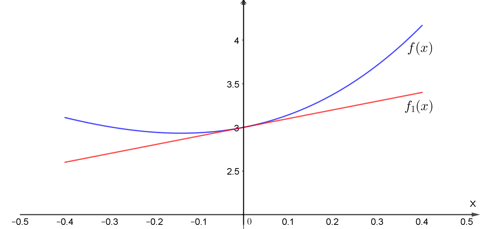
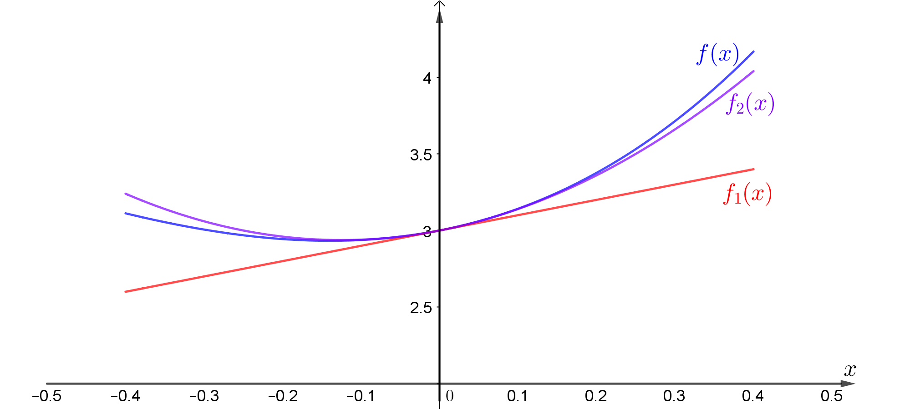

## Representing functions with derivatives

Function တစ်ခုရှိမယ်ဆိုပါတော့။ ဥပမာ−

$$
 f(x)=3+x+4x^2+2x^3
$$

သင့်ကို ဒီ $  f(x) $ function ကို ပေးမထားဘူးဆိုပါတော့။ ဒီ function ကို အမှတ်တစ်ခုမှာ (ဥပမာ x=0 မှာ) ရှိတဲ့အချက်အလက်တွေကိုပဲ အသုံးပြုပြီး ပြန်တည်ဆောက်လို့ရပါတယ်။ ဘယ်လိုအချက်အလက်တွေလဲဆိုတော့ initial value, slope, first derivative, second derivate, အစရှိတဲ့အချက်အလက်တွေပဲဖြစ်ပါတယ်။ ဒီအချက်အလက်တွေက မူရင်း function နဲ့ဘယ်လိုပတ်သက်နေလဲဆိုတာ ကြည့်ရအောင်။

ပထမဆုံး $ x=0 $ မှာရှိတဲ့ function ရဲ့တန်ဖိုးဖြစ်တဲ့ $ f(0) = 3 $ ဆိုတာကိုပဲ သိရမယ်ဆိုပါစို့။ ဒီတန်ဖိုးတစ်ခုတည်းကိုကြည့်ပြီး $  f(x) $ တန်ဖိုးက $ x=0 $ မှာ $ 3 $ ဖြစ်တယ်ဆိုတာကလွဲပြီး ဘာမှဆက်မပြောနိုင်တော့ပါဘူး။ f က constant တန်ဖိုးတစ်ခုပဲရှိတဲ့ function သာမဟုတ်ရင် $ f(0) $ တန်ဖိုးတစ်ခုတည်းနဲ့ function ကိုမှန်းဆဖို့ လုံးဝမလုံလောက်ပါဘူး။

နောက်တစ်ခါ $ f(0) $ တန်ဖိုးအပြင် $ x=0 $ မှာရှိတဲ့ $ f $ ရဲ့ first derivative $ f^{(1)}(0)=1 $ ကိုပါပေးထားမယ်ဆိုပါတော့။ $ f^{(1)}(0) $ တန်ဖိုးဟာ $ x=0 $ မှာရှိတဲ့ $ f(x) $ ရဲ့ slope နဲ့ညီမျှပါတယ်။ ဒီတော့ $ f(0) $ နဲ့ $ f^{(1)}(0) $ ကိုအသုံးချပြီး linear function တစ်ခုရေးကြည့်ရအောင်။

$$
 f_1(x)=f(0)+x f^{(1)}(0)=3+x
$$

$ f_1(x) $ လို့ရေးထားတာက function မှန်းဆချက်ကို first derivative အထိအသုံးပြုပြီး ဖွဲ့စည်းထားတယ်လို့ဆိုလိုတာပါ။ ဒီညီမျှခြင်းမှာ ရှေ့က $ f(0) $ ကိန်းသေတန်ဖိုးအပြင် $ x=0 $ မှာရှိတဲ့ rate of change (slope) နဲ့ $ x $ နဲ့မြှောက်ထားတာကြောင့် မျည်းဖြောင့်ပုံ linear equation တစ်ခုဖြစ်ပါတယ်။ ဒီညီမျှခြင်းနဲ့ တကယ့် function $ f(x) $ နဲ့က $ x=0 $ မှာ initial value နဲ့ rate of change တူတဲ့အတွက် $ x=0 $ ဝန်းကျင်မှာ အနီးစပ်ဆုံးတူညီပါလိမ့်မယ်။ ဒါပေမယ့် $ x=0 $ အမှတ်ကနေ ဝေးသွားရင်တော့ $ f(x) $ ရဲ့ slope ကိုယ်တိုင်က ပြောင်းလဲနေမှာဖြစ်တဲ့အတွက် ကျွန်ုပ်တို့ရဲ့ constant slope linear equation နဲ့ ကိုက်ညီတော့မှာမဟုတ်ပါဘူး။ အောက်ကပုံမှာ မူရင်း $ f(x) $ နဲ့ linear equation နဲ့ကိုဆွဲပြထားပါတယ်။

ဒီတော့ $  f(x) $ ရဲ့ rate of change ကိုယ်တိုင်က rate of change ရှိနေပါတယ်။ ဒါကို second order derivative နဲ့ဖော်ပြရပါမယ်။ ကဲအခု $ f^{(2)}(0)=8 $ ကိုပါထပ်ပေးထားပြီဆိုပါတော့။ ဒါဆို လက်ထဲမှာ $ f(0), f^{(1)}(0), f^{(2)}(0) $ အချက်အလက်တွေရှိနေပြီ။ ဒီတန်ဖိုးတွေကိုသုံးပြီးတော့ $ f(x) $ ကို ပြန်တည်ဆောက်ဖို့ ကြိုးစားကြည့်ပါမယ်။

$$
 f_2(x)=f(0)+xf^{(1)}(0)+\dfrac{x^2}{2}f^{(2)}(0)
$$

ဒီညီမျှခြင်းအရ $ x $ ကို $ 0 $ ပေးလိုက်ရင် $  f_2(0) $ က 3 ရမယ်။ နောက် ညီမျှခြင်းနှစ်ဖက်လုံးကို တစ်ခါရှိတ်ရင် ပထမ constant term ပျောက်သွားပြီး $ x=0 $ ပေးလိုက်ရင် $ x $ ပါနေတဲ့ တတိယ term ပျောက်သွားမယ်။ ဒါဆို အလယ်က $ f^{(1)}(0) $ ပဲကျန်ခဲ့တဲ့အတွက် မူရင်း $ f(x) $ ရဲ့ $ x=0 $ က first derivative နဲ့အတူတူပဲဖြစ်မယ်။ အလားတူပဲ $  f_2(x) $ ကိုနှစ်ခါရှိတ်လိုက်ရင် ပထမ constant term နဲ့ ဒုတိယ first order x term တွေက ပျောက်သွားပြီး $ f^{(2)}(0) $ ပဲကျန်ခဲ့မယ် (မရှင်းရင် ချတွက်ကြည့်ပါ)။ ဒီတန်ဖိုးကလည်း မူလ function ရဲ့ $ x=0 $ က second derivative နဲ့တူညီပါတယ်။ ဒီတော့ လက်ရှိညီမျှခြင်းက မူရင်း function $ f(x) $ နဲ့ $ x=0 $ မှာ initial value ရယ်၊ slope ရယ် rate of change of slope ရယ် တူညီပါတယ်။ ညီမျှခြင်းထဲကို derivative တန်ဖိုးတွေထည့်လိုက်ရင်−

$$
 f_2(x)=3+x+4x^2
$$

ရပါမယ်။ ဒီ second order approximation ညီမျှခြင်းကို အောက်ကပုံမှာ ခရမ်းရောင်နဲ့ဆွဲပြထားပါတယ်။ ပထမဆုံး constant slope ပုံထက် မူရင်း funciton နဲ့အများကြီးပိုနီးစပ်လာတာကို တွေ့နိုင်ပါတယ်။

အပေါ်ကနည်းလမ်းအတိုင်းပဲ $ f $ ရဲ့ $ x=0 $ မှာရှိတဲ့ rate of change ရဲ့ rate of change ရဲ့ rate of change တွေ၊ တစ်နည်းပြောရရင် higher order derivative တန်ဖိုးတွေကိုသိရင် function ကို ပိုပြီးတိကျအောင် ပြန်တည်ဆောက်လို့ရပါတယ်။ အခုဥပမာပေးထားတဲ့ function က third order x အထိပဲရှိတဲ့အတွက် third derivative အထိပဲ အများဆုံးရှိပါမယ်။ ဒီတော့ $ f^{(3)}(x) $ တန်ဖိုးထည့်ပြီးတွက်လိုက်ရင် $ f(x) $ ကိုအတိအကျပြန်ရမှာဖြစ်ပမယ်။

ဥပမာပေးထားတဲ့ function မှာ derivative သုံးခုပဲရှိပေမယ့် $ f(x)=e^x $ လို function မျိုးဆိုရင် origin (x=0) မှာ derivative တန်ဖိုးတွေ အနန္တရှိပါမယ်။ ဘာလို့လဲဆိုတော့ $ e^x $ ရဲ့ derivative က $ e^x $ ပဲဖြစ်ပြီး $ x=0 $ မှာ $ f^{(n)}(0)=1 $ ဖြစ်နေကြပါတယ်။ ဒီလို function မျိုးကို approximate လုပ်မယ်ဆိုရင် infinite Taylor series လို့ခေါ်တဲ့ အဆုံးမဲ့ကိန်းစဉ်တန်းတစ်မျိုးကို အသုံးပြုရပါတယ်။ ဒီကိန်းစဉ်တန်းက အပေါ်ကတွက်ခဲ့တဲ့ approximation ညီမျှခြင်းတွေပုံစံရှိပြီး function ရဲ့ အမှတ်တစ်ခုမှာရှိတဲ့ derivative တန်ဖိုးတွေကို အသုံးချထားပါတယ်။ Taylor series ရဲ့ ယေဘူယျပုံစံကတော့−

$$
  f_\infty (x-a)=\sum_0^\infty \dfrac{x^n}{n!} f^{(n)}(a)
$$

ဖြစ်ပါတယ်။ $  a $ က Taylor series ကိုဖြန့်ချတဲ့ ဗဟိုမှတ်ဖြစ်ပြီး derivative ရှာရမယ့် အမှတ်တန်ဖိုးလဲဖြစ်ပါတယ်။ ရှေ့ကဥပမာမှာ origin မှတ်ဖြစ်တဲ့ $ a=0 $ ကို အသုံးပြုခဲ့ပါတယ်။ $ n! $ ဆိုတာကတော့ n factorial လို့ဖတ်ပြီး $ n(n-1)(n-2) ... (1) $ အတိုင်း ဖြန့်ချရပါတယ်။ ဥပမာ $ n=3 $ ဆိုရင် $ 3!=3 \times 2 \times 1 $ ဖြစ်ပြီ: $ 4!=4 \times 3 \times 2 \times 1 $ ဖြစ်ပါတယ်။ $  e^x $ ကို Taylor series နဲ့ရေးရင်−

$$
 e^x=\sum_0^ \infty \dfrac{x^n}{n!}
$$

## Interval of convergence

Infinite series တစ်ခုအတွင်းက term တွေကိုပေါင်းလိုက်ရင် term အရေအတွက်အနန္တကိုချဉ်းကပ်လာတာနဲ့အမျှ ပေါင်းလဒ်က finite တန်ဖိုးတစ်ခုကိုချဉ်းကပ်သွားလား (converge)၊ ဒါမှမဟုတ် အဆုံးမရှိတိုးလာလား (diverge) ဆိုတာကို စစ်ဆေးတဲ့နည်းလမ်းတွေရှိပါတယ်။ Term အရေအတွက် အနန္တကိုပေါင်းထားတာပေမယ့် တစ်ချို့ series တွေက converge ဖြစ်ပြီး တစ်ချို့ series တွေက diverge ဖြစ်ပါတယ်။ ဒီနေရာမှာတော့ Taylor series ကိုအဓိကဆွေးနွေးနေတာဖြစ်တဲ့အတွက် convergence test တွေထဲက တစ်ခုကိုပဲနမူနာထုတ်ပြပါမယ်။ အပေါ်က $ e^x $ series ရဲ့ convergence ဖြစ်မှုကို ratio test လို့ခေါ်တဲ့နည်းလမ်းနဲ့ စစ်ဆေးလို့ရပါတယ်။ ဒီ test ရဲ့ လိုအပ်ချက်ကတော့−

$$
\lim_{n \to \infty} \left | \frac{a_{n+1}x^{n+1}}{a_n x_n} \right | < 1 
$$

ဖြစ်ရပါမယ်။ $ a_n $ ဆိုတာ $ n $ ကြိမ်မြောက် term ရဲ့ x မြှောက်ဖော်ကိန်းဖြစ်ပြီ: $ a_{n+1} $ ကတော့ $ n+1 $ ကြိမ်မြောက် term ရဲ့ x မြှောက်ဖော်ကိန်းဖြစ်ပါတယ်။ ဒါကြောင့် ဒီ test ရဲ့လိုအပ်ချက်က term အရေအတွက် အနန္တကိုချည်းကပ်သွားရင် နောက် term ရဲ့ x မြှောက်ဖော်ကိန်းက ရှေ့ term ရဲ့ x မြှောက်ဖော်ကိန်းထက်နည်းရမယ်လို့ ဆိုလိုတာဖြစ်ပါတယ်။ နောက်တစ်ခုက ratio test အရ−

$$
 \left | x \right | < R
$$

$$
 R = \lim_{n \to \infty} \left | \frac{a_n}{a_{n+1}} \right |
$$

R ကိုတော့ interval of convergence လို့ခေါ်ပြီ: x တန်ဖိုး ဘယ်လောက်အတွင်းမှာ series က converge ဖြစ်လဲဆိုတာကို ဖော်ပြပါတယ်။ အပေါ်က $ e^x $ series အတွက် R က $ \infty $ ရပါတယ်။ ဒီတော့ ဒီ series ကိုသုံးရင် x တန်ဖိုး $ -\infty $ နဲ့ $ \infty $ ကြားက ဘယ်တန်ဖိုးပဲထည့်ထည့် converge ဖြစ်ပါလိမ့်မယ် (finite ပေါင်းလဒ်တစ်ခုကို ထုတ်ပေးပါလိမ့်မယ်)။

Taylor series လိုမျိုး infinite series တွေက function approximation အတွက်ရော၊ analytical purpose အတွက်ရော အရေးပါတဲ့ကဏ္ဍကနေ ပါဝင်နေပါတယ်။ နောက်ပိုင်းမှာ တစ်ခြား infinite series တွေနဲ့ convergence test တွေအကြောင်းကို ဖော်ပြသွားပါမယ်။

Ref: Basic Training in Mathematics by R. Shankar

> "You do not study mathematics because it helps you build a bridge. You study mathematics because it is the poetry of the universe."
>
> Johnathan David Farley; Orono
