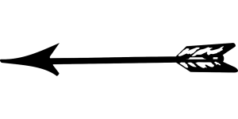
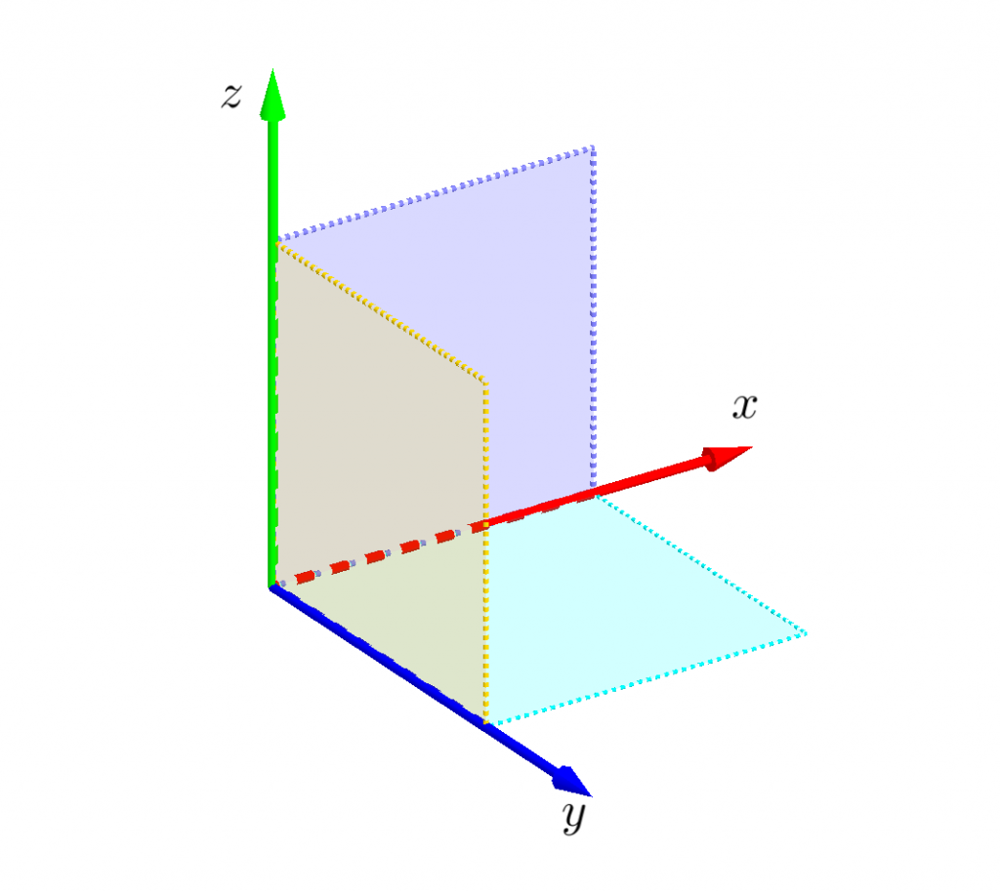
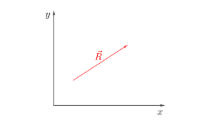
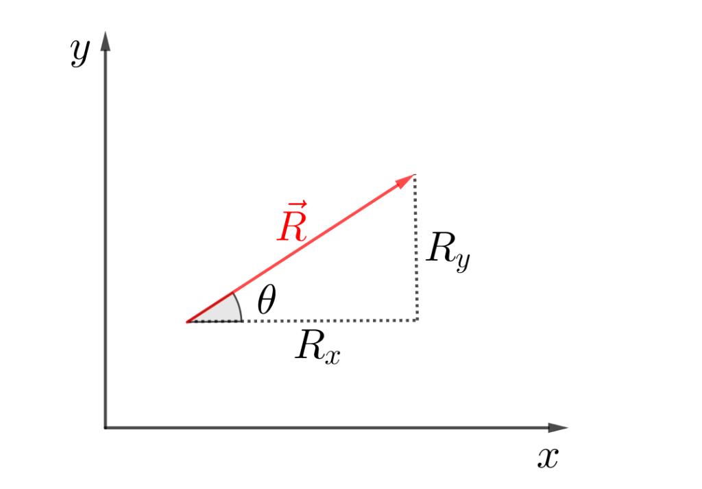
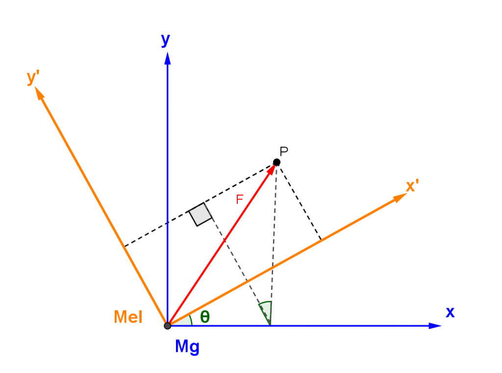

ကားတစ်စီ:ရှိတယ်ဆိုပါတော့။ ကားထဲကအင်ဂျင်က ကားမောင်းတဲ့အခါနောက်မှာကျန်နေခဲ့လား၊ ကားနဲ့အတူပါသွားသလား။ အမြဲတမ်းကားနဲ့အတူပါသွားပါတယ်။ ဒါကြောင့်အင်ဂျင်ကပေးတဲ့ရုန်းအားက ကားဘီးတွေကိုစဉ်ဆက်မပြတ်လည်နေစေပါတယ်။ ဒါကိုကားမောင်းတဲ့သူရော လမ်းပေါ်ကကြည့်တဲ့လူပါ လက်ခံနိုင်ပါတယ်။ ကားကိုဒီဇိုင်းဆွဲတဲ့အင်ဂျင်နီယာတွေက မောင်းတဲ့သူနဲ့ရပ်ကြည့်နေတဲ့သူအတွက် ခွဲပြီးမစဉ်းစားခဲ့ပါဘူး။ ဒါပေမယ့်အင်ဂျင်ကတော့ သူပေးနိုင်တဲ့ပါဝါကို ပေးနေဆဲပါပဲ။

ဒါကလူတိုင်းသိတဲ့ဟာကို ကျွန်တော်ကဘာလို့အထူးအဆန်းလုပ်ပြီးပြောနေရလဲဆိုတာ နောက်ပိုင်းကျရင်သိလာပါလိမ့်မယ်။ အခုလောလောဆယ် _vector_ ဆိုတဲ့အရာတစ်ခုအကြောင်းကိုပြောရအောင်။ မြှားတစ်ခုကိုမြင်ဖူးကြမှာပါ။ အပြင်မှာမမြင်ဘူးရင်တောင်ရုပ်ရှင်ထဲမှာတော့ မြင်ဘူးမှာပေါ့။

ဒီလိုမြားတစ်စင်းမှာ သူ့ရဲ့အရှည် (length) နဲ့ ဦးတည်ရာ (direction) ရှိပါတယ်။ Vector တစ်ခုမှာလည်း သူ့ရဲ့ပမာဏ (magnitude) နဲ့ ဦးတည်ရာ (direction) ရှိပါတယ်။ Vector ဆိုတာသင်္ချာအခေါ်အဝေါ်တစ်ခုဖြစ်ပြီး ရူပဗေဒမှာ ပမာဏနဲ့ဦးတည်ရာရှိတဲ့ကိန်းတွေကို ဖော်ပြဖို့သုံးပါတယ်။ ဥပမာ ကားတစ်စီးကအရှေ့ဘက်ကို ၁ မိုင်ရွေ့သွားတယ်ဆိုရင် သူ့ရဲ့အရွေ့ (distance) ကို vector တစ်ခုနဲ့ဖော်ပြလို့ရပါတယ်။ ကားရွေ့နေတဲ့အလျင် (velocity) ကိုလည်း အရှေ့ဘက်ကို တစ်နာရီမိုင် ၃၀ စသဖြင့် vector နဲ့ဖော်ပြလို့ရပါတယ်။ ဘာလို့သာမန်ကိန်းတွေကိုမသုံးပဲ vector ကိုသုံးရလဲဆိုရင် vector တစ်ခုမှာပမာဏနဲ့ဦးတည်ရာပေါင်းစပ်ပါဝင်တဲ့အပြင် vector analysis လို့ခေါ်တဲ့သင်္ချာနည်းပရိယာယ်တွေကို အသုံးချလို့ရတာကြောင့်ပဲဖြစ်ပါတယ်။ ဒီဆောင်းပါးမှာ vector ရဲ့သဘောသဘာဝတွေကို အဓိကထားပြီးဖော်ပြသွားမှာဖြစ်ပါတယ်။

## ကိုသြဒိနိတ်စနစ်

နောက်ထပ် vector ဥပမာတွေကတော့ အား (force)၊ အရှိန် (acceleration)၊ လိမ်အား (torque) တို့ဖြစ်ပါတယ်။ သူတို့တွေကိုပမာဏချည်းပဲဖော်ပြရုံနဲ့မလုံလောက်ပဲ ဦးတည်ရာပါလိုအပ်တာကြောင့်ပါ။ Vector အကြောင်းဆက်မပြောခင် ဟင်းလင်းပြင်မှာရှိတဲ့တည်နေရာ (spatial dimensions) ကိုဖော်ပြတဲ့ ကိုသြဒိနိတ် (coordinate)စနစ်အကြောင်းကိုပြောရအောင်။ အခုသင်ရှိနေတဲ့နေရာရဲ့ပတ်ဝန်းကျင်ကိုကြည့်လိုက်ပါ။ ကျွန်တော်တို့ဟာ အလျား၊ အနံ၊ အမြင့်နဲ့ ဖော်ပြလို့ရတဲ့ နေရာလွတ် (space) ထဲမှာနေကြတာဖြစ်ပါတယ်။ ဥပမာသင်ကအခန်းထဲမှာရှိမယ်ဆိုရင် အဲ့ဒီ့အခန်းရဲ့အကျယ်ကို အလျား၊ အနံ၊ အမြင့်နဲ့ ဖော်ပြလို့ရပါတယ်။ အခန်းထဲမှာထိုင်နေတဲ့ သင့်ရဲ့တည်နေရာကိုပြောပြချင်ရင် အခန်းထောင့်တစ်ထောင့်ကိုစမှတ်(origin) ယူပြီး အချင်းချင်းထောင့်မှန်ကျတဲ့ဝင်ရိုးသုံးခုကိုဆွဲလိုက်ပါမယ်။ အခန်းနံရံနှစ်ခုနဲ့ကြမ်းပြင်ဆုံတဲ့ထောင့်တစ်ထောင့်ကို ကြည့်လိုက်ရင်ဒီဝင်ရိုးသုံးခုကို မြင်နိုင်ပါလိမ့်မယ်။ ဒီဝင်ရိုးသုံးခုကို x, y, z ဆိုပြီးနာမည်ပေးလိုက်ပါမယ်။

ဒါဆိုအခန်းထဲကနေရာမှန်သမျှကို ဂဏန်းသုံးခု (x, y, z) နဲ့ဖော်ပြလို့ရပါပြီ။ ဒီဝင်ရိုးတွေကို ရည်ညွှန်းဖရိန် (reference frame) လို့လည်းခေါ်ပါတယ်။ ပုံမှန်အားဖြင့် ဝင်ရိုးတွေကို အပေါ်ကပုံထဲကအတိုင်း သတ်မှတ်လေ့ရှိပါတယ်။ ဒီစနစ်ကို ကာတစ်ဆီယန် (Cartesian) ကိုသြဒိနိတ်စနစ်လို့ခေါ်ပါတယ်။ ဟင်းလင်းပြင်ထဲကတည်နေရာကိုဖော်ပြတဲ့တစ်ခြားစနစ်တွေလဲရှိပါသေးတယ်။ ဥပမာ ကမ္ဘာလုံးပေါ်ကတည်နေရာကိုပြောချင်ရင် လတ္တီကျူ့၊ လောင်ဂျီကျူ့နဲ့ အမြင့်ပေတို့ကိုသုံးလေ့ရှိပါတယ်။ ဒါပေမယ့် ဒါကသိပ်အရေးမကြီးသေးတဲ့အတွက် လောလောဆယ် Cartesian စနစ်ကိုပဲသုံးပါမယ်။

ကိုသြဒိနိတ်စနစ်ကိုသတ်မှတ်ပြီးပြီဆိုရင် သင့်အနားမှာရှိတဲ့ ပေတံလိုမျိုးအချောင်းတစ်ချောင်းကို ကိုင်ထားလိုက်ပါ။ ဘာအချောင်းမှမရှိလဲ လက်ချောင်းတစ်ချောင်းထောင်ထားလိုက်ပါ။ ပြီးရင်အဲ့ဒီ့အချောင်းရဲ့ခေါင်းဖက်ကိုသတ်မှတ်လိုက်ပါ။ ဒီအချာင်းကဟင်းလင်းပြင်ထဲမှာရှိနေတဲ့အတွက်သူ့ရဲ့တည်နေရာ (ဒါမှမဟုတ်သူ့ခေါင်းထိပ်ကအမှတ်)ကို စမှတ်ကနေ (x, y, z) နဲ့ဖော်ပြလို့ရပါတယ်။ ပြီးတော့ သူ့မှာအရှည်တစ်ခုရှိပြီး ညွှန်ပြရာတစ်ခုရှိပါမယ်။ ဒါဆိုဒီအချောင်းကို သင့်စိတ်ထဲမှာ vector လို့ယူဆလို့ရပါပြီ။ ဒါကအလွန်ရိုးရှင်းပါတယ်။ ပုံနဲ့ဖော်ပြတဲ့အခါမှာ ရှင်းလင်းအောင် vector ကို 2 dimension ပဲရှိတဲ့ပြင်ညီပေါ်မှာဖော်ပြပါမယ်။ ဒါကသင့်အချောင်းကို နံရံပေါ်မှာကပ်ထားသလိုမျိုးပေါ့။ ဒီ vector ကို R လို့ခေါ်လိုက်ပါမယ်။

Vector တစ်ခုကို သူ့နာမည်ပေါ်မှာမြှားတင်ပြီးရေးပါတယ်။ စာလုံးအထူနဲ့လည်းရေးလေ့ရှိပါတယ်။ Vector ရဲ့ပမာဏကို $ |\vec{R}| $ လို့ရေးပြီး modulus of vector R လို့ဖတ်ပါတယ်။ ဒါမှမဟုတ်မြှားခေါင်းမပါပဲ $ R $ လို့လည်းရေးလေ့ရှိပါတယ်။ သူ့ရဲ့ဦးတည်ရာကိုတော့ ပုံမှာပြထားတဲ့အတိုင်း $ x-\text{axis} $ နဲ့ $ \vec{R} $ ရဲ့ခံဆောင်ထောင့်ဖြစ်တဲ့ $ \theta $ နဲ့ဖော်ပြပါမယ်။

## Vector တစ်ခု၏ component များ

ဟင်းလင်းပြင်ထဲမှာရှိတဲ့ vector $ \vec{R} $ ရဲ့ x- နဲ့ y- axis တစ်ခုစီပေါ်မှာရှိတဲ့တန်ဖိုးကို $ \vec{R} $ ရဲ့ component တွေလို့ခေါ်ပါတယ်။ ဒါက $ \vec{R} $ ရဲ့မြှားမြှီးကနေ မြှားထိပ်ဆီကိုတည့်တည့်မသွားပဲ x နဲ့ y ဝင်ရိုးတွေနဲ့အပြိုင်ပဲသွားမယ်ဆိုရင် သွားရမယ့်အကွာအဝေးတွေဖြစ်ပါတယ်။

Trigonometry အရ−

$$
 R_x= |\vec{R}| \cos \theta , \ R_y=|\vec{R}| \sin \theta
$$

ဖြစ်ပြီ:

$$
 |\vec{R}| = \sqrt{R_x^2+R_y^2}
$$

ဖြစ်ပါတယ်။

ဒီနေရာမှာတစ်ခုဖြတ်ပြောချင်တာက _unit vector_ ဆိုတာပမာဏ ၁ ယူနစ် (၁ ပေ၊ ၁ မီတာ စသည်) ရှိတဲ့ vector ကိုပြောတာဖြစ်ပြီး ကိန်းတစ်ခုကိုပမာဏမပြောင်းလဲချင်ပဲဦးတည်ရာပေးချင်တဲ့အခါသုံးပါတယ်။ ရိုးရိုး vector ကနေ unit vector ကိုပြောင်းချင်ရင် စံပြုခြင်း (normalization) လို့ခေါ်တဲ့နည်းကိုသုံးပါတယ်။ ဒီနည်းကတော့−

$$
 \hat{r}=\frac{\vec R}{|\vec{R}|}
$$

ပဲဖြစ်ပါတယ်။ $ \hat{r} $ ဆိုတာ $ \vec R $ ရဲ့ဦးတည်ရာအတိုင်းရှိပြီး ပမာဏ ၁ ပဲရှိတဲ့ unit vector ဖြစ်ပါတယ်။ $ \hat i $, $ \hat j $ နဲ့ $ \hat k $ တို့ဟာ x-, y-, z- axis အတိုင်းညွှန်ပြတဲ့ unit vector တွေဖြစ်ကြပါတယ်။ ဒီတော့ $ \vec R $ ကို သူ့ရဲ့ component တွေနဲ့ခွဲရေးမယ်ဆိုရင် 3 dimension မှာ−

$$
 \vec R= R_x \hat i + R_y \hat j + R_z \hat k
$$

လို့ရေးလို့ရပါတယ်။ 2 dimension ဆိုရင်တော့ $ R_z $ က 0 ဖြစ်ပါမယ်။

## ကိုသြဒိနိတ်ပြောင်းလဲခြင်းများ

အပေါ်မှာပြောခဲ့တဲ့ x-, y-, z- စတဲ့ ရည်ညွန်းဖရိန်ဆိုတာ တစ်ခုပဲရှိတာမဟုတ်သလို ပိုမှန်တဲ့ရည်ညွှန်းဖရိန်ဆိုတာလည်း မရှိပါဘူး။ ဥပမာ အခန်းရဲ့ဘယ်ဘက်ထောင့်ကိုစမှတ်အနေနဲ့ သတ်မှတ်လို့ရသလို ညာဘက်ထောင့်ကိုလည်း သတ်မှတ်လို့ရပါတယ်။ ဒီတော့တစ်ယောက်က ဘယ်ဘက်ထောင့်ကိုယူပြီး တစ်ယောက်ကညာဘက်ထောင့်ကိုယူမယ်ဆိုရင် အခန်းထဲကအမှတ်တစ်မှတ်တည်နေရာကို ဖော်ပြတဲ့အခါ သူတို့ရဲ့ (x, y, z) တန်ဖိုးတွေက တူမှာမဟုတ်တော့ပါဘူး။ ကိုသြဒိနိတ်၊ ဒါမှမဟုတ်ရည်ညွှန်းဖရိန်တစ်ခုကနေ နောက်တစ်ခုကိုပြောင်းတဲ့အခါ vector ရဲ့ component တန်ဖိုးတွေကို လိုက်ပြောင်းလဲရတာကို ကိုသြဒိနိတ်ပြောင်းလဲခြင်း (coordinate transformation) လို့ခေါ်ပါတယ်။ ကိုသြဒိနိတ်ပြောင်းလဲခြင်းတွေက ပုံစံအများကြီးရှိပါတယ်။ ဒီထဲကအရေးပါတဲ့တစ်ချို့ကိုထုတ်ပြရရင် အရွေ့ (translation)၊ အလည် (rotation)၊ ကိန်းသေအလျင်ကွာခြားချက် (constant velocity) တို့ပဲဖြစ်ပါတယ်။

## Translation

ရည်ညွန်းဖရိန်နှစ်ခုကြားမှာ ကိန်းသေတစ်ခုကွာခြားတဲ့ အရွေ့ပြောင်းလဲမှုကိုကြည့်ဖို့ အခန်းထဲမှာ Mg နဲ့ Mel ၁ ပေခြားပြီးထိုင်နေတယ်ဆိုပါစို့။ Mg ရဲ့နေရာကရည်ညွန်းဖရိန်က x, y ဖြစ်ပြီး Mel ရဲ့ရည်ညွန်းဖရိန်က x’, y’ လို့ထားပါ။ သူတို့နှစ်ယောက်က အခန်းနံရံမှာချိတ်ထားတဲ့နာရီ (P) ရဲ့တည်နေရာ (x, y) နဲ့ (x’, y’) တို့ကို ပြောပြမယ်ဆိုပါတော့။

ပုံအရ Mel က Mg ထက် P ကနေအလျားလိုက် ၁ ယူနစ်ပိုဝေးတဲ့အတွက် Mel ရဲ့တိုင်းထွာချက်က $ (x', y') = (x+1, y) $  ဖြစ်ပါမယ်။ ဒီညီမျှခြင်းက Mg ရဲ့အတိုင်းအထွာ (x, y) တွေကနေ Mel ရဲ့အတိုင်းအထွာ (x’, y’) ကိုပြောင်းလဲဖို့ ယေဘူယျညီမျှခြင်းပဲဖြစ်ပါတယ်။ ဒါပေမယ့် P နေရာမှာ vector တစ်ခု(ဥပမာနာရီလက်တံ) သာဆိုရင် Mg နဲ့ Mel တိုင်းထွာတဲ့ component တွေကအတူတူပဲဖြစ်မှာပါ။ ဘာလို့လဲဆိုတော့ vector ရဲ့ အလျား၊ အနံက မြှားအစွန်းနှစ်ဖက်က အမှတ်နှစ်ခုခြားနားချက်ပဲဖြစ်တာကြောင့်ဖြစ်ပါတယ်။

## Rotation

ဒီတစ်ခါရည်ညွန်းဖရိန်နှစ်ခုက တစ်တန်းတည်းမဟုတ်ပဲ ထောင့်တစ်ခုခြားပြီးစောင်းနေတဲ့အခြေအနေကို လေ့လာကြည့်ပါမယ်။ Rotation လို့ရေးထားပေမယ့် လည်နေတဲ့ဖရိန်မဟုတ်ပဲ စောင်းနေတဲ့ဖရိန်ဖြစ်တာကို သတိထားပါ။

ဟုတ်ပြီ။ စောင်းတာအတွက် transformation ကနည်းနည်းပိုရှုပ်ပါတယ်။ ပုံကိုကြည့်ပြီး trigonometry အရ P အတွက် x’, y’ နဲ့ x, y ဆက်နွယ်ချက်ကိုရှာကြည့်ပါ။ ကျွန်တော်ကတော့ စာအုပ်ထဲကကူးချလိုက်ပါမယ်။ အဖြေက−

$$
 x'=x \cos \theta + y \sin \theta
$$

$$
 y'= y \cos \theta - x \sin \theta
$$

ဒီပုံအရ 
$$
z'=z
$$
ဖြစ်ပါမယ်။

Vector $ \vec F $ ရဲ့ component တွေအတွက်ဆိုရင်လည်းဒီညီမျှခြင်းတွေက အတူတူပါပဲ။ ($ \vec F $ က origin ကိုထိတာ၊ မထိတာက ဒီညီမျှခြင်းတွေကိုသက်ရောက်မှုမရှိဘူးဆိုတာ တွေ့နိုင်ပါသလား)

$$
F_x'=F_x \cos \theta + F_y \sin \theta
$$

$$

F_y'= F_y \cos \theta - F_x \sin \theta

$$

$$

F_z' = F_z

$$

ဒီနေရာမှာ သတိပြုသင့်တာက coordinate transformation ကြောင့် vector ကို ကိုယ်စားပြုတဲ့ component တန်ဖိုးတွေပြောင်းလဲသွားပေမယ့် တကယ်ရှိနေတဲ့ vector ကမပြောင်းလဲပါဘူး။ ရည်ညွှန်းဖရိန်ပြောင်းသွားလို့ နာရီလက်တံတို့ ပေတံတို့က တိုသွားတာ၊ ရှည်သွားတာမရှိသလိုပေါ့။ Coordinate transformation ကြောင့် မပြောင်းလဲတဲ့ကိန်းတွေကို invariant quantities (သို့) scalar quantities လို့ခေါ်ပါတယ်။ Vector ရဲ့ magnitude (length) က invariant quantity တစ်ခုဖြစ်ပါတယ်။ ဒါကို $ |vec F| $ နဲ့ $ |vec {F'}| $ ကိုရှာပြီ:သက်သေပြကြည့်ပါ။

ဦးတည်ရာ (direction) မရှိတဲ့ကိန်းတွေ (ဒြပ်ထု၊ စွမ်းအင်၊ သိပ်သည်းဆ၊ work done စသည်) ကလည်း scalar quantities တွေဖြစ်ကြတဲ့အတွက် coordinate စနစ်ကိုမှီခိုခြင်းမရှိပါဘူး။

## Moving with constant velocity

ကိန်းသေအလျင်နဲ့ရွေ့နေတဲ့ ရည်ညွန်းဖရိန်နှစ်ခုအတွက် vector တွေကလည်း ပြောင်းလဲခြင်းမရှိပါဘူး။ အလင်းအလျင်နီးပါးရွေ့နေတာမဟုတ်ရင်ပေါ့လေ။ ဒီတော့ အား (force) တစ်ခုကို ရပ်နေတဲ့ဖရိန်ကပဲဖြစ်ဖြစ် ကိန်းသေအလျင်တစ်ခုနဲရွေ့နေတဲ့ဖရိန်ကပဲဖြစ်ဖြစ် အတူတူပဲမြင်ရပါမယ်။ ဒီအတွက်သက်သေပြချက်ကိုတော့ ဒီနေရာမှာမဖော်ပြတော့ပါဘူး။

Translation, rotation နဲ့ constant velocity motion တို့ရဲ့ ဖရိန်တစ်ခုကနေတစ်ခုကို transformation တွေကို Galilean transformation လို့ခေါ်ပါတယ်။ Vector တစ်ခုဖြစ်ဖို့ဆိုရင် ပမာဏနဲ့လားရာရှိရုံသာမက ဒီ transformation ညီမျှခြင်းတွေကိုလည်းလိုက်နာရပါမယ်။

သိပ္ပံဥပဒေသတွေကို vector notation နဲ့ရေးခြင်းက ရည်ညွှန်းဖရိန်ကိုမမှီခိုပဲ vector တွေကြားကဆက်နွယ်ချက်ကို ရှင်းရှင်းလင်းလင်းဖော်ပြနိုင်စေပါတယ်။ ဥပမာနယူတန်ဒုတိယနိယာမကို ညီမျှခြင်းပုံစံနဲ့ရေးရင်−

$$

F=ma

$$

F က force, m က mass နဲ့ a က acceleration ဖြစ်ပါတယ်။ တကယ်တော့ 3-dimension မှာဆိုရင်ဒီညီမျှခြင်းက သုံးကြောင်းဖြစ်ပါမယ်။ ရည်ညွှန်းဖရိန် x,y,z အတွက်−

$$

F_x=ma_x, \ F_y=ma_y , \ F_z=ma_z

$$

ဖြစ်ပါတယ်။ ရည်ညွှန်းဖရိန် x’,y’,z’ အတွက်လည်း အလားတူပဲဖြစ်ပြီ: $ F_x , F_x' $ စတာတွေကတော့ ယေဘူယျအားဖြင့်တူမှာမဟုတ်ပါဘူး။ ဒီမှာဆို F နဲ့ a က vector တွေဖြစ်တဲ့အတွက် vector ပုံစံနဲ့ရေးရင်−

$$
\vec F= m \vec a
$$

ဖြစ်ပါတယ်။ ဒီ vector ညီမျှခြင်းက ရည်ညွှန်းဖရိန်တစ်ခုပေါ်မှာမှီခိုခြင်းမရှိပဲ $ \vec F $ နဲ့ $ \vec a $ ကြားက*ဆက်သွယ်ချက်*ကိုဖော်ပြပါတယ်။ နောက်ပြီး force နဲ့ acceleration က ဦးတည်ရာအတူတူပဲဆိုတာကိုလည်း သိသာစေပါတယ်။ နောက်ထပ်ဥပမာတစ်ခုအနေနဲ့ $ \vec A $ နဲ့ $ \vec B $ ကဖရိန်တစ်ခုမှာ 30 degree ချိုးပြီးရှိနေတယ်ဆိုရင် နောက်ဖရိန်တစ်ခုမှာလည်း 30 degree ချိုးပြီ:ရှိနေပါတယ်။ နောက်တစ်မျိုးပြောရရင် ရည်ညွှန်းဖရိန်တွေပြောင်းသွားပေမယ့် vector တွေကြားကဆက်နွယ်ချက်တွေက ပြောင်းမသွားပါဘူး။ ဒါကြောင့် ကားတစ်စီးကိုရွေ့လျားစေတဲ့ အင်ဂျင်ရုန်းအား၊ ဂီယာ၊ ဘီးတို့ကြားကဆက်သွယ်ချက်တွေက ကားပေါ်ကလူအတွက်ရော ရပ်ကြည့်နေတဲ့လူအတွက်ရော မှန်တာဖြစ်ပါတယ်။ ဒါကြောင့်လည်း vector တွေအကုန်လုံးက transformation ဥပဒေသတွေအကုန်လုံးကို တစ်သမတ်တည်းလိုက်နာဖို့လိုအပ်တာဖြစ်ပါတယ်။

နောက်ဆက်တွဲအနေနဲ့ပြောရရင် vector ညီမျှခြင်းတွေက ရည်ညွှန်းဖရိန်အကုန်လုံးအတွက်မှန်တာတော့မဟုတ်ပါဘူး။ ယေဘူယျရည်ညွှန်းဖရိန်အမျိုးအစားနှစ်ခုရှိပြီး inertial reference frame နဲ့ non-inertial reference frame လို့ခေါ်ပါတယ်။ သူကိုယ်တိုင် acceleration ရှိနေတဲ့ဖရိန်အမျိုးအစားကို non-inertial reference frame လို့ခေါ်တာဖြစ်ပါတယ်။ Non-inertial reference frame တွေကနေကြည့်ရင် inertial reference frame မှာမရှိတဲ့အားအယောင်တွေထွက်လာပါတယ်။ ဒါပေမယ့်ဒီလိုဖြစ်တာက vector စနစ်ရဲ့ ချို့ယွင်းချက်ကြောင့်မဟုတ်ပဲ ရွေ့လျားမှုနိယာမကြောင့်ပဲဖြစ်ပါတယ်။

မှတ်ချက်။ ပို၍အသေးစိတ်တွက်ချက်မှုများပါဝင်သော vector ဆောင်းပါးကို [ဤနေရာတွင်ဖတ်ပါ](http://theinlinaung.com/vectors/)။

> The first principle is that you must not fool yourself – and you are the easiest person to fool.
>
> ~Richard Feynman
