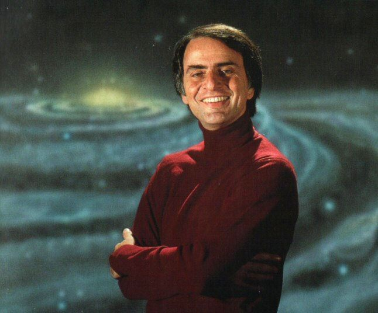

When the chemistry teacher said  
Atoms cannot be created nor destroyed  
Did you wonder where they come from?

Well, science says  
At the beginning, there was only one element  
What we now call Hydrogen  
They come together because of attraction  
And the lumps become bigger and bigger  
Till they collapse to their own weight  
Fusing hydrogen atoms at the core  
Stars being born  
Nuclear reactions producing heavier elements

When the stars die, they sacrifice themselves  
Scattering their innards across the universe  
Particles then meet again  
A story repeated quadrillion times  
After countless generations of infants  
A child named Carbon was born

After eons, on a space rock called Earth  
A labyrinth of causes and luck  
Gave rise to the first duplicating form of life  
Building blocks gifted by the deceased giants

Fast forward a chain of events and history  
Our ancestors walked on Earth  
Nourished by the mother nature  
Now look at yourself reading this  
Look at your hands, your legs, your face and eyes  
Composed of cells built with molecules built with atoms  
Once lived at the very core of the stars  
Look at your parents, your significant other  
Without stars, there are no us  
We are made of recycled star stuff  
We are literally the descendants of the suns

_Tribute to Carl Sagan_

> The nitrogen in our DNA, the calcium in our teeth, the iron in our blood, the carbon in our apple pies were made in the interiors of collapsing stars. We are made of starstuff.
>
> Carl Sagan