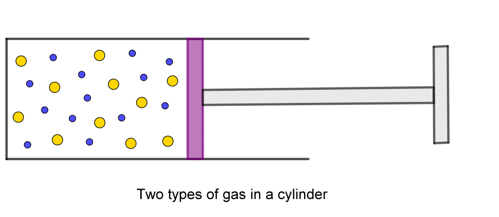

ဆလင်ဒါထဲမှာ မော်လီကျူးဒြပ်ထုမတူတဲ့ ဓာတ်ငွေ့နှစ်ခုကိုထည့်ထားပြီး ဓာတ်ငွေ့ ၁ မော်လီကျူးက ဓာတ်ငွေ့ ၂ မော်လီကျူးထက်ကြီးတယ်ဆိုပါတော့။ အဲ့ဒီ့ဓာတ်ငွေ့နှစ်ခုမော်လီကျူးတွေရဲ့ အရွေ့စွမ်းအင်ကတူချင်မှတူမယ်။ ဥပမာဓာတ်ငွေ့ ၁ မော်လီကျူးတွေကငြိမ်နေပြီး ဓာတ်ငွေ့ ၂ မော်လီကျူးတွေကလျှောက်ရွေ့နေမယ်။ ဒီအခြေအနေက ကြာကြာခံမှာမဟုတ်ပါဘူး။ ဘာလို့လဲဆိုတော့ ရွေ့နေတဲ့မော်လီကျူးတွေက ငြိမ်နေတဲ့မော်လီကျူးတွေကို တိုက်မိပြီးသူတို့ကိုရွေ့လျားစေမှာဖြစ်လို့ပါပဲ။ ဒီတော့အချိန်ကြာကြာထားလိုက်ရင် မျှခြေအခြေအနေ၊ ဒါမှမဟုတ်ဆက်မပြောင်းတော့တဲ့အခြေအနေ (steady state condition) မှာ မော်လီကျူးနှစ်ခုရဲ့အလျင်တွေက ဘယ်လိုဆက်နွယ်နေလဲ။ ဒါကိုရှာဖို့ကနည်းနည်းခက်ပါတယ်။ အရင်ဆုံးယူဆချက်တစ်ချို့ကိုလုပ်ရပါမယ်။ မော်လီကျူးတွေတိုက်မိတဲ့အခါ လည်မသွားပဲ (rotation မဖြစ်ပဲ) အရွေ့သာရှိတယ်၊ နောက်တစ်ချက်ကမော်လီကျူးအချင်းချင်းဆွဲငင်အားမရှိဘူး။ ဒါမှသာမော်လီကျူးတွေရဲ့ internal energy ကအရွေ့စွမ်းအင်နဲ့တူညီမှာပါ။

မော်လီကျူးနှစ်ခုတိုက်မိတဲ့ဖြစ်စဉ်ကို သူတို့ရဲ့ဒြပ်ထုဗဟိုချက် (center of mass) ကနေကြည့်ကြည့်ရအောင် (collison from CM system)။ CM ရဲ့အလျင်ကိုရှာဖို့ မော်လီကျူးအလျင်တွေကို သူတို့ရဲ့ဒြပ်ထုနဲ့ မြှောက်ပြီ:ပျမ်းမျှယူရပါမယ်။

$$
\vec{v}_{CM}=\frac{m_1 \vec{v_1}+m_2 \vec{v_2}}{m_1+m_2} 
$$

ဒြပ်ထုဗဟိုချက်ကနေကြည့်လိုက်ရင် မော်လီကျူးနှစ်ခုကနှိုင်းရအလျင် (relative velocity) $ \vec w = \vec{v_1}-\vec{v_2} $ နဲ့ချဉ်းကပ်လာတာကိုတွေ့ရပါမယ်။ တိုက်ပြီ:တဲ့အခါမှာ မော်လီကျူးအလျင်တွေရဲ့ဦးတည်ရာပြောင်းသွားပါတယ်။ ဒါပေမယ့် မော်လီကျူးနှစ်ခုစနစ်မှာပြင်ပသက်ရောက်အားမရှိတဲ့အတွက် $ \vec{v}_{CM} $ ကတော့မပြောင်းပါဘူး။ ဒီလိုမျိုးမော်လီကျူးအတွဲတွေရဲ့  $ \vec{v}_{CM} $ နဲ့ $ \vec{w} $ တို့ရဲ့ပျမ်းမျှဆက်သွယ်ချက်ကဘယ်လိုဖြစ်မလဲ။ များပြားလှတဲ့မော်လီကျူးအတွဲတွေရဲ့ $ \vec{w} $ တွေဟာဦးတည်ရာပေါင်းစုံပြန့်နှံ့နေတာကြောင့် $ \vec{v}_{CM} $ တစ်ခုအတွက် $ \vec{w} $ ရဲ့ဦးတည်ရာကလည်းဘယ်ဘက်ကိုမှအလေးမသာပါဘူး။ တစ်နည်းပြောရရင်ပျမ်းမျှအခြေအနေမှာ $ \vec{v}_{CM} $ နဲ့ $ \vec{w} $ တို့ကြားကထောင့် $ \theta $ အတွက်ဖြစ်တန်စွမ်းနဲ့ သူ့ရဲ့ဆန့်ကျင်ဘက်ဦးတည်ရာဖြစ်တဲ့ $ \theta+180 $ အတွက်ဖြစ်တန်စွမ်းကအတူတူပါပဲ။ ဒီတော့ $ \cos \theta $ ကပျမ်းမျှ 0 ဖြစ်ပါတယ်။

$$
\text{Avg}(\vec{v}_{CM} . \vec{w})= \text{Avg}(v_{CM}w\cos \theta)=0 
$$

Avg ကပျမ်းမျှကိုပြောတာဖြစ်ပြီး dot product ကိုရှာထားတာဖြစ်ပါတယ်။ $ \vec{v}_{CM} $ နဲ့ $ \vec{w} $ တို့ကို $ \vec{v}_1 $ နဲ့ $ \vec{v}_2 $ တို့နဲ့ပြရင်−

$$ 
\vec{v}_{CM} . \vec{w} = \frac{(m_1 \vec{v_1} + m_2 \vec{v_2})}{m_1+m_2} .(\vec{v_1} - \vec{v_2}) 
$$

$$ 
\vec{v}_{CM} . \vec{w} = \frac{(m_1 v_1^2 - m_2 v_2^2)+(m_1+m_2)(\vec{v_1}.\vec{v_2})}{m_2-m_1} 
$$

$$
\text{Avg}(\vec{v}_{CM} . \vec{w}) = \text{Avg} \left[ \frac{(m_1 v_1^2 - m_2 v_2^2)+(m_1+m_2)(\vec{v_1}.\vec{v_2})}{m_2-m_1} \right]
$$

$ \vec{v_1}.\vec{v_2} $ ရဲ့ပျမ်းမျှကဘာလဲ။ $ \vec{v_1} $ ကို $ \vec{v_2} $ ရဲ့ ဦးတည်ရာရှိတဲ့ component နဲ့မြှောက်တာ။ $ \vec{v_2} $ ရဲ့ဦးတည်ရာအမျိုးမျိုးမှာရှိတဲ့ပျမ်းမျှတန်ဖိုးက 0 ဖြစ်တယ်။ ဒီတော့ $ \vec{v_1}.\vec{v_2} $ ရဲ့ပျမ်းမျှကလည်း 0 ဖြစ်မယ်။

$$ 
0 = \text{Avg}(m_1 v_1^2 - m_2 v_2^2) 
$$

$$ 
\text{Avg} ( \frac 12 m_1 v_1^2 ) = \text{Avg} (\frac 12 m_2 v_2^2) 
$$

ဒီညီမျှခြင်းအရ မျှခြေအခြေအနေမှာ ပုံးတစ်ခုထဲမှာရှိနေတဲ့ ဓာတ်ငွေ့နှစ်ခုရဲ့ပျမ်းမျှအရွေ့စွမ်းအင်တို့က တူညီတယ်ဆိုတာပြပါတယ်။ ဒီတော့ဒြပ်ထုပိုများတဲ့ (ပိုလေးတဲ့) မော်လီကျူးတွေကအလျင်နည်းနည်းနဲ့ပဲရွေ့ပြီး ဒြပ်ထုများတဲ့မော်လီကျူးတွေက ပျမ်းမျှအလျင်များများနဲ့ရွေ့ပါလိမ့်မယ်။

ဒါပေမယ့် ဓာတ်ငွေ့နှစ်ခုကိုရောမထားရင်ရောဘယ်လိုဖြစ်မလဲ။ ဓာတ်ငွေ့နှစ်ခုကို ဒြပ်ထု m ရှိတဲ့ပစ်စတန်ရဲ့တစ်ဖက်စီမှာ ထည့်ထားမယ်ဆိုပါတော့။

ပစ်စတန်ကရှေ့နောက်ရွေ့လို့ရတဲ့အတွက် တစ်ဖက်စီကမော်လီကျူးတွေရဲ့ တိုက်တာကိုခံရပါလိမ့်မယ်။ ပစ်စတန်က ဘယ်ဘက်ကမော်လီကျူးတွေတိုက်တာခံရတဲ့ ပျမ်းမျှအရွေ့စွမ်းအင်က $ \frac 12 m_1v^2_{x1} $ ဖြစ်ပြီး ညာဘက်ကနေရတာက $ \frac 12 m_2v^2_{x2} $ ဖြစ်မယ်။ အဲ့ဒီ့ပျမ်းမျှအရွေ့စွမ်းအင်နှစ်ခုက တန်ဖိုးမတူဘူးဆိုရင် ပစ်စတန်ရဲ့တုန်ခါမှုကြောင့် နှေးတဲ့မော်လီကျူးတွေကို မြန်လာစေပါလိမ့်မယ်။ ဒီတော့မျှခြေအခြေအနေမှာ ပစ်စတန်ကာထားပေမယ့် ဓာတ်ငွေ့မော်လီကျူးတွေရဲ့ ပျမ်းမျှအရွေ့စွမ်းအင်က အတူတူဖြစ်ပါလိမ့်မယ်။

ဒါပေမယ့် ဓာတ်ငွေ့နှစ်ခုက ဘာနဲ့မှဆက်မထားပဲ သီးသန့်စီပုံးတွေထဲထည့်ထားရင်ရော။ ဒါဆိုရင်အပူမျှခြေဟုတ်မဟုတ်ကို ဆုံးဖြတ်ဖို့ တိုင်းတာတဲ့ကိရိယာတစ်ခုလိုပါတယ်။ ဒီကိရိယာကတစ်ခြားမဟုတ်၊ အပူချိန်တိုင်းတဲ့သာမိုမီတာပဲဖြစ်ပါတယ်။ မာကျူရီပါဝင်တဲ့ သာမိုမီတာကိုဓာတ်ငွေ့ ၁ ဖြည့်ထားတဲ့ပုံးထဲထည့်လိုက်ပါ။ ဒါဆိုဓာတ်ငွေ့မော်လီကျူးတွေက သာမိုမီတာရဲ့အပူကူးတဲ့သတ္တုထိပ်ဖျားကို ဝင်တိုက်ကြပါလိမ့်မယ်။ ဒီသတ္တုကနေတစ်ဆင့် မာကျူရီအက်တမ်တွေကို တုန်ခါစေပါလိမ့်မယ်။ ဒီတုန်ခါမှုက မာကျူရီရဲ့ထုထည်ကိုတိုးစေပါတယ်။ ဒီဖြစ်စဉ်က မာကျူရီအက်တမ်တွေနဲ့ ဓာတ်ငွေ့မော်လီကျူးတွေ အရွေ့စွမ်းအင်တူသွားတဲ့အထိဖြစ်နေပါလိမ့်မယ်။ ခဏကြာရင်သာမိုမီတာမှာပြတဲ့ တန်ဖိုးကိုမှတ်ထားပြီး နောက်ဓာတ်ငွေ့ကိုတိုင်းပါ။ တကယ်လို့ဓာတ်ငွေ့နှစ်ခုအတွက် သာမိုမီတာမှာပြတဲ့တန်ဖိုးက အတူတူပဲဆိုရင် ဓာတ်ငွေ့နှစ်ခုရဲ့အရွေ့စွမ်းအင်ကလည်း တူတယ်လို့ပြောနိုင်ပါတယ်။ ဒါကိုအပူမျှခြေ (thermal equilibrium) လို့ခေါ်ပါတယ်။

အပူချိန်ဆိုတာ အရွေ့စွမ်းအင်ကိုပဲ တိုင်းတာဖြစ်ပြီးဓာတ်ငွေ့အမျိုးအစားပေါ် မမီခိုတဲ့အတွက် အပူချိန်စကေးကို ကြိုက်သလိုသတ်မှတ်လို့ရပါတယ်။ မော်လီကျူးပျမ်းမျှအရွေ့စွမ်းအင်ကိုပဲ အပူချိန်လို့ခေါ်နိုင်ပေမယ့် အစဉ်အလာအရ ဒီလိုအပူချိန်စကေးမရှိပါဘူး။ အသုံးများတဲ့ Kelvin scale အတွက်စံနှုန်းက 1 degree Kelvin ကို 1.38 x 10\-23 Joules ဖြစ်ပါတယ်။ အပူချိန်နဲ့အရွေ့စွမ်းအင်ဆက်သွယ်ပေးတဲ့ ဒီကိန်းသေကို k လို့သတ်မှတ်ထားပြီ: Boltzmann constant လို့လည်းခေါ်ပါတယ်။ ဒီသတ်မှတ်ချက်အရ မော်လီကျူးပျမ်းမျှအရွေ့စွမ်းအင်က ဦးတည်ရာတစ်ဖက်ကို $ \frac 12 kT $ ရှိပြီး ဦးတည်ရာသုံးဖက်တွက် $ \frac 32 kT $ ရှိပါတယ်။ [Part 1](http://theinlinaung.com/kinetic-theory-of-gases-1/) ကညီမျှခြင်းကိုယူသုံးလိုက်ရင်−

$$ 
PV=N.\frac{2}{3}.KE= NkT
$$

ဒီညီမျှခြင်းကို ideal gas law လို့ခေါ်ပါတယ်။ အပေါ်ကယူဆချက်တွေမှန်ကန်တဲ့ ရိုးရှင်းတဲ့ဓာတ်ငွေ့တွေမှာ သူ့ကိုသုံးလို့ရပါတယ်။ ဒီညီမျှခြင်းအရ ဓာတ်ငွေ့နှစ်ခုရဲ့ P,V နဲ့ T တို့တူညီတယ်ဆိုရင် မော်လီကျူးအရေအတွက် N ကလည်းတူညီတယ်လို့ဆိုပါတယ်။ ဒါက Avogadro’s law ပါပဲ။ ဒါမှမဟုတ် ဓာတ်ငွေ့တစ်ခုတည်းကို P,V,T တို့ကိုပြောင်းလဲလိုက်မယ်ဆိုရင်−

$$ 
\frac{P_1V_1}{T_1}=\frac{P_2V_2}{T_2}=Nk=\text{Constant}
$$

ဒီဆက်သွယ်ချက်က ဓာတ်ငွေ့ဖိအား၊ ထုထည်နဲ့ အပူချိန်တို့ကိုဆက်သွယ်ပေးပါတယ်။

စုစုပေါင်းမော်လီကျူးအရေအတွက် N ကိုနောက်ထပ် unit တစ်ခုနဲ့လည်းပြလို့ရပါသေးတယ်။ ဒီ unit ကို mole လို့ခေါ်ပြီး ဓာတုဗေဒမှာ အက်တမ်၊ မော်လီကျူးအရေအတွက်တွေကို ဖော်ပြတဲ့အခါမှာသုံးပါတယ်။ 1 mole မှာ 6.02 x 1023 objects ရှိတယ်လို့သတ်မှတ်ထားပါတယ်။ N ကို mole အရေအတွက်နဲ့ပြရင် $ n \text{(moles)} = \frac{N}{6.02 \times 10^{23}} \text{(atoms or molecules)} $ ဖြစ်ပြီး 1 mole အတွက် k က $ R = k \times 6.02 \times 10^{23}=8.317 Jmol^{-1}K^{-1} $ ဖြစ်ပါတယ်။ R ကို ideal gas constant လို့ခေါ်ပါတယ်။

$$ 
PV=NkT=nRT
$$

Ideal gas law က P, V, T တစ်ခုခုကို ကိန်းသေထားလိုက်ရင် ဆက်သွယ်ချက်သုံးခုထုတ်နိုင်ပါတယ်။

Constant temperature : $ P_1V_1=P_2V_2 $ (Boyle’s law)

Constant pressure : $ \frac{V_1}{T_1}=\frac{V_2}{T_2} $ (Charle’s law)

Constant volume : $ \frac{P_1}{T_1}=\frac{P_2}{T_2} $ (Gay-Lussac’s law)

> With thermodynamics, one can calculate almost everything crudely; with kinetic theory, one can calculate fewer things, but more accurately; and with statistical mechanics, one can calculate almost nothing exactly.
> 
> Eugene Paul Wigner
