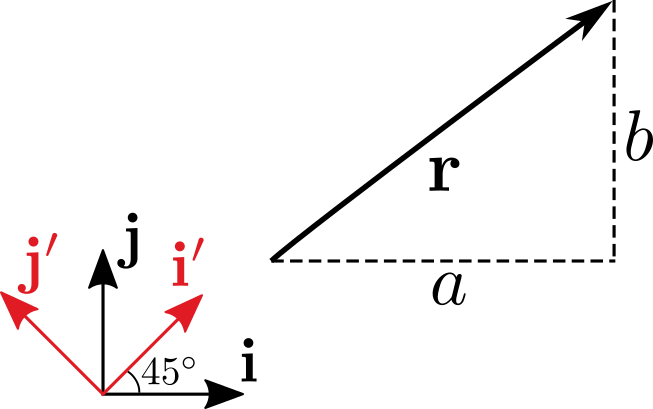

စာဖတ်သူဟာ အထက်တန်းကျောင်းတုန်းက သင်ရတဲ့ vector ဆိုတဲ့အရာတွေနဲ့တော့ ရင်းနှီးပြီးသားဖြစ်မယ်လို့ထင်ပါတယ်။ အလွယ်ပြောရရင်တော့ vector ဆိုတာပမာဏ (magnitude) နဲ့ လားရာ (direction) ရှိတဲ့ မြားလိုအရာတစ်ခုပေါ့။ ဒီဘလော့မှာလည်း vector အကြောင်းရေးထားတဲ့ အရင်ကဆောင်းပါးတစ်ချို့ ရှိပါတယ် ([1](http://theinlinaung.com/vectors/), [2](http://theinlinaung.com/vectors-part-2/), [3](http://theinlinaung.com/vectors-revised/))။ အခုပြောမယ့် linear vector spaces ထဲမှာပါတဲ့ vector တွေကလည်း သမားရိုးကျ vector တွေနဲ့ ဆင်တူပါတယ်။ ဒါပေမယ့်ဒီနေရာမှာတော့ vector ရဲ့ အဓိပ္ပာယ်ဖွင့်ဆိုချက်ကို ပိုပြီးတော့ ယေဘူယျကျအောင် physical နည်းနဲ့မဟုတ်ပဲ သင်္ချာနည်းနဲ့ဖွင့်ဆိုသွားမှာဖြစ်ပါတယ်။ ဘာလို့ဒီလိုယေဘူယျပြုရသလဲဆိုရင် vector တွေရဲ့ဂုဏ်သတ္တိကို သင်္ချာတွက်ချက်မှုတွေမှာ အသုံးချချင်လို့ဖြစ်ပါတယ်။ ဒီလို generalize လုပ်တာက သင်္ချာရဲ့အစွမ်းထက်တဲ့နည်းစနစ်တစ်ခုဖြစ်ပြီး vector သဘောတရားက သိပ္ပံနဲ့အင်ဂျင်နီယာသီအိုရီတွေမှာ ပိုပြီးတော့အသုံးဝင်လာမှာဖြစ်ပါတယ်။

ကဲ ဒီတော့ အခြေခံရူပဗေဒမှာတွေ့ရတဲ့ vector ကို သင်္ချာရှုထောင့်ကနေ ဘယ်လိုဖွင့်ဆိုမလဲ။ အရင်ဆုံး vector တစ်ခုမှာရှိရမယ့် ဂုဏ်သတ္တိတွေကို ဖော်ထုတ်ရပါမယ်။ ပြီးရင်အဲ့ဒီ့ဂုဏ်သတ္တိတွေရှိတဲ့အရာအားလုံးကို vector လို့ခေါ်ဆိုကြောင်း အဓိပ္ပာယ်သတ်မှတ်ရပါတယ်။ ဒီဂုဏ်သတ္တိတွေက vector တစ်ခုမှာ ပါကိုပါရမယ့်အရေးပါတဲ့အရာတွေဖြစ်ရမယ်၊ သူတို့ကနည်းလွန်းနေရင် အဓိပ္ပာယ်သတ်မှတ်ချက်က မပြည့်စုံဘူးဖြစ်နေမယ်၊ များလွန်းနေရင်လည်း အရမ်းကန့်သတ်ထားသလိုဖြစ်ပြီး အသုံးမဝင်ပဲနေမယ် \[[1](#references)\]။ ဒီလိုမျိုး သင်္ချာဆိုင်ရာဝတ္ထုတစ်ခုရဲ့ ရှိရမယ့်ဂုဏ်သတ္တိ၊ အရည်အသွေးတွေကို ရုပ်ဝတ္ထုလောက ကနေ အပိုအလိုမရှိပဲ ဆွဲယူအသုံးချတာကို abstraction လုပ်တယ်လို့ခေါ်ပါတယ်။ Abstraction တစ်ခုဟာ ရုပ်ဝတ္ထုလောက ကနေဆင်းသက်လာနိုင်ပေမယ့် သင်္ချာကမ္ဘာထဲရောက်တဲ့အခါ တိကျတဲ့အဓိပ္ပာယ်ဖွင့်ဆိုချက်နဲ့ ဂုဏ်သတ္တိတွေပဲကျန်ပါတော့တယ်။ ဒီတော့ မြားလေးတွေနဲ့ ကိုယ်စားပြုမြင်ယောင်ကြည့်လို့ရတဲ့ ရုပ်လောကက vector ဟာ သင်္ချာနယ်ပယ်ထဲမှာ မြင်ယောင်ကြည့်လို့မရတော့တာလည်း ဖြစ်နိုင်ပါတယ်။ ဒါပေမယ့် သဘောတရားအရ မြားအနေနဲ့စဉ်းစားတာကလည်း အထောက်အကူတော့ဖြစ်ပါတယ်။

(မှတ်ချက်။ ဤဆောင်းပါးတွင် classical vector ဆိုသည်မှာ အထက်တန်းကျောင်းတွင်သင်ရသော မြားကဲ့သို့အရာများအတွက်သုံးပြီး abstract vector (သို့) vector ဆိုသည်မှာ သင်္ချာပညာဖြင့်ယေဘူယျပြု ဖွင့်ဆိုထားသော အရာများကိုဆိုလိုသည်။) ဒီဆောင်းပါးမှာ vector တွေကို စာလုံးအမည်း ($ \mathbf{p}, \mathbf{q}, \cdots $) လို့ပြပြီး scalar တွေကိုတော့ ပုံမှန်စာလုံးနဲ့ပြပါမယ်။ ဒီတော့ abstract vector တစ်ခုကို သင်္ချာပညာရှင်တွေက ဘယ်လိုဖွင့်ဆိုထားလဲကြည့်ရအောင်။

## Vector space ဖွင့်ဆိုချက်

Vector space $ \mathcal{V} $ တစ်ခုသည် vector ဆိုသောအရာများတည်ရှိသော နေရာတစ်ခုဖြစ်သည်။ ထို vector များအတွက် အောက်ပါအချက်များလိုအပ်သည်။

- Vector များပေါင်းလဒ်ကိုရှာရန် တိကျသောသတ်မှတ်ချက်ရှိရမည်။ $ (\mathbf{p}+\mathbf{q}+\mathbf{r}+…) $
- Vector များနှင့် scalar များမြှောက်ရန် တိကျသောသတ်မှတ်ချက်ရှိရမည်။ $ (a\mathbf{p}, b\mathbf{q}, c\mathbf{r}, …) $

ပြီးတော့ ဒီပေါင်းလဒ်နဲ့ မြှောက်လဒ်တွေက အောက်ကအချက်တွေကို လိုက်နာရပါမယ်။

- ထိုတွက်ချက်မှုများပြီးပါက ရရှိလာသော vector သည် vector space အတွင်းတွင်ရှိရမည်။ $ \mathbf{p}+\mathbf{q} \in \mathcal{V} $
- scalar မြှောက်လဒ်သည် vector များအတွက် ဖြန့်ဝေရဂုဏ်သတ္တိကို လိုက်နာသည်။ $ a(\mathbf{p}+\mathbf{q})=a \mathbf{p}+b \mathbf{q} $
- scalar မြှောက်လဒ်သည် scalar များအတွက် ဖြန့်ဝေရဂုဏ်သတ္တိကို လိုက်နာသည်။ $ (a+b) \mathbf{p} = a \mathbf{p} + b \mathbf{p} $
- scalar မြှောက်လဒ်သည် စုစည်းခြင်းဂုဏ်သတ္တိကို လိုက်နာသည်။ $ a(b \mathbf{p}) = ab \mathbf{p} $
- ပေါင်းခြင်းသည် ရှေ့နောက်ပြောင်းနိုင်သည်။ $ \mathbf{p}+\mathbf{q} = \mathbf{q}+\mathbf{p} $
- ပေါင်းခြင်းသည် ဖြန့်ဝေရဂုဏ်သတ္တိကို လိုက်နာသည်။ $ \mathbf{p}+(\mathbf{q}+\mathbf{r})=(\mathbf{p}+\mathbf{q})+\mathbf{r} $
- null vector ဟုခေါ်သော သုည vector တစ်ခုရှိရမည်။ $ \mathbf{p}+\mathbf{0}=\mathbf{p} $
- vector တစ်ခုစီအတွက် ပေါင်းခြင်းပြောင်းပြန် (additive inverse) ရှိရမည်။ $ \mathbf{p}+(-\mathbf{p})=\mathbf{0} $

ဒီ definition တွေက ပမာဏနဲ့ဦးတည်ချက်ရှိရမယ်ဆိုတာထက် ပိုပြီးရှုပ်ထွေးနေသလိုပါပဲ။ ဒါပေမယ့် ဒီဖွင့်ဆိုချက်တွေက classical vector နဲ့လုံးဝမသက်ဆိုင်တာတော့မဟုတ်ပါဘူး။ ဒီထဲက $ \mathbf{p},\mathbf{q} $ vector တွေကို သိပြီးသား classical vector တွက်ချက်မှုတွေနဲ့ နှိုင်းယှဉ်ကြည့်ရင် ဘာမှမကွာဘူးဆိုတာ တွေ့နိုင်ပါတယ်။

Vector space ဆိုတာ vector အမျိုးအစားတစ်ခုထဲမှာ ဖြစ်နိုင်တဲ့ vector အားလုံးကိုကိုယ်စားပြုတဲ့ space တစ်ခုဖြစ်ပါတယ်။ ဥပမာ Euclidean vector space ဆိုရင် 2D ပြင်ညီ (သို့) 3D ဟင်းလင်းပြင်ထဲမှာရှိတဲ့ classical vector တွေအားလုံးပါဝင်ပါတယ်။ အပေါ်ကဖွင့်ဆိုချက်တွေကို သတိထားကြည့်ရင် vector တစ်ခုမှာ ပမာဏနဲ့ဦးတည်ရာရှိရမယ် ဆိုတဲ့အချက် မပါတာကိုတွေ့ရပါလိမ့်မယ်။ ဒါကြောင့် vector ရဲ့အဓိပ္ပာယ်ကပိုပြီးကျယ်ပြန့်သွားပါတယ်။ ဒါကအခုသိပ်ပြီးမရှင်းသေးရင် နောက်ဥပမာတွေတွေ့တဲ့အခါ ပိုပြီးသဘောပေါက်ပါလိမ့်မယ်။ အခုနောက်ထပ် vector space တွေအတွက်အရေးကြီးတဲ့ ဥပဒေသတစ်ခုကိုထပ်ပြီး မိတ်ဆက်ပါမယ်။

## Linear dependency

Vector နှစ်ခု $ \mathbf{p} $ နဲ့ $ \mathbf{q} $ ရှိတယ်ဆိုပါစို့။ စဉ်းစားရလွယ်အောင် သူတို့ကပြင်ညီတစ်ခုပေါ်မှာရှိတဲ့ Euclidean vector (သို့) classical vector နှစ်ခုလို့ထားပါ။ ဒီ vector နှစ်ခုကို scalar ကိန်းနှစ်ခု a နဲ့ b နဲ့မြှောက်လိုက်မယ် (ဖွင့်ဆိုချက် ၂ အတိုင်း)၊ ပြီးတော့ သူတို့နှစ်ခုကို ပေါင်းလိုက်မယ် (ဖွင့်ဆိုချက် ၁ အတိုင်း)။ ဒါကို linear combination လုပ်တယ်လို့ခေါ်ပါတယ်။ တကယ်လို့ပေါင်းလဒ်က zero vector/null vector တစ်ခုဖြစ်နေတယ်ဆိုရင် $ \mathbf{p} $ နဲ့ $ \mathbf{q} $ က linearly dependent ဖြစ်တယ်လို့ဆိုပါတယ်။

$$
a\mathbf{p}+b\mathbf{q}=\mathbf{0}
$$

ဒီညီမျှခြင်းကိုပဲ နောက်တစ်မျိုးရေးလို့ရတာက $ a\mathbf{p}=-b\mathbf{q}, \ \mathbf{p}=-\frac{b}{a}\mathbf{q} $ လို့ရေးလို့ရပါတယ်။ ဒီတော့ vector $ \mathbf{p} $ ကို $ \mathbf{q} $ နဲ့ scalar မြှောက်ဖော်ကိန်းတစ်ခုသုံးပြီး ဖော်ပြလို့ရနေပါတယ်။ ဒီနေရာမှာ a နဲ့ b က သုညကလွဲပြီး ကြိုက်ရာကိန်းဖြစ်လို့ရတာကို သတိပြုပါ (a=b=0 ဖြစ်ရင်တော့ ရလဒ်က zero vector ရတာ မဆန်းဘူးလေ၊ ဒါကိုတော့ trivial case လို့ခေါ်ပါတယ်)။ ဒီတော့ linear dependence ကိုနောက်တစ်မျိုးအဓိပ္ပာယ်ဖွင့်မယ်ဆိုရင် vector နှစ်ခုရှိရင်၊ vector တစ်ခုနဲ့ မြှောက်ဖော်ကိန်းတစ်ခုကိုသုံးပြီး vector နောက်တစ်ခုကိုဖော်ပြလို့ရမယ်ဆိုရင် သူတို့နှစ်ခုက linearly dependent ဖြစ်ပါတယ်။ ဒီလုံပုံစံနဲ့ ဘယ်လိုမှရေးလို့မရဘူးဆိုရင်တော့ linearly independent ပေါ့။ ဒီသဘောတရားကိုပဲ နှစ်ခုထက်ပိုတဲ့ vector တွေအတွက် အသုံးချလို့ရပါတယ်။ ဥပမာ vector သုံးခုရှိတယ်ဆိုရင်-

$$
a \mathbf{p}+b \mathbf{q} + c \mathbf{r} = \mathbf{0}\\
a \mathbf{p} = -b \mathbf{q} - c \mathbf{r}\\
b \mathbf{q} = -a \mathbf{p} - c \mathbf{r}\\
c \mathbf{r} = -a \mathbf{p} - b \mathbf{q}\\
$$

ဒီညီမျှခြင်းထဲကတစ်ခုခု (တကယ်တော့အကုန်အတူတူပဲ) နဲ့ကိုက်ညီတယ်ဆိုရင် $ \mathbf{p,q,r} $ က linearly dependent ဖြစ်ပါတယ်။ ဘာလို့လဲဆိုတော့ $ \mathbf{p,q,r} $ တစ်ခုခုကို ကျန်တဲ့နှစ်ခုပေါင်းစပ်ပြီးဖော်ပြလို့ရနေတဲ့အတွက်ဖြစ်ပါတယ်။

## Bases

နောက်ထပ်အရေးကြီးတဲ့အရာတစ်ခုကတော့ vector တွေရဲ့ base (သို့) basis လို့ခေါ်ပါတယ်။ အထူးသဖြင့် linearly independent basis လို့ခေါ်တဲ့အရာတွေက အလွန်အရေးပါပါတယ်။ ဒီတော့ linearly independent base ဆိုတာဘာလဲ။ အထက်တန်းကျောင်းတုန်းက 2D vector တစ်ခုကိုရေးတဲ့အခါ $ \mathbf{r}=a\mathbf{i}+b\mathbf{j} $ လို့ရေးတာမှတ်မိသေးလားမသိဘူး။ a က $ \mathbf{r} $ ရဲ့ x-component ဖြစ်ပြီး b က $ \mathbf{r} $ ရဲ့ y-component ပေါ့။ ဒီမှာ $ \mathbf{i} $ နဲ့ $ \mathbf{j} $ ကလည်း vector တွေပါပဲ။ ဒါပေမယ့် သူတို့မှာ ထူးခြားချက်ကလေးတွေ ရှိပါတယ်။ ပထမတစ်ချက်က သူတို့မှာ အလျားတစ်ယူနစ်ရှိပါတယ် (အပေါ်မှာတော့ vector တစ်ခုဖြစ်ဖို့ အလျားလို့ခေါ်တဲ့ magnitude သတ်မှတ်ချက်မလိုဘူးလို့ပြောခဲ့ပါတယ်။ ဒါလည်းမှန်ပါတယ်၊ တစ်ချို့ vector အမျိုးအစားတွေအတွက် magnitude ဖွင့်ဆိုချက်က မလွယ်ကူပါဘူး။ ဒါပေမယ့် ဒီနေရာမှာတော့ classical vector အနေနဲ့စဉ်းစားနေတဲ့အတွက် magnitude က vector ရဲ့အလျားဖြစ်ပါတယ်)။ နောက်တစ်ချက်က $ \mathbf{i} $ နဲ့ $ \mathbf{j} $ က x နဲ့ y axis အသီးသီးပေါ်မှာရှိကြတယ်၊ တစ်နည်းပြောရရင် ထောင့်မှန်ကျတယ်ပေါ့။ တစ်ယူနစ် (norm) ရှိပြီး အချင်းချင်းထောင့်မှန်ကျ (orthogonal) တဲ့အတွက် $ \mathbf{i} $ နဲ့ $ \mathbf{j} $ တို့ကို orthonormal vector လို့လည်းခေါ်ကြတယ်။ ထားတော့၊ အရေးကြီးတာက arbitrary vector တစ်ခု $ \mathbf{r} $ ကိုရေးတဲ့ညီမျှခြင်းပဲ။

$$
\mathbf{r}=a\mathbf{i}+b\mathbf{j}
$$

ဒီနေရာမှာ အပေါ်မှာပြောထားတဲ့ linear dependence ကဝင်လာပါပြီ။ အပေါ်ကဖွင့်ဆိုချက်အရ $ \mathbf{r} $ က $ \mathbf{i} $ နဲ့ $ \mathbf{j} $ ပေါ်မှာ linearly dependent ဖြစ်ပါတယ်။ ဒါပေမယ့် $ \mathbf{i} $ နဲ့ $ \mathbf{j} $ နှစ်ခုတည်းပဲ စဉ်းစားရင်ရော $ a\mathbf{i}+b\mathbf{j}=0 $ လို့ရေးလို့ရမလား။ ဒီမေးခွန်းကိုစဉ်းစားဖို့ နည်းလမ်းတစ်ခုထက်မက ရှိပါတယ်။ အလွယ်ဆုံးကတော့ physical ဒါမှမဟုတ် geometrical နည်းအရစဉ်းစားကြည့်ဖို့ပါပဲ။

Zero vector/ null vector တစ်ခုရဖို့ x-component ဘယ်လောက်နဲ့ y-component ကိုသုံးရမလဲ။ ရှင်းပါတယ်၊ x ရော y ရော 0 ဖြစ်နေမှ zero vector ကိုရမှာပေါ့။ ဒီတော့ $ a\mathbf{i}+b\mathbf{j}=0 $ ကိုရဖို့ တစ်ခုတည်းသောနည်းလမ်းက a=b=0 ဖြစ်မှရပါမယ်။ ဒီ trivial case ကလွဲပြီး တစ်ခြားနည်းနဲ့ $ a\mathbf{i}+b\mathbf{j}=0 $ ကိုရေးလို့မရတဲ့အတွက် $ \mathbf{i} $ နဲ့ $ \mathbf{j} $ က linearly independent ဖြစ်ပါတယ်။ Geometrical နည်းအရလည်း ထောင့်မှန်ကျ vector နှစ်ခုရဲ့ component တွေက ဆက်စပ်မှုမရှိပါဘူး။

$ \mathbf{r}=a\mathbf{i}+b\mathbf{j} $ ကို matrix ပုံစံနဲ့ရေးရင်−

$$
\mathbf{r}=\begin{bmatrix}
a&b
\end{bmatrix}\begin{pmatrix}
\mathbf{i}\\
\mathbf{j}
\end{pmatrix}
$$

$ a,b $ ကို $ \mathbf{r} $ ရဲ့ component တွေလို့ခေါ်ပြီး $ \mathbf{i}, \mathbf{j} $ ကိုတော့ $ \mathbf{r} $ ရဲ့ base/basis လို့ခေါ်ပါတယ်။ Vector တွေရဲ့ base ကိုဖျောက်ပြီးတော့ component တွေချည်းပဲလည်း ရေးလေ့ရှိပါတယ်။

$$
\mathbf{r}=\begin{bmatrix}
a&b
\end{bmatrix}^T=\begin{pmatrix}
a\\
b
\end{pmatrix}
$$

ဒီတော့ vector $ \mathbf{i} $ နဲ့ $ \mathbf{j} $ ကိုလည်း သူ့ base အတိုင်း component တွေနဲ့ရေးရင်−

$$
\mathbf{i}=\begin{pmatrix}
1\\
0
\end{pmatrix},\\
\mathbf{j}=\begin{pmatrix}
0\\1
\end{pmatrix}
$$

$ \mathbf{i} $ နဲ့ $ \mathbf{j} $ က x-axis နဲ့ y−axis ကို ကိုယ်စားပြုတယ်လို့ ပြောခဲ့ပေမယ့် base တွေက အဲ့လိုမဟုတ်လည်းရပါတယ်။ ဥပမာ $ \mathbf{i} $ နဲ့ $ \mathbf{j} $ ကိုပုံထဲကအတိုင်း $ 45 \\degree $ လှည့်လိုက်မယ်ဆိုပါတော့။ လှည့်လိုက်တဲ့ base ကို $ \mathbf{i}' $ နဲ့ $ \mathbf{j}' $ လို့ခေါ်စို့။

$ \mathbf{i}' $ နဲ့ $ \mathbf{j}' $ ကို မူလ basis နဲ့ရေးရင်−

$$
\begin{alignedat}{2}
\mathbf{i}'&=&cos(45)\mathbf{i}+sin(45)\mathbf{j}\\
\mathbf{j}'&=&-cos(45)\mathbf{i}+sin(45)\mathbf{j}\\
\end{alignedat}\\
\mathbf{i}'=\frac{1}{\sqrt{2}}\begin{pmatrix}
1\\
1
\end{pmatrix},\\
\mathbf{j}'=\frac{1}{\sqrt{2}}\begin{pmatrix}
-1\\
1
\end{pmatrix}
$$

$ \mathbf{i}' $ နဲ့ $ \mathbf{j}' $ ကလည်း အချင်းချင်းထောင့်မှန်ကျတဲ့အတွက် linearly independent basis ပဲဖြစ်ပါတယ်။ Vector $ \mathbf{r} $ ကို basis အသစ်မှာရေးမယ်ဆိုရင်−

$$
\mathbf{r}=c \mathbf{i}'+d \mathbf{j}'=\begin{bmatrix}
c&d
\end{bmatrix}\begin{pmatrix}
\mathbf{i}'\\\mathbf{j}'
\end{pmatrix}
$$

ဒီ component အသစ် c နဲ့ d ကို a, b နဲ့ $ \mathbf{i} \to \mathbf{i}', \mathbf{j} \to \mathbf{j}' $ ဆက်သွယ်ချက်တွေကနေရှာလို့ရပါတယ်။ ပိုလွယ်တဲ့နည်းကတော့ dot product ဆိုတာကိုသုံးပြီးရှာတာပါ။ ဒီနည်းကိုတော့ နောက်ပိုင်းမှာဖော်ပြပါမယ်။

ဒီတော့ vector တစ်ခုကို component တွေနဲ့ဖော်ပြချင်ရင် အရင်ဆုံး (orthonormal) base တစ်ခုကို သတ်မှတ်ရမှာပါ။ ပြီးရင် base vector တစ်ခုစီအတွက် မြှောက်ဖော်ကိန်း (သို့) component တွေကို ဖော်ပြရပါမယ်။ ဒီလိုမျိုး basis vector တွေကို scalar မြှောက်ဖော်ကိန်းတွေနဲ့မြှောက်ပြီး ပေါင်းထားတာကို linear combination of basis လို့ခေါ်ပါတယ်။ ဒီတော့ ယေဘူယျပြောရရင် vector တစ်ခုကို linear combination of basis တွေနဲ့တည်ဆောက်ထားတယ်လို့ သတ်မှတ်လို့ရပါတယ်။

## Vector ၏ dimension

Vector space တစ်ခုရဲ့ dimension ကို linearly independent basis အများဆုံး ဘယ်နှစ်ခုရှိသလဲဆိုတာနဲ့ သတ်မှတ်ပါတယ်။

ဒီသတ်မှတ်ချက်အရ 3D-physical vector တစ်ခုကိုဖော်ပြချင်ရင် orthonormal basis $ {\mathbf{i},\mathbf{j},\mathbf{k}} $ ကို define လုပ်ပြီးတော့−

$$
\mathbf{r}=\begin{bmatrix}
a&b&c
\end{bmatrix}\begin{pmatrix}
\mathbf{i}\\ \mathbf{j}\\ \mathbf{k}
\end{pmatrix}=a \mathbf{i} + b \mathbf{j} + c \mathbf{k}
$$

လို့ရေးရပါမယ် (ဒါမှမဟုတ် component တွေချည်းပဲရေး)။ Classical vector/Euclidean vector တွေက ရင်းနှီးပြီးသားဖြစ်တဲ့ 2D/3D physical space/Euclidean space ထဲမှာတည်ရှိပါတယ်။ ဒါဆို linearly independent basis ၄ ခုရှိတဲ့ 4−dimensional vector ဆိုရင်ရော။ ဥပမာ− $ \\{\mathbf{i},\mathbf{j},\mathbf{k},\mathbf{l}\\} $ ကို−

$$
\mathbf{i} = \begin{pmatrix}
1\\0\\0\\0
\end{pmatrix},\\
\mathbf{j} = \begin{pmatrix}
0\\1\\0\\0
\end{pmatrix},\\
\mathbf{k} = \begin{pmatrix}
0\\0\\1\\0
\end{pmatrix},\\
\mathbf{l} = \begin{pmatrix}
0\\0\\0\\1
\end{pmatrix}
$$

လို့ define လုပ်ပြီး-

$$
\mathbf{r}=\begin{bmatrix}
a&b&c&d
\end{bmatrix}\begin{pmatrix}
\mathbf{i}\\ \mathbf{j}\\ \mathbf{k}\\ \mathbf{l}
\end{pmatrix}=a \mathbf{i} + b \mathbf{j} + c \mathbf{k} + d \mathbf{l}
$$

လို့ရေးလို့ရမယ်။ 4 dimensional vector ကိုပုံဆွဲပြလို့မရပေမယ့် vector တစ်ခုဖြစ်တယ်ဆိုတာကိုတော့ vector ဖွင့်ဆိုချက်တွေအကုန်လုံးနဲ့ ကိုက်ညီကြောင်း စစ်ကြည့်လို့ရပါတယ်။ ဒီနည်းကိုသုံးပြီးတော့ n-dimensional vector တွေကို define လုပ်လို့ရပါတယ်။ ဒီကစပြီးတော့ 3D အထိပဲရှိနိုင်တဲ့ classical vector တွေကို n-dimensional အထိ abstract လုပ်လိုက်တဲ့ သဘောတရားကိုမြင်နိုင်ပါတယ်။

### References

1. Basic Training in Mathematics (R. Shankar)
2. [Elementary Linear Algebra (K. R. Matthews)](http://www.numbertheory.org/book/mp103.pdf)

<Blockquote author="Daniel Bernoulli">
There is no philosophy which is not founded upon knowledge of the phenomena, but it is absolutely necessary to be a mathematician to get any profit from this knowledge.
</Blockquote>
