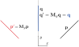

## Operator များ

ယေဘူယျအနေနဲ့ operator ဆိုတာ input တစ်ခုကို ပြောင်းလဲမှု (transformation) တွေလုပ်ပြီး output ထုတ်ပေးတဲ့ အရာတစ်ခုပဲဖြစ်ပါတယ်။ ဥပမာ differential operator $ \frac{d}{dx} $ ကိုသုံးလိုက်ရင် သူ့နောက်က expression (input) ကို $ x $ အလိုက် differentiate လုပ်ထားတဲ့ output ကိုရပါတယ်။ ဆိုလိုတာက $ \frac{d}{dx} f(x) $ ဆိုရင် $ f $ ရဲ့ $ x $ အလိုက်ပြောင်းလဲနှုန်းကို ထုတ်ပေးပါတယ်။ ဒီအတိုင်းပဲ vector space တစ်ခုအတွက် operator ဆိုတာ input vector တစ်ခုကိုထည့်လိုက်ရင် output vector တစ်ခုထွက်လာတဲ့ transformation တစ်ခုပဲဖြစ်ပါတယ်။

$$
\mathbf{A} \mathbf{p}=\mathbf{p}'
$$

ဥပမာ 2D vector တစ်ခုကို y-axis ပေါ်မှာ reflect (mirror) လုပ်တယ်ဆိုရင် x-component ကို လက္ခဏာပြောင်းလိုက်တာနဲ့ အတူတူပါပဲ။ ဒီ transformation ကို $ \mathbf{M}_y $ လို့ခေါ်စို့။

Vector transformation operator တွေကို matrix ပုံစံနဲ့ ရေးလေ့ရှိပါတယ်။ Transformation လုပ်တဲ့အခါ matrix နဲ့ vector ကိုမြှောက်လိုက်ရုံပါပဲ။ $ \mathbf{M}_y $ operator အတွက် matrix ပုံစံကတော့−

$$
\mathbf{M}_y=\begin{bmatrix}
-1 & 0 \\
0 & 1
\end{bmatrix} \\

\mathbf{M}_y \mathbf{p} = \begin{bmatrix}
-1 & 0 \\
0 & 1
\end{bmatrix} \begin{pmatrix} p_x \\ p_y \end{pmatrix} =
\begin{pmatrix} -p_x + 0 \\ 0+ p_y \end{pmatrix} =
\begin{pmatrix} -p_x \\ p_y \end{pmatrix} = \mathbf{p}'
$$

ဒီတော့ $ n $-Dimensional vector တွေအတွက် transformation matrix က $ n\times n $ dimension ရှိမယ်ဆိုတာ ထင်ရှားပါတယ်။ နောက်ဥပမာအနေနဲ့ 2D vector တစ်ခုကို $ z $-axis ပေါ်မှာ $ \theta $ ဒီဂရီ ( counter-clockwise) လှည့်လိုက်တဲ့ transformation ကို rotation operator $ \mathbf{R}_z(\theta) $ လို့ခေါ်လိုက်ရင်−

$ \mathbf{R}_z $ ရဲ့ matrix က−

$$
\mathbf{R}_z(\theta)=\begin{bmatrix} \cos \theta & \sin \theta \\
-\sin \theta & \cos \theta \end{bmatrix}
$$

Identity operator $ \mathbf{I} $ ဆိုရင်တော့ input နဲ့ output က အတူတူပါပဲ။

$$
\mathbf{I}\mathbf{p}=\mathbf{p} \\
\mathbf{I} = \begin{bmatrix} 1 & 0 \\ 0 & 1 \end{bmatrix}
$$

Vector operator တွေထဲမှာ အထူးသဖြင့် linear transformation လုပ်ပေးတဲ့ operator တွေကအရေးပါပါတယ်။ Linear transformation ဆိုတာ input နဲ့ output ဆက်သွယ်ချက်က linear ဖြစ်နေတာကို ပြောတာပါ။ ဥပမာ input ကိုနှစ်ဆတိုးလိုက်မယ်ဆိုရင် output ကလည်း နှစ်ဆလိုက်တိုးမယ်ပေါ့။ ဒီတော့ input ကို $ \lambda $ အဆတိုးပြီးမှ operate လုပ်တာနဲ့ output ကို $ \lambda $ ဆတိုးတာနဲ့ အတူတူပါပဲ။ သင်္ချာလိုပြောရင် linear transformation operator တစ်ခု $ \mathbf{A} $ ကအောက်ပါညီမျှခြင်းကို လိုက်နာပါတယ်။

$$
\mathbf{A}(\lambda \mathbf{p})=\lambda \mathbf{A}(\mathbf{p})
$$

Linear operation တစ်ခုအတွက် နောက်ဆက်တွဲက အပေါင်းဖြန့်ဝေရဂုဏ်သတ္တိကို လိုက်နာတာပါပဲ။ ဒီတော့ vector နှစ်ခု $ \mathbf{a}, \mathbf{b} $ ကို linear combination လုပ်ထားတဲ့ဟာကို operate လုပ်တာက component တွေကို operate လုပ်ပြီး linear combination လုပ်တာနဲ့တူပါတယ်။

$$
\mathbf{A}(\alpha\mathbf{a}+\beta\mathbf{b})=\alpha(\mathbf{A}\mathbf{a})+\beta(\mathbf{A}\mathbf{b}) \\ \forall  \\ \mathbf{a},\mathbf{b}\in\R^n, \alpha,\beta\in\R
$$

အပေါ်ကညီမျှခြင်းမှာ vector $ \mathbf{a} $ နဲ့ $ \mathbf{b} $ က linearly independent basis တစ်ခုဖြစ်မယ်ဆိုရင် $ \mathbf{p}=\alpha\mathbf{a}+\beta\mathbf{b} $ က 2D vector တစ်ခုဖြစ်ပြီး ညီမျှခြင်းညာဘက်ခြမ်းက $ \mathbf{A} \mathbf{p} $ နဲ့အတူတူပါပဲ။ ဒီတော့ operator တစ်ခုက basis vector တွေကိုဘယ်လိုပြောင်းလဲစေလဲဆိုတာသိရင် အဲ့ဒီ့ basis ထဲက vector တွေအကုန်လုံးရဲ့ ပြောင်းလဲမှုကို တွက်လို့ရပါတယ်။

Linear transformation operator တွေကို tensor လို့လည်းခေါ်ပါတယ်။ Euclidean vector တွေရဲ့ linear transformation ကိုတော့ second rank tensor (matrix) တွေကို အသုံးပြုပါတယ်။ 2D space ဆိုရင် 2x2 matrix, 3D space ဆိုရင် 3x3 matrix ပေါ့။ [အရှေ့ပိုင်းမှာတုန်းက](http://theinlinaung.com/linear-vector-spaces-3/) tensor ဆိုတာ vector space တစ်မျိုးပဲလို့ပြောခဲ့တဲ့အတွက် ယေဘူယျအားဖြင့် tensor တစ်ခုက အနေအထား (state) ကိုဖော်ပြတာဖြစ်နိုင်သလို ပြောင်းလဲမှု (transformation) ကိုဖော်ပြတာလည်း ဖြစ်နိုင်ပါတယ်။

## Eigenvectors/ Eigenvalues

အရှေ့မှာပြောထားတဲ့အတိုင်း ယေဘူယျအားဖြင့် operator တစ်ခုက input vector နဲ့မတူတဲ့ (transform ဖြစ်သွားတဲ့) output vector တစ်ခုကိုထုတ်ပေးပါတယ်။ ဒါပေမယ့် တစ်ချို့ vector တွေအတွက် angle မပြောင်းပဲ component ကိုပဲ scale ဖြစ်စေတဲ့ special vector တွေရှိပါတယ်။ ဒါကဘာကိုပြောတာလဲ။ ဥပမာ y-axis reflection operator $ \mathbf{M}_y $ ကို y-axis ပေါ်မှာရှိနေတဲ့ (သို့) y-axis နဲ့အပြိုင်ရှိနေတဲ့ vector ကိုထည့်လိုက်ရင် ဒီ vector ပဲပြန်ရပါတယ်။ ဒီတော့ y-axis နဲ့အပြိုင် vector တွေကို $ \mathbf{M}_y $ က မပြောင်းလဲစေပါဘူး။

$$
\mathbf{q}=\begin{pmatrix} 0 \\ 1 \end{pmatrix} \\
\mathbf{M}_y \mathbf{q}=\begin{bmatrix}
-1 & 0 \\
0 & 1
\end{bmatrix} \begin{pmatrix} 0 \\ 1 \end{pmatrix}=
\begin{pmatrix} 0 \\ 1 \end{pmatrix}=\mathbf{q}
$$

$ \mathbf{M}_y $ က x-axis နဲ့ပြိုင်တဲ့ vector တွေပေါ်ကိုရော ဘယ်လိုသက်ရောက်မှုရှိမလဲ။ သူက x-component ကို လက္ခဏာပြောင်းစေတဲ့အတွက် direction ဆန့်ကျင်ဘက်ဖြစ်သွားတဲ့ vector ကိုထုတ်ပေးပါတယ်။ တစ်နည်းပြောရရင် input vector ကို $ -1 $ နဲ့မြှောက်လိုက်တာနဲ့ အတူတူပါပဲ။

ဒီတော့ vector တစ်ခုပေါ်မှာ operator ရဲ့သက်ရောက်မှုက vector ရဲ့ component တွေကို scale factor (scalar) တစ်ခုနဲ့မြှောက်တာနဲ့တူညီတယ်ဆိုတာကို အောက်ကညီမျှခြင်းနဲ့ ရေးလို့ရပါတယ်။

$$
\mathbf{A} \mathbf{p}=\lambda \mathbf{p}
$$

ဒီနေရာမှာ $ \lambda $ က scalar ကိန်းတစ်ခုဖြစ်ပြီး real number (သို့) complex number ဖြစ်နိုင်ပါတယ်။ $ \mathbf{A} $ က linear transformation operator ဖြစ်ပြီး ဒီညီမျှခြင်းကို လိုက်နာတဲ့ vector $ \mathbf{p} $ အားလုံးကို $ \mathbf{A} $ ရဲ့ eigenvector လို့ခေါ်ပါတယ်။ $ \lambda $ ကိုတော့ eigenvalue လို့ခေါ်ပါတယ်။

ဒီဖွင့်ဆိုချက်အရ operator $ \mathbf{M}_y $ အတွက် y-axis နဲ့ x-axis ပေါ်က vector တွေအားလုံးက $ \mathbf{M}_y $ ရဲ့ eigenvector တွေဖြစ်ပါတယ်။ ပုံတွေအရ y-axis ပေါ်က vector တွေအတွက် $ \lambda=1 $ ဖြစ်ပြီး x-axis ပေါ်က vector တွေအတွက် $ \lambda=-1 $ ဖြစ်တာကို မြင်နိုင်ပါတယ်။ ဒီတော့ eigenvalue က eigenvector နဲ့အတွဲလိုက်ရှိပါမယ်။

Operator တစ်ခုရဲ့ eigenvalue နဲ့ eigenvector အတွဲတွေကို သင်္ချာနည်းနဲ့ဘယ်လိုရှာမလဲ။ လမ်းစကတော့ အပေါ်ကညီမျှခြင်းကိုသုံးဖို့ပါပဲ။ ဒီတော့−

$$
\begin{aligned}
\mathbf{A} \mathbf{p} &=\lambda \mathbf{p} \\
\mathbf{A} \mathbf{p}-\lambda \mathbf{p} &=\mathbf{0} \\
(\mathbf{A} - \lambda \mathbf{I}) \mathbf{p} &=\mathbf{0} \\
\mathbf{p} &= (\mathbf{A} - \lambda \mathbf{I})^{-1}\mathbf{0}
\end{aligned}
$$

$ \mathbf{0} $ က [Part 1](http://theinlinaung.com/linear-vector-spaces-1/) မှာပြောထားတဲ့ null vector ဖြစ်ပါတယ်။ နောက်ဆုံးညီမျှခြင်းကိုကြည့်လိုက်ရင် inverse operator တစ်ခုက null vector ကိုမြှောက်မှ vector $ \mathbf{p} $ ကိုရပါတယ်။ ပုံမှန်ဆို null vector ကို operate လုပ်ရင် null vector ပဲပြန်ရပါတယ်။ ဒီတော့ inverse operator က infinite ဖြစ်မှရပါလိမ့်မယ်။ Operator ကို matrix နဲ့ကိုယ်စားပြုတဲ့အတွက် infinite operator ဖြစ်ဖို့ matrix ရဲ့ determinant က သုညဖြစ်ရပါလိမ့်မယ်။ ဒီတော့ eigenvector ညီမျှခြင်းကိုပြေလည်ဖို့−

$$ \text{det}(\mathbf{A} - \lambda \mathbf{I})=0 $$

ဒီညီမျှခြင်းကိုသုံးပြီး $ \mathbf{A} $ ရဲ့ eigenvalue $ \lambda $ တွေကိုရှာလို့ရပါတယ်။ ဥပမာအနေနဲ့ $ \mathbf{M}_y $ ရဲ့ eigenvalue တွေကိုရှာကြည့်ရအောင်။

$$
\mathbf{M}_y=\begin{bmatrix}
-1 & 0 \\
0 & 1
\end{bmatrix} \\

\begin{aligned}
\mathbf{M}_y-\lambda \mathbf{I} &=
\begin{bmatrix}
-1 & 0 \\
0 & 1
\end{bmatrix} - \lambda
\begin{bmatrix}
1 & 0 \\
0 & 1
\end{bmatrix} \\
&=
\begin{bmatrix}
-1-\lambda & 0 \\
0 & 1-\lambda
\end{bmatrix} \\

\text{det}(\mathbf{M}_y-\lambda \mathbf{I}) &=
(-1-\lambda)(1-\lambda)-0 \\
0 &= \lambda^2-1
\end{aligned}
$$

နောက်ဆုံးရလာတဲ့ ညီမျှခြင်း $ \lambda^2-1=0 $ ကို $ \mathbf{M}_y $ ရဲ့ characteristic polynomial လို့ခေါ်ပါတယ်။ ဒီညီမျှခြင်းကို ရှင်းလိုက်ရင် $ \lambda $ တန်ဖိုးကိုရပါမယ်။ ညီမျှခြင်းက second order polynomial ဖြစ်တဲ့အတွက် အဖြေကနှစ်ခုရှိပါတယ်။ $ n\times n $ matrix အတွက် eigenvalue အရေအတွက် $ n $ ခုရှိတယ်လို့ ယေဘူယျပြောလို့ရပါတယ်။ ဒီတော့ ညီမျှခြင်းကို ဆက်ရှင်းရင်−

$$
\lambda = \pm 1
$$

ဒီရလဒ်က စောစာကစဉ်းစားထားတဲ့ဟာနဲ့ ကိုက်ညီတာကိုတွေ့ရတယ်။ ဆက်ပြီးတော့ eigenvector တွေကို ဘယ်လိုရှာမလဲ။ ရှင်းပါတယ်၊ မူလ eigenvector ညီမျှခြင်းမှာ အစားသွင်းရုံပါပဲ။ ဒီတော့ $ \lambda $ တန်ဖိုးတစ်ခုစီအတွက် သက်သက်စီရှာကြည့်ရအောင်။ အရင်ဆုံး $ \lambda=1 $ အတွက် eigenvector ကို $ \mathbf{p}_1 $ လို့ထားပြီး သူ့ component တွေကို မသိကိန်း $ x,y $ လို့ထားပါ။

$$
\mathbf{M}_y \mathbf{p} =\lambda \mathbf{p} \\
\begin{aligned}
  \lambda=1 \Rightarrow
  \mathbf{M}_y \mathbf{p}_1 &= \mathbf{p}_1 \\
  \begin{bmatrix}
  -1 & 0 \\
  0 & 1
  \end{bmatrix}
  \begin{pmatrix} x \\ y \end{pmatrix}
  &= \begin{pmatrix} x \\ y \end{pmatrix} \\
  \begin{pmatrix} -x \\ y \end{pmatrix} &=
  \begin{pmatrix} x \\ y \end{pmatrix}
\end{aligned} \\
-x=x,y=y
$$

နောက်ဆုံးညီမျှခြင်းနှစ်ကြောင်းကိုပြေလည်စေတဲ့ $ x,y $ တန်ဖိုးတွေက $ x=0 $ နဲ့ $ y $ က arbitrary ကိန်းဖြစ်တာကို တွေ့နိုင်ပါတယ်။ $ x=0 $ က y-axis ပေါ်မှာရှိပြီး y တန်ဖိုးက ကြိုက်တဲ့ကိန်းဖြစ်လို့ရတဲ့အတွက် y-axis ပေါ်က vector အားလုံးက $ \mathbf{M}_y $ ရဲ့ eigenvector တွေလို့ပြောလို့ရပါတယ်။ ဒါပေမယ့် matrix ရဲ့ eigenvector ကို တစ်ယူနစ်အလျားရှိတဲ့ normalized vector အနေနဲ့ဖော်ပြလေ့ရှိပါတယ်။ ဒီတော့ normalization condition က−

$$
\|\mathbf{p}\|= \sqrt{\mathbf{p} \cdot \mathbf{p}} = \sqrt{x^2+y^2}=1
$$

ဆိုတဲ့ညီမျှခြင်းကိုပါပြေလည်ရပါမယ်။ $ x=0 $ ကိုသိပြီးဖြစ်တဲ့အတွက် $ y=1 $ ကိုရပါတယ်။ ဒီတော့-

$$
\lambda=1 \Rightarrow \mathbf{p}_1= \begin{pmatrix} 0 \\ 1 \end{pmatrix}
$$

က $ \mathbf{M}_y $ ရဲ့ eigenvector တစ်ခုဖြစ်ပါတယ်။ ဒီ vector က normalized လုပ်ထားတဲ့အတွက် eigenvector ရဲ့ direction ကိုပဲပြတာဖြစ်ပါတယ်။ ဆိုလိုတာက $ \mathbf{p}_1 $ ကို scalar တစ်ခုနဲ့မြှောက်လိုက်ရင်လည်း ရလာတဲ့ vector က $ \mathbf{M}_y $ ရဲ့ eigenvector ညီမျှခြင်းကို ပြေလည်စေပါတယ်။

အခု နောက် $ \lambda $ တစ်ခုအတွက် eigenvector ကိုထပ်ရှာရအောင်။

$$
\begin{aligned}
\lambda=-1 \Rightarrow
\mathbf{M}_y \mathbf{p}_2 &= -\mathbf{p}_2 \\
\begin{bmatrix}
-1 & 0 \\
0 & 1
\end{bmatrix} \begin{pmatrix} x \\ y \end{pmatrix}
&= -\begin{pmatrix} x \\ y \end{pmatrix} \\
\begin{pmatrix} -x \\ y
\end{pmatrix} &=
\begin{pmatrix} -x \\ -y \end{pmatrix}
\end{aligned} \\
x=x,y=-y \\
y=0 \\
\text{Normalize} \Rightarrow \sqrt{x^2+y^2}=1 \\
x=1 \\
\mathbf{p}_2=\begin{pmatrix} 1 \\ 0 \end{pmatrix}
$$

$ \mathbf{p}_2 $ ကိုကြည့်ပြီး $ \mathbf{M}_y $ ရဲ့ ဒုတိယ eigenvector တွေက x-axis ပေါ်မှာရှိတယ်ဆိုတာ သိနိုင်ပါတယ်။

လေ့ကျင့်ခန်းအနေနဲ့ 2D real vector တွေကို $ 45 \degree $ axis မှာ mirror လုပ်တဲ့ operator $ \mathbf{M} $ ရဲ့ eigenvalue နဲ့ eigenvector တွေကိုရှာကြည့်ပါ။

$$
\mathbf{M}= \begin{bmatrix}
0 & 1 \\
1 & 0 \end{bmatrix}
$$

<Expander show="Show answer" hide="Hide answer">

Step 1: Characteristic polynomial ကနေ eigenvalue တွေကိုရှာပါ

$$
\text{det}(\mathbf{M}-\lambda \mathbf{I})=0 \\
\mathbf{M}-\lambda \mathbf{I}=\begin{bmatrix}
0 & 1 \\
1 & 0 \end{bmatrix} - \lambda \begin{bmatrix}
1 & 0 \\
0 & 1 \end{bmatrix}=\begin{bmatrix}
-\lambda & 1 \\
1 & -\lambda
 \end{bmatrix} \\

\text{det}(\mathbf{M}-\lambda \mathbf{I})=\lambda^2-1=0 \\
\lambda=\pm1
$$

Step 2: Eigenvalue တစ်ခုစီကို eigenvector ညီမျှခြင်းမှာအစားသွင်းပြီး eigenvector ကိုရှာပါ

$$
\lambda_1=1 \Rightarrow \mathbf{M} \mathbf{p}_1 = 1.\mathbf{p}_1 \\
\begin{aligned}
\begin{bmatrix}
0 & 1 \\
1 & 0 \end{bmatrix} \begin{pmatrix} x \\y \end{pmatrix}&= \begin{pmatrix} x \\y \end{pmatrix}\\
\begin{pmatrix} y \\x \end{pmatrix}&=\begin{pmatrix} x\\y \end{pmatrix} \\
x&=y
\end{aligned} \\
\text{Normalize} \Rightarrow \sqrt{x^2+y^2}=1 \\
x=y=\frac{1}{\sqrt{2}} \\
\mathbf{p}_1 = \frac{1}{\sqrt{2}} \begin{pmatrix} 1\\1 \end{pmatrix}

\lambda_2=-1 \Rightarrow \mathbf{M} \mathbf{p}_1 = -1.\mathbf{p}_1 \\
\begin{aligned}
\begin{bmatrix}
0 & 1 \\
1 & 0 \end{bmatrix} \begin{pmatrix} x \\y \end{pmatrix}&= -\begin{pmatrix} x \\y \end{pmatrix}\\
\begin{pmatrix} y \\x \end{pmatrix}&=\begin{pmatrix} -x\\-y \end{pmatrix} \\
y&=-x
\end{aligned} \\
\text{Normalize} \Rightarrow \sqrt{x^2+y^2}=1 \\
x=\frac{1}{\sqrt{2}},\ y=-\frac{1}{\sqrt{2}} \\
\mathbf{p}_2 = \frac{1}{\sqrt{2}} \begin{pmatrix} 1\\-1 \end{pmatrix}
$$

</Expander>

## References

1. Basic Training in Mathematics (R. Shankar)
2. Continuum Mechanics (P. Chadwick)
3. [Elementary Linear Algebra (K. R. Matthews)](http://www.numbertheory.org/book/mp103.pdf)

<Blockquote author="Michael Atiyah">
Algebra is the offer made by the devil to the mathematician
</Blockquote>
