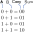

## Bits

ကွန်ပျူတာ၊ စမတ်ဖုန်းနဲ့ တစ်ခြားတွက်ချက်မှုလုပ်ဆောင်နိုင်တဲ့ အီလက်ထရွန်းနစ်ပစ္စည်းတွေမှာ အခြေခံအကျဆုံး အစိတ်အပိုင်းက transistor လို့ခေါ်တဲ့ ခလုတ်လိုမျိုးအဖွင့်အပိတ်လုပ်လို့ရတဲ့ ပစ္စည်းတစ်ခုပဲဖြစ်ပါတယ်။ ဒီ transistor တွေကို အရေအတွက်မြောက်များစွာ silicon ပြားပေါ်မှာထွင်းပြီးတော့ ရှုပ်ထွေးတဲ့ ဆားကစ်ပတ်လမ်းကြောင်းတွေကနေတစ်ဆင့် တစ်စက္ကန့်ကိုအဖွင့်အပိတ်များစွာလုပ်ပြီး တွက်ချက်မှုတွေကို ပြုလုပ်တာဖြစ်ပါတယ် \[[1](http://www.megaprocessor.com/)\]။ ဒီတော့ လျှပ်စစ်စီးနေတဲ့ အဖွင့်အခြေအနေကို 1 လို့သတ်မှတ်ပြီး အပိတ်အခြေအနေကိုတော့ 0 လို့သတ်မှတ်လိုက်ပါတယ်။ ဒီကိန်းနှစ်ခု 0 နဲ့ 1 ကို bit (binary digit) လို့ခေါ်ပါတယ်။ Bit တွေက ကွန်ပျူတာ တွေအတွက် အခြေခံအကျဆုံး အချက်အလက်ယူနစ်ဖြစ်ပါတယ်။ ကိန်းဂဏန်းတွေ၊ ရုပ်ပုံ၊ ဗွီဒီယိုတွေ၊ အခုဖတ်နေတဲ့ စာတွေကိုလည်း 0 နဲ့ 1 ကိုအစဉ်လိုက်ပေါင်းစပ်ပြီး သိမ်းထားတာဖြစ်ပါတယ်။

ဒီတော့ ကွန်ပျူတာတွေက 0 နဲ့ 1 ကလွဲပြီး တစ်ခြားကိန်းတွေကို မသိဘူးဆိုရင် သင်္ချာကိန်းဂဏန်းတွက်ချက်မှု (arithmetic) တွေကို ဘယ်လိုလုပ်သလဲ။ ဥပမာ ၃+၂ ကိုဘယ်လိုတွက်မလဲ။ ဒီတွက်ချက်မှုကိုလုပ်ဖို့ အရင်ဆုံး ကိန်းဂဏန်းတွေကို bit တွေအနေနဲ့ ဖော်ပြရပါမယ်။ လူတွေအသုံးပြုတဲ့ ပုံမှန်ဂဏန်းသင်္ချာမှာ သုညကနေ ကိုးအထိ ကိန်း ၁၀ လုံးရှိပါတယ်။ ဒီကိန်းဆယ်လုံးကို အသုံးပြုတဲ့တွက်ချက်မှုစနစ်ကို decimal arithmetic လို့ခေါ်ပါတယ်။ Decimal ကိန်းတွေကိုသုံးပြီး ရေတွက်ချင်တယ်ဆိုရင် ၁ ကနေစပြီး ၁၊ ၂၊ ၃၊ ...၊ ၈၊ ၉ အထိဆက်တိုက် ရေလို့ရမယ်။ ၉ ပြီးသွားရင် နောက်ထပ်ကိန်းအသစ်မရှိတော့တဲ့အတွက် ၁၀ ဆိုပြီး ကိန်းနှစ်ခု (၁ နဲ့ ၀) ကိုတွဲပြီးရေးရပါတယ်။ ၁၀ မှာ ဘယ်ဘက်က ၁ က ဆယ်နေရာရောက်ကိန်းကိုပြတာဖြစ်ပြီး ညာဘက်က ၀ က ခုနေရာရောက်ကိန်း ကိုပြပါတယ်။ ဒီတော့ ၁၀ ဆိုရင် ဆယ်ကိန်း ၁ နဲ့ ခုကိန်း ၀ ဖြစ်ပါတယ်။ ဒီလို နေရာရောက်ကိန်းနဲ့ သရုပ်ခွဲမယ်ဆိုရင် decimal စနစ်အတွက် ၁၀ ထပ်ညွှန်းတွေကို သုံးရပါမယ်။

$$
10=1\times 10^1 +0\times 10^0
$$

ဒီညီမျှခြင်းမှာ ၁၀ ပေါ်ကထပ်ညွှန်းကိန်းတွေက ခု၊ ဆယ်၊ ရာ စသဖြင့် နေရာရောက်တန်ဖိုး (order of magnitude) ကိုဖော်ပြပြီး သူ့ရှေ့က မြှောက်ဖော်ကိန်းတွေက နေရာရောက်ကိန်းကို ဖော်ပြပါတယ်။ နောက်ဥပမာနှစ်ခုအနေနဲ့ ၂၃ (၂−ဆယ့် ၃−ခု) နဲ့ ၄၂၇ (၄−ရာ ၂−ဆယ် ၇−ခု) ကို ကြည့်ရအောင်။

$$
23=20+3=2\times 10^1 + 3 \times 10^0 \\
427 = 400+20+7=4\times 10^2 + 2 \times 10^1 + 7 \times 10^0
$$

ဒီလိုကိန်းတန်ဖိုးတွေကို ခွဲတဲ့အခါ ၁၀ ထပ်ညွှန်းကိန်းနဲ့ရေးတဲ့အတွက် decimal စနစ်ကို အခြေ ၁၀ (base 10) စနစ်လို့လည်း ခေါ်ပါတယ်။

Decimal ကိန်းနှစ်ခုကို ပေါင်းနည်းကတော့ အားလုံးသိပြီးသားဖြစ်တဲ့အတွက် အထူးတလည်ပြောစရာမလိုပါဘူး။ အဓိကက လက်ရှိနေရာမှာ ၉ ထက်ကျော်သွားရင် ဆယ်ကိန်းကို သူ့ရှေ့ကနေရာကို ပို့ရတာပါပဲ။ (carry) လုပ်တယ်လို့ခေါ်ပါတယ်။ ဥပမာ ၂၇+၁၅ ဆိုရင် ခုကိန်းတွေဖြစ်တဲ့ ၇ နဲ့ ၅ ကိုပေါင်းလိုက်ရင် ၁၂ ရတဲ့အတွက် ၂ ကိုထားခဲ့ပြီး ၁ ကို ဆယ်ကိန်းဘက်ကို ပို့ရပါတယ်။ ဒီတော့ ဆယ်ကိန်းဘက်မှာ ၂+၁+၁ = ၄ ဖြစ်သွားတဲ့အတွက် ရလဒ်က ၄၂ ဖြစ်ပါတယ်။

ကွန်ပျူတာတွေမှာက 0 နဲ့ 1 ပဲရှိတဲ့အတွက် ကိန်းတွေကို binary စနစ်နဲ့ဖော်ပြရပါတယ်။ ဒီစနစ်ကိုသုံးပြီး ရေတွက်မယ်ဆိုရင် ၀ နဲ့ ၁ အတွက် 0 နဲ့ 1 ကိုသုံးပြီး ၁ ကျော်သွားရင် နောက်ထပ်နေရာရောက်တန်ဖိုးကို carry လုပ်ရပါတယ်။ Binary ကိန်းတွေကို နေရာရောက်ကိန်းနဲ့ခွဲရေးရင် ၂ ထပ်ညွှန်းကိန်းတွေနဲ့ရေးရတဲ့အတွက် အခြေ ၂ (base 2) စနစ်လို့လည်းခေါ်ပါတယ်။ အောက်က ဥပမာတွေကို ကြည့်ပါ။ ညီမျှခြင်းရဲ့ ဘယ်ဘက်အစွန်က decimal ကိန်းဖြစ်ပြီး ညာဘက်အစွန်ဆုံးက binary ပုံစံဖြစ်ပါတယ်။

$$
1=1\times 2^0 = 1=(1)_2 \\
2=1 \times 2^1 + 0 \times 2^0 = (10)_2 \\
3 =1 \times 2^1 + 1 \times 2^0= (11)_2  \\
23=1 \times 2^4 + 0 \times 2^3 + 1 \times 2^2+ 1 \times 2^1 +1 \times 2^0=(10111)_2
$$

| Binary | Decimal |
|:------:|:-------:|
| 0      | 0       |
| 1      | 1       |
| 10     | 2       |
| 11     | 3       |
| 100    | 4       |
| 101    | 5       |
| 110    | 6       |
| 111    | 7       |

Decimal ကနေ binary ကိန်းတွေကို ပြောင်းဖို့နဲ့ ပြောင်းပုံအဆင့်ဆင့်ကိုသိဖို့ [ဒီ website](https://www.rapidtables.com/convert/number/decimal-to-binary.html) ကိုသွားကြည့်ပါ။ ဒီတော့ decimal စနစ်က ကိန်းတွေအားလုံးကို binary ပုံစံနဲ့ဖော်ပြလို့ရတဲ့အတွက် bit တွေကို ကွန်ပျူတာတွေမှာ အသုံးချလို့ရပါတယ်။ Binary ကိန်းတွေကို ပေါင်း၊ နှုတ်၊ မြှောက်၊ စား လုပ်တဲ့ သင်္ချာကို binary arithmetic လို့ခေါ်ပြီး ရင်းနှီးပြီးသား decimal arithmetic နဲ့ဘာမှမကွာပါဘူး။ Decimal မှာ ၉ ကျော်ရင် carry လုပ်ရတာနဲ့ binary မှာ ၁ ကျော်ရင် carry လုပ်ရတာပဲကွာပါတယ်။ ဒီတော့ 1 + 1 ကိုတွက်မယ်ဆိုရင်−

$$
\begin{aligned}
1 \\
+ \ 1 \\
\hline
10
\end{aligned}
$$

ညာဘက်အစွန်ဆုံးတိုင်က ကိန်းနှစ်ခုကို စပေါင်းမယ်ဆိုရင် 1+1=2 (10) ဖြစ်တဲ့အတွက် 0 ကိုထားခဲ့ပြီး 1 ကို ဘယ်ဘက်ကို carry လုပ်ရပါမယ်။

2 (10) နဲ့ 3 (11) ကိုပေါင်းမယ်ဆိုရင်ရော၊ ဒီအတိုင်း ညာဘက်ကနေ ဘယ်ဘက်ကို ပေါင်းရုံပါပဲ။

$$
\begin{aligned}
10 \\
+ \ 11 \\
\hline
101
\end{aligned}
$$

ဒီမှာ binary ကိန်းနှစ်ခုကို ပေါင်းတဲ့အခါကျရင် တိုင်တစ်တိုင်ချင်းစီအလိုက်ပေါင်းတဲ့အတွက် အခြေခံအကျဆုံး လုပ်ဆောင်ချက်က input bit နှစ်ခုပေါင်းလဒ်အတွက် output bit ကိုရှာတာပါပဲ။ Input bit နှစ်ခုပေါင်းလဒ်အတွက် ဖြစ်နိုင်ခြေလေးခုရှိပါတယ်။

$$
0+0=00 \\
0+1=01\\
1+0=01\\
1+1=10\\
$$

ဒီတော့ ဒီ input-output bit အတွဲကိုထုတ်ပေးတဲ့၊ တစ်နည်းပြောရရင် input bit တွေထည့်လိုက်ရင် output bit တွေကို ထုတ်ပေးတဲ့ ဆားကစ်ကိုဆောက်နိုင်ရင် ဒီဆားကစ်တွေကိုသုံးပြီးတော့ binary ကိန်းတွေကို ပေါင်းလို့ရပါပြီ။ ဒီလိုဆားကစ်ကို logic gate ဆိုတာတွေသုံးပြီး ဆောက်လို့ရပါတယ်။

## Logic gates

Logic gate ဆိုတာ အဝင် input နဲ့ သတ်မှတ်ထားတဲ့ rule (logic) တစ်ခုကိုသုံးပြီး အထွက် output bit ကိုထုတ်ပေးတဲ့ အရာတစ်ခုပဲဖြစ်ပါတယ်။ ဥပမာ OR gate ဆိုရင် input နှစ်ခုနဲ့ output တစ်ခုပါပြီး သူ့ရဲ့ logic က input နှစ်ခုထဲက အနည်းဆုံးတစ်ခု 1 ဖြစ်တယ်ဆိုရင် output က 1 ဖြစ်ပါတယ်။ လျှပ်စစ်သဘောတရားအရဆိုရင် input နှစ်ခုကို ပြိုင်ဆက် (parallel) ဆက်ထားတာနဲ့ တူညီပါတယ်။ OR gate ရဲ့လုပ်ဆောင်ချက်ကို truth table လို့ခေါ်တဲ့ input-output ဆက်သွယ်ချက်တွေကိုကြည့်ပြီး ရှင်းလင်းလင်းသိနိုင်ပါတယ်။

<Caption>OR-gate အတွက် truth table</Caption>
| Input 1 (A) | Input 2 (B) | Output |
| :---------: | :---------: | :----: |
| 0           | 0           | 0      |
| 0           | 1           | 1      |
| 1           | 0           | 1      |
| 1           | 1           | 1      |

AND gate ဆိုရင်တော့ input နှစ်ခုလုံး 1 ဖြစ်မှ output က 1 ဖြစ်မှာပါ။ ဒါက input နှစ်ခုကို မြှောက်တာနဲ့ တူညီပါတယ်။

<Caption>AND-gate အတွက် truth table</Caption>
| A   | B   | Out |
| :-: |:--: | :-: |
| 0   | 0   | 0   |
| 0   | 1   | 0   |
| 1   | 0   | 0   |
| 1   | 1   | 1   |

AND-gate အတွက် truth table

အပေါ်မှာပြခဲ့တဲ့ input bit နှစ်ခုပေါင်းတာကို truth table နဲ့ရေးကြည့်မယ်ဆိုရင်ရော။ Input bit နှစ်ခုကို A နဲ့ B လို့နာမည်ပေးပြီး output bit နှစ်ခုကို Sum (ညာဘက် bit) နဲ့ Carry (ဘယ်ဘက် bit) လို့ နာမည်ပေးလိုက်မယ်။

| A   | B   | Carry | Sum |
|:---:|:---:|:-----:|:---:|
| 0   | 0   | 0     | 0   |
| 0   | 1   | 0     | 1   |
| 1   | 0   | 0     | 1   |
| 1   | 1   | 1     | 0   |

ဒီ truth table ကို အကောင်အထည်ဖော်ဖို့ကိုတော့ gate တစ်ခုတည်းနဲ့မရပဲ circuit တစ်ခုဆောက်ရပါမယ်။ ဘယ်လို circuit ကိုဆောက်ရမလဲ။ အရင်ဆုံး carry bit နဲ့ A,B bit တို့ဆက်သွယ်ချက်ကိုကြည့်ပါ။ Carry က 1 ဖြစ်တာက A,B နှစ်ခုလုံး 1 ဖြစ်တဲ့ case တစ်ခုပဲရှိတာဆိုတော့ ဒါက AND gate ရဲ့ လုပ်ဆောင်ချက်နဲ့ အတူတူပါပဲ။ ဒါဆို carry bit အတွက် AND gate output ကိုသုံးလို့ရပြီ။ Sum bit အတွက်ကျတော့ OR gate ဖြစ်သလိုရှိပေမယ့် 1,1 အတွက် 0 ဖြစ်နေပါတယ်။ တကယ်တော့ A နဲ့ B တန်ဖိုးတူရင် sum က 0 ဖြစ်ပြီး A နဲ့ B မတူရင် 1 ဖြစ်တာကိုတွေ့ရမှာပါ။ ဒီလို output ပေးတဲ့ gate ကို exclusive OR (XOR) gate လို့ခေါ်ပါတယ်။ ဒီတော့ bit နှစ်ခု ပေါင်းတာကို AND နဲ့ XOR gate တွေသုံးပြီး အောက်ပုံထဲက circuit နဲ့တွက်လို့ရပါတယ်။ ဒီ circuit နာမည်ကိုတော့ half adder circuit လို့ခေါ်ပါတယ်။

ဒီလိုအခြေခံ circuit မျိုးအများကြီးသုံးပြီး binary ကိန်းရှည်နှစ်ခုကို ပေါင်းလို့ရပါပြီ။ ဒါဆိုရင် decimal ကိန်းဂဏန်းတွေကို binary ပုံစံနဲ့ဖော်ပြပြီး logic gate တွေပါဝင်တဲ့ circuit တွေကနေ သင်္ချာတွက်ချက်မှုတွေလုပ်လို့ရတယ်ဆိုတာ အကြမ်းဖြင်းသိရပါပြီ။

Logic gate တွေကို အမျိုးမျိုးပေါင်းစပ်ပြီးတော့ ပိုပြီးတော့ရှုပ်ထွေးတဲ့ logical operation circuit တွေနဲ့ အဆင့်မြင့်သင်္ချာတွက်ချက်မှု တွေကိုပါပြုလုပ်နိုင်ပါတယ်။ ဒီလို တွက်ချက်မှုတွေကို ကွန်ပျူတာ processor ကနေပြုလုပ်ဖို့ instruction လို့ခေါ်တဲ့ ခိုင်းစေမှု code တွေကိုပေးရပါတယ်။ ဒီ instruction တွေကို software တွေကနေတစ်ဆင့် ပြောင်းလဲလိုက်တဲ့အခါ C တို့ Python တို့လို programming language တွေပေါ်လာပြီး ကွန်ပျုတာတွေကို လိုချင်တဲ့တွက်ချက်မှုတွေ ခိုင်းရတာ ပိုလွယ်သွားပါတယ်။

<Blockquote author="Homer Simpson">
Where is the ‘any’ key?
</Blockquote>
