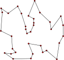

## Quantum ကွန်ပျူတာ ဆိုတာဘာလဲ

Quantum ကွန်ပျူတာဆိုတာ အလွယ်ဆုံးပြောရရင်တော့ quantum mechanics သဘောတရားတွေကို အသုံးချပြီးတော့ တွက်ချက်မှုတွေပြုလုပ်နိုင်တဲ့ ကွန်ပျူတာလို့ပြောရပါမယ်။ လက်ရှိသုံးနေတဲ့ကွန်ပျူတာတွေကို classical computer လို့ခေါ်ပြီး သူတို့တွေက binary စနစ်လို့ခေါ်တဲ့ 0 နဲ့ 1 ကိုပဲအသုံးပြုပြီးအလုပ်လုပ်တာဖြစ်ပါတယ်။ ဘာလို့လဲဆိုတော့ ကွန်ပျူတာရဲ့အဓိကတွက်ချက်မှုတွေကိုပြုလုပ်တဲ့ Central Processing Unit (CPU) ထဲက ထရန်စစ်စတာ (transistor) တွေက လျှပ်စစ်စီးဆင်းမှုရှိ၊ မရှိပေါ်မူတည်ပြီး on/off state နှစ်ခုပဲရှိပါတယ်။ ဒါဆို on ကို 1 လို့သဘောထားပြီ: off ကို 0 လို့သဘောထားလို့ရပါတယ်။ အခုဖတ်နေတဲ့ ဒီစာကို 0 နဲ့ 1 တွေအဖြစ် အစဉ်လိုက်သိမ်းထားပြီး စာလုံးတွေပေါ်လာဖို့ တွက်ချက်မှုတွေ၊ screen ပေါ်မှာပေါ်လာဖို့ ပို့လွှတ်ရတဲ့အချက်အလက်တွေကလည်း binary စနစ်နဲ့ပဲအလုပ်လုပ်တာဖြစ်ပါတယ်။ Quantum computer မှာတော့ qubit လို့ခေါ်တဲ့ quantum bit တွေကို အခြေခံယူနစ်အဖြစ် အသုံးပြုပါတယ်။ Qubit တစ်ခုက 0 နဲ့ 1 state နှစ်ခုတင်မကပဲ superposition လို့ခေါ်တဲ့ ပေါင်းကူးအခြေအနေတစ်ခုမှာရှိနိုင်ပါတယ်။ ဒါကဘာကိုပြောတာလဲဆိုတာ နောက်မှာဆက်ရှင်းပြပါမယ်။ ပြီးတော့ qubit တစ်ခုနဲ့တစ်ခု interact ဖြစ်အောင်လုပ်ထားရင် entanglement လို့ခေါ်တဲ့ တစ်ခုပေါ်တစ်ခုမီခိုနေတဲ့ အခြေအနေ၊ interference လို့ခေါ်တဲ့ ယှဉ်တွဲချုံ့၊ချုဲ့သဘာဝတွေကို အသုံးချပြီးတော့ တွက်ချက်မှုတွေကို (တစ်ချို့နေရာတွေမှာ) classical computer တွေထက်ပိုမြန်အောင် လုပ်လို့ရပါတယ်။

## Quantum computer ကိုသုံးဖို့ quantum mechanics ကို နားလည်ဖို့လိုသလား

မလိုပါဘူး။ သင့်ကွန်ပျူတာကိုအသုံးပြုဖို့၊ program ရေးမယ်ဆိုရင်တောင် ကွန်ပျုတာထဲက processor တွေ memory တွေ ဘယ်လိုသတ္ထုနဲ့လုပ်ထားလဲ၊ ဘယ်လိုတည်ဆောက်ထားလဲဆိုတာကို သိဖို့မလိုပါဘူး။ Quantum computing (QC) ကိုလေ့လာဖို့ လက်ရှိအကောင်းဆုံးဘာသာစကားက quantum computer ရဲ့ mathematical model ပဲဖြစ်ပါတယ်။ ဒီ mathematical model ကိုလေ့လာဖို့ quantum mechanics ကိုသဘောတရားတစ်ချို့ကလွဲရင် အသေးစိတ်နားလည်ဖို့ မလိုအပ်ပါဘူး။ QC ရဲ့အခြေခံကတော့ သင်္ချာက linear algebra ဖြစ်ပြီးတော့ binary ကိန်းတွေတည်ဆောက်ပုံကိုလည်း နည်းနည်းသိဖို့လိုအပ်ပါမယ်။ [Linear algebra](http://theinlinaung.com/linear-vector-spaces-1/) နဲ့ [binary computing](https://theinlinaung.com/binary-computing/) အကြောင်းတွေရေးထားတာရှိတဲ့အတွက် အဲ့ဒါတွေကိုအရင်လေ့လာထားတယ်ဆိုရင် အဆင်ပြေပါတယ်။ Quantum computer တစ်ခုကို ဘယ်လို program ရေးမလဲဆိုတာက ကွန်ပျူတာအမျိုးအစားပေါ်မူတည်ပေမယ့် universal quantum computer လို့ခေါ်တဲ့ ဘက်စုံသုံးကွမ်တမ်ကွန်ပျူတာအမျိုးအစားတွေမှာတော့ program တစ်ခုရေးဖို့အတွက် quantum circuit လို့ခေါ်တဲ့ ဒီဇိုင်းပုံစံတစ်ခုကိုရေးဆွဲရပါတယ်။ ဒီနေရာမှာတစ်ခုရှိတာက quantum programming language က standardized လုပ်ထားတာမရှိသေးတဲ့အတွက် quantum computer အမျိုးအစားနဲ့ ထုတ်တဲ့ကုမ္ပဏီပေါ်မူတည်ပြီး program အသေးစိတ်ရေးသားပုံက ကွာနိုင်ပါတယ်။ ဒါပေမယ့် အဓိကကျတဲ့အပိုင်းတွေက ယေဘူယျအားဖြင့်အတူတူပဲဖြစ်ပါတယ်။

## Quantum computing ကို ဘယ်လိုနေရာတွေမှာသုံးနိုင်လဲ

ဒီမေးခွန်းကတော့ QC ကိုစိတ်ဝင်စားတဲ့သူတွေအတွက် အတော်အရေးပါတဲ့မေးခွန်းဖြစ်ပါတယ်။ အခုနှစ်ပိုင်းအတွင်း QC က အင်တာနက်ပေါ်က သတင်းမီဒီယာတွေနဲ့ YouTube ပေါ်မှာ ခေတ်စားလာနေပါတယ်။ များသောအားဖြင့် Quantum computer တွေက classical computer တွေထက် တစ်ချို့နေရာတွေမှာ အဆပေါင်းများစွာ တွက်ချက်မှုစွမ်းရည် သာလွန်လိမ့်မယ်လို့ပဲ အလွယ်ပြောကြပါတယ်။ တစ်ချို့ကလည်း superposition, entanglement စတဲ့ keyword တွေထည့်ပြောပေမယ့် ဒီစကားလုံးတွေရဲ့ ဆိုလိုရင်းကိုသိဖို့ကတော့ qubit နဲ့ quantum gate တွေအကြောင်းကို အရင်နားလည်ဖို့လိုအပ်ပါတယ်။ အဲ့တာတွေကို မလေ့လာခင် ကွမ်တမ်ကွန်ပျူတာတစ်လုံးကို ဘာအတွက်သုံးလို့ရလဲဆိုတာ နည်းနည်းတီးခေါက်ကြည့်ရအောင်။

QC ကိုသုံးတဲ့နေရာကို အဓိကအားဖြင့် နှစ်ပိုင်းခွဲလို့ရပါမယ်။ တစ်ပိုင်းကတော့ ကွမ်တမ်မက်ကင်းနစ်ဆိုင်ရာ တွက်ချက်မှုတွေ (quantum simulation) ဖြစ်ပြီး နောက်တစ်ပိုင်းကတော့ အထွေထွေတွက်ချက်မှု (general computation) ဖြစ်ပါတယ်။ ကွမ်တမ်မက်ကင်းနစ်ဆိုင်ရာ တွက်ချက်မှုတွေမှာဆိုရင် အက်တမ်နဲ့မော်လီကျူးတွေဖွဲ့စည်းပုံ၊ လှုပ်ရှားပုံစတာတွေကို တွက်ချက်တာဖြစ်ပါတယ်။ ဒီအပိုင်းကတော့ မော်လီကျူးတွေကြားက ဆက်နွယ်မှုကို အသေးစိတ်သိဖို့လိုတဲ့ ဓာတုဗေဒ၊ ဆေးဝါးသုတေသနနဲ့ material အသစ်တွေရှာဖွေတဲ့နေရာမှာ အသုံးချနိုင်ပါတယ်။ ကွမ်တမ်ကွန်ပျူတာက ကွမ်တမ်မက်ကင်းနစ်သဘောတရားတွေကို အခြေခံထားပြီးဖြစ်တဲ့အတွက် classical computer တွေထက် ကွမ်တမ် simulation တွေကိုမြန်မြန်လုပ်လို့ရတာပဲဖြစ်ပါတယ်။

ကွမ်တမ်ကွန်ပျူတာတွေကို သုံးလို့ရမယ့် နောက်တစ်ပိုင်းကတော့ အထွေထွေတွက်ချက်မှုဖြစ်ပါတယ်။ ကွမ်တမ်မက်ကင်းနစ်နဲ့ တိုက်ရိုက်မသက်ဆိုင်တဲ့ ပြဿနာတွေကို အဖြေရှာတာလို့လည်း ပြောလို့ရပါတယ်။ ဒီအပိုင်းကို ထပ်ခွဲရင်တော့ optimization နဲ့ universal computation ဆိုပြီးထပ်ခွဲလို့ရပါတယ်။ Optimization ဆိုတာ ဖြစ်နိုင်ခြေအများကြီးရှိတဲ့ထဲက ပြဿနာကိုအကောင်းဆုံးပြေလည်စေတဲ့ အဖြေကိုရှာရတာဖြစ်ပါတယ်။ ထင်ရှားတဲ့ဥပမာတစ်ခုကတော့ travelling salesman problem လို့ခေါ်ပါတယ်။ အရောင်းသမားတစ်ယောက်က မြို့တစ်မြို့မှာ သူသွားရောင်းရမယ့် အိမ် (၁၀) အိမ်ရှိတယ်ဆိုပါတော့။ ဒီအိမ်တွေအကုန်လုံးကို ဘယ်လမ်းကနေ ဘယ်လိုအစဉ်လိုက်သွားရင် အချိန်ကုန်အသက်သာဆုံးဖြစ်မလဲ၊ တစ်နည်းအားဖြင့် စုစုပေါင်းသွားရတဲ့အကွာအဝေး အတိုဆုံးဖြစ်မလဲဆိုတာ ရှာရတာဖြစ်ပါတယ်။

, by Xypron, Public domain, via Wikimedia Commons

Optimization ပုစ္ဆာတွေကို သင်္ချာ၊ အင်ဂျင်နီယာ၊ စီးပွားရေး၊ နိုင်ငံရေးပေါ်လစီ၊ machine learning/artificial intelligence အစရှိတဲ့နယ်ပယ်တွေအပြင် တစ်ခြားနယ်ပယ်တွေမှာလည်း အလွန်အသုံးများပါတယ်။ ဒီပုစ္ဆာတွေကို​​ဖြေရှင်းတဲ့အခါ ပြဿနာရဲ့ ရှုပ်ထွေးမှုပါ်မူတည်ပြီး တွက်ချက်မှုတွေက များလာပါတယ်။ ဥပမာ deep learning အကြီးစားပရောဂျက်တွေဆိုရင် data training လုပ်ဖို့ စွမ်းရည်မြင့် ကွန်ပျူတာတွေအများကြီးလိုပါတယ်။ ဒီလိုခက်ခဲတဲ့ optimization ပုစ္ဆာတွေကို အချိန်တိုအတွင်းမှာ အဖြေရှာနိုင်ဖို့ (hardware နဲ့ software သာရှိမယ်ဆိုရင်) QC ကိုအသုံးချလို့ရနိုင်ပါတယ်။

နောက်ဆုံးတစ်ပိုင်းကတော့ universal quantum computing လို့ခေါ်တဲ့ ယေဘူယျပရိုဂရမ်တွေပဲဖြစ်ပါတယ်။ ဒီဟာက သင်္ချာပညာရှင် [Alan Turing](https://en.wikipedia.org/wiki/Alan_Turing) တင်ပြခဲ့တဲ့ Turing machine လို့ခေါ်တဲ့ mathematical computation model သဘောတရားကို အခြေခံထားပါတယ်။ အခုစာဖတ်သူသုံးနေတဲ့ ကွန်ပျူတာ၊ ဖုန်း၊ စတာတွေမှာ ဘယ်လို software တွေသွင်းလို့ရသလဲဆိုတာ စဉ်းစားကြည့်ပါ။ တကယ်လို့ကိုယ်လုပ်ချင်တဲ့ တွက်ချက်မှုတစ်ခုက ရေးပြီးသား software မရှိဘူးဆိုရင်တောင် ဒီလုပ်ဆာင်ချက်အတွက် ပရိုဂရမ်အသစ်တစ်ခုကို ရေးပြီး run လို့ရပါတယ်။ ပြောချင်တာက အိမ်သုံးကွန်ပျူတာတစ်လုံးက ဘာပရိုဂရမ်ပဲ run လို့ရမယ်ဆိုပြီး သတ်မှတ်ထားတဲ့ special purpose စက်တစ်ခုမဟုတ်ပဲ သွင်းချင်တဲ့ software သွင်းပြီး အသုံးချလို့ရတဲ့ general purpose စက်တစ်ခုပဲဖြစ်ပါတယ်။ Turing machine ရဲ့အဓိပ္ပာယ်က သတ်မှတ်ထားတဲ့ rule/instruction တစ်ချို့ကိုသုံးပြီး ဘယ်လိုပရိုဂရမ် (algorithm) မျိုးကိုမဆို run လို့ရတဲ့ စက်တစ်ခုဖြစ်ပါတယ်။ ဒီတော့ universal quantum computer ကိုသုံးရင် စဉ်းစားလို့ရသမျှ quantum algorithm ကို run လို့ရပါလိမ့်မယ်။ ဒီတော့ ကွမ်တမ်ကွန်ပျူတာတစ်လုံးကို ကိုယ်လိုသလိုအသုံးချဖို့ ထုံးစံအတိုင်း software (သို့) programming လိုလာပါတယ်။ Classical programming language ဘက်မှာဆို လူများစုရင်းနှီးနိုင်တာက Python, C++, Fortran, Java စတာတွေပဲဖြစ်ပါတယ်။ Quantum programming ကတော့ လက်ရှိအခြေအနေမှာ classical programming နဲ့ မတူတာကို တွေ့ရပါလိမ့်မယ်။

တကယ်တော့ optimization ကလည်း algorithm နဲ့ဖြေရှင်းလို့ရတဲ့ ပုစ္ဆာတစ်ခုဖြစ်တာကြောင့် universal computation အောက်မှာထည့်လို့ရပါတယ်။ ဒါပေမယ့် [D-Wave](https://www.dwavesys.com/) လိုမျိုးကုမ္ပဏီတွေရဲ့ ကွမ်တမ်ကွန်ပျူတာတွေက optimization အတွက် သီးသန့်တည်ဆောက်ထားတဲ့အတွက်ကြောင့် တစ်ခြားပရိုဂရမ်တွေထည့်ဖို့ အကန့်အသတ်ရှိပါတယ်။ တစ်ဖက်မှာတော့ IBM, Google, Microsoft စတဲ့ ကုမ္ပဏီတွေက quantum computer တွေကတော့ ယေဘူယျတွက်ချက်မှုတွေ လုပ်နိုင်ပါတယ်။

## Quantum computer က classical computer ထက် ပိုကောင်းလား

အရိုးရှင်းဆုံးအဖြေကတော့ သူတို့နှစ်ခုက ပန်းသီး နဲ့ လိမ္မော်သီးလိုမျိုး မတူတဲ့ အမျိုးအစားတွေဖြစ်တဲ့အတွက် တိုက်ရိုက်နှိုင်းယှဉ်ဖို့ခက်ပါတယ်။ အပေါ်ကပြောခဲ့သလို အက်တမ်တို့ မော်လီကျူးတို့ရဲ့ behavior ကိုတွက်ချက်တာက classical computer တွေမှာအလွန်ခက်ခဲပေမယ့် quantum computer တွေမှာလွယ်ကူပါတယ်။ General computing အပိုင်းမှာလည်း တစ်ချို့ quantum algorithm တွေက classical algorithm တွေထက် အများကြီးပိုမြန်နိုင်တာကိုလည်း တွေ့ရှိထားပါတယ်။ တစ်ချို့ပုစ္ဆာတွေ၊ ဥပမာ ကိန်းအကြီးကြီးတစ်ခုရဲ့ သုဒ္ဓဆခွဲကိန်း (prime factor) တွေကိုရှာတဲ့ပုစ္ဆာဆိုရင် classical computer တွေအတွက် ခက်ခဲပြီးအချိန်အများကြီးယူရပေမယ့် quantum computer ကိုသုံးရင် အချိန် (တွက်ချက်မှု) နည်းနည်းနဲ့ဖြေရှင်းနိုင်တာကို တွေ့ရပါတယ်။ ဒီလိုဖြစ်ရပ်ကို quantum advantage/ quantum supremacy လို့ခေါ်ပါတယ်။ တစ်ဖက်မှာလည်း quantum computer တွေရဲ့ လက်တွေ့အသုံးဝင်မှုကို မေးခွန်းထုတ်တဲ့သူတွေလည်းရှိပါတယ်။ ဘာလို့လည်းဆိုတော့ အသုံးဝင်တဲ့ universal quantum computer တစ်ခုကိုရဖို့ qubit အရေအတွက်အများကြီး (သောင်းနဲ့ချီ) လိုအပ်ပါတယ်။ အခုလက်ရှိ quantum computer တွေရဲ့ qubit အရေအတွက်က အများဆုံး ၅၀ ဝန်းကျင်ပဲရှိပါတယ်။ ဒါပေမယ့် qubit အရေအတွက်များလာတာနဲ့အမျှ ပတ်ဝန်းကျင်အပူချိန်၊ radiation စတာကြောင့်ဖြစ်တဲ့ noise လည်းများလာပါတယ်။ Noise များရင် တွက်ချက်မှုမှားယွင်းဖို့အခွင့်အလမ်းလည်း များလာပါတယ်။ Qubit တွေကြားက ချိတ်ဆက်မှုတွေကလည်း အချိန်အကြာကြီးထိန်းသိမ်းထားနိုင်ဖို့မလွယ်ကူပါဘူး။ ချိတ်ဆက်မှုပျက်သွားတာကို decoherence လို့ခေါ်ပြီး ဒါကလည်း တွက်ချက်မှုကိုပျက်ဆီးစေပါတယ်။ Software/algorithm design ပိုင်းကိုကြည့်ရင်လည်း classical programming နဲ့ရေးဖို့ အလွန်လွယ်ကူတဲ့ တစ်ချို့ပုစ္ဆာတွေက quantum ဘက်မှာ အသုံးချဖို့ခက်ခဲပြီး ရှုပ်ထွေးတဲ့ပရိုဂရမ်တွေ လိုအပ်တာကိုတွေ့ရပါတယ်။

IBM စတဲ့ကုမ္ပဏီတွေကတော့ 2023 အမီ 1000 qubit ဝန်းကျင်ပါတဲ့ quantum computer တွေကို တီထွင်နိုင်လိမ့်မယ်လို့[ကြေငြာထားပါတယ်](https://www.sciencemag.org/news/2020/09/ibm-promises-1000-qubit-quantum-computer-milestone-2023)။ လာမည့်နှစ်အနည်းငယ်မှာ ပြီးပြည့်စုံတဲ့ quantum computer တွေအစား quantum advantage ကိုအသုံးချနိုင်မယ့် အလယ်အလတ်အဆင့်တစ်ခုကို ရောက်လာလိမ့်မယ်လို့ ခန့်မှန်းကြပါတယ်။ ဒီအဆင့်ကို "Noisy Intermediate-Scale Quantum (NISQ)" အဆင့်လို့ခေါ်ပါတယ်။ Noisy လို့ပြောတဲ့အတွက် noise ကရှိနေသေးတာကြောင့် error-free မဖြစ်သေးပါဘူး။ Intermediate-Scale ဆိုတာကြောင့် qubit အရေအတွက် အများကြီးမရှိပေမယ့် လက်တွေ့စမ်းသပ်အသုံးချနိုင်တဲ့ အခြေအနေတစ်ခုဖြစ်ပါတယ်။ အဲ့ဒီ့အချိန်က scientist တွေ၊ ပညာရှင်တွေသာမက သာမန်လူထုထဲက programmer တွေ၊ ဝါသနာရှင်တွေက quantum algorithm အသစ်တွေကို လက်တည့်စမ်းရမယ့်ခေတ်ဖြစ်ပါတယ်။ ဒါကြောင့် quantum computing က တကယ်ပဲ mainstream ဖြစ်လာမလား၊ အခက်အခဲတွေကိုမကျော်လွှားနိုင်ပဲ ဇာတ်မျောသွားမလားဆိုတာတော့ လာမယ့်နှစ်တွေမှာ စောင့်ကြည့်ရမှာပဲဖြစ်ပါတယ်။

### References

1. [https://en.wikipedia.org/wiki/Travelling_salesman_problem](https://en.wikipedia.org/wiki/Travelling_salesman_problem)
2. [https://en.wikipedia.org/wiki/Turing_machine](https://en.wikipedia.org/wiki/Turing_machine)
3. [https://quantum.country/](https://quantum.country/)
4. [https://youtu.be/b-aGIvUomTA](https://youtu.be/b-aGIvUomTA)
5. [https://quantum-computing.ibm.com](https://quantum-computing.ibm.com)
6. [https://qiskit.org/textbook](https://qiskit.org/textbook)
7. [https://arxiv.org/abs/1801.00862](https://arxiv.org/abs/1801.00862)
8. [https://arxiv.org/abs/2101.08448](https://arxiv.org/abs/2101.08448)

Image credit: [Graham Carlow](https://www.flickr.com/photos/ibm_research_zurich/40645906341/in/photostream/) under [CC BY-ND 2.0](https://creativecommons.org/licenses/by-nd/2.0/)
