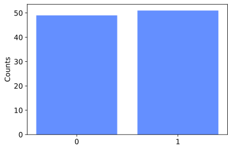

## Qubit representation

Quantum bit (qubit) ဆိုတာ ကွမ်တမ်တွက်ချက်မှုအတွက် အချက်အလက်ကို သိမ်းဆည်းနိုင်တဲ့ အခြေခံယူနစ်တစ်ခုဖြစ်ပါတယ်။ Classical bit (cbit) တခုမှာ သိမ်းဆည်းနိုင်တဲ့အချက်အလက်က binary တန်ဖိုး 0 နဲ့ 1 ဖြစ်တာကို သိပြီးဖြစ်ပါတယ်။ Qubit တခုမှာတော့ အချက်အလက်ကို ဘယ်လိုသိမ်းသလဲဆိုတာလေ့လာဖို့ qubit ကို vector တခုအနေနဲ့ဖော်ပြတဲ့စနစ်ကိုသိဖို့လိုအပ်ပါတယ်။

### Ordinary vectors

အရင်ဆုံး 2D Euclidean vector တခုကို ကြည့်ပါ။ X,Y axis ပေါ်မှာဆွဲထားတဲ့ vector တခုဖြစ်တဲ့ $ \mathbf{v} $ မှာ x-component နဲ့ y-component ရှိပါတယ်။ X,Y-direction မှာရှိတဲ့ အလျားတယူနစ်ရှိတဲ့ vector တွေကို $ \mathbf{i}, \mathbf{j} $ လို့ခေါ်လေ့ရှိပါတယ်။ သူတို့နှစ်ခုက linearly independent ဖြစ်တဲ့အတွက်ကြောင့် $ \{\mathbf{i}, \mathbf{j}\} $ အတွဲက 2D Euclidean vector space ရဲ့ orthonormal basis တခုဖြစ်ပါတယ်။


$$
\mathbf{v}=\alpha \mathbf{i}+\beta \mathbf{j}
$$

### Qubit vectors

အခုဒီ vector သဘောတရားကိုပဲ quantum mechanics မှာသုံးလေ့ရှိတဲ့ Dirac notation လို့ခေါ်တဲ့ notation နောက်တခုနဲ့ပြောင်းရေးကြည့်ပါမယ်။ ဒီ notation မှာ vector တွေကို ket လို့ခေါ်တဲ့ "$ \ket{\ } $" သင်္ကေတထဲမှာထည့်ရေးပါတယ်။ ဥပမာ $ \ket{\psi} $ ကို ket $ \psi $ လို့ဖတ်ပြီး $ \psi $ ဟာ vector တခုဖြစ်တာကိုဖော်ပြပါတယ်။ ဒီ notation မှာတော့ basis vector တွေဖြစ်တဲ့ $ \mathbf{i,j} $ တို့ကို $\ket{0}, \ket{1} $ နဲ့အစားထိုးလိုက်ပါမယ်။


$$
\ket{\psi}=\alpha \ket 0 +\beta \ket 1, \\

\text{Since}  \ket 0 = \begin{pmatrix} 1 \\ 0 \end{pmatrix} , \ket 1=\begin{pmatrix} 0 \\ 1 \end{pmatrix}, \\
\ket \psi =\begin{pmatrix} \alpha \\ \beta \end{pmatrix}
$$

ဒုတိယနဲ့ တတိယညီမျှခြင်းတွေမှာလိုမျိုး column vector အနေနဲ့ရေးရင် $ \{ \ket 0, \ket 1 \} $ basis ကိုသုံးထားတယ်လို့ယူဆရပါမယ်။ ဒီ $ \psi $ vector ကိုသုံးပြီး qubit တခုရဲ့ state ကိုဖော်ပြလို့ရပါတယ်။ တခုပဲထပ်ပိုတာက qubit အတွက်ဆိုရင်တော့ $ \alpha, \beta $ ကိန်းတွေက real number တွေမဟုတ်ပဲ complex number တွေဖြစ်ကြပါတယ်။ ဒီတော့ **qubit state တစ်ခုကို 2D complex vector တစ်ခုနဲ့ ဖော်ပြတယ်**လို့ပြောနိုင်ပါတယ်။

$$
\boxed{ \text{qubit} \ket \psi = \alpha \ket 0 +\beta \ket 1,  \\ \alpha, \beta \in \Complex }
$$

ဘာလို့ complex number ကိုသုံးရလဲဆိုတော့ qubit က quantum ဝတ္ထုတခုဖြစ်ပြီး quantum ဝတ္ထုတွေက လှိုင်းသဘာဝရှိတာကိုကြားဖူးမှာပါ။ လှိုင်းအကြောင်းပြောတဲ့အခါမှာ amplitude တို့ phase တို့သုံးရတာကြောင့် qubit တွေရဲ့ relative phase ဆိုတာကိုတိုင်းတာတဲ့အခါမှာ complex number တွေကအရေးပါလာပါတယ်။ Qubit ကိုဖော်ပြတဲ့ state vector ကလည်း ဒီအချက်အလက်ကို သိမ်းဆည်းရတဲ့အတွက် complex vector ဖြစ်ရပါမယ်။

### Superposition

Qubit statevector ကိုကြည့်ရင် $ \ket 0 $ ရော $ \ket 1 $ ရောက basis state တွေအနေနဲ့ပါဝင်နေပြီး component တွေဖြစ်တဲ့ $\alpha, \beta $ တို့နဲ့ပေါင်းစပ်ထားတာကို တွေ့နိုင်ပါတယ်။ ဒါက vector သဘောတရားအရတော့ အထူးအဆန်းမဟုတ်ပါဘူး။ Vector တခုဟာ basis တွေကို [linear combination](https://theinlinaung.com/linear-vector-spaces-1/#Bases) လုပ်ထားတာပဲဖြစ်ပါတယ်။ Quantum mechanics မှာတော့ ဒီလို combination လုပ်ထားတဲ့ state ကို superposition လို့ခေါ်ပါတယ်။ ဒီ superposition ဆိုတဲ့အသုံးကလည်း လှိုင်းမက္ကန်းနစ်က လှိုင်းထပ်ခြင်းသဘောတရားကနေ လာတာဖြစ်ပါတယ်။ ပြန်ချုပ်ရရင်တော့ superposition ဆိုတာ basis state $ (\ket 0, \ket 1) $ တွေကို component $ (\alpha, \beta) $ တွေနဲ့ ပေါင်းစပ်ထားတဲ့ linear combination state ဖြစ်ပါတယ်။

### What is a qubit made of?

Qubit ကို သင်္ချာနည်းနဲ့ဖော်ပြတာတော့ဟုတ်ပါပြီ၊ qubit ဆိုတာ တကယ်တော့ဘာလဲလို့မေးစရာရှိပါတယ်။ Quantum computer ရဲ့တည်ဆောက်ပုံကိုမူတည်ပြီး physical qubit အမျိုးအစားအမျိုးမျိုးရှိပါတယ်။ ဥပမာ [အလင်းရဲ့ polarization](https://en.wikipedia.org/wiki/Linear_optical_quantum_computing), [electron ရဲ့ spin](https://en.wikipedia.org/wiki/Spin_qubit_quantum_computer), [charged particle ရဲ့ energy level](https://en.wikipedia.org/wiki/Trapped_ion_quantum_computer) စသဖြင့် ကွမ်တမ်သဘာဝရှိတဲ့အရာတွေကို အခြေခံပြီး ကွမ်တမ်ကွန်ပျူတာကိုတည်ဆောက်ပါတယ်။ ဒီကွမ်တမ်အမှုန်အသီးသီးမှာ ဖြစ်နိုင်တဲ့ state နှစ်ခုကို $ \ket 0 $ နဲ့ $ \ket 1 $ လို့နာမည်ပေးလိုက်တာပါပဲ။ ဥပမာ electron ရဲ့ spin-up state ကို $ \ket 0 $ လို့ခေါ်ပြီး spin-down state ကို $ \ket 1 $ လို့ခေါ်သလိုပေါ့။

## တိုင်းတာခြင်း (Measurement)

Quantum computing မှာ အရေးပါတဲ့အပိုင်းတခုကတော့ qubit ကို တိုင်းတာခြင်းအပိုင်းပဲဖြစ်ပါတယ်။ တိုင်းတာခြင်းကို English လို measurement/observation လို့ခေါ်ကြပါတယ်။ Qubit ရဲ့ လက်ရှိ state ကိုသိရအောင် တိုင်းတာခြင်းပါပဲ။ ဒီနေရာမှာထူးဆန်းတဲ့အချက်က qubit state ကို တိုက်ရိုက်တိုင်းတာလို့မရဘူးဆိုတာပါပဲ။ ဒါကဘာကိုဆိုလိုတာလဲဆိုရင် qubit statevector မှာပါတဲ့ $ \alpha, \beta $ component တွေကို တိုက်ရိုက်မသိနိုင်ပါဘူး။ ($ \alpha, \beta $ က complex number ဖြစ်နေတာက တပိုင်းပေါ့လေ) ဒါက quantum computer ကြောင့်ဖြစ်တာမဟုတ်ပဲ quantum particle တွေရဲ့ပြုမူပုံကြောင့်ဖြစ်ပါတယ်။ ဒါဆိုရင် measurement ရလဒ်က ဘာကိုရတာလဲ။

### တိုင်းတာခြင်းနှင့် ဖြစ်တန်စွမ်း

Qubit တခုရဲ့ general state ကိုပြန်ကြည့်ပါ။ သူ့မှာ basis vector နှစ်ခုဖြစ်တဲ့ $ \ket0, \ket1 $ နဲ့ complex component နှစ်ခုဖြစ်တဲ့ $ \alpha, \beta $ တို့ပါဝင်ပါတယ်။

$$\ket \psi = \alpha \ket0 + \beta \ket1 $$

Complex component $ \alpha, \beta $ ကို complex amplitude လို့လည်းခေါ်ပါတယ်။ ဒီ amplitude တွေက qubit ကိုတိုင်းတာလိုက်တဲ့အခါ တွေ့ရမယ့်ရလဒ်ရဲ့ ဖြစ်တန်စွမ်း (probability) တန်ဖိုးတွေနဲ့ဆက်နွယ်နေပါတယ်။ **Qubit တခုကိုတိုင်းတာလိုက်တဲ့အခါ သူ့ရဲ့ basis state တခုခုကိုပဲအမြဲတမ်းရပါတယ်**။ အပေါ်မှာရေးထားတဲ့ qubit $ \ket \psi $ မှာ basis state တွေက $ \ket0 $ နဲ့ $ \ket1 $ ဖြစ်တာကြောင့် ဒီ qubit ကိုတိုင်းတာလိုက်ရင် $ \ket0 $ (သို့) $ \ket1 $ တခုခုကိုရပါလိမ့်မယ်။ ဘယ်တခုကိုရမလဲဆိုတဲ့ **ဖြစ်တန်စွမ်းက basis အသီးသီးရဲ့မြှောက်ဖော်ကိန်း (complex component) ရဲ့ ပကတိတန်ဖိုးနှစ်ထပ်ကိန်းနဲ့တူညီပါတယ်**။ ဒါကိုညီမျှခြင်းနဲ့ရေးရင်−

$$p(\ket0)=|\alpha|^2, \\ p(\ket1)=|\beta|^2$$

Complex number တခုရဲ့ ပကတိတန်ဖိုးနှစ်ထပ်ကိန်းကိုရှာချင်ရင် သူနဲ့ သူ့ရဲ့ complex conjugate ကိုမြှောက်ပေးရပါတယ်။ နောက်တနည်းကတော့ $ \text{(real part)}^2+\text{(imaginary part)}^2 $ပါပဲ။ $ z=a+bi $ ဆိုရင် $ |z|^2=a^2+b^2 $။

ဒီညီမျှခြင်းမှာ $ p(\ket 0) $ ရဲ့အဓိပ္ပာယ်က တိုင်းတာလိုက်ရင် $ \ket 0 $ ကိုရမယ့် probability ကိုဆိုလိုပါတယ်။

Qubit ကို တိုင်းတာခြင်းရဲ့ အကျိုးဆက်တခုကတော့ **တိုင်းတာပြီးတဲ့နောက် qubit state က တိုင်းတာလို့ရတဲ့ရလဒ် (basis state) ကို ရောက်သွားပါတယ်**။ ဒါကို collapse ဖြစ်တယ်လို့ခေါ်ပြီး ကွမ်တမ်မက်ကင်းနစ်ရဲ့အကျိုးဆက်တခုဖြစ်ပါတယ်။ ဒီတော့ qubit ကိုထပ်တိုင်းတာရင်လည်း ဒီရလဒ်ပဲပြန်ရနေမှာဖြစ်ပါတယ်။ ဒါကြောင့်လဲ superposition state ကို တိုက်ရိုက်တိုင်းတာလို့ မရနိုင်တာဖြစ်ပါတယ်။ တိုင်းတာခြင်းက qubit ရဲ့ superposition state ကိုပျက်စီးစေတဲ့အတွက် တိုင်းတာခြင်းအဆင့်ကို ကွမ်တမ်တွက်ချက်မှုတွေရဲ့ နောက်ဆုံးမှာပြုလုပ်လေ့ရှိပါတယ်။


Superposition တွင်ရှိသော qubit တစ်ခုကိုတိုင်းတာလိုက်သည့်အခါ basis state တစ်ခုကိုသာရပြီး probability မှာ amplitude နှစ်ထပ်ကိန်းနှင့် တိုက်ရိုက်အချိုးကျသည်

အပေါ်မှာပြောခဲ့တာက qubit ကို $ \ket 0, \ket 1 $ basis မှာ measure လုပ်တဲ့ရလာဒ်တွေဖြစ်ပါတယ်။ ဒီ basis မဟုတ်တဲ့ တခြား orthonormal basis တွေကိုသုံးပြီးတော့လည်း တိုင်းတာလို့ရပါသေးတယ်။ ဒီအကြောင်းကိုတော့ နောက်ပိုင်းမှာထပ်ဖော်ပြသွားပါမယ်။

### Normalization

Probability သဘောတရားအရ ဖြစ်တန်စွမ်းတွေအားလုံးပေါင်းလဒ်က ၁ နဲ့ညီရပါလိမ့်မယ်။ $ \ket \psi $ကို တိုင်းတာရင်တွေ့ရမယ့်ဖြစ်နိုင်ခြေက နှစ်ခုပဲရှိတဲ့အတွက်−

$$
\begin{aligned}
p(\ket0)+p(\ket1)=1\\
|\alpha|^2+|\beta|^2=1
\end{aligned}
$$

ဒုတိယညီမျှခြင်းရဲ့ ဘယ်ဘက်ခြမ်းကဖော်ပြချက်က vector $ \\ket \\psi $ ရဲ့ အလျား (သို့) ပကတိတန်ဖိုး (နှစ်ထပ်ကိန်း) နဲ့တူညီပါတယ်။ ဒါက qubit တခုကိုဖော်ပြတဲ့ vector တွေအားလုံးက magnitude ၁ ယူနစ်ရှိရမယ်လို့သတ်မှတ်လိုက်တာပါပဲ။ တစ်နည်းအားဖြင့် vector $ \\ket \\psi $ က unit circle ထဲမှာရှိရမယ်လို့ ပြောနိုင်ပါတယ်။ ဒါကို **normalization condition** လို့ခေါ်ပါတယ်။


ဥပမာအနေနဲ့ qubit state တခုကိုကြည့်ရအောင်။

$$
\ket \psi = 0.6 \ket 0+0.8\ket1 \\
p(\ket 0)=0.6^2=0.36 \\
p(\ket 1)=0.8^2=0.64 \\
$$

$ 0.36+0.64=1 $ ဖြစ်တဲ့အတွက် ဒီ state က normalization အခြေအနေကို ပြေလည်စေတာကိုတွေ့ရပါတယ်။ ဒီ qubit ကိုသာ တိုင်းတာလိုက်ရင် $ \ket 0 $ ရဖို့ 36% ဖြစ်တန်စွမ်းရှိပြီး $ \ket 1 $ ရဖို့ 64% ဖြစ်တန်စွမ်းရှိပါတယ်။

ဒါဆိုရင် $ \ket q $ အတွက် ဖြစ်နိုင်တဲ့ superposition state တချို့ကို ရေးကြည့်လို့ရပါပြီ။

$$
\ket{q}=\frac{1}{\sqrt{2}}\ket 0 + \frac{1}{\sqrt 2} \ket 1 \\
\ket{q}=\frac{1}{\sqrt{2}}\ket 0 + \frac{i}{\sqrt 2} \ket 1 \\
\ket{q}=\frac{i}{2}\ket 0 + \frac{\sqrt 3 i}{2} \ket 1 \\
\ket{q}=i \ket 0 + 0 \ket 1
$$

လက်ရှိ quantum computing language တွေမှာ qubit တခုပဲဖြစ်ဖြစ်၊ တခုထက်ပိုတဲ့ qubit တွေပဲဖြစ်ဖြစ် တိုင်းတာလို့ရတဲ့တဲ့ရလဒ်တွေကို classical bit လို့ခေါ်တဲ့ ရိုးရိုး binary bit (0 or 1) တွေအနေနဲ့ ဖော်ပြပါတယ်။ Qubit တခုတည်းအတွက်ဆိုရင် တိုင်းတာတဲ့ရလဒ်က $ \ket0 $ နဲ့ $ \ket1 $ ပဲဖြစ်နိုင်တဲ့အတွက် convention အရ $ \ket0 $ ကို cbit 0 နဲ့ $ \ket 1 $ ကို cbit 1 ဆိုပြီး သတ်မှတ်ထားပါတယ်။ ဒါကြောင့် $ {\ket 0, \ket 1} $ basis ကို **computational basis** လို့လည်းခေါ်ကြပါတယ်။

$$
\ket 0 \equiv 0, \\ \ket 1 \equiv 1
$$

Quantum program တခုတွက်ချက်မှုတခုအပြီးမှာ အဖြေက qubit state $ \ket \psi $ ကိုရမယ်ဆိုပါစို့။ ဒီအဖြေကိုကြည့်ချင်တဲ့အခါ measurement လုပ်ရပါမယ်။ ဒါပေမယ့် qubit ကိုတိုင်းတာလိုက်ရင် basis state ကိုပဲရတယ်ဆိုတော့ probability တန်ဖိုး (ဒါမှမဟုတ်) တကယ့် qubit state vector ရဲ့ component တွေကို ဘယ်လိုသိနိုင်မလဲ။ နည်းလမ်းကတော့ အဲ့ဒီ့ program ကို အကြိမ်ပေါင်းများစွာ run ပြီး measurement ရလဒ်တွေကို အချိုးချကြည့်ဖို့ပါပဲ။ ဥပမာ အကြွေစေ့တခုကို အကြိမ် ၁၀၀ ခေါင်းပန်းလှန်ကြည့်မယ်ဆိုရင် အကြိမ် ၅၀ လောက်က ခေါင်းရပြီး အကြိမ် ၅၀ လောက်က ပန်းရသလိုပါပဲ။ Statistics မှာတော့ ဒါကို [frequentist inference](https://en.wikipedia.org/wiki/Frequentist_inference) လို့ခေါ်ပါတယ်။



ဒီအကြိမ်ရေတွေကို အချိုးချလိုက်ရင်တော့ probability တန်ဖိုးတွေကိုရမှာဖြစ်ပါတယ်။


## Measurement in other basis

Measurement လုပ်လိုက်ရင် $ \ket{0} $ နဲ့ $ \ket{1} $ ကိုရတာက computational basis အတွက်ပဲမှန်ပါတယ်။ Qubit ကို တစ်ခြား orthonormal basis တွေမှာလည်း measurement လုပ်လို့ရတဲ့အတွက်ကြောင့် ယေဘူယျပြောရင် qubit $ \ket{q} $ ကို state $ \ket{x} $ မှာ တိုင်းတာရရှိဖို့ ဖြစ်နိုင်ခြေက−

$$
p(\ket{x})=|\langle x | q \rangle |^2
$$

$ \bra{\\ } $ သင်္ကေတကို bra လို့ခေါ်ပြီး row vector တစ်ခုကိုကိုယ်စားပြုပါတယ်။ $\ket{\\ }$ က column vector ကို ကိုယ်စားပြုပါတယ်။ သူတို့နှစ်ခုပေါင်းပြီး bra-ket notation လို့ခေါ်တာဖြစ်တယ်။ $ \langle x | q \rangle $ က vector $ x $ နဲ့ $ q $ ရဲ့ dot product/inner product ကိုဖော်ပြပါတယ်။ တစ်နည်းအားဖြင့် row vector နဲ့ column vector နှစ်ခုမြှောက်လဒ်ပါပဲ။

$$
\langle  a| b\rangle=
\begin{bmatrix}
a_x^* & a_y^*
\end{bmatrix}\begin{bmatrix}
b_x \\ b_y
\end{bmatrix}=
a_x^* b_x+a_y^* b_y
$$

$ a^* $ က $ a $ ရဲ့ (imaginary part ဆန့်ကျင်ဘက်လက္ခဏာရှိတဲ့) complex conjugate ဖြစ်ပါတယ်။ Inner product ရဲ့သဘောတရားကတော့ vector $ q $ ကို $ x $ ပေါ်မှာ projection ချတာပါပဲ။ $ x $ basis မှာရှိတဲ့ $ q $ ရဲ့ component လို့လည်းပြောလို့ရပါတယ်။ ဒီတော့ ဒီညီမျှခြင်းကို computational basis တွေဖြစ်တဲ့ $ \ket 0, \ket 1 $ မှာ အသုံးချကြည့်ရင်−

$$
\langle 0 | q \rangle =
\begin{bmatrix}
1 & 0
\end{bmatrix}\begin{bmatrix}
\alpha \\ 
\beta
\end{bmatrix}=\alpha \\
p(\ket 0)=|\langle 0 | q \rangle |^2=\alpha^2\\
\\

p(\ket 1)=|\langle 1 | q \rangle |^2=\beta^2
$$

$ \ket 0, \ket 1 $ ကို ၄၅ ဒီဂရီလှည့်ထားတဲ့ နောက်ထပ် orthonormal basis တစ်ခုကိုတော့ $ \ket + $ နဲ့ $ \ket - $ လို့ခေါ်ပါတယ်။ ဒီ basis မှာ $ \ket q $ ကို measure လုပ်မယ်ဆိုရင်ရော ဘယ်လိုရလဒ်ရမလဲ။

$$
\ket + =\frac{1}{\sqrt 2}\ket 0+\frac{1}{\sqrt 2}\ket 1\\
\ket - =\frac{1}{\sqrt 2}\ket 0-\frac{1}{\sqrt 2}\ket 1\\
\lang +|q \rang =
\begin{bmatrix}
\frac{1}{\sqrt 2} & \frac{1}{\sqrt 2}
\end{bmatrix}
\begin{bmatrix}
\alpha \\ \beta
\end{bmatrix}
\\
p(\ket +)=|\langle + | q \rangle |^2= \begin{pmatrix} \frac{1}{\sqrt 2} \cdot \alpha + \frac{1}{\sqrt 2} \cdot \beta  \end{pmatrix}^2 \\
p(\ket -)=|\langle - | q \rangle |^2= \begin{pmatrix} \frac{1}{\sqrt 2} \cdot \alpha - \frac{1}{\sqrt 2} \cdot \beta  \end{pmatrix}^2
$$

Measurement အတွက်ကတော့ computational basis ဖြစ်တဲ့ $ \ket 0, \ket 1 $ ကိုပဲအများဆုံးသုံးပါတယ်။ အဓိကက measure လုပ်ပြီးသွားရင် observer effect ကြောင့် qubit state ပျက်သွားပြီး measured state ကိုရောက်သွားတာရယ်၊ statistics ကိုရဖို့ အကြိမ်ရေများများ run ရတာရယ်ပါပဲ။

## Programming a single qubit

Qubit တခုနဲ့ သူ့ကိုတိုင်းတာပုံကို Qiskit လို့ခေါ်တဲ့ quantum programming language မှာစမ်းကြည့်ရအောင်။ [Qiskit](https://qiskit.org/) (kiss-kit) ဆိုတာ IBM ကုမ္ပဏီကထုတ်ပေးထားတဲ့ universal quantum programming tool တခုဖြစ်ပါတယ်။ သူ့ကို [Python](https://www.python.org/) language နဲ့ရေးရတာဖြစ်ပြီး quantum program တွေတည်ဆောက်ဖို့နဲ့ ဒီ program တွေကို simulation (သို့) quantum computer ပေါ်မှာ run ဖို့စတဲ့ function တွေပါဝင်ပါတယ်။

အခု ရိုးရှင်းတဲ့ program တခုရေးကြည့်ပါမယ်။ Quantum program တခုကို quantum circuit လို့လည်းခေါ်ပါတယ်။ အခု program/circuit မှာတော့ qubit state တခုကိုဖန်တီးပြီး measure လုပ်ကြည့်ပါမယ်။ ဒါကသိပ်အသုံးမဝင်ပေမယ့် အပေါ်မှာပြောထားတဲ့သဘောတရားတွေကို လက်တွေ့စမ်းကြည့်လို့ရမှာဖြစ်ပါတယ်။

အရင်ဆုံး Python code ထဲမှာ Qiskit နဲ့ လိုအပ်တဲ့ package တွေကို import လုပ်ရပါမယ်။ အောက်က box ထဲမှာ ဒီ code ကိုရေးထားပါတယ်။ ဒီ code ကို run ဖို့ "run" ဆိုတာကိုနှိပ်ပါ။ ပထမဆုံးအကြိမ် run ရင် ခဏစောင့်ရပါလိမ့်မယ်။ `Packages successfully imported.` ဆိုတဲ့စာသားပေါ်လာရင် ဆက်သွားလို့ရပါပြီ။

```python
# import required packages
from qiskit import QuantumCircuit, Aer, assemble, execute
from qiskit.visualization import plot_histogram
from math import sqrt

print('Packages successfully imported.')
```

အခု quantum circuit တခုကို စတည်ဆောက်လို့ရပါပြီ။ သူ့ကို `qc` လို့နာမည်ပေးလိုက်ပါမယ်။ ဒီ circuit မှာ qubit တခုနဲ့ measurement ရလဒ်ကိုသိမ်းဖို့ classical bit (cbit) တခုပါဝင်ပါမယ်။ ဒါကို `qc = QuantumCircuit(1,1)` လို့ရေးရပါတယ်။

နောက်တဆင့်ကတော့ qubit state ကိုသတ်မှတ်ဖို့ပါပဲ။ ရှေ့မှာတွေ့ခဲ့တဲ့ $ \ket \psi = \frac{1}{\sqrt 2} \ket 0+\frac{i}{\sqrt 2}\ket1 $ state ကိုပဲပေးကြည့်ပါမယ်။ ဒီလိုင်းကိုတော့ `initial_state = [1/sqrt(2), 1j/sqrt(2)]` လို့ရေးထားတာတွေ့နိုင်ပါတယ်။ Code ထဲမှာ imaginary unit အတွက် i အစား j ကိုသုံးပြီး $ z=a+bj $ လို့ရေးရပါတယ်။ ဒီအဆင့်မှာ `initial_state` က variable တခုအနေနဲ့ပဲရှိပြီး qubit နဲ့မသက်ဆိုင်သေးပါဘူး။ ဒီတော့ နောက်တလိုင်းဖြစ်တဲ့ `qc.initialize(initial_state, 0)` မှာ qubit state ကို သတ်မှတ်ဖို့ပြောလိုက်ပါတယ်။

```python
# define quantum circuit with 1 qubit and 1 cbit
qc = QuantumCircuit(1,1)

# define state |q>
initial_state = [1/sqrt(2), 1j/sqrt(2)]

# initialise the 0th qubit in the state `initial_state`
qc.initialize(initial_state, 0)

# measure the qubit
qc.measure(0, 0)

# show the quantum circuit
qc.draw('mpl', scale=1.5)
```


Circuit ကိုတည်ဆောက်ပြီးရင်တော့ run (execute) ပြီး classical bit မှာတွေ့ရမယ့် measurement ရလဒ်တွေကို အဖြေအဖြစ်ကြည့်ရမှာဖြစ်ပါတယ်။ ဒီ circuit ကိုတော့ simulator နဲ့ အရင် run ကြည့်ရအောင်။ အောက်က code မှာ စောစောကဆောက်ထားတဲ့ `qc` circuit ကို `qasm_simulator` ကိုသုံးပြီး အကြိမ် ၁၀၀၀ `shots=1000` run ပြီး အဖြေကို graph နဲ့ဆွဲပြပါတယ်။

```python
# execute quantum circuit and get result statistics
counts = execute(qc, Aer.get_backend('qasm_simulator'), shots=1000).result().get_counts()

# plot the statistics
plot_histogram(counts)
```

Run လို့ရလာတဲ့ probability တွေက qubit state ရဲ့ amplitude square ဖြစ်တာကိုတွေ့ရဖို့မျှော်လင့်ပါတယ်။ ဒီတော့ အပေါ်က code ထဲက `initial_state` တန်ဖိုးကိုပြောင်းကြည့်ပြီး probability တွေဘယ်လိုပြောင်းသွားလဲဆိုတာ စမ်းကြည့်ပါ။ Statevector က normalization condition ကိုမလိုက်နာရင် ဘယ်လို error ပြလဲဆိုတာကိုလည်း စမ်းကြည့်နိုင်ပါတယ်။

## References

[https://qiskit.org/textbook/ch-states/representing-qubit-states.html](https://qiskit.org/textbook/ch-states/representing-qubit-states.html)


<Blockquote author="Lin">
Never better
</Blockquote>