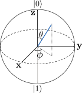
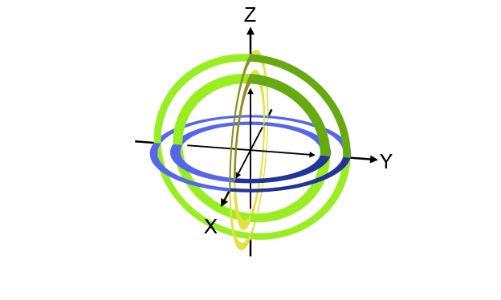
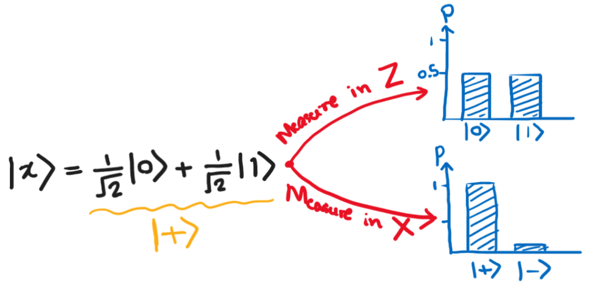

ဤဆောင်းပါးတွင် linear algebra သဘောတရားများပါဝင်သောကြောင့် [linear vector space](https://theinlinaung.com/linear-vector-spaces-1/) များအကြောင်းကို ကြိုတင်ဖတ်ရှုရန် အကြံပြုသည်။

## Visualizing qubits

Qubit ကိုပုံနဲ့ဘယ်လိုပြမလဲ။ ရှေ့အပိုင်းမှာ qubit တခုကို 2D complex vector အနေနဲ့ပြလို့ရတယ်လို့ပြောခဲ့ပါတယ်။ $ \R^2 $ vector ကို ပုံဆွဲပြလို့ရပေမယ့် $ \Complex^2 $ vector ကိုဘယ်လိုဆွဲနိုင်မလဲ။ Complex number တခုမှာ real part နဲ့ imaginary part အတွက် ကိန်းနှစ်ခုပါဝင်တာကြောင့် $ \Complex^2 $ vector တခုမှာ ကိန်းလေးခုပါဝင်ပါတယ်။

$$
\ket \psi = \alpha \ket0+\beta \ket1, \\  \ket \psi \in \Complex^2
$$

### Global phase

Complex number တွေဖြစ်တဲ့ $ \alpha $ နဲ့ $ \beta $ ကို polar form နဲ့လည်းရေးလို့ရပါတယ်။ $ z=a+bi=re^{i\phi}, r=\sqrt{a^2+b^2}, \phi=\tan^{-1}(b/a) $

$$
\alpha = r_1 e^{i\phi_1}, \beta = r_2 e^{i\phi_2} \\
\ket \psi = r_1 e^{i\phi_1} \ket0 + r_2 e^{i\phi_2} \ket1
$$

$ r $ က amplitude ဖြစ်ပြီး $ \phi $ က phase ဖြစ်ပါတယ်။ ဒီနေရာမှာ qubit ရဲ့ global phase ဆိုတာကိုပြောဖို့လိုပါတယ်။ Qubit vector တခုဟာ normalize လုပ်ထားတဲ့အတွက် magnitude တယူနစ်ရှိတယ်ဆိုတာ သိပြီးဖြစ်ပါတယ်။ ဒီတော့ $ \psi $ ကို amplitude တယူနစ်ရှိတဲ့ complex number နဲ့မြှောက်လိုက်ရင် $ \psi $ ရဲ့ probability တန်ဖိုးတွေက ပြောင်းသွားမှာမဟုတ်ပါဘူး။ အောက်က ညီမျှခြင်းမှာကြည့်ပါ။

$$
e^{i\theta} \ket \psi=r_1 e^{i(\phi_1+\theta)} \ket0+r_2 e^{i(\phi_2+\theta)}\ket 1 \\
P(\ket0)=|r_1 e^{i(\phi\_1+\theta)}|^2 =r_1^2 \\
P(\ket1)=|r_2 e^{i(\phi\_2+\theta)}|^2 =r_2^2 
$$

Statevector တခုလုံးရဲ့ တယူနစ်ရှိတဲ့မြှောက်ဖော်ကိန်း $ e^{i\theta} $ ကို global phase လို့ခေါ်ပြီး သူနဲ့မြှောက်ခြင်းဟာ measurable quantities တွေဖြစ်တဲ့ probability တန်ဖိုးတွေကို မပြောင်းလဲစေတဲ့အတွက် $ \ket \psi $ နဲ့ $ e^{i\theta} \ket \psi $ တို့ဟာ physically equivalent ဖြစ်တယ်လို့ယူရပါမယ်။

### Bloch sphere

အခု $ \ket \psi $ ကို global phase တခုဖြစ်တဲ့ $ e^{-i\phi_1} $ နဲ့မြှောက်လိုက်ပါမယ်။

$$
\ket \psi = r_1 e^{i\phi_1} \ket0 + r_2 e^{i\phi_2} \ket1 \\
e^{-i\phi_1} \ket \psi = r_1 \ket0 + r_2 e^{i(\phi_2-\phi_1)} \ket1 \\
 \ket \psi = r_1 \ket0 + r_2 e^{i\phi} \ket1, \\  \phi=\phi_2-\phi_1
$$

အခု $ \ket \psi $ မှာ real number သုံးခုပဲရှိပါတော့တယ်။ ဒါပေမယ့် normalization rule အရ complex amplitude တွေက ဆက်နွယ်ချက်ရှိပါတယ်။

$$
\begin{aligned}
|r_1|^2+|r_2e^{i\phi}|^2 =1 \\
r_1^2+r_2^2=1
\end{aligned} 
$$

ဒုတိယညီမျှခြင်းဟာ unit circle ညီမျှခြင်းဖြစ်ပါတယ်။ ဒီတော့ $ r_1, r_2 $ ကလည်း unit circle ရဲ့အစိတ်အပိုင်းဖြစ်တဲ့အတွက် သူတို့နှစ်ခုအစား angle တစ်ခုနဲ့အစားထိုးလို့ရပါတယ်။

$$
r_1 = \cos \frac{\theta}2,  r_2 = \sin \frac\theta 2
$$

ပြန်ချုပ်လိုက်ရင်−

$$
\ket \psi = \cos \frac \theta 2 \ket 0 + \sin \frac \theta 2 e^{i\phi} \ket 1
$$

ဒီပုံစံမှာ real ကိန်းဖြစ်တဲ့ angle နှစ်ခု $\theta $ နဲ့ $ \phi $ ပဲရှိပါတော့တယ်။ ဒီ angle နှစ်ခုကို 3D sphere ပေါ်မှာဆွဲပြီး qubit state vector ကိုဆွဲပြလို့ရပါတယ်။ ဒီ sphere ကိုတော့ တီထွင်သူ Felix Bloch ကိုအစွဲပြုပြီး Bloch sphere လို့ခေါ်ပါတယ်။ ဒီ sphere ပေါ်က angle နှစ်ခုကို အောက်ကပုံမှာကြည့်ပါ။



Bloch sphere မှာ +z ဝင်ရိုးက $ \ket 0 $ နဲ့ -z က $ \ket 1 $ တို့ဖြစ်ပါတယ်။ +x နဲ့ -x က $ \ket + $ နဲ့ $ \ket - $ လို့ခေါ်တဲ့ superposition state တွေဖြစ်ပါတယ် (နောက်ပိုင်းမှာဖော်ပြပါမယ်)။ ဒီတော့ $ \theta=0, \phi=0 $ ဆိုရင် $ \ket 0 $ state ဖြစ်တာကို $ \ket \psi $ ညီမျှခြင်းကနေတွေ့နိုင်ပါတယ်။ ဒီလိုမျိုး ထောင့်တွေကိုစမ်းထည့်ကြည့်ရင်−

| Binary | Decimal |
|:------:|:-------:|
| 0      | 0       |
| 1      | 1       |
| 10     | 2       |
| 11     | 3       |
| 100    | 4       |
| 101    | 5       |
| 110    | 6       |
| 111    | 7       |


### Bloch sphere on Qiskit

Qiskit ကိုသုံးပြီး qubit state ကို Bloch sphere ပေါ်မှာဆွဲကြည့်ရအောင်။ သုံးရမယ့် function က `plot_bloch_multivector` ဖြစ်ပါတယ်။

```python
# import required packages 
from qiskit.visualization import plot_bloch_multivector 
from math import pi, sqrt 
import warnings 
warnings.filterwarnings('ignore')

qubit_state = [1, 0]

# draw the qubit state on Bloch sphere 
plot_bloch_multivector(qubit_state)
```
`qubit_state` တန်ဖိုးကိုပြောင်းကြည့်ပြီး Bloch vector ဘယ်လိုပြောင်းသလဲဆိုတာ စမ်းကြည့်ပါ။ ဥပမာ [0, 1], [0, -1] နဲ့ [1/sqrt(2), 1/sqrt(2)] တို့ကိုထည့်ကြည့်ပါ။

## Single qubit gates

Qubit တစ်ခုကို ဘယ်လိုဖော်ပြလဲသိပြီဆိုရင် qubit ကိုပြောင်းလဲစေတဲ့ operation တွေကိုလေ့လာလို့ရပါပြီ။ Classical computing မှာ gate တွေကိုအသုံးပြုပြီး တွက်ချက်သလိုပဲ quantum computing မှာ qubit gate (quantum gate) တွေကို အသုံးပြုပြီး တွက်ချက်ပါတယ်။ Single qubit gate ဆိုတာ qubit တစ်ခုတည်းကို သက်ရောက်တဲ့ gate အမျိုးအစားတွေဖြစ်ပါတယ်။ ဥပမာ X gate လို့ခေါ်တဲ့ gate ဟာ classical က NOT gate နဲ့ဆင်တူပါတယ်။ သူက $ \ket 0 $ qubit state ကို $ \ket 1 $ ကိုပြောင်းလဲပေးပြီး $ \ket 1 $ ဆိုရင် $ \ket 0 $ ကိုပြောင်းလဲပေးပါတယ်။

$$
X\ket 0=\ket 1\\
X\ket 1=\ket 0
$$

Qubit က vector တစ်ခုပဲဖြစ်တာကြောင့် qubit gate တွေက linear algebra မှာ vector တွေကိုသက်ရောက်တဲ့ operator (linear transformation matrix) တွေနဲ့အတူတူပါပဲ။ Single qubit က 2D vector ဖြစ်တာကြောင့် single qubit gate က 2x2 matrix ဖြစ်ပါတယ်။ ဥပမာ X gate ဆိုရင်−

$$
X=\begin{bmatrix} 0 & 1 \\ 1 & 0 \end{bmatrix}
$$

ပုံစံရှိပါတယ်။ X gate က qubit $ \ket \psi $ ကို operate လုပ်တဲ့ output ကိုရဖို့ matrix နဲ့ vector နဲ့မြှောက်လိုက်ရုံပါပဲ။

$$
\ket \psi=\begin{pmatrix} \alpha \\ \beta \end{pmatrix} \\
X\ket \psi=\begin{bmatrix} 0&1\\1&0 \end{bmatrix}\begin{pmatrix} \alpha \\ \beta \end{pmatrix}=\begin{pmatrix} \beta \\ \alpha \end{pmatrix}
$$
ဒီတော့ X gate matrix က $ \ket 0 $ ကို $ \ket 1 $ ဖြစ်စေတယ် (တနည်းပြောရရင် $ \ket0 $ နဲ့ $ \ket1 $ တို့ရဲ့မြှောက်ဖော်ကိန်းတွေကို နေရာလဲပေးတယ်) ဆိုတာ အလွယ်တကူတွေ့နိုင်ပါတယ်။

Qiskit မှာ X gate ကိုထည့်ဖို့ quantum circuit `qc` ကိုကြေညာပြီးရင် `qc.x(qubit_index)` လို့ရေးနိုင်ပါတယ်။ Qubit index ကို 0 ကနေစရေတွက်ပါတယ်။

```python
# import required packages 
from qiskit import QuantumCircuit, Aer, transpile, execute, assemble 
from qiskit.visualization import plot_histogram, plot_bloch_multivector

# create the quantum circuit with 1 qubit 
qc = QuantumCircuit(1)

# initialize the 0th qubit 
qc.initialize([1,0], 0)

# apply X gate to 0th qubit 
qc.x(0)

# draw quantum circuit 
qc.draw('mpl')
```
Qubit ကို $ \ket0 $ နဲ့ initialize လုပ်ထားတဲ့အတွက် ဒီ circuit ကို simulator မှာ run လိုက်ရင် $ \ket 1 $ output ရပါမယ်။

```python
# set up statevector simulator 
svsim = Aer.get_backend('statevector_simulator') 
qc = transpile(qc, svsim)

# run and get the final state 
state = svsim.run(qc).result().get_statevector()

print('After applying X gate, the state is', state) 
plot_bloch_multivector(state)
```

## Gates as rotation operators

Quantum gate တစ်ခုက qubit vector ကို transformation လုပ်ပေးတဲ့ linear transformation operator ဖြစ်ကြောင်း ရှေ့မှာပြောခဲ့ပါတယ်။ ဒီ operator တွေရဲ့ဂုဏ်သတ္တိတခုကတော့ qubit ရဲ့ magnitude ကိုပြောင်းလဲစေခြင်းမရှိတာပါပဲ (magnitude ကိုသာပြောင်းစေမယ်ဆိုရင် output qubit က normalization rule ကိုလိုက်နာစေမှာမဟုတ်တာကို တွေ့နိုင်ပါတယ်)။ ဒီတော့ quantum gate တခုရဲ့ transformation ကို Bloch sphere ပေါ်မှာကြည့်မယ်ဆိုရင် gate ရဲ့သက်ရောက်မှုက Bloch sphere ရဲ့ axis တခုကို ပတ်ပြီး angle တခုလှည့်ပေးတဲ့ rotation operator အနေနဲ့လည်း မှတ်ယူလို့ရပါတယ်။ ဥပမာ X gate ဆိုရင် Bloch sphere ရဲ့ X ဝင်ရိုးကိုတည်ပြီး ၁၈၀ ဒီဂရီ $ (\pi) $ လှည့်လိုက်တာနဲ့ညီမျှတာကို တွေ့ရပါလိမ့်မယ်။

](images/X_gate.gif)

ဒီအတိုင်းပဲ Y နဲ့ Z gate တို့ကလည်း သူတို့ဝင်ရိုးအသီးသီးပေါ်တည်ပြီး $ \pi $ လှည့်လိုက်တာဖြစ်ပါတယ်။

$$
Y=\begin{bmatrix} 0 & -i \\ i & 0 \end{bmatrix}, \\ Z=\begin{bmatrix} 1 & 0 \\ 0 & -1 \end{bmatrix}
$$




Y နဲ့ Z တို့ရဲ့သက်ရောက်မှုကို အောက်က simulator code နဲ့စမ်းကြည့်နိုင်ပါတယ်။ Qubit ကို $ \ket 0 $ နဲ့ initialize လုပ်ထားတယ်ဆိုတာသတိရပါ။

```python
# create a new quantum circuit
qc = QuantumCircuit(1)

# put Y gate to qubit 0 
qc.y(0)

# setup and run simulator 
svsim = Aer.get_backend('statevector_simulator') 
qc = transpile(qc, svsim) 
state = svsim.run(qc).result().get_statevector()

plot_bloch_multivector(state)
```

Quantum gate တွေကrotation axis မှာရှိတဲ့ vector တွေကိုပြောင်းလဲစေမှာမဟုတ်တဲ့အတွက် rotation axis ကို gate matrix ရဲ့ [eigenvector](https://theinlinaung.com/linear-vector-spaces-4/#Eigenvectors_Eigenvalues) တွေကိုတွက်ထုတ်ပြီး ရှာလို့ရပါတယ်။ ဥပမာ X gate ဆိုရင် X axis မှာရှိတဲ့ vector တွေက eigen vector တွေဖြစ်တဲ့အတွက် rotation axis က X axis ဖြစ်ပါတယ်။

```python
from numpy.linalg import eig 
import numpy as np

X = np.array([[0., 1.], [1., 0.]]) 
w,v = eig(X)

# print('Eigenvalues are {} and {}'.format(w[0], w[1])) 
print('Eigenvectors are {} and {}'.format(v[:,0], v[:,1]))

plot_bloch_multivector(v[:,0])
```


## Hadamard gate

နောက်ထပ် gate တစ်ခုကတော့ နည်းနည်းထူးခြားပါတယ်။ Hadamard gate လို့ခေါ်ပြီး သူက $ \ket 0 $ နဲ့ $ \ket 1 $ ကို equal superposition state ကိုပြောင်းလဲပေးပါတယ်။
$$
H\ket 0=\frac{1}{\sqrt 2} \ket 0 + \frac{1}{\sqrt 2} \ket 1 = \ket+ \\
H\ket 1=\frac{1}{\sqrt 2} \ket 0 - \frac{1}{\sqrt 2} \ket 1 =\ket - \\
H=\frac{1}{\sqrt 2} \begin{bmatrix} 1 & 1 \\ 1 & -1 \end{bmatrix}
$$
အောက်ပုံက Bloch sphere ကိုကြည့်ရင် $ H $ က +Z $ (\ket 0) $ axis ကို +X axis ဆီပြောင်းပေးပြီး -Z $ (\ket 1) $ ကို -X ဆီပြောင်းပေးတာကိုတွေ့ရပါတယ်။ ဒီတော့ H gate က Bloch sphere မှာ X နဲ့ Z axis ကိုကူးပြောင်းပေးတာလို့ ပြောလို့ရပါတယ်။ Rotation လုပ်တဲ့ axis ကတော့ X နဲ့ Z ကြားက ၄၅ ဒီဂရီမျဉ်းပဲဖြစ်ပါတယ်။


Bloch sphere ရဲ့ X axis က equal superposition state ဖြစ်တဲ့ $ \ket+, \ket - $ တို့ကို ကိုယ်စားပြုတာကို ဒီနေရာမှာတွေ့နိုင်ပါတယ်။

X,Y,Z gate တွေက superposition state ကို ဖန်တီးပေးနိုင်ခြင်းမရှိပေမယ့် Hadamard gate ကိုသုံးပြီး superposition ဖြစ်အောင်လုပ်လို့ရတဲ့အတွက် အလွန်အသုံးဝင်တဲ့ gate တစ်ခုဖြစ်ပါတယ်။

Hadamard gate ရဲ့ matrix ပုံစံကိုကြည့်ရင် ရှေ့မှာမြှောက်ဖော်ကိန်း $ \frac{1}{\sqrt 2} $ ပါနေတာကိုတွေ့ရပါတယ်။ ဒီမြှောက်ဖော်ကိန်းရဲ့တာဝန်က H gate ရဲ့ output state တွေရဲ့ magnitude ကို 1 ဖြစ်အောင် (unit vector ဖြစ်အောင်) လုပ်ဆောင်ပေးတာပါပဲ။ ဆိုလိုတာက ဒီမြှောက်ဖော်ကိန်းသာမပါရင် superposition state တွေက unit vector တွေဖြစ်မှာမဟုတ်တော့ပါဘူး။ ဒီတော့ quantum gate တွေအားလုံးက vector magnitude (norm) ကိုမပြောင်းလဲစေတဲ့ unitary matrix တွေဖြစ်ကြပါတယ်။ Unitary matrix တွေရဲ့ နောက်ထပ်အရေးကြီးတဲ့ဂုဏ်သတ္တိနှစ်ခုက inner product တွေကိုမပြောင်းလဲစေတာနဲ့ eigen vector တွေက orthogonal ဖြစ်တာပဲဖြစ်ပါတယ်။

## Change of basis

Vector တွေသုံးပြီး တွက်ချက်တဲ့အခါ basis က အရေးပါတာကိုသိပြီးဖြစ်ပါတယ်။ Basis ကိုသတ်မှတ်ထားမှသာ vector ရဲ့ component တွေကို ထုတ်ရေးလို့ရပါမယ်။ ဒါပေမယ့် basis စနစ်ကို ပြောင်းလဲလိုက်ရင်လည်း linear vector သဘောတရားအရ vector တစ်ခုနဲ့တစ်ခုကြားက ဆက်သွယ်ချက်တွေက မှန်နေသေးတဲ့အတွက် special basis ဆိုတာမရှိပါဘူး။ Qubit အတွက်လည်း ဒီအတိုင်းပါပဲ။ Qubit vector, measurement နဲ့ gate ရဲ့ matrix ပုံစံတို့ကို computational basis လို့ခေါ်တဲ့ $ {\ket 0, \ket 1} $ ကိုသုံးပြီး ဖော်ပြခဲ့ပေမယ့် တခြား basis တွေမှာလည်း တန်းတူအသုံးချလို့ရပါတယ်။ ဥပမာ equal superposition state−

$$
\ket \psi=\frac{1}{\sqrt 2} \ket 0+\frac{1}{\sqrt 2} \ket 1
$$

ကို measure လုပ်ရင် 0: 50% နဲ့ 1: 50% ရမယ်ဆိုတာ သိသာပါတယ်။ ဒီ state ကိုပဲ Hadamard basis/X basis လို့ခေါ်တဲ့ $ \{\ket+, \ket-\} $ basis မှာရေးမယ်ဆိုရင်−

$$
\ket  \psi=1\ket ++0\ket - 
$$

ဖြစ်ပါလိမ့်မယ် (basis transformation လုပ်ရင် dot product ယူရတာသတိရပါ)။ ဒီတော့ state ကို X basis မှာ တိုင်းတာမယ်ဆိုရင် $ \ket + \rightarrow $: 100% နဲ့ $ \ket + \rightarrow $: 0% ရပါလိမ့်မယ်။ Amplitude တွေက basis ပေါ်မီခိုပြီး probability တွေက amplitude squared ပေါ်ကိုမီခိုနေတာကြောင့် တိုင်းတာတဲ့ basis ပေါ်မူတည်ပြီး probability တန်ဖိုးတွေပြောင်းသွားရတာဖြစ်ပါတယ်။



ဒါပေမယ့် လက်ရှိ **Qiskit မှာ measurement လုပ်တဲ့အခါ probability တန်ဖိုးတွေက Z basis ကိုအခြေခံထားတဲ့အတွက် တခြား basis မှာတိုင်းချင်ရင် transformation လုပ်ရပါမယ်**။ ဒီအတွက် သင့်တော်တဲ့ quantum gate တွေကိုသုံးရပါမယ်။ ဥပမာ X basis မှာတိုင်းချင်တယ်ဆိုရင် X ကနေ Z basis ကိုပြောင်းလဲပေးတဲ့ operator က H gate ဖြစ်တဲ့အတွက် measurement မလုပ်ခင် H gate ကိုခံပေးရပါမယ်။

```python
from numpy import sqrt

qc = QuantumCircuit(1,1)

# initialize qubit to |+> state 
qc.initialize([1/sqrt(2), 1/sqrt(2)], 0)

# change basis from X to Z (uncommment the line below to enable) 
# qc.h(0)

# measure in Z basis 
qc.measure(0,0)

counts = execute(qc,Aer.get_backend('qasm_simulator')).result().get_counts() 
plot_histogram(counts)
```

ဒီ circuit မှာ H gate ထည့်တာနဲ့ မထည့်တဲ့အဖြေကိုနှိုင်းယှဉ်ကြည့်ပါ။ နောက်တစ်ခုထူးခြားတာက $ \ket - $ state မှာရှိနေတဲ့ qubit ကို Z basis မှာတိုင်းရင် 50-50 probability ပဲရမှာဖြစ်တဲ့အတွက် $ \ket + $ နဲ့ $ \ket - $ state ကို probability အရခွဲခြားလို့ရမှာမဟုတ်ပါဘူး (ပုံမှာကြည့်ပါ)ျ။ ဒါပေမယ့် X ကနေ Z ပြောင်းပြီးတိုင်းမယ်ဆိုရင်တော့ ဒီ state နှစ်ခုကို အတိအကျခွဲခြားလို့ရမှာဖြစ်ပါတယ်။ ပြောင်းပြန် ပြန်ပြောရရင်တော့ $ \ket 0 $ (သို့) $ \ket 1 $ state ကို X basis မှာတိုင်းမယ်ဆိုရင် $ \ket + $ နဲ့ $ \ket - $ ရဖို့ 50-50 ဖြစ်ပါလိမ့်မယ်။ ဒီတော့ **လိုချင်တဲ့အဖြေကိုမူတည်ပြီး ဘယ် basis မှာတိုင်းတာမလဲဆိုတာကို ဆုံးဖြတ်ရမှာဖြစ်ပါတယ်**။


## Parametric gates

X, Y, Z gate တွေက Bloch sphere ရဲ့ဝင်ရိုးတွေပေါ်မှာ $ \pi $ radian (၁၈၀ ဒီဂရီ) လှည့်တဲ့ gate တွေဆိုတာ တွေ့ခဲ့ပါတယ်။ $ \pi $ radian မဟုတ်ပဲ လိုချင်တဲ့ ထောင့်ပမာဏလှည့်လို့ရတဲ့ gate အမျိုးအစားတွေကိုတော့ parametric gate လို့ခေါ်ပါတယ်။ Parametric gate လို့ခေါ်ရတာက gate ကိုအသုံးပြုဖို့ parameter ကိန်းတစ်ခု၊ ဒါမှမဟုတ် တစ်ခုထက်ပိုတဲ့ကိန်းတွေလိုအပ်လို့ဖြစ်ပါတယ်။ ပထမဆုံး gate ကိုတော့ $ R_Z $ gate လို့ခေါ်ပါတယ်။ သူက Z axis မှာ $ \phi $ radian လှည့်ပေးတဲ့ gate ဖြစ်ပြီး matrix ပုံစံကတော့ အောက်ပါအတိုင်းဖြစ်ပါတယ်။
$$
R_Z(\phi) =\begin{bmatrix} e^{-i\frac \phi2} & 0 \\ 0 & e^{i\frac \phi2} \end{bmatrix} \\
R_Z \ket q=\begin{pmatrix} e^{-i\frac \phi2} \alpha \\e^{i\frac \phi2} \beta \end{pmatrix}
$$

```python
qc = QuantumCircuit(1)

# apply H gate and Rz(pi/2) gate 
qc.h(0) 
qc.rz(pi/2,0)

svsim = Aer.get_backend('statevector_simulator') 
qobj = assemble(qc) 
state = svsim.run(qobj).result().get_statevector() 
print('Final state is', state) 
plot_bloch_multivector(state)
```


$ R_Z $ နဲ့ဆင်တဲ့ gate တခုကတော့ phase gate လို့ခေါ်တဲ့ P gate ဖြစ်ပါတယ်။ သူ့ matrix ပုံစံက−

$$
P(\phi) =\begin{bmatrix} 1 & 0 \\ 0 & e^{i\phi} \end{bmatrix} \\
P\ket q=\begin{pmatrix} \alpha \\ e^{i\phi} \beta \end{pmatrix}
$$

ဖြစ်ပြီး $ \ket 1 $ ကို phase angle တခုထည့်ပေးပါတယ်။ $ P(\phi)=e^{i\phi} R_Z $ ဖြစ်တယ်ဆိုတာမြင်နိုင်တဲ့အတွက် $ P $ နဲ့ $ R_Z $ က global phase တခုပဲကွာပြီး နှစ်ခုလုံး Z-axis မှာ rotation လုပ်တဲ့ gate တွေဖြစ်ပါတယ် (ဒါကြောင့် သူတို့ကွာခြားချက်ကို Bloch sphere ပေါ်မှာမတွေ့နိုင်ပဲ state simulator output မှာသာတွေ့နိုင်တာဖြစ်ပါတယ်)။

```python
qc = QuantumCircuit(1)

# apply H gate and P gate 
qc.h(0) 
qc.p(pi/2,0)

svsim = Aer.get_backend('statevector_simulator')
qobj = assemble(qc) 
state = svsim.run(qobj).result().get_statevector() 
print('Final state is', state) 
plot_bloch_multivector(state)
```

$ e^{i\phi} $ ကို rotation/phase တွေပြောင်းလဲတဲ့နေရာမှာ သုံးတာတွေ့ဖူးပါလိမ့်မယ်။ $ P(\phi) $ ရဲ့လုပ်ဆောင်ချက်က $ \alpha $ ကိုဒီအတိုင်းထားပြီး $ \beta $ ကို $ e^{i\phi} $ နဲ့မြှောက်လိုက်တာကို တွေ့နိုင်ပါတယ်။ $ \beta $ ကိုသက်သက်မြှောက်လိုက်တော့ $ \ket q $ ရဲ့ unit magnitude ကိုမပြောင်းလဲစေဖူးလား။ ဒါကိုလေ့လာကြည့်ဖို့ $ \beta $ က complex number ဖြစ်တဲ့အတွက် သူ့ကို $ re^{i\theta} $ ပုံစံနဲ့ရေးလို့ရပါတယ်။
$$
\beta = x+iy= \| \beta \| e^{i\theta}\\
e^{i\phi}\beta=\| \beta \| e^{i(\theta+\phi)}
$$
ဒုတိယညီမျှခြင်းအရ $ e^{i\phi} $ က $ \beta $ ရဲ့ ပမာဏကိုမပြောင်းလဲစေပဲ phase ကိုပဲပြောင်းလဲစေတဲ့အတွက် $ \ket q $ ရဲ့ ပမာဏကလည်း ပြောင်းလဲသွားမှာမဟုတ်ပါဘူး။

Qiskit မှာ $ P $ gate ရဲ့ special case gate တွေလည်းရှိပါတယ်။ သူတို့တွေကတော့ S gate $ (\phi=\pi/2) $, T gate $ (\phi=\pi/4) $ လို့ခေါ်ပါတယ်။

$ P $ gate က Z axis ပေါ်မှာလှည့်တာဆိုရင် တခြား axis ပေါ်မှာလှည့်ဖို့ ဘယ် gate တွေကိုသုံးမလဲ။ $ U_3 $ gate ဆိုတာရှိတယ်။ သူက axis အကုန်လုံးအတွက် parameter တွေပါတဲ့အတွက် ယေဘူယျအကျဆုံး single qubit gate ဖြစ်ပါတယ်။

$$
U_3(\lambda, \theta, \phi ) = \begin{bmatrix} \cos(\theta/2) & -e^{i\lambda}\sin(\theta/2) \\
            e^{i\phi}\sin(\theta/2) & e^{i\lambda+i\phi}\cos(\theta/2)
     \end{bmatrix}
$$

$ \lambda, \theta, \phi $ တွေက Bloch sphere ရဲ့ angle တွေမဟုတ်ပဲ Z, Y, Z axis တို့ကိုပတ်လည်တဲ့ ထောင့်တွေဖြစ်ပြီး rotation လုပ်တဲ့အစီအစဉ် (order of rotation) ကတော့ $ \lambda \to \theta \to \phi $ ဖြစ်ပါတယ်။ ယေဘူယျအားဖြင့် Z, X, Z (သို့) Z, Y, Z သုံးခုလှည့်တာကိုသုံးပြီး Bloch sphere ပေါ်က ဘယ်လို transformation မဆိုလုပ်လို့ရပါတယ်။ U3 gate ကိုသုံးပြီး လိုချင်တဲ့ qubit state ကိုရဖို့ angle တွေကိုဘယ်လိုရှာမလဲဆိုတာ [ဒီဆောင်းပါး](https://pragyakatyayan.medium.com/how-to-find-correct-angle-values-for-parametrized-quantum-u3-gates-and-controlled-u3-gates-using-659c92f46ce7)မှာဖတ်ကြည့်နိုင်ပါတယ်။ ဒီမှာတော့ပျင်းလို့ရေးမပြတော့ပါ။

အချုပ်ဆိုရင် single qubit gate တွေက qubit တခုကို Bloch sphere မှာ rotate လုပ်ပေးတဲ့ transformation operator တွေဖြစ်ပါတယ်။ ဒီ article မှာ အရေးပါတဲ့ gate တချို့ကိုမိတ်ဆက်ခဲ့တာဖြစ်ပြီး Qiskit မှာပါတဲ့ single qubit gate တွေနဲ့ matrix ပုံစံတွေကို [documentation](https://qiskit.org/documentation/stubs/qiskit.circuit.QuantumCircuit.html) ထဲမှာဖတ်နိုင်ပါတယ်။

## References

- [https://qiskit.org/textbook/ch-states/representing-qubit-states.html](https://qiskit.org/textbook/ch-states/representing-qubit-states.html)
- [https://qiskit.org/documentation/stubs/qiskit.circuit.QuantumCircuit.html](https://qiskit.org/documentation/stubs/qiskit.circuit.QuantumCircuit.html)
- [http://akyrillidis.github.io/notes/quant\_post\_7](http://akyrillidis.github.io/notes/quant_post_7)
