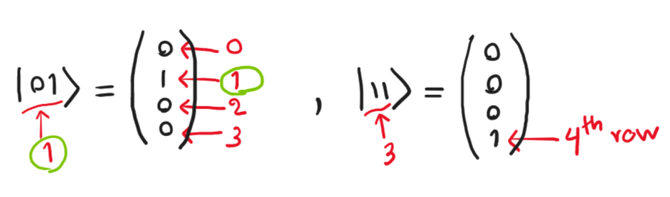

## Multiple qubits

Qubit တစ်ခုကို $\Complex^2$ vector အနေနဲ့ ဖော်ပြရတယ်ဆိုတာ အရှေ့ပိုင်းမှာပြောခဲ့ပါတယ်။ Qubit ရဲ့ complex amplitude တွေကို basis တစ်ခုမှာ column vector အနေနဲ့ရေးလို့ရပါတယ်။ Measurement probability တွေက သက်ဆိုင်ရာ basis vector ရဲ့ amplitude နှစ်ထပ်ကိန်းအသီးသီးဖြစ်ပါတယ်။

$$
\ket q=\alpha\ket 0 +\beta \ket 1, \ \ \alpha,\beta \in \Complex 
$$
$$
\ket q=\begin{pmatrix} \alpha \\ \beta \end{pmatrix}.
$$

Qubit တစ်ခုထက်ပိုလာရင်ရော ဘယ်လိုဖော်ပြမလဲ။  $\Complex^2$ vector တစ်ခုချင်းစီအနေနဲ့ ဖော်ပြပြီး vector algebra ကိုသုံးလို့ရမလား။ ဒီလိုလုပ်လို့မရပါဘူး။ အကြောင်းကတော့ qubit တွေက သီးသန့်ရှိနေတာမဟုတ်ပဲ တစ်ခုပေါ်တစ်ခုသက်ရောက်မှုရှိနိုင်တဲ့အတွက် multiple qubit state ရဲ့ basis က single qubit basis ထက်ပိုပြီးကျယ်ပြန့်ပါတယ်။

Vector နှစ်ခု အချင်းချင်းဆက်နွယ်တဲ့ component မျိုးစုံကိုပြချင်တဲ့အခါ tensor product ဆိုတာကိုသုံးပါတယ်။ ဒီလိုပဲ two-qubit စနစ်ကို qubit vector နှစ်ခုရဲ့ tensor product နဲ့ဖော်ပြပါတယ်။ ဥပမာ computational basis 
$ {\ket 0, \ket 1 \\} $ မှာ qubit နှစ်ခုဖြစ်တဲ့ $ \ket {q_0}$ နဲ့ $ \ket {q_1} $ ရှိတယ်ဆိုပါစို့။ ဒါဆိုရင် two-qubit စနစ်ဖြစ်တဲ့ $ \ket {q_1q_0} $ ဟာ သူတို့နှစ်ခုရဲ့ tensor product ဖြစ်ပါတယ်။ $ \otimes $ (O-times လို့ဖတ်) သင်္ကေတနဲ့ပြတဲ့ tensor product လုပ်ပုံကတော့ အောက်မှာပြထားတဲ့အတိုင်း component တွေကိုအတွဲလိုက် မြှောက်လိုက်တာပါပဲ။

$$
\ket {q_0} = \begin{pmatrix} \alpha_0 \\ \beta_0 \end{pmatrix}, \ \ket {q_1} = \begin{pmatrix} \alpha_1 \\ \beta_1 \end{pmatrix}, \\\

\ket {q_1q_0}= \ket{q_1} \otimes \ket{q_0} =
\begin{pmatrix} \alpha_1 \times \begin{pmatrix} \alpha_0 \\ \beta_0 \end{pmatrix} \\\
\beta_1 \times \begin{pmatrix} \alpha_0 \\ \beta_0 \end{pmatrix} \end{pmatrix}
=
\begin{pmatrix}
 \alpha_1 \alpha_0 \\ \alpha_1 \beta_0 \\ \beta_1 \alpha_0 \\ \beta_1 \beta_0 
 \end{pmatrix} .
 $$

မှတ်ချက်။ Component လေးခုပါတဲ့ Rank-2 tensor product တွေကိုရေးတဲ့အခါ matrix ပုံစံနဲ့ရေးလေ့ရှိပါတယ်။ ဒါပေမယ့် ဒီနေရာမှာတော့ ကြည့်ရလွယ်အောင် vector ပုံစံနဲ့ပဲရေးပါမယ်။

## Muliple qubit ၏ basis

ဒီ tensor product ရဲ့ basis vector တွေကဘာတွေဖြစ်မလဲ။ ဒါကိုသိဖို့ single qubit basis နှစ်ခုကို tensor product လုပ်လိုက်ရုံပါပဲ။
$$
\mathbf e_0 = \begin{pmatrix} \ket 0 \\ \ket 1 \end{pmatrix}, \mathbf e_1 = \begin{pmatrix} \ket 0 \\ \ket 1 \end{pmatrix}, \\
\mathbf e_1 \otimes \mathbf e_0 = \begin{pmatrix} \ket 0 \times \begin{pmatrix} \ket 0 \\ \ket 1 \end{pmatrix}  \\
\ket 1 \times \begin{pmatrix} \ket 0 \\ \ket1 \end{pmatrix}
\end{pmatrix} =
\begin{pmatrix} \ket {00} \\ \ket {01} \\ \ket {10} \\ \ket {11} \end{pmatrix}, \ket{ab}\equiv \ket a \otimes \ket b
$$

ဒီတော့ two-qubit system အတွက် component-basis ပုံစံနဲ့ဆိုရင်−

$$
\begin{aligned}
\ket {q_1q_0} &= \begin{bmatrix}
 \alpha_1 \alpha_0 & \alpha_1 \beta_0 & \beta_1 \alpha_0 & \beta_1 \beta_0 
 \end{bmatrix} \begin{pmatrix} 
\ket {00} \\
\ket {01} \\
\ket {10} \\
\ket {11}
 \end{pmatrix}, \\
&=\alpha_1 \alpha_0 \ket {00}+\alpha_1 \beta_0 \ket {01}+\beta_1 \alpha_0 \ket {10}+\beta_1 \beta_0 \ket {11}.
\end{aligned}
$$

ဒီ 2-qubit ကို measurement လုပ်ရင်ရမယ့် (classical bit) binary တန်ဖိုးတွေက binary basis $ (00, 01, \cdots) $ တွေဖြစ်ပြီး probability က သက်ဆိုင်ရာ amplitude ပကတိတန်ဖိုးရဲ့ နှစ်ထပ်ကိန်းဖြစ်ပါတယ်။ တနည်းပြောရင် 2-qubit state နဲ့ တိုင်းချင်တဲ့ basis ရဲ့ inner product နှစ်ထပ်ကိန်းဖြစ်ပါတယ်။

$$
p(x)=|\braket{x|q_1q_0}|^2 \\\\
p(00)=|\braket{00|q_1q_0 }|^2 = |\alpha_1 \alpha_0|^2
$$

Normalization rule အရ ဖြစ်နိုင်တဲ့ measurement တွေရဲ့ probability စုစုပေါင်းက 1 ဖြစ်တဲ့အတွက် amplitude နှစ်ထပ်ကိန်းအားလုံးပေါင်းလဒ်က 1 နဲ့ညီရပါမယ်။

$$
p(00)+p(01)+p(10)+p(11)=1 \\\\
|\alpha_1 \alpha_0|^2 + |\alpha_1 \beta_0|^2 +|\beta_1 \alpha_0|^2 +|\beta_1 \beta_0|^2=1
$$


## Two-qubit ဥပမာများ

ဒီတော့ two-qubit state ဥပမာတစ်ချို့ကို ကြည့်လို့ရပါပြီ။ တွေ့ရများတဲ့ two-qubit state တွေက ကိုယ်ပိုင်နာမည်ရှိတာကြောင့် သူတို့နာမည်တွေပါပြထားပါတယ်။ ပုံမှန်အားဖြင့် two-qubit state တခုမှာ component လေးခုပါရမှာဖြစ်ပေမယ့် 0 တန်ဖိုး component တွေကို ဖျောက်ရေးထားပါတယ်။ ဒီ state တွေက valid state တွေဖြစ်သလားဆိုတာ normalization rule နဲ့စစ်ကြည့်ပါ။
$$
\ket{q_1q_0}=\frac{1}{\sqrt 3}(\ket{00}+\ket{01}+\ket{10}), \\
\ket{0i} = \frac{1}{\sqrt 2}(\ket{00}+i\ket{01}) ,\\

\ket{\Phi^+} = \frac{1}{\sqrt 2} (\ket{00} + \ket{11}), \\
\ket{\Phi^-} = \frac{1}{\sqrt 2} (\ket{00}  - \ket{11}).
$$


## Multi-qubit basis ကို decimal ပုံစံဖြင့်ဖော်ပြခြင်း

Multi-qubit စနစ်ရဲ့ tensor product basis ကို အပေါ်မှာပြထားတဲ့ပုံစံအပြင် တခြားပုံစံတွေနဲ့လည်းရေးလေ့ရှိပါတယ်။ သိသာတဲ့ပုံစံတစ်ခုကတော့ $ \ket{} $ သင်္ကေတအထဲကကိန်းတွေကို binary ကိန်းတွေအဖြစ်ယူဆပြီးရေးတာပါပဲ။ Binary ကိန်းတွေလို့ယူဆရင် ညီမျှတဲ့ decimal တန်ဖိုးတွေအနေနဲ့လည်း ရေးလို့ရပါတယ်။ ဥပမာ $ \ket{11} $ ဆိုရင် $ \ket{3}_2 $ လို့ရေးပါတယ် (2-qubit စနစ်မှန်းသိအောင် subscript 2 ကိုထည့်ရေးထားပါတယ်)။

$$
\begin{pmatrix} 
\ket {00} \\
\ket {01} \\
\ket {10} \\
\ket {11}
 \end{pmatrix} \Rarr
\begin{pmatrix} 
\ket 0_2 \\
\ket 1_2 \\
\ket 2_2 \\
\ket 3_2
 \end{pmatrix}
$$


Tensor product basis ထဲမှာပါတဲ့ basis vector တွေကို အခြေခံ component တွေအလိုက်ဖြန့်ကြည့်ရင်−

$$
\ket {00}=\ket 0 \otimes \ket 0= \begin{pmatrix} 1 \\ 0 \end{pmatrix} \otimes \begin{pmatrix} 1 \\ 0 \end{pmatrix}= 
\begin{pmatrix} 1 \\0 \\ 0 \\ 0 \end{pmatrix}, \\
\ket {01}=\begin{pmatrix} 0 \\ 1 \\ 0 \\ 0 \end{pmatrix}, 
\ket {10}=\begin{pmatrix} 0 \\ 0 \\ 1 \\ 0 \end{pmatrix},
\ket {11}=\begin{pmatrix} 0 \\ 0 \\ 0 \\ 1 \end{pmatrix}.
$$

ဒီ basis vector လေးခုက mutually orthogonal ဖြစ်တယ်ဆိုတာ အလွယ်တကူတွေ့နိုင်ပါတယ်။ ဒီတော့ two-qubit state တစ်ခုဟာ 4-D complex vector တစ်ခုဖြစ်ပါတယ်။ ဒီညီမျှခြင်းတွေကနေပြီး တွေ့နိုင်တာနောက်တစ်ခုက $ \ket{} $ ထဲက decimal ကိန်းက column vector ထဲမှာ 1 ရှိတဲ့ row နံပါတ် (-1) ဖြစ်ပြီး ကျန်ကိန်းတွေက 0 ဖြစ်ပါတယ်။ ဥပမာ $ \ket {11} $ ဆိုရင် 11 က 3 နဲ့ညီမျှတဲ့အတွက် (၀ ကိုထည့်တွက်ရင်) column vector ရဲ့ ၄−တန်းမြောက်ကိန်းက 1 ဖြစ်ပါလိမ့်မယ်။



နှစ်ခုထက်ပိုတဲ့ qubit တွေအတွက်လည်း အလားတူပဲ tensor product ပုံစံနဲ့ရေးလို့ရပါတယ်။ Basis vector တွေကိုတွက်မယ်ဆိုရင် tensor product အဆင့်အဆင့်မြှောက်ပြီး တွက်လို့ရပါတယ်။ ဥပမာ 3-qubit ဆိုရင် $ 2^3=8 $ dimension ရှိတာကြောင့် basis ၈ ခုရှိပါမယ်။ ဒါကြောင့် ယေဘူယျအားဖြင့် n-qubit စနစ်မှာ $ 2^n $ အရေအတွက်ရှိတဲ့ basis vector နဲ့ component တွေရှိပါတယ်။

$$
\ket{x}_3=\ket {q_2q_1q_0} = \ket {q_2} \otimes \ket {q_1} \otimes \ket {q_0}=
\begin{pmatrix} 
\alpha_2 \alpha_1 \alpha_0 \\
\alpha_2 \alpha_1 \beta_0 \\
\alpha_2 \beta_1 \alpha_0 \\
\alpha_2 \beta_1 \beta_0 \\
\beta_2 \alpha_1 \alpha_0 \\
\beta_2 \alpha_1 \beta_0 \\
\beta_2 \beta_1 \alpha_0 \\
\beta_2 \beta_1 \beta_0 \\
\end{pmatrix}^T 

\begin{pmatrix} 
\ket{000} \\
\ket{001} \\
\ket{010} \\
\ket{011} \\
\ket{100} \\
\ket{101} \\
\ket{110} \\
\ket{111} \\
\end{pmatrix}
\\
p(101) = |\braket{101|x}|^2=|\beta_2 \alpha_1 \beta_0|^2, \cdots
$$

n-qubit state နဲ့ normalization condition ကို အရိုးရှင်းဆုံးပုံစံနဲ့ရေးပြရင်−

$$
\ket q= \sum_{x=0}^{2^n-1} a_x \ket x_n ,\\
\sum_{x=0}^{2^n-1} |a_x|^2=1.
$$

ဒီနေရာမှာ basis vector နဲ့ component index တွေကို decimal notation $ x $ နဲ့ရေးထားတာပါပဲ။

Single qubit state တစ်ခုချင်းစီကနေ multiple qubit state ကို tensor product လုပ်ပြီးဖော်ပြထားတာကို product state လို့ခေါ်ပါတယ်။ ဒါပေမယ့် နောက်ဆုံးရလဒ်ဖြစ်တဲ့ multiple qubit state ကိုအရင်ပေးထားရင် အဲ့ဒီ့ကနေ single qubit တွေကို ပြန်ခွဲထုတ်ဖို့က အမြဲတမ်းမဖြစ်နိုင်ပါဘူး။ Product state မဟုတ်တဲ့ state တွေကို entangled state လို့ခေါ်ပါတယ်။ Entanglement က ဘယ်လို state မျိုးလဲဆိုတာ နောက်ပိုင်းမှာတွေ့ရပါလိမ့်မယ်။


## Quantum vs classical computing (n-qubits vs n-bits)

n-qubit state တစ်ခုဟာ $ 2^n $ dimension ရှိတဲ့ complex vector တစ်ခုဖြစ်တာကြောင့် n-qubit state ကိုဖော်ပြဖို့ $ 2^n $ complex number တွေလိုအပ်ပါတယ်။ Classical စနစ်မှာတော့ n-bit state ကိုဖော်ပြဖို့ n အရေအတွက် bit တွေပဲလိုပါတယ်။ ဥပမာ 3-bit state ကိုပြဖို့ bit ၃ ခုပဲလိုပေမယ့် 3-qubit state ကိုဖော်ပြဖို့ complex number ၈ ခုလိုပါတယ်။ 30-qubit state ဆိုရင် $ 2^{30} \approx 1 \times 10^9 $ component တွေလိုတဲ့အတွက် သူ့ကို classical computer နဲ့ simulate လုပ်ဖို့ အနည်းဆုံး memory 1 GB လိုပါလိမ့်မယ်။ 35-qubit အတွက်ဆိုရင်တော့ $ 2^{35} \approx 34 \times 10^9 $ ဖြစ်တဲ့အတွက် 34 GB memory လိုသွားပါပြီ။ ဒီလို qubit state ကိုဖော်ပြဖို့လိုအပ်တဲ့ component တွေက qubit အရေအတွက်အလိုက် **exponential scale** ဖြစ်နေတာကြောင့် quantum စနစ်တွေကို classical computer တွေနဲ့ simulate လုပ်ဖို့အလွန်ခက်ခဲတာဖြစ်ပါတယ်။

```python
import numpy as np 
import matplotlib.pyplot as plt

n = np.linspace(1,50,50) mem = 2**n / 1e9

plt.plot(n, mem) 
plt.grid('on') 
plt.yscale('log') 
plt.xlabel('n_qubits') 
plt.ylabel('Memory (GB) (at least)')
```

## Multiple qubits in Qiskit

Qubit တစ်ခုထက်ပိုပါတဲ့ quantum circuit ကို ဘယ်လိုတည်ဆောက်မလဲဆိုတာ ကြည့်ရအောင်။

```python
from qiskit import QuantumCircuit, Aer, execute 
from qiskit.visualization import plot_histogram, plot_bloch_multivector

# Build a two-qubit quantum circuit 
qc = QuantumCircuit(2)

# Initialize the qubits in the state |01⟩ 
qc.initialize('01', [0, 1])

qc.measure_all() 
qc.draw('mpl')
```

Single qubit တုန်းကအတိုင်းပဲ `QuantumCirciut` ကို qubit 2 ခုနဲ့ဆောက်မယ်လို့ပြောလိုက်ပါတယ်။ ဒုတိယလိုင်းမှာတော့ two-qubit state ကို `01` နဲ့ initialize လုပ်ထားပါတယ် (ဒုတိယ argument က qubit နှစ်ခုရဲ့ index ဖြစ်ပါတယ်) `[0, 1]` ဆိုတာကြောင့် default order အတိုင်းပဲ qubit 0 က $ \ket 1 $ ဖြစ်ပြီး qubit 1 က $ \ket 0 $ ဖြစ်ပါမယ်။ ဒီ state ကိုတိုင်းတာရင် သူ့ရဲ့တွဲဖက် binary output ဖြစ်တဲ့ 01 ကို 100% ရပါမယ်။

```python
# run the circuit in a simulator 
counts = execute(qc, Aer.get_backend('qasm_simulator')).result().get_counts() 
plot_histogram(counts)
```

Multiple qubit state ကို Qiskit မှာ `plot_bloch_multivector` နဲ့ visualize လုပ်လို့ရပါတယ်။ ဒီ function က qubit တစ်ခုစီအတွက် Bloch sphere ပေါ်မှာသက်ဆိုင်ရာ state ကိုပြပေးပါတယ်။ ဒါပေမယ့်ာ tensor product ကနေ single qubit တစ်ခုစီသပ်သပ်ခွဲထုတ်လို့မရတဲ့ entangled state တွေဆိုရင် visualize လုပ်လို့ရမှာမဟုတ်ပါဘူး။

```python
from qiskit.quantum_info import Statevector

qc = QuantumCircuit(2) 
# Initialize the qubits in the state |01⟩ 
qc.initialize('01', [0, 1])

state = Statevector(qc) 
plot_bloch_multivector(state, reverse_bits=True)
```