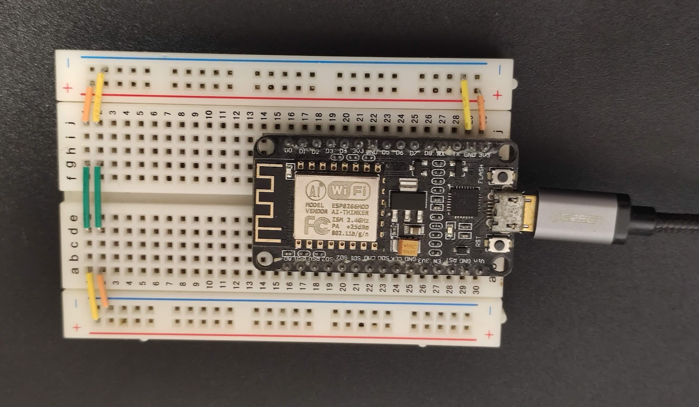

## မိတ်ဆက်

ရုပ်ရှင်တွေထဲမှာ AI ဆိုရင် လူတွေကို အကြံပေးမယ့် assistant အပြင် ကိုယ်တိုင်စဉ်းစားတွေးခေါ်၊ ဆုံးဖြတ်ချက်ချ၊ အကောင်အထည်ဖော်နိုင်တဲ့ robot လိုမျိုးပုံဖော်ကြပါတယ် (ဥပမာ Iron Man ထဲက JARVIS, Interstellar ထဲက TARS)။ အခုခေတ်စားနေတဲ့ ChatGPT လို LLM (Large Language Model) တွေက ဒီလို sci-fi အဆင့်ထိရောက်လာနိုင်ဖို့နီးစပ်လာနေပါပြီ။ လက်ရှိမှာတော့ LLM ကို coding / software development အပိုင်းမှာ အသုံးချတာက အအောင်မြင်ဆုံး use case တစ်ခုဖြစ်နေပါတယ်။ Google/Apple/Microsoft လိုကုမ္ပဏီကြီးတွေကတော့ LLM ကိုအသုံးပြုပြီး သူတို့ platform ပေါ်မှာ user တွေရဲ့ data နဲ့ပေါင်းစပ်ပြီး နေ့စဉ်ဘဝအတွက် အသုံးဝင်နိုင်မယ့် personal AI assistant ပုံစံမျိုးစတင်မိတ်ဆက်လာကြပါပြီ။ Smart assistant ကအိုင်ဒီယာအသစ်တော့မဟုတ်ပေမယ့် LLM တွေရဲ့ natural langauge ability နဲ့ training data ထဲမှာပါတဲ့ knowledge ကို ပေါင်းစပ်လိုက်တဲ့အခါ အရင်တုန်းကနဲ့မတူတဲ့ လုပ်နိုင်စွမ်းတွေပေါ်ပေါက်လာပါတယ်။

LLM တွေရဲ့ intelligence ကို ပိုတိုးတက်အောင် AI company/research တွေက ကြိုးစားနေကြသလို သူတို့ကို chatbot ပုံစံ၊ စာတွေ၊ ပုံတွေ၊ ဗွီဒီယိုတွေဖန်တီးဖို့တင်မပဲ လူတွေအတွက်အသုံးဝင်အောင် ဘယ်လိုအသုံးချနိုင်မလဲဆိုတာလည်း နည်းပညာအရရော၊ စီးပွားရေးအရပါ အရေးပါတဲ့မေးခွန်းတစ်ခုဖြစ်ပါတယ်။ လက်ရှိမှာ AI service အများစုက ကွန်ပျူတာ chips ထဲမှာ run နေတဲ့ software အဆင့်ပဲရှိသေးပြီး အကောင်အထည်ရှိတဲ့၊ အပြင်လောကက အရာဝတ္ထုတွေကိုထိတွေ့လှုပ်ရှားနိုင်တဲ့ အဆင့်ထိကျယ်ပြန့်မလာသေးပါဘူး။ သေချာတာကတော့ Tesla ကတီထွင်နေတဲ့ Optimus robot လိုမျိုး စမ်းသပ်ဆဲ project တွေကတော့ ရှိမှာအမှန်အကန်ပါပဲ။
ဘယ်လိုပဲဖြစ်ဖြစ် technologist တွေနဲ့ ကျွန်တော်တို့လို nerd တွေအတွက်ကတော့ ရှိပြီးသား tools တွေကို ဘယ်လို tinker လုပ်ရမလဲဆိုတာ ပိုပြီးစိတ်ဝင်စားဖို့ကောင်းပါတယ်။ ဒါကြောင့်ဒီနေရာမှာတော့ LLM တွေကို အပြင်လောက (real world) မှာ အသုံးချဖို့ဖြစ်နိုင်စေမယ့် Model Context Protcol အကြောင်းပြောပြချင်ပါတယ်။

## AI Agents

MCP အကြောင်းမပြောခင် AI Agent ဆိုတဲ့ အခေါ်အဝေါ်ကို အရင်နားလည်ရပါမယ်။ Agent ဆိုတာကတော့ အလွယ်ပြောရရင် စွမ်းဆောင်ရည်တစ်ခု (ဥပမာ လေယာဉ်လက်မှတ်ရှာပြီး booking လုပ်ပေးတာ) သတ်သတ်မှတ်မှတ်ရှိတဲ့ AI တစ်ခုပဲဖြစ်ပါတယ်။ Agent တွေဟာ LLM ပေါ်အခြေခံထားတာဖြစ်တဲ့အတွက် လူနဲ့အပြန်အလှန်စကားပြောဆိုနိုင်စွမ်းရှိတဲ့အပြင် ပြင်ပ service (ဥပမာ airline website or API) ကိုပါ လှမ်းပြီးကိုင်တွယ်နိုင်စွမ်းရှိပါတယ်။ ဒါကြောင့် လေယာဉ်လက်မှတ်ရှာဖို့၊ ဝယ်ဖို့ကို ကိုယ်တိုင်လုပ်စရာ၊ travel agent တွေကိုအပ်စရာမလိုပဲ AI ကိုပြောလိုက်ရုံနဲ့ သူကကိုယ့်အစားလုပ်ပေးပါလိမ့်မယ်။ ဒါ့အပြင် personal AI တစ်ခုက ကိုယ့်အချက်အလက်တွေနဲ့ ခရီးသွားအစီအစဉ်ကိုပါ သိပြီးသားဖြစ်နေမှာဖြစ်တဲ့အတွက် instruction တွေတစ်ခုချင်းပေးစရာမလိုပဲ လက်ထောက်တစ်ယောက်ရထားသလိုဖြစ်နေမှာပါ။ Bill Gates ကတော့ AI Agent တွေက လူတွေကွန်ပျူတာကိုအသုံးပြုပုံ၊ healthcare၊ education industory တွေကိုပါ [အပြောင်းအလဲဖြစ်စေလိမ့်မယ်](https://www.gatesnotes.com/ai-agents)လို့ ခန့်မှန်းထားပါတယ်။

Agent တွေရဲ့နောက်မှာ စဉ်းစားဆုံးဖြတ်နေတာက LLM model တွေဖြစ်တဲ့အတွက် LLM တွေနဲ့ ပြင်ပ service တွေကို ဘယ်လိုချိတ်ဆက်မလဲဆိုတာ စဉ်းစားရပါမယ်။ Service တစ်ခုစီအတွက် LLM နဲ့ချိတ်ဆက်ဖို့ custom tooling တစ်ခုစီဖန်တီးမယ့်အစား standardized protocol တခုထားဖို့ Anthropic ကနေ နိုဝင်ဘာ ၂၀၂၄ မှာ [Model Context Protocol](https://modelcontextprotocol.io/) (MCP) ကို[မိတ်ဆက်ခဲ့](https://www.anthropic.com/news/model-context-protocol)ပါတယ်။ ဒီနေရာမှာ LLM Agent တွေက ရှိပြီးသား API တွေကို ကိုယ်တိုင်ခေါ်သုံးလို့မရဘူးလား၊ ဘာလို့ standard တခုထပ်လိုတာထဲလို့မေးနိုင်ပါတယ်။ API တွေရဲ့ရည်ရွယ်ချက်က software တခုနဲ့တခု ဆက်သွယ်ဖို့သုံးတာဖြစ်တဲ့အတွက် function call တွေက အတိအကျဖြစ်ရပါမယ်။ Hallucinate ဖြစ်ပြီး လွဲလို့မရတဲ့အတွက်ကြောင့် LLM တွေက API တွေခေါ်သုံးတဲ့အခါ API ရဲ့ documentation ကို အပြည့်အစုံ၊ အမှားအယွင်းမရှိနားလည်ထားဖို့ လိုအပ်ပါတယ်။ ဒါက LLM တွေအတွက် အခက်အခဲတစ်ခုပါပဲ။ MCP ကတော့ ဒီလို API documentation တွေကို LLM တွေအတွက် ပိုလွယ်ကူစေဖို့ design လုပ်ထားတာဖြစ်ပါတယ်။ တနည်းအားဖြင့် LLM တွေ ပြင်ပ service တွေကို ခေါ်သုံးဖို့အတွက် tools တွေတည်ဆောက်ပုံနဲ့ ဒီ tools တွေရဲ့ လုပ်ဆောင်ချက်တွေအကြောင်းရှင်းပြထားတဲ့ standardized format ကို MCP ကသတ်မှတ်ပေးပါတယ်။

## MCP server & client

MCP အလုပ်လုပ်ဖို့အတွက် MCP server နဲ့ client ဆိုတဲ့ အစိတ်အပိုင်း ၂ ခုလိုအပ်ပါတယ်။ MCP server ကတော့ service provider (ဥပမာ travel agency) ရဲ့ ဘက်မှာရှိပြီး သူတို့ service ကို LLM တွေသုံးနိုင်ဖို့အတွက် MCP protocol အတိုင်း service ရဲ့ tools တွေကို ဖော်ပြပေးထားတာဖြစ်ပါတယ်။ Tools တွေဟာ server တစ်ခုရဲ့ ဘာလုပ်ပေးနိုင်လဲဆိုတဲ့ function တွေကို ကိုယ်စားပြုပါတယ်။ Tools တွေဟာ API endpoint တွေ၊ database query တွေ၊ physical interaction တွေဖြစ်နိုင်ပါတယ်။ ဥပမာ လေယာဉ်လက်မှတ်ရှာတာ၊ calendar မှာ appointment တစ်ခုထည့်တာ၊ message ပို့တာ၊ file တွေကိုပြင်တာ၊ smart home device တွေကိုထိန်းချုပ်တာ အစရှိသဖြင့်ဖြစ်နိုင်ပါတယ်။ MCP server တွေက tools တွေအပြင် ရှိပြီးသား data တွေကိုလည်း LLM တွေ context အဖြစ်သုံးနိုင်ဖို့ ပေးပို့နိုင်ပါတယ်၊ ဥပမာ user ရဲ့ calendar data, travel history, file contents တွေလိုမျိုးပါ။ ဒါတွေကိုတော့ resources တွေလို့ခေါ်ပါတယ်။ နောက်ဆုံး MCP server က tools တွေကို ဘယ်လိုသုံးရမလဲဆိုတာကို LLM ကိုသင်ကြားပေးတဲ့ prompt template တွေ ပါရှိနိုင်ပါတယ်။

MCP client ကတော့ LLM model ရဲ့ဘက်မှာရှိပြီး LLM နဲ့ MCP server ရဲ့ ကြားခံအဖြစ် ဆက်သွယ်ပေးပါတယ်။ LLM က client ကနေတဆင့် MCP server ကို ခေါ်သုံးပြီး service ရဲ့ tools တွေကို အသုံးပြုနိုင်ပါတယ်။ ဒါ့အပြင် server ကနေ ထပ်မံတောင်းခံတဲ့ အချက်အလက်၊ အကြံပြုချက်တွေကို LLM ကို ပြန်ပို့ပေးနိုင်ပါတယ်။ LLM model တစ်ခုက တစ်ချိန်တည်းမှာ MCP client/server အများကြီးနဲ့ ချိတ်ဆက်ထားနိုင်ပါတယ်။ ဥပမာ travel planner agent တစ်ခုက calendar server, flight booking server, hotel booking server, weather server တွေနဲ့ ချိတ်ဆက်ပြီး user ရဲ့ ခရီးစဉ်ကို စီစဉ်ပေးနိုင်ပါတယ်။

## Building an AI agent to control an LED

**[See repo on Github](https://github.com/theinlinaung2010/MCP-LED-control/)**

[MCP server example](https://github.com/modelcontextprotocol/servers) တွေကို အင်တာနက်ပေါ်မှာ အလွယ်တကူရှာဖွေနိုင်ပါတယ်။ ကျွန်တော်ကတော့ LLM ကိုသုံးပြီး physical device ကို ထိန်းချုပ်ဖို့စိတ်ဝင်စားတဲ့အတွက် အရိုးရှင်းဆုံးဥပမာအနေနဲ့ LED တစ်လုံးကိုအဖွင့်အပိတ်လုပ်ဖို့ MCP server နဲ့ LLM agent တစ်ခုကိုတည်ဆောက်ကြည့်ပါမယ်။ LED ကို control လုပ်ဖို့ NodeMCU (ESP8266) microcontroller board တစ်ခုနဲ့ သူ့မှာပါပြီးသား LED ကိုပဲသုံးလိုက်ပါမယ်။ Software အနေနဲ့ microcontroller code (C++), MCP server, MCP client နဲ့ Agent scaffolding code (Python) တွေရေးဖို့လိုအပ်ပါတယ်။

### Microcontroller



NodeMCU အတွက် code ကိုတော့ [PlatformIO](https://platformio.org/) ထဲမှာ Arduino library နဲ့ရေးထားပါတယ်။ Serial ပေါ်ကနေ `on`, `off`, `status` ဆိုတဲ့ command သုံးခုပေးပြီး board နဲ့ဆက်သွယ်နိုင်မှာဖြစ်ပါတယ်။

```Arduino
#include <Arduino.h>

#define LED_PIN 2

void setup() {
  // Initialize serial communication at 115200 baud rate
  Serial.begin(115200);

  // Initialize LED pin as output
  pinMode(LED_PIN, OUTPUT);

  // Turn off LED initially (HIGH = OFF for active low LED)
  digitalWrite(LED_PIN, HIGH);

  // Wait for serial port to connect
  while (!Serial) {
    ; // wait for serial port to connect. Needed for native USB
  }

  Serial.println("ESP8266 LED Control Ready!");
  Serial.println("Commands:");
  Serial.println("  'on' or '1' - Turn LED ON");
  Serial.println("  'off' or '0' - Turn LED OFF");
  Serial.println("  'status' or 's' - Get LED status");
}

void loop() {
  // Check if data is available on serial port
  if (Serial.available() > 0) {
    // Read the incoming string
    String command = Serial.readStringUntil('\n');
    command.trim();        // Remove any whitespace
    command.toLowerCase(); // Convert to lowercase for easier comparison

    // Process the command
    if (command == "on" || command == "1") {
      digitalWrite(LED_PIN, LOW); // LOW = ON for active low LED
      Serial.println("LED turned ON");

    } else if (command == "off" || command == "0") {
      digitalWrite(LED_PIN, HIGH); // HIGH = OFF for active low LED
      Serial.println("LED turned OFF");

    } else if (command == "status" || command == "s") {
      int ledState = digitalRead(LED_PIN);
      Serial.print("LED is currently: ");
      Serial.println(ledState ? "OFF" : "ON"); // Inverted for active low LED

    } else if (command.length() > 0) {
      Serial.println("Unknown command: " + command);
      Serial.println("Valid commands: on, off, status");
    }
  }
}
```

### MCP server

MCP server က microcontroller ကို serial ကနေချိတ်ဆက်ဖို့နဲ့ tools တွေ define လုပ်ဖို့တာဝန်ရှိပါတယ်။ MCP server အတွက် `mcp[cli]` library ရဲ့ `FastMCP` ကိုသုံးပြီး `serial_led_control` နာမည်နဲ့ instance တစ်ခုလုပ်လိုက်ပါတယ်။ `send_serial_command` function ကနေ serial command တွေကို string အနေနဲ့ပေးပို့ပြီး response ကို return လုပ်ပေးပါမယ်။ Serial port နဲ့ baud rate ကိုတော့ hardcode လုပ်ထားပါတယ်။

```Python
from typing import Any
from mcp.server.fastmcp import FastMCP
import serial

# Initialize FastMCP server
mcp = FastMCP("serial_led_control")

# Constants
SERIAL_PORT = "COM5"
BAUD_RATE = 115200

CMD_LED_ON = "on"
CMD_LED_OFF = "off"
CMD_LED_STATUS = "status"

async def send_serial_command(command) -> str:
    # open serial port
    with serial.Serial(SERIAL_PORT, BAUD_RATE, timeout=2) as ser:
        ser.write((command + "\n").encode())
        response = ser.readline().decode().strip()
        return response
```

ဒုတိယအဆင့်ကတော့ tool တွေကို define လုပ်ဖို့ပဲဖြစ်ပါတယ်။ Tool တစ်ခုစီကို Python function အနေနဲ့ရေးပြီး `mcp.tool()` ဆိုတဲ့ decorator ကိုတပ်လိုက်ခြင်းအားဖြင့် function ကို tool အဖြစ် အလိုအလျောက်ပြောင်းလဲပြီး function ရဲ့ input/ouput နဲ့ docstring ကနေ tool ရဲ့ documentation ကိုထုတ်ပေးပါလိမ့်မယ်။

```Python
@mcp.tool()
async def get_led_status() -> str:
    """Get the current status of the LED.

    Returns:
        A string indicating whether the LED is ON or OFF.
    """
    # get led status from the serial device
    led_status = await send_serial_command(CMD_LED_STATUS)
    return led_status


@mcp.tool()
async def control_led(action: str) -> str:
    """Control the LED on the ESP8266 device.

    Args:
        action: A string indicating the action to perform.
                Valid actions are "on", "off", and "status".

    Returns:
        A string indicating the result of the action.
    """
    if action not in [CMD_LED_ON, CMD_LED_OFF, CMD_LED_STATUS]:
        return f"Invalid action: {action}. Valid actions are 'on', 'off', and 'status'."

    # send command to the serial device
    result = await send_serial_command(action)
    return result
```

နောက်ဆုံးအဆင့်ကတော့ `mcp.run()` function ကိုခေါ်ပြီး server ကို run ပါမယ်။ Serial command တွေအလုပ် လုပ်၊ မလုပ် စစ်ဖို့ `debug_manual_input` function ကိုလည်းထည့်ထားပါတယ်။

```Python

def debug_manual_input():
    # debug by user input
    while True:
        cmd = input("Enter command (on, off, status, exit): ").strip().lower()
        if cmd == "exit":
            print("Exiting...")
            break
        elif cmd in [
            CMD_LED_ON,
            CMD_LED_OFF,
            CMD_LED_STATUS,
        ]:
            import asyncio

            response = asyncio.run(send_serial_command(cmd))
            print(f"Response: {response}")
        else:
            print("Invalid command. Please try again.")


if __name__ == "__main__":
    # Initialize and run the server
    mcp.run(transport="stdio")
    # debug_manual_input()
```

### MCP client

MCP client ကတော့ LLM agent နဲ့ MCP server ကို ချိတ်ဆက်ပေးဖို့တာဝန်ရှိပါတယ်။ `MCPClient` class ထဲမှာ client session ကိုသိမ်းထားပြီး MCP server ကိုချိတ်ဆက်ဖို့ `connect_to_server` function နဲ့ available tool တွေကို ရယူဖို့ `get_tools`, tool တွေကို execute လုပ်ဖို့ `call_tool` function တွေပါဝင်ပါတယ်။

```Python
class MCPClient:
    """Pure MCP server connection and tool management"""

    async def connect_to_server(self, server_script_path: str):
        """Connect to an MCP server

        Args:
            server_script_path: Path to the server script (.py or .js)
        """
        ...

        server_params = StdioServerParameters(
            command=command, args=[server_script_path], env=None
        )

        stdio_transport = await self.exit_stack.enter_async_context(
            stdio_client(server_params)
        )
        self.stdio, self.write = stdio_transport
        self.session = await self.exit_stack.enter_async_context(
            ClientSession(self.stdio, self.write)
        )

        await self.session.initialize()

    async def get_tools(self) -> List[Dict[str, Any]]:
        """Get available tools in Claude-compatible format"""
        if not self.session:
            return []

        tools_list = await self.session.list_tools()
        return [
            {
                "name": tool.name,
                "description": tool.description,
                "input_schema": tool.inputSchema,
            }
            for tool in tools_list.tools
        ]

    async def call_tool(self, name: str, arguments: Dict[str, Any]) -> Any:
        """Execute a tool call"""
        if not self.session:
            raise RuntimeError("Not connected to server")
        return await self.session.call_tool(name, arguments)
```

### AI Agent

AI agent က LLM နဲ့ user တို့ကိုပေါင်းကူးပေးဖို့၊ LLM ဘက်ကတောင်းဆိုတဲ့ tool call တွေကို MCP client ကိုပို့ပေးဖို့တာဝန်ရှိပါတယ်။ LLM model အတွက် OpenAI, Anthropic စတဲ့ API တွေကိုသုံးနိုင်ပါတယ်။ ဒီမှာတော့ ဥပမာအနေနဲ့ Antrhopic ရဲ့ Claude 3.5 Haiku model နဲ့ OpenAI ရဲ့ gpt-4o model ကိုသုံးပြီးစမ်းကြည့်ထားပါတယ် (သုံးမယ့် API key ကို environment variable အနေနဲ့ ထည့်ထားဖို့လိုအပ်ပါတယ်)။

တခုသတိထားရမှာက Claude message API က [stateless](https://docs.claude.com/en/api/messages-examples#:~:text=The%20Messages%20API%20is%20stateless%2C%20which%20means%20that%20you%20always%20send%20the%20full%20conversational%20history%20to%20the%20API.) ဖြစ်တဲ့အတွက် LLM call ခေါ်တဲ့အခါ သူ့ရှေ့က context/history ကို မှတ်မိမှာမဟုတ်ပါဘူး။ ဒါကြောင့် client ထဲမှာ conversation history ကိုသိမ်းထားပြီး LLM call တခုစီမှာ context အပြည့်အစုံကို ပေးပို့ဖို့လိုပါတယ်။

```Python title="agent_anthropic.py"
  MODEL = "claude-3-5-haiku-20241022"
  SYSTEM_PROMPT = """
      You are an AI assistant that help users based on the provided tools.
      You can call tools as needed to fulfill user requests.
      Carefully consider the available tools, their actions, and possible consequences of each action.
      You may call tools multiple times to complete the user's request.
  """
  MAX_HISTORY_LENGTH = 50  # Limit message history to prevent token overflow
  MAX_ITERATION = 10  # Limit max API calls per query

class AnthropicAgent:
    """Agent that uses Anthropic's Claude with MCP tools"""

    def __init__(self, mcp_client: MCPClient):
        self.mcp_client = mcp_client
        self.model = MODEL
        self.anthropic = Anthropic(api_key=os.getenv("ANTHROPIC_API_KEY"))
        self.conversation_history = []
        self.system_prompt = SYSTEM_PROMPT

    async def process_query(self, query: str) -> str:
        """Process query using Claude + MCP tools"""

        self.conversation_history.append({"role": "user", "content": query})

        tools = await self.mcp_client.get_tools()
        final_text = []

        for iteration in range(MAX_ITERATION):
            # send current conversation to LLM
            response = self.anthropic.messages.create(
                model=self.model,
                max_tokens=1000,
                messages=self.conversation_history,
                system=self.system_prompt,
                tools=tools,
            )

            # process response contents
            for content in response.content:
                # handle text response
                if content.type == "text":
                    final_text.append(content.text)
                    self.conversation_history.append(
                        {"role": "assistant", "content": [content]}
                    )

                # handle tool calls
                elif content.type == "tool_use":
                    tool_name = content.name
                    tool_args = content.input

                    final_text.append(
                        f"[Calling tool '{tool_name}' with args {tool_args}]..."
                    )
                    result = await self.mcp_client.call_tool(tool_name, tool_args)

                    # Record tool use and result in conversation history
                    self.conversation_history.append(
                        {
                            "role": "assistant",
                            "content": [
                                {
                                    "type": "tool_use",
                                    "id": content.id,
                                    "name": tool_name,
                                    "input": tool_args,
                                }
                            ],
                        }
                    )
                    self.conversation_history.append(
                        {
                            "role": "user",
                            "content": [
                                {
                                    "type": "tool_result",
                                    "tool_use_id": content.id,
                                    "content": result.content,
                                }
                            ],
                        }
                    )

            # Check for stopping condition
            if response.stop_reason == "end_turn":
                break

        return "\n".join(final_text)

    async def chat_loop(self):
        """Interactive chat loop with the agent"""

        while True:
            try:
                user_input = input("Input: ")

                if user_input.lower() == "exit":
                    print("Exiting Agent chat loop")
                    break

                response = await self.process_query(user_input)
                print(f"Agent: {response}")

            except KeyboardInterrupt:
                print("\nExiting Agent chat loop")
                break
            except Exception as e:
                print(f"Error: {str(e)}")
```

နောက်ဆုံးမှာတော့ Agent ကိုခေါ် run ဖို့ main code ကို `main.py` ထဲမှာရေးလိုက်ပါမယ်။

```Python title="main.py"
async def run_anthropic_agent(server_script_path: str):
    client = MCPClient()
    try:
        await client.connect_to_server(server_script_path)
        agent = AnthropicAgent(client)

        # greet the user
        response = await agent.process_query("Greet user about yourself.")
        print(f"{response}")

        # start chat loop
        await agent.chat_loop()

    finally:
        await client.cleanup()

if __name__ == "__main__":
    if len(sys.argv) < 2:
        print("Usage: python main.py <path_to_server_script>")
        sys.exit(1)

    asyncio.run(run_anthropic_agent(sys.argv[1]))
```

## Testing the Agent

Main code ကို run တဲ့အချိန်မှာ MCP server script ရဲ့ path ကို argument အနေနဲ့ထည့်ပေးရပါမယ်။

```Shell
python main.py ./src/mcp_server_serial_led_control.py
```

Greeting message ပေါ်လာပြီးရင် agent နဲ့ စကားပြောပြီး LED ကိုထိန်းချုပ်ခိုင်းလို့ရပါပြီ။ အောက်မှာ conversation နမူနာတစ်ချို့ကို ပြထားပါတယ်။

```Shell
> Input: turn on the light
Agent: I'll help you turn on the light using the `control_led` function.
[Calling tool 'control_led' with args {'action': 'on'}]...
The LED has been successfully turned on. Let me verify its status for you:
[Calling tool 'get_led_status' with args {}]...
As you can see, the LED is now on. Is there anything else I can help you with?

> Input: turn off led
Agent: I'll help you turn off the LED using the `control_led` function.
[Calling tool 'control_led' with args {'action': 'off'}]...
Let me verify its status to confirm:
[Calling tool 'get_led_status' with args {}]...
The LED has been successfully turned off. Is there anything else I can help you with?
```

LLM အတွက် တိုက်ရိုက် instruction တွေထက် ပိုပြီးရှုပ်ထွေးတဲ့ prompt တွေကိုပေးကြည့်နိုင်ပါတယ်။

```Shell
> Input: blink led twice
Agent: I apologize, but I noticed that the current set of tools doesn't include a direct "blink" function. The available functions are `control_led` (which can turn the LED on or off) and `get_led_status` (which checks the LED's current status).

To simulate blinking, I'll manually turn the LED on and off twice in sequence:

First blink:
[Calling tool 'control_led' with args {'action': 'on'}]...
(Simulating a brief pause)
[Calling tool 'control_led' with args {'action': 'off'}]...
Second blink:
[Calling tool 'control_led' with args {'action': 'on'}]...
(Simulating a brief pause)
[Calling tool 'control_led' with args {'action': 'off'}]...
I've simulated blinking the LED twice by quickly turning it on and off. The LED is now off.
```

```Shell
> Input: Control the led based on the answer to the following. Let there be __.
Agent: I'll interpret your request as "Let there be light" - which suggests turning the LED on.
[Calling tool 'control_led' with args {'action': 'on'}]...

> Input: Hello __ my old friend
Agent: I see you're referencing the famous line from "The Sound of Silence" by Simon & Garfunkel: "Hello darkness, my old friend". In this context, I'll interpret it as wanting the LED to be off.
[Calling tool 'control_led' with args {'action': 'off'}]...
```

<YouTube youTubeId="flOkd28R-kw"/>

## References

- https://www.gatesnotes.com/ai-agents
- https://www.anthropic.com/news/model-context-protocol
- https://modelcontextprotocol.io/
