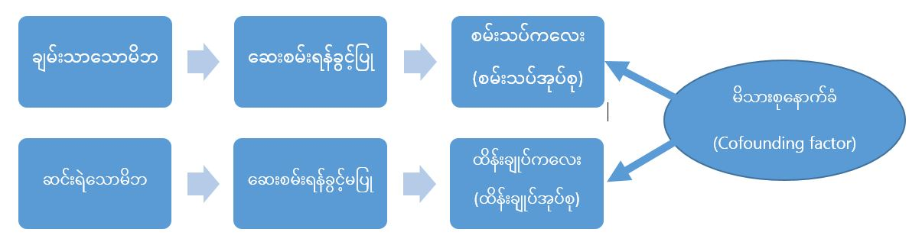
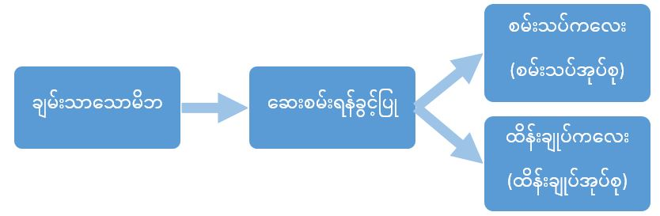

ဆေးဝါးအသစ်တစ်ခုကို ရှာဖွေဖော်ထုတ်လိုက်ပြီဆိုပါတော့။ ဒီဆေးအသစ်က ဓာတ်ခွဲခန်းမှာ အောင်မြင်တယ်ဆိုပေမယ့် တစ်ကယ်အပြင်မှာသုံးတဲ့အခါ လိုချင်တဲ့အာနိသင်ရှိရဲ့လားဆိုတာ သေချာစမ်းသပ်စစ်ဆေးဖို့လိုပါတယ်။ တိရစ္ဆာန်တွေကို စမ်းသပ်တဲ့အခါမှာ မတွေ့ရတဲ့ ပြဿနာတစ်ချို့ကို လူတွေအပေါ် စမ်းသပ်ချက် ပြုလုပ်တဲ့အခါ တွေ့ရတတ်ပါတယ်။ တိရစ္ဆာန်တွေဆိုတာ ဘာတွေ ဖြစ်လာမယ်မှန်းမသိတဲ့ ရက်စက်တဲ့ ကံကြမ္မာကို  ဒီအတိုင်း လက်ခံတတ်တာမျိုးကိုး။ ဒီနေရာမှာတော့ ညဏ်ရည်အမြင့်ဆုံးလို့ ကိုယ့်ကိုယ်ကို ခံယူထားတဲ့ လူသားတွေ ဖြစ်နေတယ်လေ။ စမ်းသပ်တဲ့ ဆရာဝန်တွေ၊  စမ်းသပ်မှုကို ခွင့်ပြုတဲ့ လူနာရှင်တွေ၊ အစမ်းသပ်ခံလူနာတွေ အားလုံးက စိတ်ခံစားချက်တွေ ပြည့်နှက်နေတဲ့ လူသားတွေလေ။ ဒီတော့ စမ်းသပ်ချက်ပြုလုပ်ဖို့ လှည့်ကွက်လေးတွေ လိုတာပေါ့နော်။ အောင်မြင်တဲ့ စမ်းသပ်ချက်တစ်ခုဖြစ်ဖို့ အတွက် စမ်းသပ်ချက်တစ်ခုရဲ့ နောက်ကွယ်မှာ ဘာတွေလိုလဲဆိုတာ ဆေးဝါးစမ်းသပ်ပုံကို ဥပမာထားပြီး လေ့လာကြည့်ကြရအောင်။

ပိုလီယိုရောဂါဟာ 1961 ခုနှစ်မှာ အမေရိကန်မှာ စတင်ပြန့်ပွားလာပြီ: နှစ်လေးဆယ်အတွင်း သေဆုံးသူ (အထူးသဖြင့် ကလေးငယ်များ) အရေအတွက်က သိန်းနဲ့ချီရှိလာပါတယ်။ 1950 အကျော်မှာတော့ ပိုလီယိုကာကွယ်ဆေးအချို့ကို စမ်းသပ်တွေ့ရှိလာကြပါတယ်။ ဒီအထဲမှာ Jonas Salk ဆိုသူရှာဖွေဖော်စပ်ထားတဲ့ဆေးက အလားအလာကောင်းကြောင်းတွေ့ခဲ့ကြပါတယ်။ ဓာတ်ခွဲခန်းတွေမှာ စမ်းသပ်ချက်အရ သူ့ဆေးက ပိုလီယိုကိုကာကွယ်နိုင်တဲ့ antibodies တွေထုတ်ပေးနိုင်တာကို တွေ့ခဲ့ကြပါတယ်။

ဒါပေမယ့် ဆေးဝါးအသစ်တစ်ခု စမ်းသပ်တဲ့အခါ ထိုဆေးက ရောဂါအပေါ်မှာ သက်ရောက်မှုရှိ/ မရှိဆိုတာ သေချာစမ်းသပ်ပြီး သက်သေပြဖို့လိုလာပါတယ်။ ဒါကို စမ်းသပ်ဖို့ အရှင်းဆုံးနည်းလမ်းကတော့ နှိုင်းယှဉ်တဲ့နည်းလမ်း (Method of comparison) ဖြစ်ပါတယ်။ ဒီနည်းလမ်းအရ လူနာတွေကို အုပ်စုနှစ်ခုခွဲလိုက်ပါတယ်၊ အုပ်စုတစ်ခုကို ဆေးပေးပြီး နောက်တစ်ခုကို ဆေ:မပေးပဲထားလိုက်ပါတယ်။ ပြီ:တော့ အုပ်စုနှစ်ခုရဲ့ ရောဂါအခြေအနေကို နှိုင်းယှဉ်ကြည့်ပါတယ်။ တကယ်လို့ဆေးက သက်ရောက်မှုကောင်းကောင်းရှိမယ်ဆိုရင် ဆေးကျွေးထားတဲ့ အုပ်စုက ကျန်အုပ်စုထက် အခြေအနေတိုးတက်မှုရှိမှာဖြစ်ပါတယ်။ ဆေးပေးခြင်းခံရတဲ့ အုပ်စုကို Treatment group လို့ခေါ်ပြီး ဆေးမပေးထားတဲ့အုပ်စုကို Control group လို့ခေါ်ပါတယ်။ Treatment group နဲ့ control group ကိုနှိုင်းယှဉ်ပြီ: ​ဆေးရဲ့သက်ရောက်မှုကို ဆုံးဖြတ်တာဖြစ်ပါတယ်။ ဒီလို စမ်းသပ်ခံအုပ်စုနဲ့ နှိုင်းယှဉ်ဖို့ ထိန်းချုပ်ထားတဲ့အုပ်စု နှစ်ခုခွဲပြီး လေ့လာတဲ့စနစ်ကို ထိန်းချုပ်စမ်းသပ်ချက် (Controlled experiment) လို့ခေါ်ပါတယ်။

ဒီလို အုပ်စုခွဲပြီး စမ်းသပ်စစ်ဆေးတဲ့အခါမှာ ပြဿနာတော့ နည်းနည်းရှိပါတယ်။ ရောဂါရှိတဲ့လူနာချင်းအတူတူကိုပဲ တစ်ချို့တစ်ဝက်ကို ဆေးမပေးဘူးဆိုတာက ဆေးပညာကျင့်ဝတ်ပိုင်းမှာ မေးခွန်းထုတ်စရာဖြစ်လာပါတယ်။ ဒါပေမယ့် ပိုလီယိုကာကွယ်ဆေးလိုမျိူး ဆေးအသစ်တစ်ခုရဲ့ အာနိသင်နဲ့ သက်ရောက်မှုကို စမ်းသပ်ဖို့က ဒီနည်းကပဲ အသေချာဆုံးဖြစ်နေတဲ့အတွက် ဒီနည်းကိုပဲ သုံးရဦးမှာပါပဲ။ နောက်ပိုအရေးကြီးတဲ့တစ်ချက်က စမ်းသပ်အုပ်စုနဲ့ ထိန်းချုပ်အုပ်စုက ဆေးရခြင်း၊ မရခြင်းကလွဲရင် တစ်ခြားအချက်တွေက တူညီရမှာဖြစ်ပါတယ်။ အဲ့ဒါမှ အုပ်စုနှစ်ခုရဲ့ ရလာဒ်ကွာခြားချက်က ဒီဆေးကြောင့်လို့ ကောက်ချက်ချလို့ရမှာ ဖြစ်တယ်။ မဟုတ်ရင် ဆေ:ရဲ့ သက်ရောက်မှုကြောင့်လား၊ တစ်ခြား factor တစ်ခုခုကြောင့်လားဆိုတာ သေချာနိုင်မှာမဟုတ်ပါဘူး။

ဥပမာ စမ်းသပ်အုပ်စုကို အသက် ၅၀ အောက်တွေထားပြီ: ထိန်းချုပ်အုပ်စုကို အသက် ၅၀ အထက်တွေထားလိုက်မယ်ဆိုရင် အုပ်စုနှစ်ခုက ဆေ:ရခြင်း၊ မရခြင်းအပြင် အသက်အရွယ်ပါ သိသိသာသာကွာခြားချက် ဖြစ်သွားပါပြီ။ အဲ့ဒါဆိုရင် သူတို့တွေရဲ့ ရောဂါကိုတုန့်ပြန်မှုက ဆေးအစွမ်းကြောင့်လား၊ အသက်ငယ်လို့ ကိုယ်ခံအားကောင်းတာလားဆိုတာ မသေချာတော့ပါဘူး။ ဒါက ရိုးရှင်းတဲ့ ဥပမာဖြစ်ပါတယ်။ အဲ့ဒီ့လို ကိုယ်စမ်းချင်တဲ့အရာနဲ့ ထွက်လာတဲ့ရလာဒ်ကြားမှာ ဝင်ရှုပ်တဲ့ကောင်ကို confounding factor/ variable လို့ခေါ်ပါတယ်။

ဒါက ဆေးဝါးစမ်းသပ်ချက်မှာသာမက သိပ္ပံနည်းကျစမ်းသပ်ချက်တွေအားလုံး အကျုံးဝင်ပါတယ်။ သိပ္ပံစမ်းသပ်ချက်တစ်ခုဟာ သဘာဝအတိုင်း ဖြောင့်မတ်မှန်ကန်ရပါမယ်။ မှန်ကန်မျှတတဲ့စမ်းသပ်ချက် (fair experiment) ဖြစ်ဖို့ဟာ စမ်းသပ်ချက်တစ်ခုရဲ့အသက်ပါပဲ။ နောက်ထပ်ဥပမာတစ်ခုက အပင်တွေရဲ့နေရောင်ရရှိမှုကိုလိုက်ပြီး ကြီးထွားဖွံ့ဖြိုးမှုနှုန်းကို လေ့လာမယ်ဆိုရင် အမျိုးအစားနဲ့ အရွယ်အစားတူညီတဲ့ အပင် အနည်းဆုံးနှစ်ပင်ရှိရပါမယ်။ တစ်ပင်ကို နေရိပ်ထဲမှာထားပြီး နောက်တစ်ပင်ကို နေရောင်ကောင်းကောင်းရတဲ့နေရာမှာထားနိုင်ပါတယ်။ ဒါပေမယ့် သူတို့ကို ရေလောင်းတဲ့ ပမာဏ၊ အချိန်၊ မြေဩဇာပမာဏကို အတူတူထားရမှာဖြစ်ပါတယ်။ ဒီစမ်းသပ်ချက်မှာ နေရောင်ရရှိမှုကို ပြောင်းလဲပြီးလေ့လာတဲ့အတွက် နေရောင်ရရှိမှုကို independent variable, ကြီးထွားနှုန်းက နေရောင်ရရှိမှုကို မှီခိုနေတဲ့အတွက် dependent variable, ရေနဲ့ မြေဩဇာက ထိန်းချုပ်ထားတဲ့အတွက် controlled variable/ constant variable လို့အသီးသီ:ခေါ်ပါတယ်။

ပိုလီယိုကာကွယ်ဆေးစမ်းသပ်တုန်းက သူတို့ကလေးတွေကို ဆေးစမ်းဖို့ခွင့်ပြုတဲ့ မိဘတွေရဲ့ ကလေးတွေကို စမ်းသပ်အုပ်စုမှာထားပြီး ခွင့်မပြုတဲ့ မိဘတွေရဲ့ ကလေးတွေကို ထိန်းချုပ်အုပ်စုမှာထားဖို့ အဆိုပြုခဲ့ကြပါတယ်။ အဲ့ဒါဆို ဘယ်သူ့ကို ဘယ်အုပ်စုထဲ ထည့်ရမလဲ ဆုံးဖြတ်စရာမလိုတော့ဘူး။ ဒါပေမယ့် ပြဿနာက ဆေးစမ်းဖို့ခွင့်ပြုတဲ့မိဘနဲ့ ခွင့်မပြုတဲ့မိဘရဲ့ ကလေးတွေမှာ ကွာခြားချက်တစ်ခုရှိနေပါတယ်။ အဲ့ဒါက မိသားစုနောက်ခံ (family background) ပါ။ ဆေးစမ်းဖို့ခွင့်ပြုတဲ့ မိဘတွေက ချမ်းသာတဲ့မိဘတွေဖြစ်တာများပြီ: ခွင့်မပြုတဲ့ မိဘတွေက ဆင်းရဲတဲ့မိဘတွေဖြစ်တာ များပါတယ်။ ချမ်းသာတဲ့မိသားစုက ကလေးတွေက ပိုလီယိုဖြစ်တာပိုများပါတယ်။ ဆင်းရဲတဲ့မိသားစုက ကလေးတွေက ငယ်ငယ်ကတည်းက ကျန်းမာရေးနဲ့သိပ်မညီညွတ်တော့ ပိုလီယိုရောဂါပိုးကို နည်းနည်း ယဉ်သွားတဲ့သဘောပါပဲ။ အဲ့ဒီ့တော့ မိဘတွေကိုကြည့်ပြီ: အုပ်စုခွဲမယ်ဆိုရင် ကွာခြားချက်တွေရှိလာမှာဖြစ်ပြီး ကာကွယ်ဆေးရဲ့ အခန်းကဏ္ဍက မှေးမှိန်သွားမှာ ဖြစ်ပါတယ်။

မိဘကိုကြည့်ပြီ:အုပ်စုခွဲလို့ အဆင်မပြေတဲ့အတွက်၊ အုပ်စုနှစ်ခု အတူတူဖြစ်အောင် မိဘခွင့်ပြုတဲ့ကလေးတွေကိုပဲ စမ်းသပ်အုပ်စုကော ထိန်းချုပ်အုပ်စုပါလုပ်ဖို့ ဆုံးဖြတ်ခဲ့ကြပါတယ်။ အဲ့ဒါဆိုရင် အုပ်စုနှစ်ခုက မိသားစုနောက်ခံ အတူတူဖြစ်သွားမှာဖြစ်ပါတယ်။

စမ်းသပ်ချက်မှာပါတဲ့လူတွေကို confounding factor တွေမရှိအောင် စိစစ်ပြီးသွားပြီဆိုရင် အုပ်စုခွဲဖို့လိုအပ်လာပါပြီ။ ဘယ်သူ့ကို ဘယ်အုပ်စုမှာထားမလဲဆိုတာ သုတေသနလုပ်တဲ့ ဆရာဝန်ကိုသာ ဆုံးဖြတ်ခိုင်းမယ်ဆိုရင် human judgement ဖြစ်တဲ့အတွက် အနည်းနဲ့အများ သိသိနဲ့သော်လည်းကောင်း၊ မသိလိုက်ပဲနဲ့သော်လည်းကောင်း ဘက်လိုက်မှာဖြစ်ပါတယ်။ ရောဂါအခြေအနေ နည်းနည်းပိုဆိုးမယ်ထင်တဲ့လူကို ထိန်းချုပ်အုပ်စုထဲပို့ပြီး ရောဂါသိပ်မဆိုးဘူးလို့ ထင်ရတဲ့လူကို စမ်းသပ်အုပ်စုထဲပို့လိုက်မယ်ဆိုရင် ဆေ:စွမ်းဘက်ကို အသားပေး ဘက်လိုက်တဲ့သူဖြစ်သွားပါပြီ။ ပြောင်းပြန်လည်းဖြစ်နိုင်ပါတယ်။ အဲ့ဒီ့လိုဘက်မမျှဖြစ်နေရင် အုပ်စုနှစ်ခုကြားမှာ confounding effect က ရှိနေဦးမှာဖြစ်ပါတယ်။ ဘက်မျှစေချင်ရင် လူအဆုံးအဖြတ်ကို မယူပဲ ခေါင်းပန်းလှန်သလို chance process နဲ့ဆုံးဖြတ်ပါတယ်။ ခေါင်းပန်းလှန်တာလိုမျိုး chance process မှာ ဖြစ်နိုင်ခြေနှစ်ခု (ခေါင်းနှင့်ပန်း) အတွက် ဖြစ်တန်စွမ်း ၅၀% စီရှိပါတယ်။ ဆိုလိုတာက အကြိမ်တစ်ရာခေါင်းပန်းလှန်ရင် အကြိမ် ၅၀ လောက်က ခေါင်းကျပြီး အကြိမ် ၅၀ လောက်က ပန်းကျမှာဖြစ်တယ်။ ဒီနည်းနဲ့ လူတစ်ယောက်ကို ဆုံးဖြတ်ရင် စမ်းသပ်အုပ်စု (သို့) ထိန်းချုပ်အုပ်စုကို ကျဖို့ ၅၀/၅၀ ဖြစ်နိုင်ချေရှိတယ်။ အဲ့ဒါက သူ့အတွက်ရော စမ်းသပ်မှုအတွက်ပါ မျှတပြီး ဘက်မလိုက်တဲ့ ဆုံးဖြတ်ချက်ဖြစ်ပါတယ်။ စမ်းသပ်ချက်မှာပါဝင်တဲ့ လူအားလုံးကို ဒီလိုဆုံးဖြတ်ရင် တစ်ဝက်က စမ်းသပ်အုပ်စုရောက်ပြီး ကျန်တစ်ဝက်က ထိန်းချုပ်အုပ်စုရောက်မယ်၊ ဘယ်အုပ်စုဘက်မှလည်း ဘက်လိုက်လို့မရတဲ့ နည်းစနစ်ဖြစ်ပါတယ်။ အဲဒီ့လို စနစ်ကို ကျပန်းထိန်းချုပ်စမ်းသပ်ချက် (Randomized controlled experiment) လို့ခေါ်ပါတယ်။

စမ်းသပ်ချက်မှာ ပါဝင်တဲ့သူတွေကို အုပ်စုခွဲပြီးသွားရင် စမ်းသပ်ခံအုပ်စုကို ဆေ:ဝါးအသစ်တိုက်ကျွေးပါတယ်။ ထိန်းချုပ်အုပ်စုကိုတော့ အာနိသင်မရှိတဲ့ ဆေးအတုကို တိုက်ကျွေးပါတယ်။ စမ်းသပ်ချက်မှာ ပါဝင်သူတွေက သူတို့ ဘယ်အုပ်စုမှာပါဝင်လဲ ဆိုတာမသိပါဘူး။ သူတို့သောက်တဲ့ဆေးက အာနိသင်ရှိ၊ မရှိလဲ မသိပါဘူး။ ဘာလို့ ဆေးအတုကိုပေးရလဲ၊ ဘာဆေးမှမပေးရင်ရော မရဘူးလား? ဘာဆေးမှမပေးတဲ့အခါကျရင် သူတို့က ထိန်းချုပ်အုပ်စုထဲမှာပါတယ်ဆိုတာသိသွားမယ်၊ နောက်ပြီ: ဆေးဝါးကိုမရရှိတဲ့အတွက် သူတို့ကိုယ်သူတို့ ယုံကြည်မှုလည်းလျော့သွားမယ်။ ဒီလိုဖြစ်ရင် သူတို့ရဲ့စိတ်အခြေအနေက ရောဂါကို သက်ရောက်မှုတစ်ခုရှိနိုင်တယ်၊ စမ်းသပ်အုပ်စုနဲ့ ထိန်းချုပ်အုပ်စုတွေရဲ့ မတူတဲ့စိတ်အခြေအနေက စမ်းသပ်မှုအတွက် နောက်ထပ် confounding factor တစ်ခုလိုဖြစ်နေနိုင်ပါတယ်။ ဆေးကို ရခြင်း၊ မရခြင်းကို သိတဲ့စိတ်က ရောဂါကို တစ်ကယ်ပဲ သက်ရောက်မှုရှိနိုင်တယ်လို့ ဆိုတဲ့ သုတေသနတွေလည်း ရှိပါတယ်။ သူတို့ကို ဆေးဝါးအကုန်ပေးထားတယ်လို့ ထင်မြင်စေခြင်းအားဖြင့် စိတ်ရဲ့သက်ရောက်မှုမပါတော့ပဲ ဆေးရဲ့တစ်ကယ့် physical သက်ရောက်မှုကို လေ့လာနိုင်ပါတယ်။ ထိန်းချုပ်အုပ်စုကိုပေးတဲ့ ဟန်ပြဆေးအတုကို placebo လို့ခေါ်ပါတယ်။

ကဲ. ဆေးကျွေးတဲ့ အဆင့်တော့ပြီးသွားပြီ။ ဆေးရဲ့ သက်ရောက်မှုကို လေ့လာရတော့မယ်။ ဆေးရဲ့သက်ရောက်မှုကို စစ်ဆေးတဲ့ဆရာဝန်တွေက ဘယ်သူတွေက စမ်းသပ်အုပ်စုဆိုတာသိရင် ဘက်လိုက်ပြီးစစ်ဆေးမှာစိုးတဲ့အတွက် စစ်ဆေးတဲ့ ဆရာဝန်တွေ (Diagnosticians) ကို ဘယ်အုပ်စုကလူဆိုတာ ပြောမပြပါဘူး။ ဒီလို အစမ်းသပ်ခံရော စမ်းသပ်တဲ့သူပါ အုပ်စုခွဲမှု မသိတဲ့စနစ်ကို နှစ်ဖက်ပိတ်ထိန်းချုပ်စမ်းသပ်စနစ် (Double-blind experiment) လို့ ခေါ်ပါတယ်။ အားလုံးကို ခြုံလိုက်ရင် ထိန်:ချုပ်အုပ်စုရှိ၊ ကျပန်းအုပ်စုခွဲစနစ်၊ စမ်းသပ်ခံနှင့် စမ်းသပ်သူတို့ အုပ်စုခွဲမှု မသိတဲ့ စမ်းသပ်ချက်မျိုးကို Randomized controlled double-blind experiment လို့ခေါ်ပါတယ်။

Randomized controlled double-blind experiment တွေကို လက်ရှိ အကောင်းဆုံး စမ်းသပ်ချက် design လို့သတ်မှတ်ထားကြပါတယ်။ သိပ္ပံနည်းကျစမ်းသပ်ချက်တွေ အကုန်လုံးကတော့ controlled experiment တွေ မဟုတ်ပါဘူး။ တစ်ချို့စမ်းသပ်ချက်တွေက ထိန်းချုပ်အုပ်စုလုပ်လို့ အဆင်မပြေပါဘူး။ ဥပမာ ဆေးလိပ်သောက်ခြင်းနဲ့ ကင်ဆာဖြစ်ပွားမှုကို လေ့လာမယ်ဆိုရင် နောက်ခံတူညီတဲ့လူတွေလိုက်ရှာ၊ တစ်ဝက်ကို ဆယ်နှစ်​လောက် ဆေးလိပ်သောက်ခိုင်းပြီး နောက်တစ်ဝက်ကို ဆေးလိပ်မသောက်ခိုင်းတာတော့ မဟုတ်သေးဘူးလေ။ ဒီလိုကိစ္စတွေကျတော့ ထိန်းချုပ်အုပ်စုကို စမ်းသပ်ချက်က သတ်မှတ်ပေးရတာမဟုတ်ပဲ အရှိအတိုင်းပဲ confounding မဖြစ်အောင် စိစစ်ပြီး လေ့လာရပါတယ်။ ဒီလိုလေ့လာမှုမျိုးကိုတော့ observational studies လို့ခေါ်ပါတယ်။ Observational studies တွေမှာ တစ်ချိန်တည်း ဖြတ်ပြီးလေ့လာတဲ့စနစ် (ဥပမာ လက်ရှိ အသက် ၃၀ နဲ့ ၃၅ နှစ်ကြားလူတွေကို လေ့လာခြင်း) ကို cross-sectional study လို့ခေါ်ပြီး အချိန်ယူစောင့်ကြည့်လေ့လာတဲ့စနစ် (ဥပမာ အသက် ၃၀ မှစ၍ ၃၅ နှစ်တိုင်အောင် ၅ နှစ်လုံးလေ့လာခြင်း) ကို follow-up study လို့ အကြမ်းဖြင်းခွဲခြားနိုင်ပါတယ်။ Observational study တွေဟာ အချက်တစ်ခုနဲ့ တစ်ခုကြား ဆက်သွယ်ချက်ကိုရှာတဲ့နေရာမှာ အသုံးဝင်ပေမယ့် ဘာကြောင့်ဖြစ်ရတာလဲဆိုတဲ့ cause ကို ရှာတဲ့နေရာမှာတော့ အားနည်းပါတယ်။

သိပ္ပံပညာရှင်တွေဟာ စမ်းသပ်ချက်တစ်ခုပြုလုပ်တဲ့အခါ မိမိကိုယ်တိုင်ရော တစ်ခြားအရာတွေကြောင့် စမ်းသပ်ချက်ရလာဒ်တွေ မမှန်မကန်ဖြစ်သွားမှာကို စိုးရိမ်ကြပါတယ်။ ဒါကြောင့် စမ်းသပ်ချက်ကို ပုံစံဆွဲတဲ့အခါ ပတ်ဝန်းကျင်က သက်ရောက်မှုတွေ နည်းနိုင်သမျှနည်းအောင်လုပ်ပြီး အချက်အလက်ကိုစုဆောင်းကြပါတယ်။ ဒီလိုလုပ်တာတောင် တစ်ခါတစ်ရံ ချွတ်ချော်ပြီးအမှားအယွင်းတွေရှိတတ်ပါတယ်။ စမ်းသပ်ခံလူတွေက သိပ္ပံပညာရှင် ခိုင်းတဲ့အတိုင်းမလုပ်တာတွေလည်း ရှိတတ်ပါသေးတယ်။ သိပ္ပံပညာရှင်တွေကတော့ ရှေ့က စမ်းသပ်ချက်တွေရဲ့ အမှားတွေကို သင်ခန်းစာယူပြီး ပိုပြည့်စုံတဲ့ စမ်းသပ်ချက်ဖြစ်အောင် နည်းမျိုးစုံနဲ့ ကြိုးစားကြပါတယ်။ Research paper တွေကို ဖတ်ကြည့်ရင် လေ့လာသူတွေက သူတို့ဘယ်လို စမ်းသပ်ခဲ့လဲဆိုတဲ့ စမ်းသပ်ချက်ပုံစံကို ဖော်ပြထားတာတွေ့ရပါလိမ့်မယ်။ ဒီလို စမ်းသပ်ချက်တစ်ခုရဲ့ နောက်ကွယ်က အကြောင်းအရာတွေကိုသိရှိထားရင် စမ်းသပ်ချက်ပုံစံကို ပိုပြီးနားလည်နိုင်ပါလိမ့်မယ်။ သင်ကိုယ်တိုင် စမ်းသပ်ချက်တစ်ခု လုပ်ရတဲ့အခါကျရင်လည်း ဒီအချက်တွေကို သတိထားနိုင်ဖို့ ရေးသားဖော်ပြလိုက်ပါတယ်။

Reference: Statistics, Fourth Edition, David Freedman
