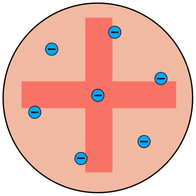
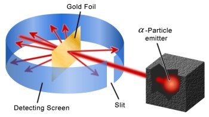
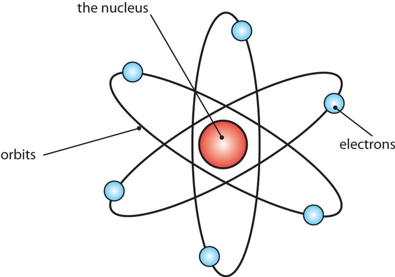
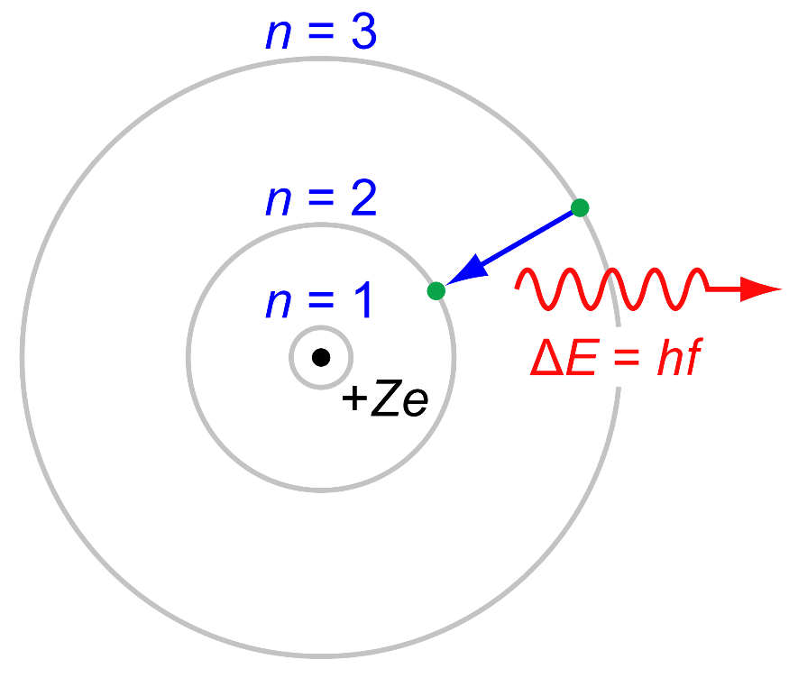
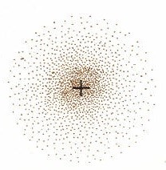
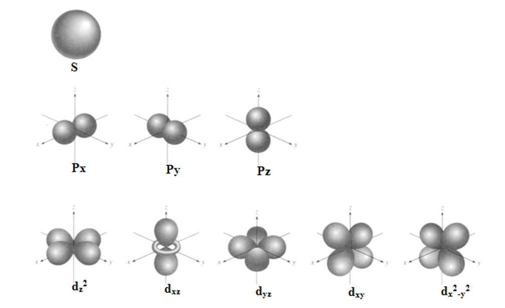

အက်တမ် (Atom) ဆိုတာ ဂရိဘာသာကလာတာဖြစ်ပြီး ထပ်မံမခွဲစိတ်နိုင်သောအရာလို့အဓိပ္ပာယ်ရပါတယ်။ သင်ကိုယ်တိုင်နဲ့သင့်ပတ်ဝန်းကျင်မှာရှိတဲ့အရာအားလုံး၊ စကြာဝဠာတစ်ခွင်မှာရှိတဲ့ ဒြပ်ထုအားလုံးကို အက်တမ်တွေနဲ့ဖွဲ့စည်းထားပါတယ်။

အက်တမ်အယူအဆကို (၄၀၀) BC လောက်မှာ တွေးခေါ်ပညာရှင် Leucippus နဲ့ သူ့တပည့် Democritus တို့ကစတင်တီထွင်ခဲ့ပါတယ်။ အက်တမ်တွေဟာဖန်တီးလို့၊ ဖျက်ဆီးလို့မရကြောင်းကိုလည်းအဆိုပြုခဲ့ပါတယ်။ ဒါပေမယ့် သူတို့အယူအဆတွေဟာတွေးခေါ်မှုသက်သက်ဖြစ်ပြီး သိပ္ပံနည်းကျစမ်းသပ်မှုတွေမပါဝင်ခဲ့ပါဘူး။

## Dalton (ဒေါ်လ်တန်) ၏ အက်တမ်သီအိုရီ

England သိပ္ပံပညာရှင် John Dalton (1766-1844) ရဲ့သီအိုရီပါ။

၁. ဓာတုပစည်းများကို အလွန်သေးငယ်သော အမှုန်များဖြစ်သည့် အက်တမ်များဖြင့်ဖွဲ့စည်းထားသည်။

၂. ပစ္စည်းအမျိုးအစား (ဒြပ်စင်) တူညီပါက အက်တမ်များလည်းတူညီကြသည်။ တစ်နည်းအားဖြင့် ဒြပ်စင်တစ်ခုစီကို အက်တမ်အမျိုးအစားတစ်ခုစီဖြင့် ဖွဲ့စည်းထားသည်။

၃. ​အက်တမ်များကို ပိုင်းခြားမရ၊ ဖန်တီးမရ၊ ဖျက်ဆီးမရပါ။

၄. ဒြပ်စင်များပေါင်းစပ်သောအခါ အက်တမ်များသည် အချိုးအဆ ကိန်းပြည့်ဖြင့် ပေါင်းစပ်ကြသည်။ ဥပမာ H2O.

၅. ဓာတုဗေဒဒြပ်ပြုမှုများတွင် အက်တမ်များသည် ပေါင်းစပ်ကြ၊ ကွဲကွာကြ၊ အစီအစဥ်ပြောင်းလဲကြသည်။

## J.J. Thompson (ဂျေဂျေသော်မ်ဆန်) ၏အက်တမ်မော်ဒယ်

Joseph John Thompson (1871-1937) က အီလက်ထရွန်ကို စမ်းသပ်တွေ့ရှိခဲ့သူတစ်ဦ:ဖြစ်ပါတယ်။ သူက အက်တမ်တစ်လုံးဟာ သီးစုံကိတ်မုန့်လို ဖြစ်ပြီး အဖိုဓာတ်တွေပျံ့နှံ့နေတဲ့ စက်လုံးပုံ ကိတ်မုန့် ထဲမှာ အမဓာတ်ဆောင်တဲ့ အီလက်ထရွန် (သစ်သီး) တွေက နစ်မြုပ်နေတယ်လို့ ဆိုပါတယ်။

## Rutherford (ရားသားဖို့သ်) ၏အက်တမ်မော်ဒယ်

J.J. Thompson ရဲ့တပည့် Ernest Rutherford (1871-1937) က သီးစုံကိတ်အက်တမ်မော်ဒယ်ကို သက်သေပြဖို့အတွက် စမ်းသပ်ချက်တစ်ခု လုပ်ခဲ့ပါတယ်။ ရွှေပြားပါးပါးလေးတစ်ပြားကို အပေါင်းဓာတ်ဆောင်တဲ့ alpha particles တွေနဲ့  တိုက်လိုက်ပါတယ်။ သော်မ်ဆန်မော်ဒယ်အရဆို alpha particle တွေက အပေါင်းဓာတ်တွေပျံ့နေတဲ့ရွှေပြားကိုတည့်တည့်ဖြတ်သွားရမှာဖြစ်ပါတယ်။ စမ်းသပ်ချက်အရ alpha particle အများစုက ရွှေပြားကို တည့်တည့်ဖြတ် ဒါမှမဟုတ် မဆိုစလောက် သွေဖီသွားပါတယ်။ ဒါပေမယ့် တစ်ခါတစ်ခါ particle တစ်ချို့က ဒီဂရီအများကြီးသွေဖီသွားတယ်၊ တစ်ချို့က bounce ဖြစ်ပြီးနောက်ပြန်လှည့်လာတာကို တွေ့ရတယ်။ အပေါင်းဓာတ်တွေက အက်တမ်ထဲမှာ ညီတူညီမျှ ပျံ့နှန့်နေတာဆိုရင် particle တွေ ပြန်လှည့်လာစရာမရှိဘူး။ ဒါကြောင့် ရားသားဖို့ က အက်တမ်ရဲ့အလယ်မှာ  အပေါင်းဓာတ်တွေစုနေပြီး အီလက်ထရွန်တွေက အပေါင်းဓာတ်တွေကို ြခံရံကာ စက်ဝိုင်းပုံလှည့်ပတ်နေတယ်။ အက်တမ်ရဲ့ဒြပ်ထုအများစုဟာ အလယ်က အပေါင်းဓာတ်ရှိတဲ့ ထုထည်သေးသေးလေး (နောက်ပိုင်း nucleus လို့နာမည်ပေးခဲ့ပါတယ်)မှာ စုစည်းနေတယ်၊ ဒါကြောင့် alpha particle အများစုဟာ nucleus  နဲ့ လွတ်တဲ့အခါ အက်တမ်ကို တည့်တည့်ဖြတ်ပြီး nucleus နဲ့ပွတ်မိတဲ့အခါ လမ်းကြောင်းပြောင်းသွားတယ်၊ nucleus နဲ့ တည့်တည့်တိုက်မိတဲ့အခါ နောက်ဖက်ပြန်လှည့်လာခြင်းဖြစ်တယ်လို့ ရှင်းပြခဲ့ပါတယ်။ Nucleus ဟာသိပ်သည်းဆအလွန်များပြီး ထုထည်က အက်တမ်ထုထည်ရဲ့ ၄၀၀၀ ပုံတစ်ပုံလောက်ပဲရှိပါတယ်။ (အက်တမ်က ဘောလုံးကွင်းတစ်ကွင်းစာရှိမယ်ဆိုရင် နယူကလီးယက်စ်က ဖန်ဂေါ်လီလုံးတစ်လုံးစာပဲ ရှိပါတယ်)။ ဒြပ်ထုတွေအကုန်နီးပါးကလည်း nucleus မှာစုနေတဲ့အတွက် အက်တမ်တစ်လုံးက နေရာလွတ် (ဗလာ) နီ:ပါးဖြစ်ပါတယ်။

Rutherford မော်ဒယ်မှာ ဂြိုလ်တွေကနေကို လှည့်ပတ်နေသလိုမျိုး အီလက်ထရွန်တွေက နယူကလီးယက်စ်ကို လှည့်ပတ်နေပါတယ်။ အဲဒါဆို အီလက်ထရွန်တွေက စွမ်းအင်လျော့လာရင် တဖြည်းဖြည်း နယူကလီ:ယက်စ်ထဲကို ဝင်မသွားနိုင်ဘူးလား။ ဒီပြဿနာကို Neils Bohr က ဖြေရှင်းဖို့ကြိုးစားခဲ့ပါတယ်။

## Neils Bohr (1885-1962) ၏အက်တမ်မော်ဒယ်

၁၉ ရာစုအစောပိုင်းမှာ ဂျာမန်သိပ္ပံပညာရှင် Max Plank က ကွမ်တမ်သီအိုရီ (quantum theory) ကို အဆိုပြုခဲ့ပါတယ်။ သူက အက်တမ်တွေက ထုတ်လွှတ်တဲ့ စွမ်းအင် (electromagnetic radiation) ဟာ တစ်ဆက်တည်းမဟုတ်ပဲ အစုလိုက်ပုံစံနဲ့ထုတ်လွှတ်တယ်လို့ ဆိုပါတယ်။

ညီမျှခြင်းအရ:

$$
E = h\nu
$$

E က စွမ်းအင်၊ h က Plank's constant ($6.63 \times 10^{-34}$ J.s)၊ $\nu$ က ကြိမ်နှုန်း (frequency) ဖြစ်ပါတယ်။

ဒီညီမျှခြင်းအရ စွမ်းအင်က ကြိမ်နှုန်းပေါ်မူတည်ပါတယ်၊ ဒါ့အပြင် ပမာဏက $1 hv$, $2 hv$, $3 hv$ စသည်ဖြင့် ကိန်းပြည့် $hv$ ပဲရှိပြီး $1.5hv$ လို့မရှိပါဘူး။

အက်တမ်အကြောင်းကို ပြန်ဆက်ရရင် ၁၉၁၃ မှာ Neils Bohr က အက်တမ်တစ်လုံးမှာ အီလက်ထရွန်တွေက နယူကလီးယက်စ်ကို တိကျတဲ့အကွာအဝေးကနေ စက်ဝိုင်းပုံလမ်းကြောင်းတွေအတိုင်းပတ်နေတယ်လို့ အဆိုပြုခဲ့ပါတယ်။ ဒီပတ်လမ်းတွေကို orbit လို့ခေါ်ပါတယ်။ သူက အီလက်ထရွန်တွေမှာ တိကျတဲ့ စွမ်းအင်ရှိပြီး အဲ့ဒီစွမ်းအင်က အီလက်ထရွန်ပတ်လမ်းကို သတ်မှတ်ပေးတယ်လို့ဆိုပါတယ်။ (စွမ်းအင်တွေက quantum သီအိုရီအရ တိကျစွာသတ်မှတ်ထားတဲ့အတွက် အီလက်ထရွန်တွေက နယူကလီးယက်စ်ထဲကို ဝင်မသွားနိုင်ပါဘူး) အီလက်ထရွန်တစ်လုံးကစွမ်းအင်ရရှိ၊ ဆုံးရှုံးတဲ့အခါ သူ့ပတ်လမ်းကနေ တစ်ခြားပတ်လမ်းတစ်ခုကို ကူးပြောင်းပါတယ်။ ပတ်လမ်းရဲ့နာမည်ကို n နဲ့သတ်မှတ်ြပီး တန်ဖိုးက 1 ကနေ infinity အထိရှိပါတယ်။ n=1 ပတ်လမ်းဟာ အနိမ့်ဆုံး စွမ်းအင်အဆင့်ဖြစ်ြပီး ground state လို့ခေါ်ပါတယ်။ အီလက်ထရွန်က n=1 ကနေ n=2 ပတ်လမ်းကိုပြောင်းဖို့ (နယူကလီးယက်စ်ကနေ ဝေးရာကိုသွားဖို့) စွမ်းအင်ပမာဏတစ်ခုကို စုပ်ယူရပါတယ်။ n=2 ကနေ n=1 ကို ပြောင်းရင် တူညီတဲ့ စွမ်းအင်ပမာဏကို electromagnetic radiation အနေနဲ့ထုတ်လွှတ်ပါတယ်။ အဲ့ဒီ electromagnetic radiation စွမ်းအင်ပမာဏတစ်ခုကို photon လို့လည်းခေါ်ပါတယ်။ Hydrogen atom က အီလက်ထရွန်တစ်လုံးက n=2 ကနေ n=1 ground state ကို ​ပြောင်းတဲ့အခါ လှိုင်းအလျား ၁၂၀ နာနိုမီတာ ရှိတဲ့ photon တစ်လုံးကို ထုတ်လွှတ်ပါတယ်။ ဒီလှိုင်းအလျားက ခရမ်းလွန်ရောင်ခြည်ရဲ့ လှိုင်းအလျားဖြစ်ပါတယ်။

Bohr ရဲ့အက်တမ်မော်ဒယ်က hydrogen လိုမျိုးရိုးရှင်းတဲ့ အက်တမ်တွေအတွက်အဆင်ပြေပေမယ့် အီလက်ထရွန်တွေများပြီး ရှုပ်ထွေးတဲ့ အက်တမ်တွေမှာ အဆင်မပြေခဲ့ပါဘူး။

## Heisenberg's Uncertainty Principle (ဟိန်းစင်ဘက်၏ မသေချာမှုနိယာမ)

အက်တမ်တွေရဲ့ နယူကလီးယက်စ်ကို အဖိုဓာတ်ဆောင်တဲ့ အီလက်ထရွန်နဲ့ အမဓာတ်ဆောင်တဲ့ ပရိုတွန်တွေနဲ့ ဖွဲ့စည်းထားတယ်လို့ယူဆခဲ့ကြပါတယ်။ ၁၉၃၂ ခုနှစ်မှာ Rutherford ရဲ့လုပ်ဖော်ကိုင်ဖက် James Chadwick က နယူထရွန် (neutron) ကို တွေ့ရှိခဲ့ပါတယ်။ နယူထရွန်ဟာ ပရိုတွန်နဲ့ ဒြပ်ထုတူပြီး ဓာတ်မဲ့ (neutral) ဖြစ်ပါတယ်။ nucleus မှာ proton နဲ့ neutron ပေါင်းပြီးရှိနေတာကိုသိရပြီ။

၁၉၂၆ မှာ ဂျာမန်သိပ္ပံပညာရှင် Werner Heisenberg က uncertainty principle (မသေချာမှုနိယာမ) မှာ electron လိုမျိုး သေးငယ်တဲ့အရာတစ်ခုရဲ့ တည်နေရာနဲ့ အဟုန် (position and momentum) ကို တစ်ချိန်တည်းမှာ အတိအကျမတိုင်းနိုင်ဘူးလို့ ပြောခဲ့ပါတယ်။ (အဟုန် = ဒြပ်ထု x အလျင်)

$$
\Delta x . m \Delta u \ge \frac{h}{4 \pi}
$$

$ \Delta x $ = တည်နေရာမသေချာမှု၊ $ \Delta u $ = အလျင်မသေချာမှု၊ $ m $ = ဒြပ်ထု၊ $ h $ = Plank ၏ ကိန်းသေ

မက်ကင်းနစ်မှာ အရာဝတ္ထုတစ်ခုရဲ့ သွားရာလမ်းကြောင်း (path/ trajectory) ကိုသိဖို့ သူ့ရဲ့ တည်နေရာနဲ့ အလျင် (အဟုန် = အလျင် x ဒြပ်ထု) ကိုသိဖို့လိုပါတယ်။ အဲ့ဒါကိုတွေကို မသိရင် အီလက်ထရွန်က Rutherford နဲ့ Bohr ပြောခဲ့သလို စက်ဝိုင်းပုံသွားတယ်၊ ဘာပုံသွားတယ်လို့ ပြောလို့မရတော့ပါဘူး။ အဲ့ဒါဆို ဘယ်လိုလုပ်မလဲ?

## Quantom mechanical model (ကွမ်တမ် မက္ကင်းနစ် မော်ဒယ်)

အီလက်ထရွန်ရဲ့ တည်နေရာနဲ့လမ်းကြောင်းကို သေချာပြောလို့မရတဲ့အတွက် နေရာတစ်ခုမှာအီလက်ထရွန်ကို တွေ့ဖို့ဖြစ်တန်စွမ်း (probability) နဲ့ပြဖို့ Heisenberg  က အဆိုပြုခဲ့ပါတယ်။ ဒီပြဿနာကို ဩစတြီးယားသိပ္ပံပညာရှင် Erwin Schrodenger က လှိုင်းညီမျှခြင်းနဲ့ လှိုင်းဖန်ရှင် ($ \psi $ − ဇိုင်) ကိုသုံးပြီ:ဖြေရှင်းခဲ့ပါတယ်။ ဇိုင်ရဲ့ နှစ်ထပ်ကိန်းဟာ အီလက်ထရွန်တစ်လုံးကို စွမ်းအင်အဆင့်တစ်ခု၊ နေရာတစ်ခုမှာတွေ့နိုင်တဲ့ ဖြစ်တန်စွမ်းကိုပြပါတယ်။ ဒီဖြစ်တန်စွမ်းကို အီလက်ထရွန်သိပ်သည်းဆ (electron density) လို့ခေါ်ပြီး အစက်ကလေးတွေနဲ့ ဖော်ပြပါတယ်။ ပုံမှာပြထားတာကတော့ ground state hydrogen atom ရဲ့ အီလက်ထရွန်သိပ်သည်းဆပြပုံ ဖြစ်ပါတယ်။ Bohr မော်ဒယ်လို စက်လုံးပုံရှိပေမယ့် အီလက်ထရွန်ပတ်လမ်းတွေ သတ်မှတ်မထားပါဘူး။ အီလက်ထရွန်က အစက်ကလေးတစ်စက်ရှိတဲ့နေရာတိုင်းမှာရှိနိုင်ပါတယ်။ နယူကလီးယက်စ် နဲ့နီးတဲ့နေရာမှာ အစက်တွေများနေတဲ့အတွက် အီလက်ထရွန်ရှိနိုင်ခြေများပြီး ဝေးလာတာနဲ့ ရှိနိုင်ခြေနည်းလာပါတယ်။

လှိုင်းညီမျှခြင်း (wave equation) ကို ရှင်းလိုက်တဲ့အခါ လှိုင်းဖန်ရှင်အမျိုးမျိုး၊ အီလက်ထရွန်သိပ်သည်းဆပုံအမျိုးမျိုးထွက်လာပါတယ်။ ဒီလှိုင်းဖန်ရှင်တွေကို orbital လို့ခေါ်ပါတယ်။ ဒီ orbital ဆိုတဲ့စကားလုံးက Bohr model က orbit နဲ့ ဆင်ပေမယ့် အဓိပ္ပာယ်ကမတူပါဘူး။ orbital တွေကို နံပါတ်နဲ့ 0, 1, 2, 3, … အက္ခရာနဲ့ s, p, d, f, … လို့သတ်မှတ်ပါတယ်။ အပေါ်က hydrogen atom ရဲ့ orbital ပုံက s-orbital (1s) ဖြစ်ပါတယ်။ အောက်ကပုံမှာ orbital အမျိုးအစားတစ်ချို့ကို ဖော်ပြထားပါတယ်။

ဒီမော်ဒယ်မှာ အီလက်ထရွန်တစ်လုံးစီကို စွမ်းအင်အဆင့်၊ orbital နံပါတ် (သို့) အက္ခရာ၊ magnetic quantum number နဲ့ စပင်နံပါတ် (spin number) တို့နဲ့သတ်မှတ်ပါတယ်။

ဒီအက်တမ်မော်ဒယ်မှာပဲ ရိုးရှင်းအောင် နယူကလီးယက်စ်ကနေ အီလက်ထရွန် 90% ရှိနိုင်တဲ့ စက်လုံးပုံ region ကို အက်တမ်ရဲ့ စက်လုံးပုံမော်ဒယ် (spherical model) အဖြစ် သတ်မှတ်ကြပါတယ်။

အက်တမ်တွေကို သိပ္ပံပညာရှင်တွေ အမျိုးမျိုးအဓိပ္ပာယ်ဖွင့်ခဲ့ကြတာ အသေးစိတ်လေ့လာကြည့်ရင် အလွန်စိတ်ဝင်စားဖို့ကောင်းပါတယ်။ ဒီလို အက်တမ်အကြောင်း နားလည်နိုင်ဖို့ နှစ်ပေါင်းများစွာ တဖြည်းဖြည်း လေ့လာစမ်းသပ်ခဲ့ရတာဖြစ်ပါတယ်။ သင်အက်တမ်ကိုလေ့လာတယ်ဆိုတာ  အက်တမ်အစုအဝေးကြီးက သူ့အကြောင်းကိုသူ ပြန်လေ့လာနေခြင်းပဲဖြစ်ပါတယ်။