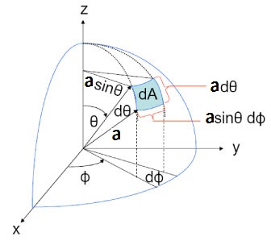

Hollow earth society က လူတွေပြောသလို ကမ္ဘာကြီးက အခေါင်းပေါက်ကြီးဆိုရင် ကမ္ဘာအတွင်းပိုင်းမှာနေတဲ့ လူတွေက အိမ်မြှောင်တွေလို ဇောက်ထိုးကပ်နေမှာမဟုတ်ပဲ ဟင်းလင်းပြင်ထဲမှာလို လွင့်မြောနေကြလိမ့်မယ်။ ဘာလို့လဲဆိုတော့ အခေါင်းပေါက်ကမ္ဘာအတွင်းမှာဆိုရင် ဘယ်နေရာမှာပဲဖြစ်ဖြစ် မြေဆွဲအားက သုညဖြစ်နေလို့ပဲ။

ဒီလိုဖြစ်ရတာဟာ မြေဆွဲအားက ဒြပ်ထုနှစ်ခုအကွာအဝေးနှစ်ထပ်ကိန်းနဲ့ ပြောင်းပြန်အချိုးကျလို့ပဲဖြစ်တယ်။ ဒါပေမယ့် စက်လုံးရဲ့ မျက်နှာပြင်ဧရိယာ (ထို့ကြောင့် ဒြပ်ထု) က အချင်းဝက်နှစ်ထပ်ကိန်းနဲ့ တိုက်ရိုက်အချိုးကျတယ်။ စက်လုံးရဲ့ အလယ်ဗဟိုမှာဆိုရင်တော့ ဒြပ်ဆွဲအားတွေ မျှခြေဖြစ်သွားတာရှင်းပါတယ်။ ဒါပေမယ့် ဗဟိုမဟုတ်ရင်လည်း နှစ်ထပ်ကိန်းအချိုးက တူညီနေတဲ့အတွက် အားသက်ရောက်မှုရှိမှာမဟုတ်ပါဘူး။

စက်လုံးကို မစဉ်းစားသေးပဲ 2D ဖြစ်တဲ့ စက်ဝိုင်းကို စဉ်းစားကြည့်။ P က စက်ဝိုင်းအထဲက ကြိုက်တဲ့အမှတ်တစ်ခုမှာရှိမယ်။ လူက အမှတ် P မှာ ရှိတယ်။ ပြီ:ရင် လူကို ဗဟိုပြုပြီး ထောင့်အသေးလေး dθ တစ်ခု ဆန့်ထုတ်လိုက်။ သူ့ဆန့်ကျင်ဘက်ကိုလည်း ဆွဲထုတ်လိုက်။

အဲ့ဒါဆိုရင် အဲ့ဒီ့ထောင့် dθ က အုပ်မိတဲ့ စက်ဝိုင်းရဲ့ မျက်နှာပြင်အရှည် (စက်ဝန်းပိုင်း) က တစ်ဖက်မှာ dθ × a ဖြစ်ပြီး နောက်တစ်ဖက်မှာ dθ × b ဖြစ်လိမ့်မယ်။ စက်လုံးမှာဆိုရင် ထောင့်က ကတော့ချွန်ပုံရှိပြီး အုပ်မိတာက စက်လုံးရဲ့ မျက်နှာပြင်ဧရိယာဖြစ်လိမ့်မယ်။

_Image source: Stack Exchange_

$$
dA_1=a d\theta .a\, \sin\theta \, d\phi
$$

$$
\text{since} \  b=D-a, \; dA_2=(D-a)d\theta.(D-a)\, \sin\theta \, d\phi
$$

စက်လုံးရဲ့ အထူက $dt$ ဖြစ်မယ်ဆိုရင် ထုထည်က−

$$
dV_1=dA_1\times dt=a d\theta .a \, \sin\theta \, d\phi \, dt
$$

$$
dV_2=dA_2\times dt=(D-a) d\theta .(D-a) \, \sin\theta \, d\phi \, dt
$$

$\rho$ က သိပ်သည်းဆဆိုရင် ဒြပ်ထုက−

$$
dm_1=dV_1\times \rho
$$

$$
dm_2=dV_2\times \rho
$$

အခု စက်လုံးအပိုင်းတစ်ခုစီက အမှတ် P မှာရှိတဲ့ လူပေါ်ကို သက်ရောက်တဲ့ ဒြပ်ဆွဲအားကို ရှာရအောင်။ ဒြပ်ဆွဲအား ညီမျှခြင်းက $F_G=G\frac{m_1 m_2}{r^2}$ ဆိုတော့ လူရဲ့ ဒြပ်ထုက $M$ ဖြစ်မယ်ဆိုရင် ဘယ်ဘက်ခြမ်းက အပိုင်းလေးက သက်ရောက်တဲ့အားက−

$$
dF_{G1}=G\frac{Mdm_1}{r_1^2}=GM\frac{a\, d\theta \, a \, \sin\theta \, d\phi \, dt}{a^2}=GM \, d\theta \, \sin\theta \, d\phi \, dt
$$

ဖြစ်မယ်။

အလားတူပဲ ညာဘက်ခြမ်းက အပိုင်းလေး သက်ရောက်တဲ့အားက−

$$
dF_{G2}=G\frac{Mdm_2}{r_2^2}=GM\frac{(D-a)\, d\theta \, (D-a) \, \sin\theta \, d\phi \, dt}{(D-a)^2}=GM \, d\theta \, \sin\theta \, d\phi \, dt
$$

ဖြစ်မယ်။

အဲ့ဒီ့တော့ ဘယ်ဘက်ခြမ်းက ဒြပ်ထုအပိုင်းလေးဆွဲတဲ့အားနဲ့ ညာဘက်ခြမ်းက အပိုင်းလေးဆွဲတဲ့အားက အတူတူပဲဆိုတာတွေ့ရမယ်။ စက်လုံးတစ်ခုလုံးကို အဲ့ဒီ့လို အပိုင်းလေးအတွဲတွေ အများကြီးနဲ့ ဖွဲ့စည်းထားတယ်လို့ မြင်ရင် (တနည်း $\theta$ နဲ့ $\phi$ အလိုက် integrate လုပ်ရင်) အဲ့ဒီ့အတွဲတွေက force တွေက အတူတူပဲဖြစ်တဲ့အပြင် P ရဲ့ ဆန့်ကျင်ဘက်ကနေ သက်ရောက်တဲ့အတွက် အကုန်ကျေသွားပြီး အမှတ် P မှာ ဘာဆွဲအားမှ မရှိတော့ဘူး။ အလားတူပဲ အမှတ် P ကို တခြားတစ်နေရာပြောင်းပြီ: ဒီအဆင့်တွေအတိုင်း ပြန်တွက်ကြည့်ရင်လည်း Force တွေ အကုန်ကျေသွားတာ တွေ့ရမယ်။ အဲ့ဒါကြောင့် အခေါင်းပေါက်စက်လုံးထဲက ဒြပ်ဆွဲအားဟာ ဘယ်နေရာမှာပဲဖြစ်ဖြစ် သုညပဲရှိတယ်။
