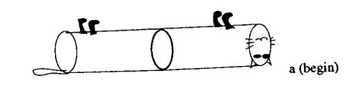
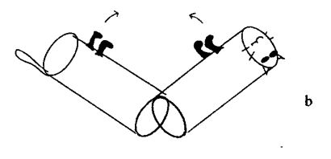
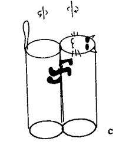
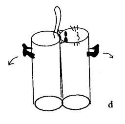
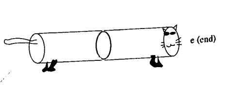
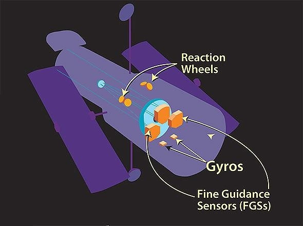

## မိတ်ဆက်

ကြောင်တစ်ကောင်ကို အမြင့်တစ်နေရာက ပတ်လက်လှန်ပြီး လွှတ်ချလိုက်ရင် အောက်ရောက်တဲ့အခါ ခြေထောက်နဲ့ပဲကျတာကို သိကြမှာပါ။ ဒါဆို လွှတ်ချတဲ့အချိန်နဲ့ မြေပေါ်ရောက်တဲ့အချိန်ကြားမှာ ကိုယ်ကို တစ်ပတ်လှည့်လိုက်တာ သေချာပါတယ်။ ဘယ်လိုလှည့်တာလဲဆိုတာကို ၁၉ ရာစုကတည်းက သိပ္ပံပညာရှင်တွေက လေ့လာခဲ့ကြပါတယ်။ ပထမထင်တာက ကြောင်က လွှတ်ချလိုက်တဲ့သူရဲ့ လက်ကို ကန်ပြီးလှည့်တယ်လို့ ယူဆခဲ့ကြပါတယ်။ ဒါပေမယ့် ဗွီဒီယိုကင်မရာနဲ့ အနှေးပြကွက်တွေ ပြန်ကြည့်တဲ့အခါ လေထဲကျမှ လှည့်တာကို တွေ့ခဲ့ကြပါတယ်။

By Étienne-Jules Marey - http://twicsy.com/, Public Domain, https://commons.wikimedia.org/w/index.php?curid=31154812

ဒါဆိုရင် သိပ္ပံရှုထောင့်ကနေပြီး ယေဘူယျပြောမယ်ဆိုရင် အရာဝတ္ထုတစ်ခုက ပြင်ပအားသက်ရောက်မှုမရှိပဲ၊ နောက်ပြီး ပြင်ပအရာတစ်ခုခုကိုလည်း အားမပြုပဲ ဟင်းလင်းပြင်ထဲမှာ လှည့်နိုင်သလားဆိုတာ မေးခွန်းထုတ်စရာဖြစ်ပါတယ်။ ဘာလို့လဲဆိုတော့ နယူတန်တတိယနိယာမနဲ့ မျည်းဖြောင့်အဟုန်တည်မြဲခြင်းနိယာမတို့က အရာဝတ္ထုတစ်ခုသည် ပြင်ပအားသက်ရောက်မှုမရှိပဲ မရွေ့လျားနိုင်ဘူးလို့ ဆိုပါတယ်။ ဥပမာ ဒုံးပျံတွေ လေဟာနယ်ထဲမှာ ရွေ့ဖို့ဆိုရင် သူ့အထဲက လောင်စာတွေကို အပြင်ဘက်တွန်းထုတ်ပြီးမှ သွားနိုင်ပါတယ်။ ဒီသဘောတရားအရရယ်၊ ထောင့်ပြောင်းအဟုန်တည်မြဲခြင်းနိယာမကလည်း မှန်တယ်ဆိုရင် ဝတ္ထုတစ်ခုက သူ့ချည်းသက်သက် လေဟာနယ်ထဲမှာ လည့်နိုင်ပါ့မလား။

##   လေဟာနယ်ထဲတွင်လှည့်ခြင်း

၁၈၉၄ ခုနှစ်မှာ ပြင်သစ် ရူပဗေဒပညာရှင် Léon Lecornu က စုစုပေါင်းထောင့်ပြောင်းအဟုန် သုညဖြစ်ရင်တောင်မှ လှည့်လို့ရနိုင်တယ်ဆိုတာ အဆိုပြုခဲ့ပါတယ်။ ၂၀ ရာစုနှစ်အတွင်းမှာ ကြောင်ပြုတ်ကျတဲ့ဖြစ်ရပ်ကို အသေးစိပ်လေ့လာတဲ့ သုတေသနစာတမ်းတွေ ပေါ်ထွက်လာခဲ့ပါတယ်။ ရှင်းလင်းချက်အကြမ်းဖျင်းကတော့ ကြောင်က ပြုတ်ကျတဲ့အချိန်မှာ ကိုယ်ကိုကွေးချလိုက်ပြီး ဝင်ရိုးနှစ်ခုပေါ်မှာလှည့်တဲ့အတွက် တစ်ကိုယ်လုံးလည်တာကြောင့်ဖြစ်တဲ့ ထောင့်ပြောင်းအဟုန်ကို ကြေပျက်စေတာဖြစ်ပါတယ်။ ဒီလိုလှည့်တာကို ပိုပြီးရှင်းရှင်းလင်းလင်း သိနိုင်ဖို့ ကြောင်နေရာမှာ ပိုပြီးရိုးရှင်းတဲ့ ပုံစံတစ်ခုနဲ့ အစားထိုးကြည့်ပါမယ်။ အောက်ကပုံနဲ့ ရှင်းလင်းချက်ကတော့ 1993 မှာ publish လုပ်ခဲ့တဲ့ Richard Montgomery ရဲ့ စာတမ်းကနေ ကောက်နှုတ်ထားတာဖြစ်ပါတယ်။

ဒီပုံစံက ကြောင်နေရာမှာ ဆလင်ဒါနှစ်ခု ဆက်ထားတဲ့ ပုံစံဖြစ်ပါတယ်။ အစမှာ ဇောက်ထိုးဖြစ်နေပါတယ်။

အောက်ကျတဲ့အချိန်မှာ ခါးလည်ကနေ ကွေးလိုက်ပါတယ်။ အခြမ်းနှစ်ခုက ဆန့်ကျင်ဘက်လည်တဲ့အတွက် စုစုပေါင်းထောင့်ပြောင်းအဟုန် သုညဖြစ်ပါတယ်။

အခြမ်းနှစ်ခု ကပ်သွားတဲ့အချိန်ကျရင် အပေါ်မှာ မြှားပြထားတဲ့အတိုင်း ဆန့်ကျင်ဘက် ၁၈၀˚စီ လှည့်လိုက်ပါမယ်။ ဒီတစ်ခါလည်း ဆန့်ကျင်ဘက်လည်တာဖြစ်တဲ့အတွက် ထောင့်ပြောင်းအဟုန်ပြောင်းလဲမှုမရှိပါဘူး။

လှည့်ပြီးသွားရင် အခြမ်းနှစ်ခုကို ပြန်ဆန့်ထုတ်လိုက်ပါမယ်။ အလားတူပဲ စုစုပေါင်းထောင့်ပြောင်းအဟုန်သုညဖြစ်ပါတယ်။ ဒါဆိုရင် အောက်ကပုံအတိုင်း ကြောင်ကအတည့်ဖြစ်သွားတာကို တွေ့ရပါမယ်။

ဒီဖြစ်စဉ်မှာ ဆလင်ဒါနှစ်ခုအတွက် စုစုပေါင်းထောင့်ပြောင်းအဟုန်က အမြဲတမ်းသုညဖြစ်နေပါတယ်။ ဒါကြောင့် ထောင့်ပြောင်းအဟုန်ပြောင်းလဲမှုမရှိပဲ မျက်နှာမူရာ (attitude/orientation) ကို ဟင်းလင်းပြင်ထဲမှာ ပြောင်းလဲလို့ရနိုင်ပါတယ်။ တကယ့်ကြောင်ရဲ့ လှုပ်ရှားမှုပုံစံကတော့ အပေါ်ကပုံစံထက် ပိုပြီးရှုပ်ထွေးပါတယ်။ ကြောင်က ပုံထဲကလို နှစ်ခြမ်းခွဲပြီး မလှည့်နိုင်ပါဘူး။ ကျောရိုးကို ကွေးလိုက်ပြီး ရှေ့ခြမ်းနဲ့နောက်ခြမ်းကို လှည့်တာတော့ မှန်ပါတယ်။ သို့ပေမယ့် ကြောင်က နောက်ထပ်သဘောတရားတစ်ခုကို အသုံးပြုပါသေးတယ်။ ဒါကတော့ moment of inertia ဖြစ်ပါတယ်။

စပြုတ်ကျတဲ့အခါ ကြောင်က ကျောရိုးကိုကွေးလိုက်ပြီး နောက်ခြေကို ဆန့်ထုတ်ကာ ရှေ့ခြေကိုရုတ်လိုက်ပါတယ်။ ဒီလိုလုပ်လိုက်တာက နောက်ခြမ်းမှာရှိတဲ့ moment of inertia ကို တိုးသွားစေပါတယ်။ ဒါကြောင့် လှည့်လိုက်တဲ့အခါ နောက်ခြမ်းက ရှေ့ခြမ်းလောက် မလည်သွားပါဘူး။ တစ်ဝက်လောက်လှည့်ပြီးတော့ နောက်ခြေကိုရုတ်ပြီး ရှေ့ခြေကို ဆန့်ထုတ်လိုက်ပါတယ်။ ဒီအခါ ရှေ့ပိုင်းက နှေးသွားပြီး နောက်ပိုင်းက လည်သွားပါတယ်။ ဒီအဆင့်တွေကိုပေါင်းစပ်ပြီး ထောင့်ပြောင်းအဟုန်ပြောင်းလဲမှုမရှိစေပဲ ကိုယ်ကိုတစ်ပတ်လည်စေတာ ဖြစ်ပါတယ်။ အောက်က videoမှာ ရှင်းပြထားတာလည်း တွေ့နိုင်ပါတယ်။

`youtube:https://www.youtube.com/watch?v=RtWbpyjJqrU&w=560&h=315`

## Hubble Space Telescope

ထောင့်ပြောင်းအဟုန်တည်မြဲခြင်းနိယာမကို အာကာသတယ်လီစကုတ်တွေမှာလည်း အသုံးပြုပါတယ်။ ဒီတယ်လီစကုတ်တွေကိုလှည့်ဖို့ ဓာတ်ငွေ့သုံးတွန်းအားစနစ်တွေကိုသုံးရင် ဓာတ်ငွေ့တွေက တယ်လီစကုတ်ရဲ့ မှန်တွေမှာ လာကပ်နိုင်တာကြောင့် အသုံးမပြုပါဘူး။ သူတို့အတွက် reaction wheel/control movement gyro လို့ခေါ်တဲ့ ဘီးတွေကို အသုံးပြုပါတယ်။ ဒီဘီးတွေက မော်တာနဲ့မောင်းနှင်တဲ့ အလေးတုန်းတွေပဲဖြစ်ပါတယ်။

_Source: Robert Forst, Quora_

Space telescope မှာ ဒီလိုဘီးမျိုး အနည်းဆုံး ၃ ခုပါဝင်ပြီး သူတို့ရဲ့လည်နှုန်းကို ပြောင်းလဲပြီးတော့ ထောင့်ပြောင်းအဟုန်ကို တိုးစေ/လျော့စေပါတယ်။ ထောင့်ပြောင်းအဟုန်တည်မြဲခြင်းနိယာမအရ reaction wheel တွေရဲ့ ထောင့်ပြောင်းအဟုန်ပြောင်းလဲမှုကြောင့် telescope ကို လည်သွားစေပါတယ်။ ဒီစနစ်ကို telescope ကို ချိန်ဖို့အတွက်သာမက မြေဆွဲအာ:၊ လေထုပွတ်တိုက်မှုနဲ့ အခြားအကြောင်းတွေကြောင့် တိမ်းစောင်းမှုကို တန်ပြန်ချိန်ညှိဖို့အတွက်လည်း အသုံးပြုပါတယ်။ Telescope ပေါ်မှာ သက်ရောက်နေတဲ့ လိမ်အား (torque) တွေက တစ်ခုထက်ပိုလာရင်တော့ လည်ခြင်းစနစ်တွေရဲ့ နောက်ထပ်နက်နဲမှုတစ်ခုကြောင့် ဒီတန်ပြန်ထိန်းကွပ်မှုစနစ်က သိပ်မရိုးရှင်းတော့ပါဘူး။ ဒီအကြောင်းကို နောက်အပိုင်းမှာ ဆက်ဆွေးနွေးသွားပါမယ်။

References:

- [http://qr.ae/TbcEIj](http://qr.ae/TbcEIj)
- [http://www.zzwave.com/zzw/upload/up/2/54ba35b.pdf](http://www.zzwave.com/zzw/upload/up/2/54ba35b.pdf)
- [http://qr.ae/TbcEId](http://qr.ae/TbcEId)
