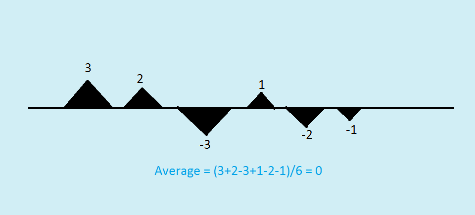

ပျမ်းမျှ၏ ပြဿနာများ ပျမ်းမျှခြင်း (Average) ရဲ့သဘောတရားကိုတော့ စာဖတ်သူသိရှိပြီးဖြစ်မှာပါ။ စာရင်းတစ်ခုရဲ့ ပျမ်းမျှခြင်းကို ရှာချင်ရင် ကိန်းတွေအားလုံးပေါင်းပြီး ကိန်းဂဏန်းအရေအတွက်နဲ့ စားရပါတယ်။ ပျမ်းမျှတန်ဖိုးက စာရင်းတစ်ခုလုံးကို ခြုံထားတဲ့ (summarization) အချက်အလက်တစ်ခုဖြစ်ပါတယ်။ ဒါပေမယ့် ပျမ်းမျှခြင်းက နေရာတိုင်းမှာသုံးလို့မရသလို သူ့ချည်းပဲလည်း မပြည့်စုံတဲ့ အခြေအနေတွေရှိပါတယ်။ ပျမ်းမျှခြင်းရဲ့ အဓိက ပြဿနာက စာရင်းထဲမှာပါတဲ့ ကိန်းတွေရဲ့ ဖြန့်ကျက်မှု (distribution) ကို ဖော်ပြခြင်းမရှိတာပါပဲ။

Bus ကားတစ်စီးပေါ်မှာ လူ ၄၉ ယောက်ရှိတယ်ဆိုပါစို့။ သူတို့ရဲ့ ပိုင်ဆိုင်မှုကို စာရင်းကောက်လိုက်တဲ့အခါ ပျမ်းမျှတစ်ယောက်ကို ဒေါ်လာ ငါးသောင်းစီ ချမ်းသာတယ်ဆိုပါစို့။ ပြီးတော့ ကားပေါ်ကို Bill Gates တက်လာတယ်ဆိုပါတော့။ သူတက်လာပြီး စာရင်းပြန်တွက်လိုက်တဲ့အခါ လူတစ်ယောက်ကို ပျမ်းမျှ ဒေါ်လာ တစ်သန်း ပိုင်သွားပါတယ်။ သာမန်လူ ၄၉ ယောက်နဲ့ Bill Gates တစ်ယောက်ရဲ့ ပိုင်ဆိုင်မှုကို ပျမ်းမျှတန်ဖိုးတစ်ခုနဲ့ ဖော်ပြလို့မပြည့်စုံပါဘူး။ ပျမ်းမျှပိုင်ဆိုင်မှုက လူဘယ်နှစ်ယောက်က ဘယ်လောက်ကို ပိုင်ဆိုင်ထားလဲဆိုတဲ့ အချက်အလက်ကို မပေးနိုင်ပါဘူး။ Bill Gates ရဲ့ပိုင်ဆိုင်မှုက သာမန်မဟုတ်တဲ့ အစွန်းရောက်တန်ဖိုးတစ်ခု (extreme, outlier) ဖြစ်နေလို့ ဖြစ်ပါတယ်။

တစ်နေ့ကို ဝိုင်တစ်ခွက်သောက်ခြင်းဟာ ကျန်းမာရေးနဲ့ ညီညွတ်ပါတယ်။ ဒါပေမယ့် တစ်နှစ်လုံးမသောက်ပဲ ဒီဇင်ဘာ ၃၁ ရက်နေ့ကျမှ ဝိုင် ၃၆၅ ခွက်သောက်မယ်ဆိုရင်တော့ အခြေအနေမကောင်းပါဘူး။ ပျမ်းမျှသောက်တဲ့နှုန်းကတော့ အတူတူပဲဖြစ်ပါတယ်။ မြစ်တစ်မြစ်ရဲ့ ပျမ်းမျှအနက်က ၄ ပေရှိတယ်ဆိုရင် အဲ့ဒီ့မြစ်ကို ဖြတ်မလား၊ မဖြတ်ဘူးလား။ မြစ်က တစ်လျှောက်လုံး တစ်ပေလောက်ပဲ နက်ပြီး တစ်နေရာကျမှ ဆယ်ပေနက်နေတာလည်း ဖြစ်နိုင်ပါတယ်။ ပျမ်းမျှခြင်းရဲ့ နောက်ပြဿနာတစ်ခုက ကိန်းတွေရဲ့ အပေါင်းအနှုတ် (လက္ခဏာ) ကို ထည့်တွက်တာပါပဲ။ လမ်းတစ်လမ်းရဲ့ ချောမွေ့မှုကို အဖုတွေ အချိုင့်တွေ အမြင့်ရဲ့ ပျမ်းမျှနဲ့ ပြမယ်ဆိုပါတော့။ လမ်းရဲ့ ရေပြင်ညီမျည်းကို အသေယူပြီ: အဖုရဲ့ အမြင့်ကို အပေါင်းကိန်း၊ အချိုင့်ကို အနှုတ်ကိန်းနဲ့ ပြမယ်။ ပျမ်းမျှရှာလိုက်ရင် အပေါင်းနဲ့ အနှုတ်က ကျေသွားတဲ့အတွက် သုညနီးပါးထွက်နေနိုင်ပါတယ်။ ဒီလိုနည်းနဲ့ရှာရင် လမ်းက ဘာအချိုင့်အခွက်မှ မရှိတာလား၊ အဖုနဲ့ အချိုင့်နဲ့ ကျေသွားတာလားဆိုတာမသိနိုင်ပါဘူး။ တောင်တွေကို ပင်လယ်ထဲထည့်ပြီး ကမ္ဘာကို ပြောင်ချောကြီးလို့ သတ်မှတ်ရမလို ဖြစ်နေပါတယ်။

ကိန်းအစီအစဥ်တစ်ခုရဲ့ အချက်အလက်ကို ပျမ်းမျှတန်ဖိုးနဲ့ ဖော်ပြလို့ မလုံလောက်ရင် ဖြန့်ကျက်မှု (distribution) ကိုပါဖော်ပြရပါတယ်။ Distribution ကို statistical နည်းအမျိုးမျိုးနဲ့ ဖော်ပြလို့ရပါတယ်။ အပေါင်းအနှုတ်ပြဿနာအတွက်ကတော့ Root means square ဆိုတဲ့ တန်ဖိုးတစ်ခုကိုသုံးပါတယ်။ စာရင်းတစ်ခုရဲ့ root-means-square (RMS လို့ အတိုကောက်ခေါ်ပါတယ်) ကိုရှာချင်ရင် ကိန်းတွေကို နှစ်ထပ်တင်ပြီးပေါင်း၊ ကိန်းအရေအတွက်နဲ့စားပြီး square root ယူရပါတယ်။ ကိန်းတွေကို နှစ်ထပ်တင်လိုက်တဲ့အတွက် အနှုတ်ကိန်းတွေပျောက်သွားပါတယ်။

$$
\text{RMS}=\sqrt{\frac{(3^2+ 2^2+(-3)^2+1^2+(-2)^2+(-1)^2)}{6}}=4.33
$$

ဒါကြောင့် experiment တွေနဲ့ engineering data တွေမှာ RMS value ကိုဖော်ပြကြပါတယ်။
