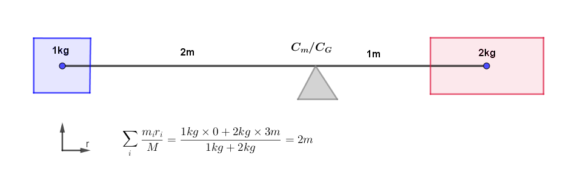
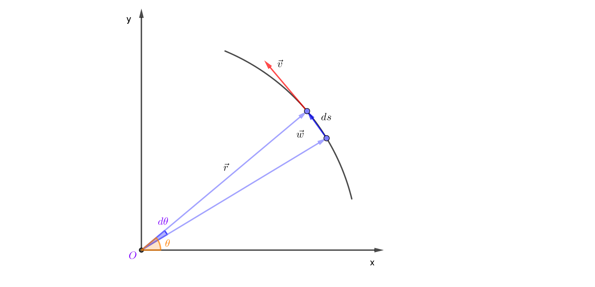

အရှေ့ပိုင်းမှာ တည့်တည့်သွားတဲ့ အရွေ့တွေအကြောင်း ပြောပြီးပြီဆိုတော့ အခု ဝင်ရိုးတစ်ခုကို ပတ်လည်တဲ့စနစ်တွေအကြောင်း ပြောရအောင်။ လည်ပတ်တာတွေကို လေ့လာရာမှာလည်း နယူတန်နိယာမတွေကိုပဲ အသုံးချရပါတယ်။ ဒါပေမယ့် နယူတန်နိယာမတွေက အတည့်သွားတဲ့အရွေ့ကိုပဲ ပြောတာဖြစ်တဲ့အတွက် လည်ပတ်တဲ့အရာတွေအတွက် အသင့်သုံးလို့တော့မရပါဘူး။

## Rigid body and center of mass

အရှေ့ကရွေ့လျားမှုတွေကို လေ့လာခဲ့တဲ့ အရာတွေက rigid body လို့ခေါ်တဲ့ ရွေ့လျားမှုကြောင့် ပုံသဏ္ဍာန်ပျက်မသွားတဲ့ အရာတွေဖြစ်ပါတယ်။ တကယ်တော့ ပကတိသုညမဟုတ်တဲ့ အပူချိန်မှာ အက်တမ်တွေအကုန်လုံးက တုန်ခါနေကြပါတယ်။ ဒါကြောင့် အရာဝတ္ထုတစ်ခုကို အလွန်အားကောင်းတဲ့ မိုက်ခရိုစကုပ်နဲ့ကြည့်လိုက်မယ်ဆိုရင် အက်တမ်အဆင့်မှာ တည်ငြိမ်နေတာမဟုတ်ပဲ အမြဲမပြတ်တုန်ခါလှုပ်ရှားနေတာကို တွေ့ရမှာပါ။ ဒါပေမယ့် ပြင်ပအားသက်ရောက်မှုမရှိရင်တော့ အဟုန်တည်မြဲမှုနိယာမအရ ဝတ္ထုတစ်ခုလုံးရဲ့ ပျမ်းမျှအလျင်ကတော့ သုညဖြစ်နေမှာပါ။ နယူတန်နိယာမတွေကိုသုံးပြီး အက်တမ်တစ်လုံးချင်းစီကို သက်ရောက်တဲ့အားတွေ၊ အရွေ့တွေကို တွက်ထုတ်ပြီး ဝတ္ထုတစ်ခုလုံးရဲ့ အရွေ့ကိုတွက်လို့ရပါတယ်။ ဒါပေမယ့် အလွန်တရာများပြားလှတဲ့ အက်တမ်အရေအတွက်ကြောင့် ဒီနည်းစနစ်က အသုံးမဝင်တာများပါတယ်။ ဒါကြောင့် classical မက်ကင်းနစ်မှာ အက်တမ်တွေက လှုပ်ရှားနေသော်ငြား ဝတ္ထုပစ္စည်းကြီးက ပျမ်းမျှအားဖြင့် ပုံသဏ္ဍာန်မပျက်ရှိနေတယ်လို့ ယူဆပါတယ်။ ဒါဆိုရင် ပစ္စည်းတစ်ခုကို projectile motion (မျည်းကွေးလမ်းကြောင်း) အတိုင်း ပစ်လွှတ်လိုက်တယ် ဆိုပါတော့။ အဲ့ဒီ့ပစ္စည်းသွားတဲ့ လမ်းကြောင်းကို မက်ကင်းနစ်နဲ့ တွက်ထုတ်လို့ရပါတယ်။ ဒါပေမယ့် တွက်လို့ရတဲ့လမ်းကြောင်းပေါ်မှာ ဘယ်အရာကသွားတာလဲ။ တစ်နည်းပြောရရင် အား၊ အလျင်၊ အရှိန်တွေက ဘယ်အမှတ်အတွက် တွက်ထားတာလဲ။ ပစ္စည်းထဲမှာရှိတဲ့ အက်တမ်တွေက ပရမ်းပတာတုန်ခါနေတဲ့အတွက် လမ်းကြောင်းပေါ်မှာ ပုံမှန်မသွားနိုင်ပါဘူး။ ရိုးရိုးရှင်းရှင်းပဲ စဉ်းစားကြည့်ရင်တော့ ပစ္စည်းရဲ့ ဗဟိုချက်က လမ်းကြောင်းပေါ်မှာသွားတယ်လို့ ခန့်မှန်းကြည့်လို့ရပါတယ်။ ဒါဆိုအဲ့ဒီ့ ဗဟိုချက်ကို ဘယ်လိုရှာရမလဲ။

## ဒြပ်ထုဗဟိုချက်

အရာဝတ္ထုတစ်ခုကို အက်တမ်လိုမျိုး အပိုင်းသေးသေးလေးတွေနဲ့ ဖွဲ့စည်းထားတယ်ဆိုပါတော့။ တစ်ပိုင်းချင်းစီကို subscript $ i $ နဲ့ သတ်မှတ်ပါမယ်။ နောက်ပြီး ဝတ္ထုကို ဝင်ရိုးတစ်ခုကနေ တိုင်းတဲ့အကွာအဝေးကို $ \vec{r} $ နဲ့သတ်မှတ်တဲ့အတွက် အပိုင်းလေးတစ်ပိုင်းစီမှာ ဒြပ်ထု $ m_i $ နဲ့ တည်နေရာ $ \vec{r_i} $ တို့ရှိပါမယ်။ နယူတန်ဒုတိယနိယာမအရ−

$$
\vec{F_i}=m_i\frac{d_2\vec{r_i}}{dt^2}
$$

ဝတ္ထုတစ်ခုလုံးအတွက်−

$$
\vec{F}=M\frac{d_2\vec{r}}{dt^2}
$$

အပိုင်းလေးတွေရဲ့ Force တွေအားလုံးပေါင်းရင် ဝတ္ထုအတွက် စုစုပေါင်း Force ရပါမယ်။ ဒီတော့−

$$
\vec{F}=\sum_{i}\vec{F}_i=\sum_{i}m_i\frac{d_2\vec{r}_i}{dt^2}=\frac{d_2\sum_{i}m_i\vec{r}_i}{dt^2}
$$

အပေါ်က ညီမျှခြင်းမှာ နောက်ဆုံး term ကို ကြည့်ကြည့်ပါ။ $ \frac{d_2(...)}{dt^2} $ ပုံစံဖြစ်တဲ့အတွက် ဝတ္ထုရဲ့ စုစုပေါင်း ဒြပ်ထုကို M လို့ထားပြီး $ \vec{F} $ ကို  $ M\frac{d_2(...)}{dt^2} $ ပုံစံနဲ့ ရေးလို့ရအောင် လုပ်ကြည့်ပါမယ်။

$$
\vec{F}=M \frac{\frac{d_2 \sum_{i} m_i \vec{r}_i}{dt^2}}{M}
$$

M က ကိန်းသေဖြစ်တဲ့အတွက်−

$$
\vec{F}=M \frac{d_2\left[\frac{\sum_{i} m_i \vec{r}_i}{M}\right]}{dt^2} 
$$

အပေါ်က ညီမျှခြင်းပုံစံက $ \vec{F}=M \frac{d*2\vec{R}}{dt^2} $ ပုံစံဖြစ်တဲ့အတွက်ကြောင့် ဝတ္ထုရဲ့ ဒြပ်ထုက M ဖြစ်တယ်ဆိုရင် $ \frac{\sum*{i} m_i \vec{r}\_i}{M} $ က ဝတ္ထုတစ်ခုလုံးအတွက် $ \vec{R} $ ဖြစ်ပါတယ်။ တနည်းအားဖြင့် အဲ့ဒီ့ကိန်းက ဝတ္ထုရဲ့ ဒြပ်ထုဆုံချက်ဖြစ်ပါတယ်။ ဒီတည်နေရာအမှတ်မှာ ဝတ္ထုတစ်ခုလုံးရဲ့ ဒြပ်ထုတွေစုနေတယ်လို့ ယူဆပြီးတွက်လို့ရပါတယ်။ ဒီကိန်းက ဝတ္ထုကိုဖွဲ့စည်းထားတဲ့ အပိုင်းသေးသေးလေးတွေရဲ့ ဒြပ်ထုနဲ့ သူတို့ရဲ့တည်နေရာကိုမြှောက်၊ အားလုံးပေါင်းပြီး စုစုပေါင်းဒြပ်ထုနဲ့ စားတာဖြစ်ပါတယ်။ ဒီလိုတွက်ချက်မှုကို သခင်္ျာမှာ weighed average ရှာတယ်လို့လည်း ခေါ်ပါတယ်။

ဒြပ်ထုဗဟိုချက်အမှတ် (center of mass) ကို မြေဆွဲအားဗဟိုချက်အမှတ် (center of gravity) လို့လည်းခေါ်ကြပါတယ်။ မြေဆွဲအားက ဝတ္ထုပေါ်ကို တစ်ပြေးညီသက်ရောက်တယ်ဆိုရင် နေရာတိုင်းမှာ မြေဆွဲအားအလျင် (g) က ကိန်းသေဖြစ်တဲ့အတွက် $ C_m $ နဲ့ $ C_G $ က အတူတူပါပဲ။ မြေဆွဲအားဗဟိုချက်ကို lever သဘောတရားနဲ့ ယှဉ်ကြည့်နိုင်ပါတယ်။

ဒြပ်ထုဗဟိုချက်က ဝတ္ထုအတွင်းပိုင်းမှာ ရှိချင်မှရှိပါမယ်။ လခြမ်းကွေးလိုအရာဆိုရင် ဒြပ်ထုဗဟိုချက်က အကွေးထဲက နေရာလွတ်ထဲမှာ ရှိမှာပါ။ ရှုပ်ထွေးတဲ့ပုံသဏ္ဍာန်ရှိတဲ့အရာတွေဆို ဒြပ်ထုဗဟိုချက်ရှာရတာ ပိုခက်ပေမယ့် သဘောတရားကတော့ အတူတူပါပဲ။

## ထောင့်ပြောင်းအလျင် (Angular velocity)

ဝတ္ထုတစ်ခုက ဝင်ရိုးတစ်ခုကို ပတ်ပြီးလည်နေတယ်ဆိုရင် သူ့ရဲ့ လည်ပတ်နှုန်းကို ကိန်းအမျိုးမျိုးနဲ့ ပြနိုင်ပါတယ်။ တစ်မိနစ်အတွင်းမှာ ဘယ်နှစ်ပတ်လည်သွားလဲ (revolution per minute – rpm) ဆိုတာနဲ့ပြလို့ရသလို တစ်စက္ကန့်အတွင်းမှာ ပြောင်းသွားတဲ့ထောင့် (radian per second) အနေနဲ့လဲ ဖော်ပြလို့ရပါတယ်။ radian က degree ထက်စာရင် စက်ဝန်းပိုင်းအလျား (arc length) နဲ့ ပိုပြီးနီးကပ်စွာ ဆက်နွယ်နေတဲ့အတွက်ကြောင့် သိပ္ပံတွက်ချက်မှုတွေမှာ radian ကိုပဲ အသုံးများပါတယ်။ $ 2\pi $ radian မှာ 360 degree ရှိတဲ့အတွက် 1 radian မှာ $ \frac{360}{2\pi}\approx 57.3 degree $ ရှိပါတယ်။

ဒီတော့ ထောင့်ပြောင်းအလျင်နဲ့ မျည်းဖြောင့်အတိုင်းရွေ့တဲ့အလျင် ဆက်နွယ်ချက်ကို ရှာကြည့်ရအောင်။ အောက်ကပုံမှာ ပြထားတဲ့အတိုင်း ဝတ္ထု m က အမှတ် O ကို ဗဟိုပြုပြီး ထောင့်ပြောင်းအလျင် $ \theta rad/s $ နဲ့ ပတ်နေတယ်ဆိုပါတော့။ အချိန်ပိုင်း dt မှာ ဝတ္ထုရွေ့သွားတဲ့အကွာအဝေးကို ds လို့ထားရင် ဝတ္ထုရဲ့ အလျင်က-

$\vec{v}=\frac{ds}{dt} $ ဒီအလျင်က အချိန်ပိုင်းသေးသေးလေးမှာ မျည်းကွေးကို tangent ကျတဲ့ အလျင်ဖြစ်တဲ့အတွက် tangential velocity လို့လည်းခေါ်ပါတယ်။ ဒီအချိန်ပိုင်းမှာ ဝတ္ထုက ထောင့် $ d\theta $ ရွေ့သွားပါပြီ။

$ ds $ နဲ့ $ d\theta $ နဲ့ဆက်သွယ်ချက်က−

$$
ds=r\space d\theta \\
\frac{ds}{dt}=r\space \frac{d\theta }{dt} \\
v=r \omega 
$$

$ \omega $ က ထောင့်ပြောင်းအလျင် (angular velocity) ဖြစ်ပြီး rad/s နဲ့ ဖော်ပြပါတယ်။

