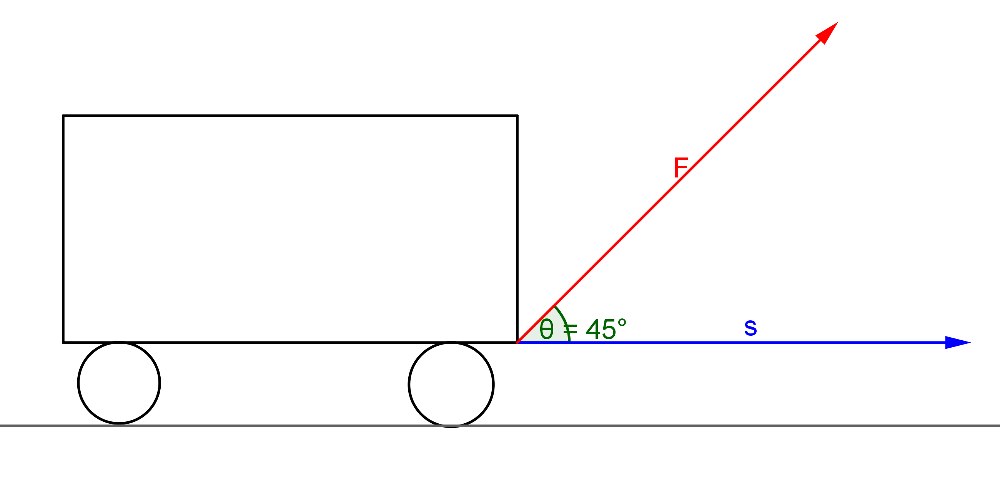

## Vector တစ်ခု၏ အစိတ်အပိုင်း (component) များ

Vector တစ်ခု၊ $A$ ဆိုပါတော့။ အဲ့ဒီ့ vector $A$ ဟာ ဟင်းလင်းပြင်ထဲမှာရှိတဲ့အတွက် ပုံမှန်အားဖြင့် သူ့မှာ အစိတ်အပိုင်း သုံးခုရှိမယ်၊ $A_x$ ရယ်၊ $A_y$ ရယ်၊ $A_z$ ရယ်။ အဲ့တော့ vector $A$ ကို မြင်တာနဲ့ သူ့ထဲမှာ အပိုင်းသုံးခုရှိတယ်ဆိုတာ သိရမယ်။

## Vector operations (Dot Product)

ကဲ နောက် vector တစ်ခု $B$ ဆိုရင် သူ့မှာလည်း $B_x, B_y, B_z$ ရှိမယ်။ $A$ နဲ့ $B$ ရဲ့dot product ကို ရှာမယ်ဆိုလို့ရှိရင် $A \cdot B$ လို့ ရေးပြီး မြှောက်တဲ့အခါ x component အချင်းချင်း၊ y, z component အချင်းချင်း မြှောက်ပြီး အကုန်ပေါင်းရတယ်။

$$
\mathbf{A} \cdot \mathbf{B}=A_xB_x+A_yB_y+A_zB_z 
$$

Vector နှစ်ခု dot product လုပ်လို့ ရလာတဲ့ အဖြေက scalar တစ်ခု ဖြစ်တယ်။

Dot product ရဲ့ အဓိက အဓိပ္ပာယ်ကတော့ vector တစ်ခုပေါ်ကို နောက်တစ်ခုက projection ချပြီး မြှောက်တာကို ဆိုလိုတာပါ။ Projection ချတယ်ဆိုတာ vector တစ်ခုရဲ့ လားရာဘက်အတိုင်း ကျန်တဲ့ vector ရဲ့ အစိတ်အပိုင်းကို ယူတာဖြစ်ပါတယ်။ ဥပမာတစ်ခုအနေနဲ့ အလုပ် ညီမျှခြင်းကို ကြည့်ပါ။ အလုပ်ကို ရှာချင်တဲ့အခါ ရွေ့လျားမှုနဲ့ ရွေ့လျားမှု လမ်းကြောင်းအတိုင်းရှိတဲ့ အား (သို့မဟုတ်) အားနဲ့ အားလမ်းကြောင်းအတိုင်း ရှိတဲ့ ရွေ့လျားမှု မြှောက်လဒ်ကို ရှာရပါတယ်။ ပုံကို ကြည့်ပါ။

ပုံအရဆိုရင် F က အရွေ့ s ကို ၄၅˚ ချိုးပြီး သက်ရောက်နေတဲ့အတွက် w ကို တွက်ရင် $F \cos(45) \times s$ နဲ့ တွက်ရမယ်။

$$
w=F\cos(45).s
$$

ဒီညီမျှခြင်းက 3-dimension မှာဆို component တွေနဲ့ ရှုပ်လာစရာရှိပါတယ်။

ဒီညီမျှခြင်းကို vector notation နဲ့ရေးမယ်ဆိုရင် $ w=\mathbf{F} \cdot \mathbf{s} $

Component ပုံစံနဲ့ ပြန်ရေးမယ်ဆိုရင် $ w=F_xs_x+F_ys_y+F_zs_z $

$F_x=Fcos\theta $ ဆိုတော့ $ w=Fcos\theta.s_x $ ပဲ ပြန်ရပါတယ်။ ဒါပေမယ့် $ w=\mathbf{F.s} $ လို့ရေးလိုက်တာနဲ့ F ကို s ပေါ်မှာ projection ချတယ်ဆိုတာ အဓိပ္ပါယ်သက်ရောက်ပြီးသားဖြစ်ပါတယ်။

နောက်ဥပမာတစ်ခုအနေနဲ့ နယူတန်ဒုတိယနိယာမ ညီမျှခြင်း $ \mathbf{F}=m\cdot a $ ကို ကြည့်ရအောင်။ ဒီမှာ dot product က scalar နဲ့ vector နဲ့ကို မြှောက်ထားတာြဖစ်နေတယ်။ Scalar နဲ့ vector ကို dot product လုပ်ရင် result က vector ရပါတယ်။ ဒီမှာတော့ Force vector အဖြစ် ရပါတယ်။ ဒီ vector ညီမျှခြင်းကို scalar component တွေ အဖြစ် ပြန်ခွဲထုတ်ရင်−

$$
F_x=ma_x
$$

$$
F_y=ma_y
$$

$$
F_z=ma_z
$$

သုံးကြောင်း ရပါတယ်။ ဒီမှာ ပါတဲ့ $x, y, z$ တွေက ကိုယ်ယူထားတဲ့ coordinate စနစ်အပေါ်မှာ မူတည်ပါတယ်။ ဒီတော့ နယူတန်ဒုတိယနိယာမကို vector ပုံစံနဲ့ရေးရင် သမားရိုးကျရေးသလို ညီမျှခြင်း သုံးကြောင်းစီ လိုက်ရေးစရာမလိုတဲ့အပြင် coordinate စနစ်တစ်ခုကို မီခိုတာကနေလည်း ကင်းလွတ်စေပါတယ်။

အခု vector တစ်ခုရဲ့ ပကတိတန်ဖိုး (ပမာဏ) ကို ရှာကြည့်ရအောင်။ Vector $A$ မှာ ထုံးစံအတိုင်း component သုံးခုရှိမယ်။ အဲ့ဒီ့တော့ vector $A$ ရဲ့ အရှည်ကို လိုချင်ရင် Pythagoras theorem အရ အနား နှစ်ဖက်စီတွဲရှာလိုက်ရင်−

$$
\left | \mathbf{A} \right | =A=\sqrt{A_x^2+A_y^2+A_z^2} 
$$

$$
\begin{aligned}
A^2 &=A_x^2+A_y^2+A_z^2 
\\
A^2 &=A_xA_x+A_yA_y+A_zA_z 
\end{aligned}
$$

$A^2$ ညီမျှခြင်းက $A$ နှစ်ခု dot product လုပ်ထားတာနဲ့ တူပါတယ်။ အဲ့ဒီ့တော့ vector တစ်ခုရဲ့ ပမာဏနှစ်ထပ်ကိန်းကို လိုချင်ရင်လည်း dot product ကို သုံးပါတယ်။

$$
A^2=\mathbf{A} \cdot \mathbf{A}
$$

Vector u နဲ့ v နှစ်ခုကို dot product လုပ်တာကို အောက်က link မှာ ကိုယ်တိုင်စမ်းကြည့်နိုင်ပါတယ်။ u နဲ့ v ကို ပြောင်းလဲဖို့ အမှတ်တွေကို ဖိပြီးရွှေ့ကြည့်ပါ။ Dot product ပြောင်းလဲသွားတာကို သတိထားကြည့်ပါ။

https://ggbm.at/VuvcrCuC

Dot product က vector operation တွေထဲက တစ်ခုပဲရှိပါသေးတယ်။ တစ်ခြား အသုံးဝင်တဲ့ vector operation တွေ ရှိပါသေးတယ်။ ဥပမာ Cross product ဆိုတဲ့ဟာက လိမ်အား (torque) တွက်ချက်မှုနဲ့ ထောင့်ပြောင်းအဟုန် (angular momentum) တွက်ချက်မှုတွေမှာ သုံးပါတယ်။ သူတို့အကြောင်း အသေးစိပ်ကို လိုအပ်တဲ့ အချိန်ကျရင် ထည့်ရေးပေးပါမယ်။

