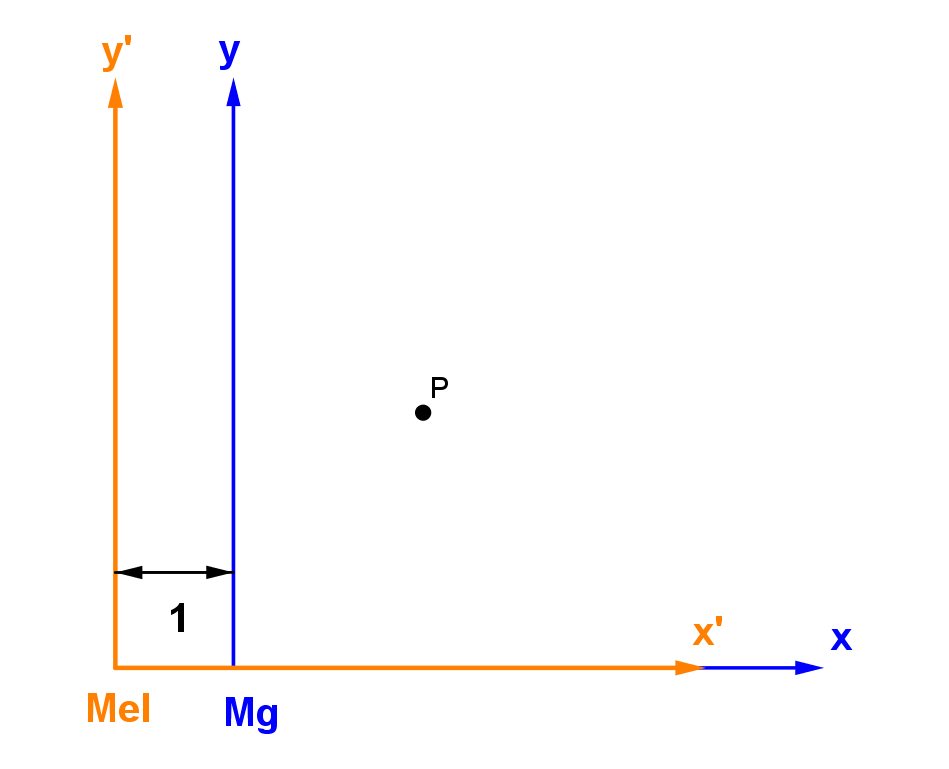
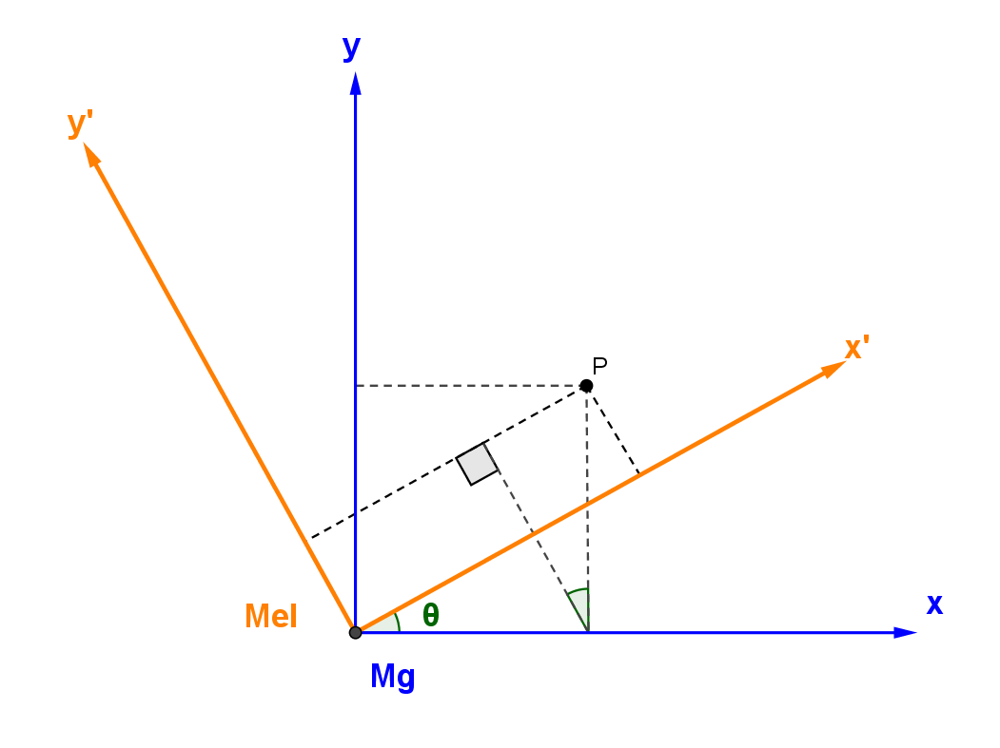
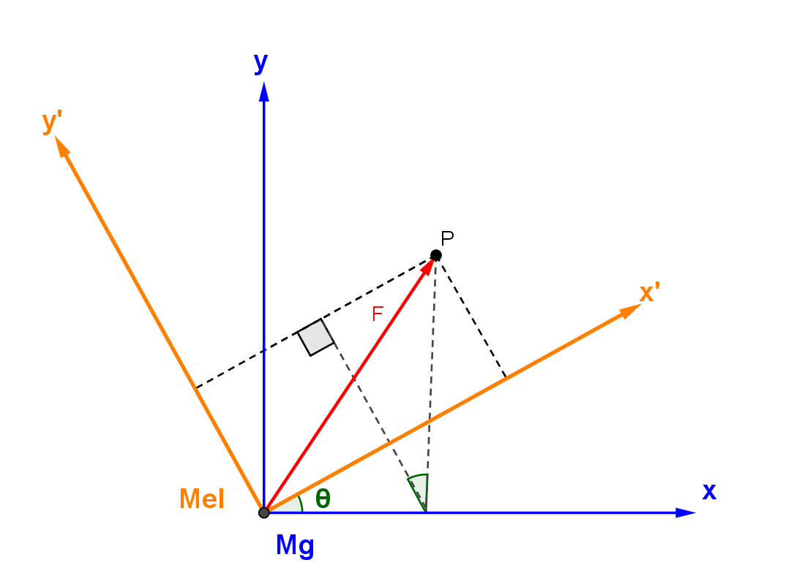

## Vector ဆိုတာ ဘာလဲ

Vector ဆိုတာ အရွယ်အစားနဲ့ ဦးတည်ချက်ရှိတဲ့အရာကို ခေါ်တာလို့ ကြားဖူးကြမှာပါ။ ဥပမာ အား၊ အလျင်၊ အရှိန်၊ အဟုန်တို့ဟာ vector တွေဖြစ်ပါတယ်။ Vector ကို ဟင်းလင်းပြင် (space) ထဲမှာ မြှားခေါင်းတပ်ထားတဲ့ အတံလေးနဲ့ ဖော်ပြပါတယ်။ သူ့မှာ အရှည်(ပမာဏ) နဲ့ လားရာရှိပါတယ်။ အရှည်က လိုချင်တဲ့ တိုင်းတာမှု (ဥပမာ အား) ကို သင့်တော်တဲ့ scale တစ်ခုချုံ့ပြီး coordinate system တစ်ခုပေါ်မှာ ဖော်ပြပါတယ်။ လားရာကတော့ တိုင်းတာမှုရဲ့ လားရာကို ကိုယ်စားပြုပါတယ်။

ဒါပေမယ့် အရွယ်အစားနဲ့ ဦးတည်ချက်ရှိတဲ့ အရာတိုင်းကို vector လို့ခေါ်လို့ ရလားဆို​တော့ မရပါဘူး။ ဘာဖြစ်လို့လဲဆိုတော့ အဓိပ္ပာယ်သတ်မှတ်ချက်က မပြည့်စုံလို့ပါ။ အရွယ်အစားနဲ့ ဦးတည်ချက်ရှိတဲ့ အရာအားလုံးကို vector လို့ မခေါ်ပါဘူး။ ဒါကြောင့် vector ကို သချင်္ာသဘောတရားအရ ပညတ်ချက်တစ်ခုအနေနဲ့ အဓိပ္ပာယ်ဖွင့်မှသာ အားလုံးကို ခြုံငုံမိမှာဖြစ်ပါတယ်။ Vector တစ်ခုဖြစ်ဖို့ coordinate system ကို လိုက်ပြီ:ပြောင်းလဲတဲ့ transformation တွေကို လိုက်နာရပါမယ်။ ဘာလို့လဲဆိုတော့ vector တွေရဲ့ ဂုဏ်သတ္တိတစ်ခုက coordinate system တစ်ခုပေါ်မှာ မမှီခိုခြင်းပါပဲ။ ဒါကြောင့် coordinate system တစ်ခုမှာ မှန်တဲ့ vector တွက်ချက်မှုတွေဟာ တစ်ခြား coordinate system မှာလဲ မှန်ကန်ပါတယ်။

Newton ရဲ့ ဒုတိယနိယာမကို equation ပုံစံနဲ့ ဖော်ပြရင်−

$$
F_x=m\frac{d_2x}{dt^2}
$$

$$
F_y=m\frac{d_2y}{dt^2}
$$

$$
F_z=m\frac{d_2z}{dt^2}
$$

ဖြစ်တာကို သိကြမှာပါ။ ဒါပေမယ့် အဲ့ဒီ့မှာပါတဲ့ x, y, z တွေကို ဘယ်နေရာကနေ ရည်ညွှန်းပြီ: တိုင်းတာလဲ။ တိုင်းတာချက်ဗဟိုသုညအမှတ် (0, 0, 0) က ဘယ်နေရာလဲ? ကိုယ်ရှိတဲ့နေရာလား၊ ကမ္ဘာ့ဗဟိုချက်လား၊ စကြာဝဋ္ဌာဗဟိုချက်လား? အခုပြမယ့် သက်သေပြချက်တွေအရ ဘယ်နေရာကနေတိုင်းတိုင်း ဒီဥပဒေသတွေက မှန်ကန်တာကို တွေ့ရမှာဖြစ်ပါတယ်။ ဒါကြောင့် စကြာဝဋ္ဌာထဲမှာ အထူးမှန်ကန်တဲ့ ရည်ညွှန်း frame ဆိုတာမရှိပါဘူး။ တစ်နေရာကနေတိုင်းတာတဲ့ ဥပဒေသတွေက နောက်တစ်နေရာကနေတိုင်းလဲ အတူတူပဲဖြစ်ပါတယ်။

## ဟင်းလင်းပြင်ထဲတွင် ပြောင်းလဲခြင်းများ

အရာဝတ္ထုတစ်ခုကို လေထဲမှာ ဘေးတိုက်၊ အပေါ်အောက် ရွှေ့လို့ရသလို လှည့်လိုက်လို့လည်း ရပါတယ်။ ဒီလိုပဲ coordinate စနစ်တစ်ခုကိုလည်း x, y, z direction အလိုက်ရွှေ့လို့၊ လှည့်လို့ရပါတယ်။ မျည်းဖြောင့်အတိုင်း တည့်တည့်ရွေ့တာကို အတည့်ပြောင်းလဲခြင်း (linear transformation) လို့ခေါ်ပြီး ဝင်ရိုးတစ်ခုကို ပတ်လည်တာကို rotational transformation လို့ခေါ်ပါတယ်။ (တစ်ခြား transformation တွေလည်းရှိပါသေးတယ်။ သူတို့အကြောင်းအကြမ်းဖြင်းကို [ဒီမှာဖတ်ပါ](https://theinlinaung.wordpress.com/2017/09/06/symmetry/))

Linear transformation ကို ရိုးရှင်းတဲ့ ဥပမာတစ်ခုအနေနဲ့ x-axis မှာ ရွေ့သွားတာကို လေ့လာကြည့်ပါမယ်။ မောင်နဲ့ မယ်က ၁ မီတာ အကွာမှာ ရပ်နေတယ်ဆိုပါစို့။ မောင်ရဲ့ ကိုယ်ပိုင် coordinate system ကို x, y, z နဲ့ ပြပြီး မယ်ရဲ့ coordinate system ကိုတော့ x’, y’, z’ နဲ့ ပြမယ်ဆိုပါတော့။ မောင်က အမှတ်တစ်ခု P ကို တိုင်းတာတဲ့အခါ (x, y, z) ကို ရပြီး မယ်က (x’, y’, z’) ကို ရမယ်။

ဒီတော့ အမှတ် P အတွက် မောင်ရဲ့ ကိုဩဒိနိတ်စနစ်နဲ့ မယ်ရဲ့ ကိုဩဒိနိတ်စနစ်ဆက်သွယ်ချက်က−

$$
x'=x+1
$$

$$
y'=y
$$

$$
z'=z
$$

အမှတ် P မှာ ရှိနေတဲ့ Force ကျတော့ မောင်ကနေ တိုင်းတဲ့ Fx ,Fy ,Fz နဲ့ မယ်ရဲ့ Fx ,Fy ,Fz က အတူတူပဲဖြစ်မယ်။ အဲ့ဒီ့တော့ မောင်ကနေ တွက်တဲ့ နယူတန်ဒုတိယနိယာမနဲ့ မယ်ကနေတွက်တဲ့ နယူတန်ဒုတိယနိယာမ အတူတူပဲလားဆိုတာ ကြည့်ရအောင်။ တစ်နည်း−

$$
F_x=m\frac{d_2x}{dt^2}
$$

$$
F_y=m\frac{d_2y}{dt^2}
$$

$ F_z=m\frac{d_2z}{dt^2} $ ရယ်
$ F_x'=F_x, F_y'=F_y, F_z'=F_z $ ဖြစ်တယ်ဆိုရင်

$$
F_x'=m\frac{d_2x'}{dt^2}
$$

$$
F_y'=m\frac{d_2y'}{dt^2}
$$

$ F_z'=m\frac{d_2z'}{dt^2} $ ဖြစ်လားဆိုတာ ကြည့်ရအောင်။

$$
m\frac{d_2x'}{dt^2}=m\frac{d_2(x+1)}{dt^2}=m\left[\frac{d_2x}{dt^2}+\frac{d_2(1)}{dt^2}\right]=m\frac{d_2x}{dt^2}=F_x=F_x'
$$

$$
m\frac{d_2y'}{dt^2}=m\frac{d_2y}{dt^2}=F_y=F_y'
$$

$$
m \frac{d_2z'}{dt^2}=m\frac{d_2z}{dt^2}=F_z=F_z'
$$

အဲ့တာကြောင့် Force ကို မောင်က တွက်တွက် မယ်က တွက်တွက် အတူတူပဲ ထွက်မှာပါ။ အခုက x-axis တစ်ခုတည်း ရွှေ့ထားတာဖြစ်ပေမယ့် ကျန်တဲ့ axis နှစ်ခုအတွက်လည်း သဘောတရားက အတူတူပါပဲ။ နယူတန် ဒုတိယနိယာမက ဒီလို ရည်ညွှန်း frame ကို ရွှေ့လိုက်ရင်လည်း မှန်နေတဲ့အတွက် အဲ့ဒီ့နိယာမက ရွှေ့ခြင်းမှာ မပြောင်းလဲဘူး (symmetric in linear translation) လို့ ခေါ်ပါတယ်။

ပြီးတော့ Rotational transformation အတွက် မောင်ရဲ့ z-axis ကို ဝင်ရိုးပြုပြီး မယ်ရဲ့ frame ကို ထောင့် θ တစ်ခုလှည့်ကြည့်ရအောင်။ တွက်ရလွယ်အောင်လို့ လောလောဆယ် linear transformation မလုပ်ပဲ မောင်နဲ့ မယ်က တစ်နေရာတည်းမှာရှိနေပြီး မျက်နှာလှည့်ရာပဲ မတူတာဆိုပါစို့။

အဲ့တာဆို မောင်နဲ့ မယ်ရဲ့ ရည်ညွှန်း frame နှစ်ခု ဆက်သွယ်ချက်က−

$$
x'=xcos\theta+ysin\theta
$$

$$
y'=ycos\theta-xsin\theta
$$

$$
z'=z
$$

ပြီးတော့ Force ကို ကြည့်ရအောင်။ Force (F) ရဲ့ ဦးတည်ချက်က ပုံမှာ ပြထားတဲ့အတိုင်း ဆိုပါတော့။

ဒီနေရာမှာတော့ မယ်ရဲ့ မျက်နှာလှည့်ရာက ပြောင်းသွားပြီဖြစ်တဲ့အတွက် Force အစိတ်အပိုင်းတွေက မောင်နဲ့ တူမှာမဟုတ်ပါဘူး (ပုံကိုကြည့်ပါ)။ အဲ့ဒီ့တော့ ဘယ်လိုဖြစ်မလဲဆိုတော့−

$$
F_x'=F_xcos\theta+F_ysin\theta
$$

$$
F_y' = F_y cos\theta - F_x sin\theta
$$

$$
F_z'=F_z=0
$$

အပေါ်က Force ဆက်သွယ်ချက် သုံးခုက ပုံအရ မောင်ကနေမြင်တဲ့ Force နဲ့ မယ်ကနေမြင်တဲ့ Force ဆက်သွယ်ချက်ကို ပြထားတာဖြစ်ပါတယ်။ အခု မောင်နဲ့ မယ်ရဲ့ corrdinate စနစ် ဆက်သွယ်ချက်ကို သုံးပြီး Force တွေကို နယူတန်နိယာမနဲ့ တွက်ထုတ်ကြည့်ရအောင်။

$$
m\frac{d_2x'}{dt^2}=m\frac{d_2(xcos\theta+ysin\theta)}{dt^2}=m\left[\frac{d_2x}{dt^2}cos\theta+\frac{d_2y}{dt^2}sin\theta\right]=F_xcos\theta+F_ysin\theta
$$

$$
m\frac{d_2y}{dt^2}=m\frac{d_2(ycos\theta-xsin\theta)}{dt^2}=m\left[\frac{d_2y}{dt^2}cos\theta-\frac{d_2x}{dt^2}sin\theta\right]=F_ycos\theta-F_xsin\theta
$$

$$
m\frac{d_2z'}{dt^2}=m\frac{d_2z}{dt^2}=F_z
$$

မယ်ရဲ့ ရည်ညွှန်း frame ကနေပြီး နယူတန်နိယာမကိုသုံးပြီ: တွက်ထုတ်လိုက်ရင် Force ဆက်သွယ်ချက်တွေက မှန်ကန်တာကို တွေ့ရမယ်။ ဆိုလိုတာက Force ကြီး တစ်ခုရှိတယ်ဆိုရင် ဘယ်နေရာကနေ ကြည့်တွက်တွက် သူ့ coordinate နဲ့သူ မှန်တယ်လို့ ဆိုလိုတာပါ။ ဒီလို ဖြစ်တာက Force က vector တစ်ခု ဖြစ်လို့ပါ။ နောက်ပြီး ရည်ညွှန်း frame နှစ်ခုရဲ့ Force ဆက်သွယ်ချက်တွေနဲ့ coordinate စနစ် ဆက်သွယ်ချက်တွေကို နှိုင်းယှဉ်ကြည့်ရင် ဆက်သွယ်ချက်တွေက ဆင်တူနေတာ တွေ့ရပါလိမ့်မယ်။ အဲ့လို ဆင်တူမှသာ coordinate စနစ်ကို ပြောင်းလိုက်ရင် vector relation တွေကလည်း လိုက်ပြောင်းပြီး နောက် coordinate စနစ်အသစ်အတွက် မှန်ကန်နေမှာ ဖြစ်ပါတယ်။

အခုဆိုရင် Vector တွေရဲ့ အရေးပါတဲ့ ဂုဏ်သတ္တိဖြစ်တဲ့ ရည်ညွှန်း frame ပေါ်မှာ မမှီခိုခြင်းဆိုတာကို နည်းနည်းနားလည်ပြီထင်ပါတယ်။ :)

Force နဲ့ acceleartion တွေက vector ဖြစ်ရင် နယူတန် ဒုတိယနိယာမကို−

$\mathbf{F}=m.\mathbf{a} $

လို့ရေးလို့ရပါတယ်။ စာလုံးအမည်းနဲ့ ရေးထားတာ vector ဖြစ်ကြောင်းကို ပြတာဖြစ်ပြီး လက်ရေးနဲ့ရေးရင် စာလုံးပေါ်မှာ မြှားတင်ပြီး $ \vec{F}=m.\vec{a} $ လို့ ရေးပါတယ်။ F နဲ့ a က vector ဖြစ်တဲ့ အတွက် သူတို့ကို ဘယ်ရည်ညွှန်း frame ကနေ တိုင်းတိုင်း ဆက်သွယ်ချက်က မှန်ကန်နေမှာ ဖြစ်ပါတယ်။ ဒီနေရာမှာ mass (m) က ဦးတည်ချက်မပါတဲ့ပမာဏသက်သက်ကိန်း ဖြစ်ပါတယ်။ ဒီလိုပမာဏချည်းပဲရှိတဲ့ကိန်းကို စကေလာ (scalar) လို့ခေါ်ပါတယ်။ m နဲ့ a ကြားက အစက်ကလေးကို ဒေါ့ (dot) လို့ ဖတ်ပြီး သူ့ကို dot product လို့ ခေါ်ပါတယ်။

dot product နဲ့ ရေးလို့ရတဲ့ နောက် vector equation တစ်ခုက အလုပ် equation ြဖစ်တဲ့−

$$
w=\vec{F}.\vec{s}
$$

ဖြစ်ပါတယ်။

Dot product နဲ့ တစ်ခြား vector operation တွေ အကြောင်းကို နောက်တစ်ခါ ရေးပေးပါမယ်။
